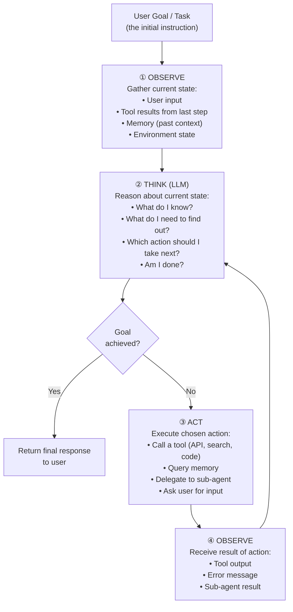
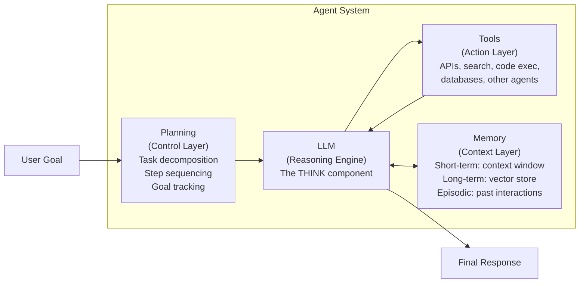
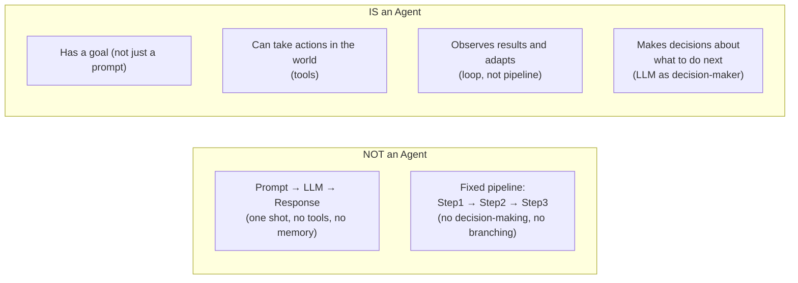

# Lesson 1.1 — What Is an AI Agent: The Agentic Loop

---

## The Problem: LLMs Are Stateless and Passive

A standard LLM call is a one-shot transaction: you send a prompt, it sends back a response, and it forgets everything. It cannot take actions in the world. It cannot check whether its answer was correct. It cannot retry if something fails. It cannot break a complex task into steps and execute them sequentially. It simply responds to whatever prompt it receives.

This is fine for answering a question or drafting an email. It is completely insufficient for tasks like: *"Research all competitors of this product, compare their pricing, draft a report, and email it to the team"* — a task that requires multiple steps, external tools, intermediate results, and decision-making based on what is discovered along the way.

**An AI agent** is an LLM wrapped in a control loop that enables it to reason, decide, act on the world through tools, observe results, and continue until a goal is achieved. The agent is not just a language model — it is the language model plus the infrastructure that gives it agency.

---

## The Agentic Loop: Observe → Think → Act → Observe

The core structure of every agent — regardless of framework or implementation — is a loop with four phases:

*Every agent runs this loop. The LLM is the THINK step. Everything else — tools, memory, environment — provides the OBSERVE step. The ACT step changes the world. The loop continues until the goal is achieved or a stop condition is hit.*

**The four components:**

1. **Observe**: Collect the current state — the original task, results from the last action, relevant memory, and any environmental signals. This is the agent's "input" for this iteration of the loop.

2. **Think**: The LLM reasons over the observed state. Given what I know and what I just learned, what should I do next? This is where reasoning frameworks (ReAct, CoT, planning) live.

3. **Act**: Execute the decided action. This changes something in the world — calls an API, writes a file, queries a database, sends a message. Without this, the agent is just thinking.

4. **Observe (again)**: Receive the result of the action. The tool returned data. An API returned an error. A database returned zero results. This new observation feeds the next THINK step.

---

## The Four Core Components of an Agent System

**LLM (Reasoning Engine):** The brain. It interprets observations, decides what to do, generates text, calls tools, and determines when the task is complete.

**Tools (Action Layer):** The hands. Without tools, the agent can only produce text. Tools let it search the web, query databases, execute code, call APIs, send emails, book calendars, and more. Tools are what make an agent different from a chatbot.

**Memory (Context Layer):** The memory. The agent must remember what it has already done (to avoid repeating), what it has already found (to build on), and who the user is (to personalize). Memory comes in multiple types — covered in Part 4.

**Planning (Control Layer):** The strategy. For complex tasks, the agent must decompose the goal into sub-tasks, decide their order, track which are complete, and replan when something fails.

---

## A Concrete Example: Amazon Q Business Agent

Amazon Q is Amazon's enterprise AI assistant. When an employee asks: *"Summarize all customer complaints about the checkout flow from last month and list the top 3 issues."*

A simple chatbot would hallucinate an answer or say "I don't have access to that data."

Amazon Q as an agent:
1. **Observe**: User query + access to enterprise data sources
2. **Think**: I need to query the customer feedback database for last month's data, then analyze and summarize
3. **Act**: Calls the customer feedback API with date filters → retrieves 847 complaint records
4. **Observe**: 847 records received in JSON format
5. **Think**: I need to categorize and count complaint themes
6. **Act**: Calls a code execution tool → Python script clusters complaints by topic
7. **Observe**: Top 3 themes returned: (1) Slow page load 312 cases, (2) Payment failure 198 cases, (3) Coupon not applied 143 cases
8. **Think**: I have enough to answer. Generate the summary.
9. **Respond**: Structured summary with counts, representative quotes, and trend analysis

The user gets a specific, data-backed answer. No hallucination. The agent executed a multi-step workflow invisibly.

---

## What Makes Something an Agent vs Not an Agent

The minimum requirements for something to be called an agent:
1. It has a **goal** to achieve (not just a prompt to respond to)
2. It can **take actions** (use tools) — not just generate text
3. It **observes results** of those actions and uses them to decide next steps
4. The **LLM is the decision-maker** about which action to take — not a hardcoded rule

---

> **Interview note:** *"What is an AI agent? How is it different from a regular LLM call?"*
> An AI agent is an LLM running in a loop — Observe → Think → Act → Observe — that enables it to take multi-step actions toward a goal. A regular LLM call is stateless: one prompt, one response, no actions. An agent adds four things: (1) tools to act on the world, (2) memory to persist state across steps, (3) a planning mechanism to decompose complex tasks, and (4) a loop that continues until the goal is achieved. The LLM is the reasoning engine, but the agent system is what gives it agency.

> **Interview note:** *"What are the four core components of an agent system?"*
> LLM (reasoning engine — the THINK step), Tools (action layer — how the agent changes the world), Memory (context layer — short-term in the context window, long-term in vector stores), and Planning (control layer — task decomposition and goal tracking). The key insight: removing any one of these degrades the system significantly. No tools = chatbot. No memory = amnesiac agent that repeats itself. No planning = fails on multi-step complex tasks. No LLM reasoning = just a scripted pipeline.

---

## Summary

- An AI agent is an LLM running in a control loop: **Observe → Think → Act → Observe**. The loop continues until the goal is achieved or a stopping condition is met.
- Four core components: **LLM** (the reasoning engine), **Tools** (action layer — APIs, search, code), **Memory** (state layer — context window + vector store + episodic logs), **Planning** (control layer — task decomposition).
- An agent must have a goal, tools to act, the ability to observe results, and LLM-driven decision-making. Missing any one of these means it is a chatbot or a pipeline, not an agent.
- The power of the agentic loop: the agent adapts to what it discovers — it can handle failures, unexpected results, and incomplete information by reasoning and retrying.
- Amazon context: Amazon Q, Alexa+, Rufus, and Bedrock Agents all use variations of this loop.
