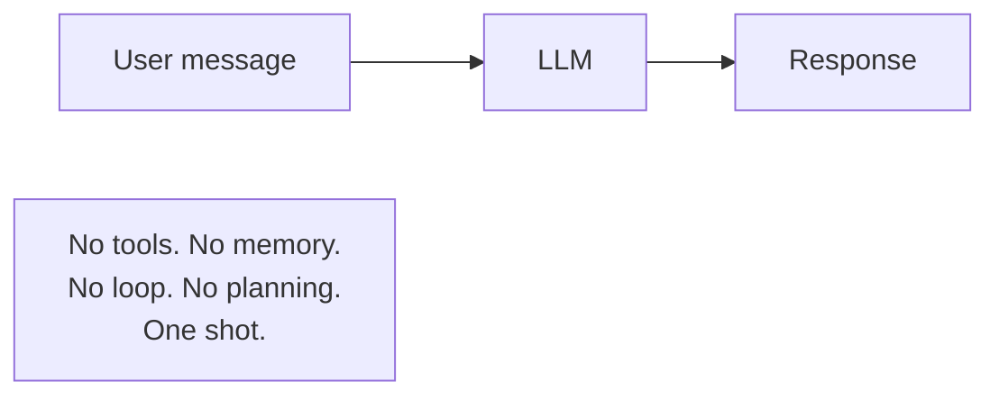
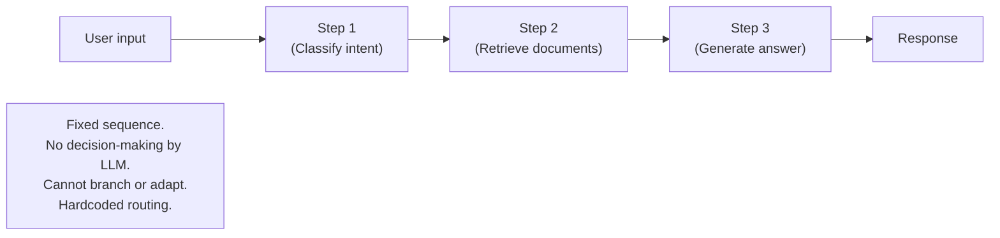
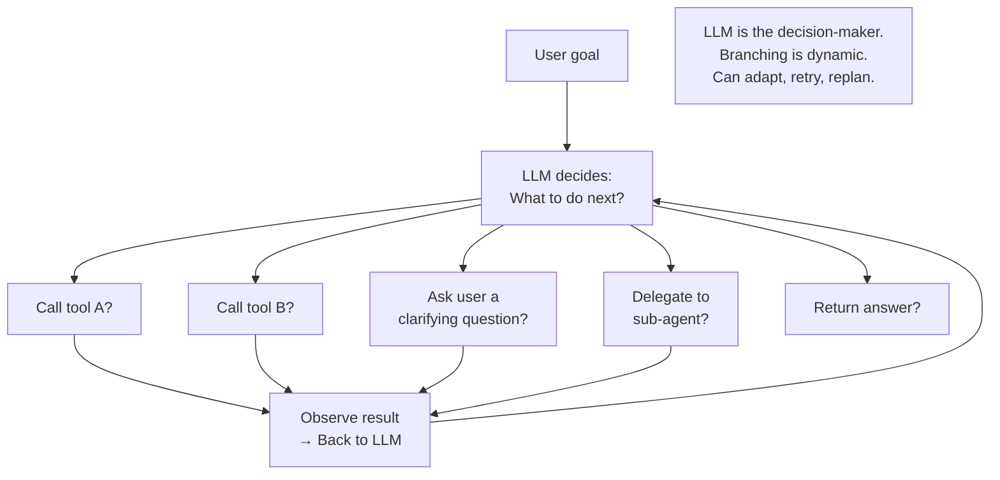
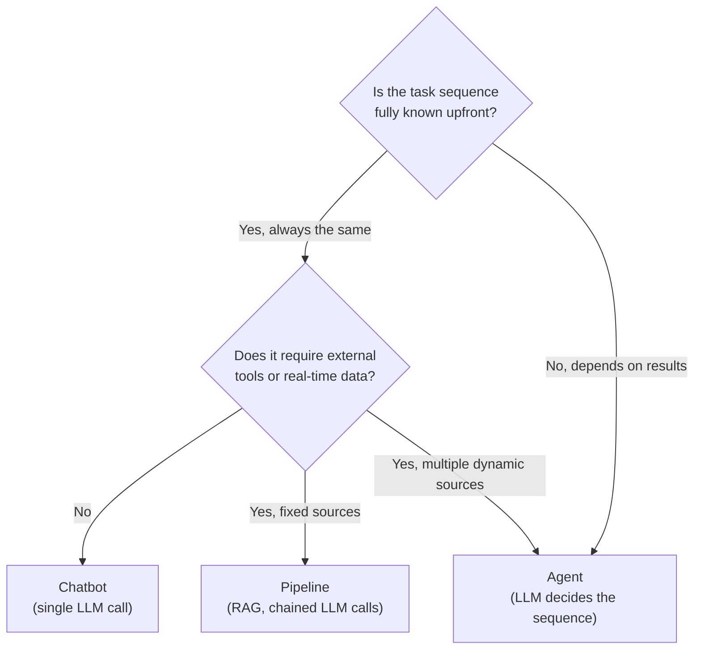

# Lesson 1.2 — Agent vs Chatbot vs Pipeline: The Key Distinctions

---

## Why This Distinction Matters in an Interview

Amazon interviewers designing systems will ask you to design an "agent." If you design a scripted pipeline and call it an agent, that signals you don't understand the difference. Conversely, if you propose an agent where a simpler pipeline would suffice, that signals over-engineering. Knowing when each is appropriate — and being able to defend your choice — is the answer they're looking for.

---

## The Three Architectures Side by Side

### Architecture 1: Chatbot (Single-Turn LLM)

**What it is:** A single LLM call. The user sends a message; the LLM generates a response from its training knowledge.

**What it can do:** Answer factual questions (within training cutoff), summarize provided text, generate content, translate languages.

**What it cannot do:** Access real-time data, take actions, remember across sessions, handle tasks requiring multiple steps, recover from errors.

**Amazon example:** The most basic Alexa response — "What's the capital of France?" → "Paris." No loop, no tools, no memory.

---

### Architecture 2: Pipeline (Chained LLM Calls)

**What it is:** Multiple steps chained in a fixed sequence. Each step's output feeds the next. The routing is hardcoded by a developer — the LLM does not decide the sequence.

**What it can do:** Complex, multi-step processing for well-defined, predictable tasks. More capable than a chatbot. Reliable and fast because there is no reasoning overhead.

**What it cannot do:** Adapt to unexpected inputs, handle failure at step 2 by trying a different approach, decide "I need an extra step here." The sequence is fixed.

**Amazon example:** A basic RAG pipeline: query → retrieve → rerank → generate. The steps are always the same in the same order. If retrieval returns nothing, the pipeline doesn't decide to try a different query — it just passes empty context to the generator.

---

### Architecture 3: Agent (LLM-Driven Control Loop)

**What it is:** The LLM drives the sequence of actions. It decides at each step what to do next, based on what it has observed. The developer provides tools — the LLM decides which to call, when, and with what parameters.

**What it can do:** Handle open-ended tasks, recover from failures, make decisions mid-task, handle tasks that cannot be fully specified upfront.

**What it cannot do (vs pipeline):** It is less predictable, slower (more LLM calls), more expensive (multiple tool calls), and harder to debug.

---

## The Decision Table

| Question | Chatbot | Pipeline | Agent |
|---|---|---|---|
| Does the task require real-time data? | ✗ | ✓ (fixed source) | ✓ (dynamic choice) |
| Is the task sequence fixed and known? | N/A | ✓ Must be | ✗ Not required |
| Does the task require adapting to unexpected results? | ✗ | ✗ | ✓ |
| Is reliability and predictability critical? | High | High | Lower |
| Is latency a hard constraint? | Fastest | Fast | Slowest |
| Are costs per query a concern? | Cheapest | Cheap | Most expensive |
| Does the task require multi-tool orchestration? | ✗ | Sometimes (fixed) | ✓ |

---

## When to Use Each: The Decision Framework

---

## Concrete Example: "Handle a customer refund request"

**Chatbot approach:** "I cannot process refunds — please contact customer service." The LLM has no tools, so it deflects. Useless.

**Pipeline approach:** `Classify intent → Query order DB → Check refund policy → Generate response`. This works for straightforward cases. But what if the order DB returns "order not found"? The pipeline passes "not found" to the generator, which generates an unhelpful response. The pipeline cannot decide to try a different order ID, ask the user for clarification, or escalate.

**Agent approach:** The LLM reads the refund request. It queries the order DB. If the order is not found, it decides to ask the user to confirm the order number. If the order is found but outside the return window, it checks the customer's tier and decides whether to apply an exception. If the exception policy tool returns an error, it retries with a fallback API. Every branch is decided by the LLM, not by hardcoded logic. The agent handles the messy real world.

---

> **Interview note:** *"When would you choose a pipeline over an agent?"*
> When the task sequence is fully predictable, the inputs are well-structured, reliability is paramount, and latency is constrained. A RAG pipeline — retrieve, rerank, generate — is more predictable, faster, cheaper, and easier to debug than an agent. Adding agent-style LLM decision-making to a pipeline that doesn't need it adds latency, cost, and unpredictability without benefit. The right answer is: default to the simplest architecture that solves the problem. Use an agent only when the task requires dynamic decision-making that a fixed pipeline cannot provide.

> **Interview note:** *"What are the main downsides of agents vs pipelines?"*
> Three main downsides: (1) **Cost** — multiple LLM calls per task, multiple tool invocations. An agent handling a complex task may make 10–20 LLM calls vs 1 for a pipeline. (2) **Latency** — each LLM call adds 200–2000ms depending on model size. 10 calls = 2–20 seconds per task. (3) **Unpredictability** — the LLM decides the sequence, and it may choose a suboptimal path, loop unnecessarily, or make a wrong decision. Pipelines are deterministic; agents are not. This is why evaluation (Part 7) and guardrails are critical for production agents.

---

## Summary

- **Chatbot**: single LLM call, no tools, no memory, no loop. Fastest and cheapest. Only suitable for tasks the LLM can answer from training knowledge.
- **Pipeline**: fixed sequence of hardcoded steps. Fast, reliable, predictable. Suitable for well-defined multi-step tasks where the sequence is always the same.
- **Agent**: LLM-driven control loop where the LLM decides what to do next at each step. Handles open-ended, adaptive, multi-tool tasks. Slower, more expensive, less predictable.
- Default to the simplest architecture. Use a pipeline when the sequence is fixed. Use an agent only when dynamic decision-making is required.
- The cost of agents: more LLM calls (cost), more sequential steps (latency), LLM-driven routing (unpredictability). These three trade-offs must be acknowledged in any design answer.
