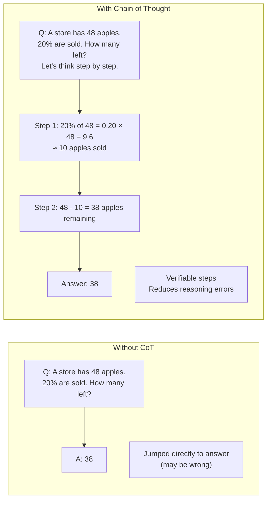
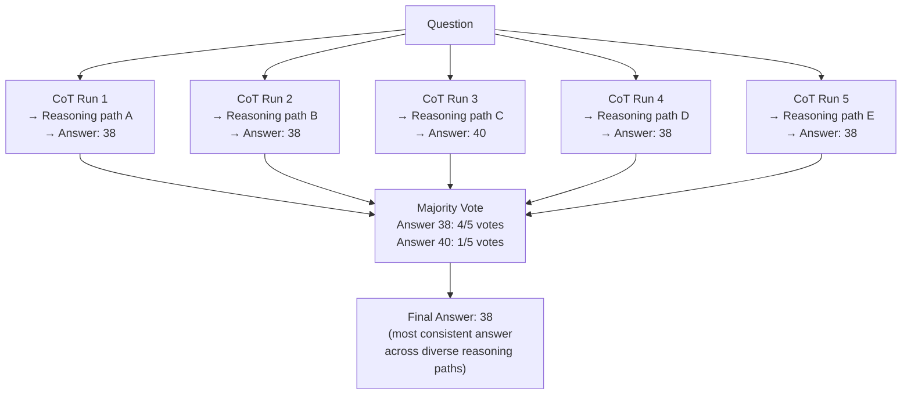

# Lesson 2.1 — Chain of Thought: Making LLMs Think Step by Step

---

## The Problem: LLMs Collapse Complex Reasoning

Without explicit reasoning, an LLM treats every input as a single prediction problem: "given this prompt, what is the most likely next token?" For simple questions, this works. For complex questions requiring multiple logical steps, this direct approach fails — the model jumps to an answer without doing the intermediate work, and the answer is wrong.

Example: *"Roger has 5 tennis balls. He buys 2 more cans of tennis balls. Each can has 3 balls. How many does he have?"*

**Without CoT:** The LLM scans the numbers and outputs "11" — sometimes correct, sometimes "7" or "10" depending on which numbers it pattern-matches. It did not actually compute 5 + (2×3).

**With CoT:** "Roger starts with 5 balls. He buys 2 cans × 3 balls = 6 more balls. 5 + 6 = 11." The correct answer, with verifiable reasoning.

**Chain of Thought (Wei et al. 2022)** prompts the LLM to generate intermediate reasoning steps before producing its final answer. This simple change dramatically improves performance on tasks requiring arithmetic, logic, common sense reasoning, and multi-step decision-making.

---

## How CoT Works: The Mechanism

CoT is not a different model — it is a different prompting strategy. You change what you ask the model to produce. Instead of "Answer: [final answer]", you ask for "Let's think step by step... [reasoning steps] ... Answer: [final answer]".

The reasoning steps force the model to:
1. Activate relevant knowledge in a structured sequence
2. Check each step before moving to the next
3. Produce a final answer grounded in the intermediate work



---

## Three Variants of CoT

### Variant 1: Few-Shot CoT (Original)

Provide 2–8 examples in the prompt that demonstrate the reasoning format. The model learns to mimic the step-by-step pattern.

```
Example 1:
Q: [question]
A: Let me think step by step.
   Step 1: [reasoning]
   Step 2: [reasoning]
   Therefore: [answer]

Example 2:
[similar structure]

Now answer this:
Q: [your actual question]
A:
```

**Best for:** Tasks where the reasoning format is consistent and examples can be provided. Works on smaller models that may not follow zero-shot instructions well.

### Variant 2: Zero-Shot CoT

Just append "Let's think step by step." to the prompt. No examples needed. Surprisingly effective on large models.

```
Q: [question]
A: Let's think step by step.
```

**Best for:** Quick wins without curating examples. Works best on models ≥ 100B parameters. Weaker for specialized domains.

### Variant 3: Self-Consistency (The Most Powerful Variant)

Instead of generating one CoT reasoning chain, generate **K different reasoning chains** (with temperature > 0) and take a **majority vote** on the final answers.



**Why it works:** A single reasoning chain may go wrong in the middle. Different chains make different mistakes. But the *correct* answer tends to be reached by more paths than any incorrect answer. Majority voting selects the most robust answer.

**Cost:** K × (cost of one CoT call). For K=5 and one call costing $0.01, self-consistency costs $0.05. The quality improvement is often worth it for high-stakes tasks.

---

## When CoT Helps and When It Doesn't

| Task type | CoT helpful? | Why |
|---|---|---|
| Arithmetic and math | ✓ Strong | Requires sequential computation |
| Multi-step logic | ✓ Strong | Each step depends on previous |
| Common sense reasoning | ✓ Moderate | Decomposing commonsense chains |
| Simple factual recall | ✗ No benefit | "What is the capital of France?" — no steps needed |
| Text classification | ✗ Marginal | Direct answer is as good |
| Creative writing | ✗ May hurt | Reasoning steps interrupt creative flow |

**CoT scales with model size.** On models < 10B parameters, CoT often fails — the model generates plausible-looking reasoning steps that are wrong. CoT reliably helps on models ≥ 50B parameters. For smaller models, few-shot examples with correct reasoning are more important than the CoT format itself.

---

## CoT in Agents

CoT is the foundation of reasoning in agents. In the THINK phase of the agentic loop, the LLM's internal monologue IS chain of thought reasoning. When you use ReAct (Lesson 2.2), the "Thought:" prefix in each step is CoT operating within the agent loop.

```
Thought: The user wants to know last month's sales. I need to query the sales database.
Action: query_database(table="sales", filter="month=2026-05")
Observation: [sales data returned]
Thought: I have the data. Now I need to compute the total and compare to the previous month.
Action: calculate(...)
```

The "Thought:" lines are chain of thought embedded in the agent's action-selection process.

---

## Concrete Example: Amazon Customer Support Agent

An Amazon support agent receives: *"My order #123-456 was supposed to arrive 3 days ago. I have a Prime membership. Am I entitled to a refund of the shipping charge?"*

**Without CoT in the agent's reasoning:**
→ The LLM pattern-matches "Prime membership" + "refund" and outputs "Yes, you are entitled to a refund." This might be wrong — it depends on the specific Prime shipping guarantee terms for the order type.

**With CoT in the THINK step:**
```
Thought: I need to check: (1) Is this order Prime-eligible? (2) What was the guaranteed delivery date?
(3) What is the actual delivery status? (4) What does the Prime shipping guarantee say for this delay?
Action: get_order_details(order_id="123-456")
Observation: Prime-eligible: Yes. Guaranteed: 2026-05-30. Status: In transit. Expected: 2026-06-04.
Thought: The delivery is 5 days late. Per Prime guarantee, delays > 2 days on Prime-eligible orders
qualify for a refund of shipping charges. The amount is $0 (included in Prime), so I should offer a
$5 promotional credit instead per policy.
Action: generate_response(offer="$5 promotional credit")
```

The CoT reasoning caught three important facts the direct answer would have missed.

---

> **Interview note:** *"What is Chain of Thought prompting, and when should you use it?"*
> CoT prompts the LLM to generate intermediate reasoning steps before producing a final answer. You add "Let's think step by step" (zero-shot) or provide examples of step-by-step reasoning (few-shot). It dramatically improves accuracy on tasks requiring arithmetic, multi-step logic, and complex common sense reasoning. Use it when the task has verifiable intermediate steps. Don't use it for simple factual recall or creative tasks — it adds cost without benefit. Self-consistency (generate K reasoning chains, take majority vote) is the strongest variant for high-stakes decisions.

> **Interview note:** *"What is self-consistency and when is it worth the extra cost?"*
> Self-consistency generates K independent reasoning chains for the same question and takes a majority vote on the final answers. It works because different chains make different reasoning errors, but the correct answer is reached by more paths than any single wrong answer. Worth the cost (K× more expensive) when: (1) the task is high-stakes and a single wrong answer is costly (medical, legal, financial), (2) the model is borderline on accuracy for the task (self-consistency often adds 5–15% accuracy), (3) you have no ground truth to verify the single chain output. Not worth it for routine queries where single CoT is already >95% accurate.

---

## Summary

- CoT prompts the LLM to generate intermediate reasoning steps before producing a final answer. This dramatically reduces reasoning errors on multi-step problems.
- **Few-shot CoT**: provide 2–8 reasoning examples in the prompt. Strongest for specialized domains. **Zero-shot CoT**: just append "Let's think step by step." Sufficient for large models.
- **Self-consistency**: generate K reasoning chains, take majority vote. 5–15% accuracy gain over single CoT. K× more expensive. Best for high-stakes decisions.
- CoT only helps on large models (≥ 50B parameters) reliably. On small models, few-shot examples matter more than the CoT format.
- In agents, CoT is the reasoning mechanism inside the THINK step. The "Thought:" prefix in ReAct is CoT embedded in the agentic loop.
