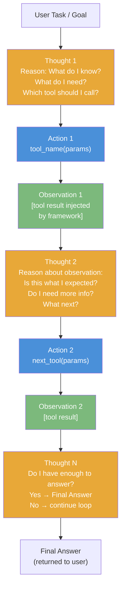

# Lesson 2.2 — ReAct: Reasoning + Acting — The Core Agent Framework

---

## The Problem: Thinking Without Acting, Acting Without Thinking

Before ReAct, two approaches existed and both had critical limitations:

**Pure reasoning (CoT only):** The model reasons step by step but has no way to act on the world — it cannot look up information, call APIs, or verify facts. It hallucinates when it needs real-world data. A great thinker with no hands.

**Pure acting (tool use without reasoning):** The model calls tools based on superficial pattern-matching, without understanding why or what to do with the results. It may call the wrong tool, fail to chain tool results, or not know when to stop. A pair of hands with no brain directing them.

**ReAct (Yao et al., 2022)** — short for Reasoning + Acting — solves this by interleaving reasoning and action. The model alternates between generating thoughts (reasoning about the current state and what to do next) and generating actions (calling tools). Each action's result is observed, and the model reasons about it before deciding the next action.

---

## The ReAct Format: Thought → Action → Observation

ReAct structures the agent's output as a series of Thought/Action/Observation triplets:

```
Thought: [The agent reasons about the current state and what to do next]
Action: [tool_name(parameters)]
Observation: [result returned by the tool]
Thought: [The agent reasons about the observation and decides next step]
Action: [next tool call or final answer]
Observation: [result]
...
Thought: I now have enough information to answer.
Action: Final Answer: [the final response to the user]
```

Each "Thought" is chain-of-thought reasoning. Each "Action" is a tool call. Each "Observation" is the tool's return value, injected by the agent framework. The model never sees "Observation" as something it generates — the framework appends tool results after "Action" and the model continues from there.

---

## Full ReAct Example: Amazon Product Research Agent

**User query:** *"What is the best-selling laptop on Amazon under $500 that has at least 8GB RAM and a 15-inch screen?"*

```
Thought: I need to search Amazon's product catalog with filters for price, RAM, and screen size.
Action: search_products(category="laptop", max_price=500, min_ram=8, screen_size=15)
Observation: [
  {"id": "B001", "name": "Acer Aspire 5", "price": 449, "sales_rank": 3, "rating": 4.5},
  {"id": "B002", "name": "HP 15", "price": 489, "sales_rank": 1, "rating": 4.3},
  {"id": "B003", "name": "Lenovo IdeaPad", "price": 399, "sales_rank": 7, "rating": 4.6}
]

Thought: The HP 15 has the best sales rank (1) but lower rating than Acer (4.3 vs 4.5). I should
check recent reviews to understand why the better-selling product has lower ratings.
Action: get_reviews(product_id="B002", limit=10, sort="recent")
Observation: [5 reviews mentioning "battery life", 3 mentioning "keyboard quality", 2 positive]

Thought: Many recent HP 15 reviews mention battery issues. The Acer Aspire 5 has better rating
and is still in the top 5 for sales rank. That's the stronger recommendation.
Action: get_product_details(product_id="B001")
Observation: {"specs": {"ram": "8GB", "screen": "15.6 inch", "battery": "10hr", ...}, "in_stock": true}

Thought: The Acer Aspire 5 meets all criteria, is in stock, highly rated, and top-selling without
the battery complaints of the HP 15. I have enough to answer.
Action: Final Answer: "The Acer Aspire 5 (B001) at $449 is the best-selling 15-inch laptop under
$500 with 8GB RAM. It has a 4.5-star rating and 10-hour battery life. The HP 15 (B002) ranks
higher in sales but recent reviews flag battery concerns."
```

The agent used two tools intelligently, reasoned about an unexpected finding (high sales + lower rating), and produced a nuanced answer.

---

## The ReAct Loop as a Diagram



*Thoughts (orange) are generated by the LLM. Actions (blue) call external tools. Observations (green) are tool results injected by the framework. The LLM only generates Thoughts and Actions — never Observations.*

---

## When ReAct Gets Stuck: Failure Modes and Fixes

**Failure Mode 1: Action Loop**

The agent keeps calling the same tool with slightly different parameters without making progress. Example: search fails → slightly rephrase → search again → fails again → repeat.

**Fix:** Maximum iteration limit. If the agent has not produced a "Final Answer" after N steps (typically 5–15), terminate and return a fallback response. Track which tool calls have been made and prevent exact repeats.

**Failure Mode 2: Hallucinated Tool Parameters**

The LLM generates an Action with parameters that don't match the tool's schema — e.g., `get_order_details(order="123-456")` when the tool expects `get_order_details(order_id=123456)`.

**Fix:** Strict function calling (OpenAI/Bedrock API validates parameters against the schema before execution). The framework returns a schema error as the Observation, and the model can retry with correct parameters.

**Failure Mode 3: Observation Ignored**

The model generates the next Thought without meaningfully incorporating the Observation — it "says" it understands but its next action ignores the tool result.

**Fix:** Prompt engineering — explicitly instruct: "Before deciding your next action, summarize what the Observation tells you." Some implementations force a "Summarize the observation" step before the next Thought.

---

## ReAct vs Pure CoT vs Tool Use Only

| | Pure CoT | Tool Use Only | ReAct |
|---|---|---|---|
| **Can access real data** | ✗ | ✓ | ✓ |
| **Verifiable reasoning** | ✓ | ✗ | ✓ |
| **Adapts to tool results** | N/A | ✗ | ✓ |
| **Recovers from failures** | N/A | ✗ | ✓ (with limits) |
| **Interpretable steps** | ✓ | ✗ | ✓ |
| **Foundation for agents** | Partial | ✗ | ✓ |

---

> **Interview note:** *"Explain the ReAct framework. How does it work?"*
> ReAct interleaves reasoning (Thought) and action (Action) in alternating steps. At each step: the model generates a Thought — reasoning about the current state and deciding what to do — then an Action — a tool call. The framework executes the tool and injects the result as an Observation. The model then generates the next Thought informed by that Observation. This continues until the model generates a Final Answer. ReAct is better than pure CoT (which cannot access real data) and better than pure tool use (which cannot reason about why to call which tool). It is the foundation of modern LLM-based agents.

> **Interview note:** *"What happens when a ReAct agent gets stuck in a loop? How do you prevent it?"*
> An agent loops when tool calls consistently fail or return unhelpful results, and the model keeps retrying without making progress. Prevention: (1) Set a hard max-iterations limit (e.g., 10 steps) — if no Final Answer by then, terminate with a fallback. (2) Track seen (tool, parameters) pairs and prohibit exact repeats. (3) After N consecutive failures of the same tool, switch to a different tool or ask the user for clarification. (4) Use structured output validation to catch malformed tool parameters before execution, turning a failure into an informative error Observation the model can learn from.

---

## Summary

- ReAct interleaves Thought (CoT reasoning) and Action (tool call) in a loop: Thought → Action → Observation → Thought → ... → Final Answer.
- The model generates Thoughts and Actions. The framework executes the tool and injects the Observation. The model never generates Observations — they are factual tool results.
- ReAct solves the limitation of both pure CoT (no tools, hallucinates data) and pure tool use (no reasoning about why/when to call which tool).
- Key failure modes: action loops (fix: max iterations + deduplicate calls), hallucinated parameters (fix: schema validation), observation ignored (fix: prompt engineering).
- ReAct is the foundation of Amazon Bedrock Agents and most production LLM agent frameworks. Every Amazon Q and Alexa+ agent task uses a ReAct-style loop.
