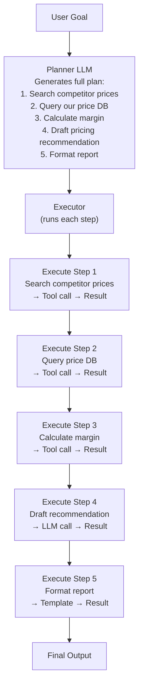
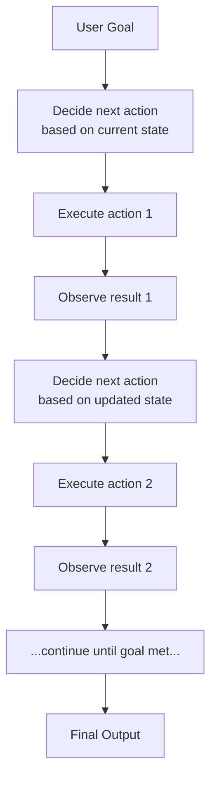
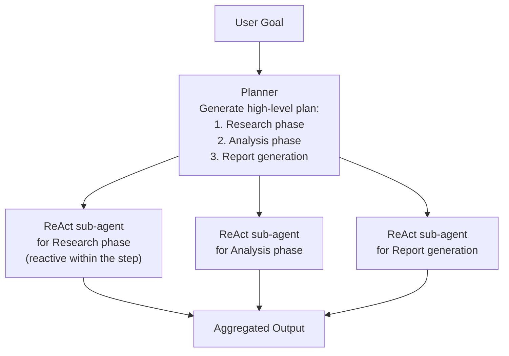

# Lesson 2.3 — Plan-and-Execute vs Reactive Planning

---

## The Problem: ReAct Is Greedy, Not Strategic

ReAct decides the next action at each step based on what has been observed so far — a greedy, one-step-ahead strategy. This works well for short tasks with 2–4 steps. For long, complex tasks (10–20 steps), ReAct has a critical weakness: it has no global view of the task. It can get lost in sub-tasks and forget the original goal. It can take a locally reasonable action that moves it in the wrong global direction. It can reach step 8 and realize that steps 3–5 were wrong, requiring a full retry from scratch.

The question is: should an agent think about the whole plan before starting to execute, or should it decide step by step as it goes?

---

## Two Philosophies of Planning

### Philosophy 1: Plan-and-Execute (Upfront Planning)

**Structure:** First, generate a full plan — a complete ordered list of steps to achieve the goal. Then, execute each step in order (using an executor that may itself be an LLM+tools call). The plan is fixed unless explicit replanning is triggered.



**Advantages:**
- Global coherence — the plan ensures all steps align with the overall goal
- Easier to audit and explain — the plan is human-readable before execution starts
- Parallel execution possible — if steps 1 and 2 are independent, they can run simultaneously
- Better for long tasks — the agent doesn't lose track of what it's doing

**Disadvantages:**
- The plan can become invalid when the world doesn't match assumptions (step 3 assumed step 1 would return prices — but the competitor site is down)
- Inflexible — the executor must replan if an unexpected result occurs mid-execution

---

### Philosophy 2: Reactive Planning (Dynamic / Online Planning)

**Structure:** No upfront plan. The agent decides the next action based only on the current observation. ReAct is the canonical example of reactive planning. Each step is decided by asking "given what I know right now, what should I do next?"



**Advantages:**
- Fully adaptive — responds to unexpected results at every step
- No upfront commitment — if the first tool returns something surprising, the agent can pivot immediately
- Works well for short tasks (2–5 steps) where the path is hard to predict

**Disadvantages:**
- Myopic — makes locally optimal decisions that may be globally suboptimal
- Can lose track of the original goal after 7+ steps
- Hard to parallelize — each step must wait for the previous to complete and be observed
- No human review point before execution begins

---

## The Hybrid Approach: Plan-then-ReAct

Real production agents often combine both:



*The planner provides global structure (3 phases). Each phase is executed by a ReAct sub-agent that can adapt reactively within its phase. The best of both worlds.*

---

## When to Use Each

| Scenario | Plan-and-Execute | Reactive (ReAct) |
|---|---|---|
| Long, multi-phase task (10+ steps) | ✓ Best choice | ✗ Gets lost |
| Short, exploratory task (2–5 steps) | ✗ Overhead not worth it | ✓ Best choice |
| Steps are mostly independent | ✓ Can parallelize | ✗ Sequential only |
| High uncertainty (can't predict what tools return) | ✗ Plan becomes invalid | ✓ Adapts at each step |
| Human review before execution required | ✓ Review the plan | ✗ No review point |
| Real-time, interactive tasks | ✗ Planning latency | ✓ Responds immediately |

---

## Task Decomposition: The Heart of Planning

Whether you use Plan-and-Execute or reactive planning, complex tasks must be decomposed. The planner LLM performs **task decomposition**: breaking the goal into sub-tasks that are individually achievable.

Good decomposition has three properties:
1. **Completeness** — all sub-tasks together achieve the goal. Nothing missing.
2. **Independence** — ideally, sub-tasks are independent (can run in parallel). Minimize dependencies.
3. **Appropriate granularity** — each sub-task is doable in 1–3 tool calls. Not too large (becomes a sub-goal, not a task) and not too small (unnecessary fragmentation).

Example for task "Prepare a competitive analysis report for Product X":
```
Bad decomposition (too coarse):
  1. Research competitors
  2. Write report

Good decomposition:
  1. Identify top-5 competitors using search_tool
  2. For each competitor: get pricing from price_tool
  3. For each competitor: get feature list from feature_tool
  4. Compare features and pricing in a structured table
  5. Identify key differentiators
  6. Generate executive summary
  7. Format as PDF
```

---

## Concrete Example: Amazon Rufus Product Recommendation

**Task:** "Help me find a laptop for my college freshman starting engineering."

**Reactive approach (ReAct):** Agent asks one clarifying question, searches, refines — good for short interactive sessions. Works well here because the task is 3–5 steps and highly interactive.

**Plan-and-Execute approach:** Better if the task were "Research and prepare a comprehensive buyer's guide for student laptops for our 2026 catalog" — a 20-step task with research, competitive analysis, writing, and formatting phases. The planner would outline all phases, executor runs each, and the result is a coherent long-form document.

---

> **Interview note:** *"When would you use Plan-and-Execute vs ReAct for an agent?"*
> ReAct is better for short, exploratory, or interactive tasks (2–7 steps) where the path cannot be predicted upfront and adaptability at each step is essential. Plan-and-Execute is better for long, multi-phase tasks (10+ steps) where global coherence matters, where human review of the plan before execution is valuable, and where steps are mostly independent (enabling parallelism). In practice, most production agents use a hybrid: a planner generates a high-level plan broken into phases, and each phase is executed by a ReAct-style sub-agent that adapts within its phase.

> **Interview note:** *"What is task decomposition and what makes a good decomposition?"*
> Task decomposition is the process of breaking a complex goal into individually executable sub-tasks. A good decomposition is: (1) Complete — sub-tasks together fully achieve the goal with no gaps; (2) Independent — sub-tasks can run in parallel or in any order (minimizing dependencies reduces latency); (3) Appropriately granular — each sub-task is achievable in 1–3 tool calls (too coarse = hard to execute; too fine = unnecessary overhead). The quality of decomposition directly determines the quality of a Plan-and-Execute agent's output — bad decomposition means missing steps, redundant work, or tasks too large for the executor to handle.

---

## Summary

- **Reactive planning (ReAct)**: decides next action step by step based on current observations. Fully adaptive but myopic — can lose track on long tasks. Best for short (2–7 step) interactive tasks.
- **Plan-and-Execute**: planner generates a full task plan first, executor runs each step. Globally coherent, parallelizable, auditable before execution. Best for long (10+ step) structured tasks.
- **Hybrid**: planner generates high-level phases, each phase executed by a ReAct sub-agent. Combines global structure with within-phase adaptability.
- Task decomposition is the core skill of the planner: breaking the goal into complete, independent, appropriately granular sub-tasks.
- Amazon context: Rufus uses reactive planning for interactive product recommendations. Amazon Q Business agents use Plan-and-Execute for long analytical workflows.
