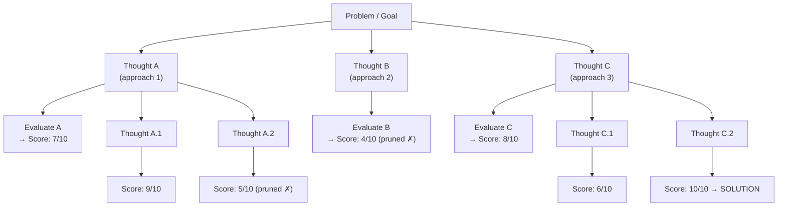
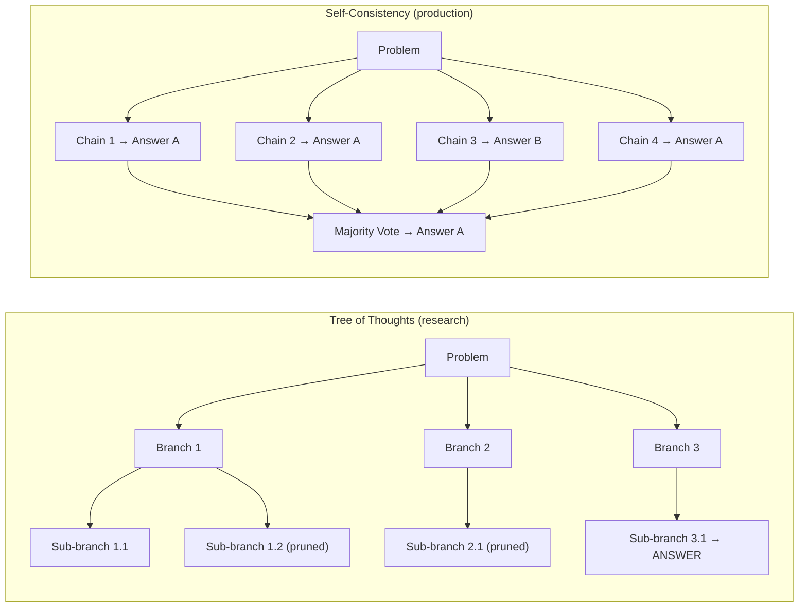

# Lesson 2.4 — Tree of Thoughts and Self-Consistency

---

> *This is a Tier 2 lesson. It covers two concepts at the conceptual level needed for interview breadth — not deep implementation. After reading this, you can answer "what is Tree of Thoughts?" and "how is it different from ReAct?" confidently.*

---

## The Limitation of Linear Reasoning

Both CoT (Lesson 2.1) and ReAct (Lesson 2.2) are **linear**: they produce one reasoning chain. At each step, one thought leads to one action. If the initial reasoning direction is wrong, the model continues down the wrong path — there is no mechanism to backtrack and try a different approach.

For tasks that genuinely require **exploration** — where the right solution path is not obvious and multiple paths must be tried — linear reasoning is insufficient. You need a framework that can branch, explore, evaluate, and backtrack.

---

## Tree of Thoughts (ToT)

**Tree of Thoughts (Yao et al., 2023)** extends CoT from a single linear chain to a tree structure. The model generates multiple candidate "thoughts" at each step, evaluates them, and searches the tree for the best path to the solution.

*At each depth, multiple candidate thoughts are generated, evaluated, and low-scoring branches are pruned. The search continues down promising branches. This is breadth-first or best-first search over a reasoning tree.*

**Three components:**
1. **Thought generation:** At each step, generate K candidate thoughts (K = 3–5 typically)
2. **Thought evaluation:** Score each thought — either with another LLM call ("Is this a promising approach? Rate 1-10") or a heuristic
3. **Search strategy:** BFS (explore all branches at each depth), DFS (follow one promising branch to completion), or Best-First (always expand the highest-scoring node)

---

## When ToT Helps vs When It Doesn't

**ToT wins over linear CoT/ReAct when:**
- The problem has multiple possible solution approaches that look equally reasonable upfront
- Mistakes in early reasoning steps are catastrophic (you need backtracking)
- The task is combinatorial or requires exploration (e.g., code debugging, math proofs, game-playing)

**ToT is overkill when:**
- The task is straightforward and linear (most Q&A, summarization, simple tool calls)
- Cost and latency matter (ToT uses K× more LLM calls per depth level — for K=3 and depth=4: 81 LLM calls vs 1 for CoT)
- The task is better handled by ReAct (real-time data access, tool calls)

**Practical reality:** ToT is primarily a research technique. In production agents, its ideas are incorporated indirectly — through self-consistency (sample multiple paths, vote) or through Plan-and-Execute with re-planning (when a step fails, replan from that point rather than continuing linearly).

---

## Self-Consistency Revisited: Tree Ideas in Practice

Self-consistency (from Lesson 2.1) is the practical, production-friendly version of ToT's key insight: generate multiple reasoning paths and select the best answer by majority vote.

*Self-consistency is a simpler, cheaper approximation of ToT's exploration idea. Instead of a deep tree with evaluation at each node, it generates K flat chains and votes. Much cheaper; reasonably effective.*

---

## Interview-Level Summary of the Reasoning Framework Hierarchy

| Framework | Structure | Cost | Adaptability | Best For |
|---|---|---|---|---|
| **Standard CoT** | Linear chain | 1× | None | Structured multi-step reasoning |
| **Zero-shot CoT** | Linear chain | 1× | None | Quick wins on large models |
| **Self-Consistency** | K parallel chains + vote | K× | None (static) | High-stakes reasoning, accuracy++ |
| **ReAct** | Linear chain + tools | N steps × LLM | Adapts to tool results | Agent tasks with real-world data |
| **Plan-and-Execute** | Plan then execute | Plan + N steps | Replanning on failure | Long structured multi-phase tasks |
| **Tree of Thoughts** | Tree + evaluation + search | K^D × LLM | Backtracks on bad paths | Combinatorial exploration, proofs |

---

> **Interview note:** *"What is Tree of Thoughts and how is it different from ReAct?"*
> Tree of Thoughts extends chain-of-thought reasoning from a single linear chain to a tree. At each step, it generates K candidate thoughts, evaluates them with a scoring mechanism, and searches the tree (BFS, DFS, or best-first) for the best path to the solution. Pruning removes low-scoring branches. This enables backtracking — something ReAct cannot do. ReAct uses tools and adapts to observations but follows a single reasoning chain. ToT is better for combinatorial exploration tasks (math proofs, planning under uncertainty) where multiple approaches must be tried. ReAct is better for real-world tool-using tasks where adaptation to new information (not backtracking) is the key challenge. In production, ToT ideas are approximated via self-consistency (sample K paths, vote) rather than full tree search.

---

## Summary

- Tree of Thoughts (ToT) extends CoT from a linear chain to a tree: at each step, generate K candidate thoughts, evaluate each, prune low-scorers, and search the tree for the best solution path. Enables backtracking.
- ToT uses K^D LLM calls (K candidates per depth D) — expensive. Practical in research and high-value one-off tasks, not in production API agents.
- Self-consistency is the production-friendly approximation of ToT's key insight: sample K independent reasoning chains, take majority vote. K× cost, no tree structure, no pruning.
- Reasoning framework hierarchy: CoT → Self-Consistency → ReAct → Plan-and-Execute → ToT (increasing capability, increasing cost).
- For interviews: know what ToT is, why it enables backtracking (vs ReAct's linear reasoning), and why self-consistency is its practical production equivalent.
