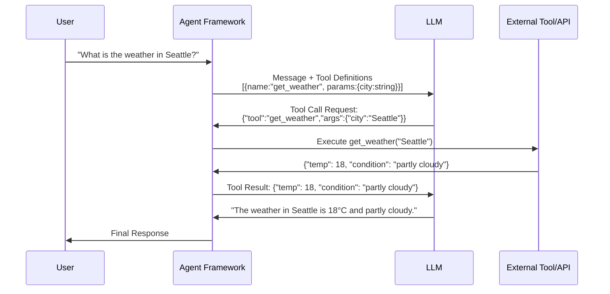
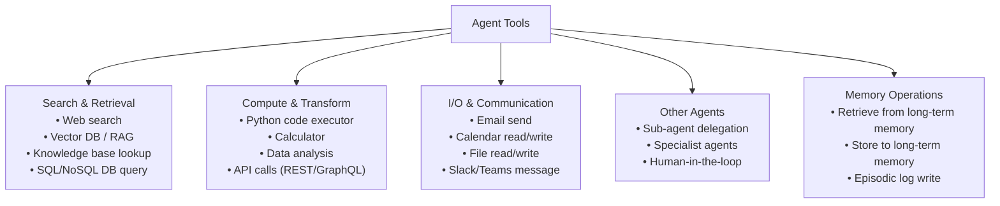

# Lesson 3.1 — Tool Use and Function Calling: How Agents Act

---

## The Problem: LLMs Are Sealed in a Text Box

An LLM, by itself, cannot access the internet, cannot read a database, cannot send an email, cannot get the current time, and cannot run code. It only knows what was in its training data (up to its knowledge cutoff) and what is in the current context window. For any task that requires real-world interaction — current data, user-specific information, external systems — the LLM alone is useless.

**Tool use** (also called function calling) gives the LLM hands. It is the mechanism by which the agent's THINK step translates into a real-world ACT. Without tool use, you have a sophisticated chatbot. With tool use, you have an agent.

---

## How Function Calling Works (The Mechanism)

Modern LLM APIs (OpenAI, Anthropic, Amazon Bedrock) support structured function calling. The developer defines a set of tools — their names, descriptions, and parameter schemas. These tool definitions are passed to the LLM alongside the user's message. The LLM does not "call" the tool itself — it outputs a structured request to call the tool. The framework intercepts this, executes the tool, and returns the result.

**Step by step:**



*The LLM outputs a structured tool call request (JSON). The framework executes it. The result is injected back into the context. The LLM generates the final response based on real data.*

---

## The Tool Definition: What the LLM Sees

A tool definition is a JSON schema that tells the LLM: what this tool does, what arguments it takes, and what each argument means. The description is critical — it is how the LLM decides whether to call this tool and with what parameters.

```json
{
  "name": "search_product_catalog",
  "description": "Search Amazon's product catalog. Use this when the user asks about products, pricing, availability, or product comparisons. Returns a list of matching products with prices and ratings.",
  "parameters": {
    "type": "object",
    "properties": {
      "query": {
        "type": "string",
        "description": "The search query (e.g., 'wireless headphones under $100')"
      },
      "max_results": {
        "type": "integer",
        "description": "Maximum number of results to return (default: 5, max: 20)"
      },
      "category": {
        "type": "string",
        "enum": ["electronics", "clothing", "books", "home"],
        "description": "Product category filter (optional)"
      }
    },
    "required": ["query"]
  }
}
```

**The description is where tool quality lives.** A poor description like *"Search for products"* leaves the LLM guessing when to use this tool vs a web search tool. A good description tells the LLM precisely: when to use it, what it returns, and what inputs look like.

---

## Types of Tools Agents Use



---

## Tool Selection: How the LLM Chooses the Right Tool

With multiple tools available, the LLM must decide: which tool answers the current need? This decision is entirely based on the tool descriptions and the current reasoning context. Three signals guide tool selection:

1. **Tool description match**: Does the description match what I need right now?
2. **Past usage in this conversation**: Did this tool return useful results earlier?
3. **Reasoning about what data I need**: "I need current stock prices" → financial data tool, not a product catalog tool

**Common tool selection failures:**
- **Wrong tool for the task**: Using web search when a structured database tool would give better results
- **Missing tool**: The agent tries to use a tool that doesn't exist and generates an error
- **Tool parameter confusion**: Mixing up which parameter goes to which tool when multiple similar tools exist

**Fix**: Write clear, distinct tool descriptions. If two tools seem similar, explicitly state in each description when NOT to use it: "Use this for Amazon catalog only. For external retailer prices, use the competitor_price_lookup tool."

---

## Parallel Tool Calls

Modern APIs support calling multiple tools simultaneously. Instead of:
```
Search tool → wait → analyze result → compute tool → wait → combine
```
The LLM can request:
```
[Search tool, Compute tool] → both execute in parallel → both results returned → LLM combines
```

This dramatically reduces latency for tasks where multiple tool calls are independent. Amazon Bedrock supports parallel tool use in its agent action groups.

---

## Concrete Example: Amazon Q Business — Employee HR Query

An employee asks Amazon Q: *"What's my remaining vacation balance and what's the policy for carrying over unused days to next year?"*

This requires two independent pieces of information: the HR database (employee-specific) and the policy documents (general). With parallel tool calls:

```
Tool call 1 (parallel): hr_database.get_vacation_balance(employee_id=E12345)
Tool call 2 (parallel): policy_search("vacation carryover policy 2026")

Both return simultaneously:
Tool 1 result: {"remaining_days": 7, "year_end": "2026-12-31"}
Tool 2 result: "Policy: Up to 5 days may be carried over to the next year..."

LLM combines:
"You have 7 vacation days remaining. Per policy, you can carry over up to 5 days.
If you don't use at least 2 days by Dec 31, you will forfeit them."
```

Without parallel calls: two sequential LLM→tool→wait cycles. With parallel: one round trip. Roughly 2× faster.

---

> **Interview note:** *"How does function calling / tool use work in an LLM agent?"*
> The developer defines tools as JSON schemas — name, description, and parameter types. These schemas are passed to the LLM alongside the user's message. The LLM outputs a structured tool call request (which tool, with what parameters) based on the descriptions and the current reasoning context. The framework executes the tool and injects the result back into the LLM's context. The LLM then continues reasoning with the real data. The LLM never executes tools directly — it only requests them. The framework is the executor and the safety gate.

> **Interview note:** *"What makes a good vs bad tool definition? How do you write tool descriptions for an agent?"*
> A good tool definition has three qualities: (1) Precise trigger condition — when should the LLM call this tool vs not? Be explicit: "Use for Amazon product search. Do NOT use for web search or competitor sites." (2) Clear output description — what format does the tool return? "Returns a JSON array of products with fields: name, price, rating, ASIN." The LLM needs to know what it will receive so it can plan next steps. (3) Parameter examples or ranges — "max_results: integer, default 5, max 20." Vague schemas lead to hallucinated parameters and tool call failures.

---

## Summary

- Tools give agents the ability to act on the real world. Without tools, an LLM is sealed in its training data — no current information, no external actions.
- Function calling: the LLM outputs a structured tool call request; the framework executes the tool and returns the result; the LLM continues reasoning with real data. The LLM never runs code directly.
- Tool definitions must have: precise trigger description (when to use/not use), output format description (what will be returned), and clear parameter schemas with types and constraints.
- Tool types: search/retrieval, compute/transform, I/O/communication, other agents, memory operations.
- Parallel tool calls: call multiple independent tools simultaneously to reduce latency. Supported by Bedrock, OpenAI, and Anthropic APIs.
