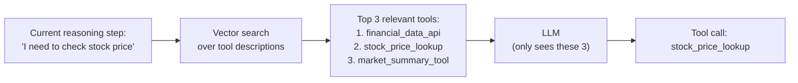
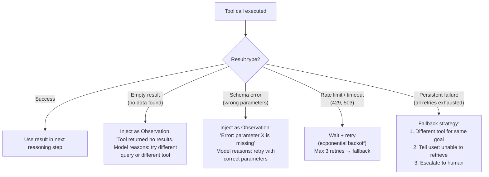
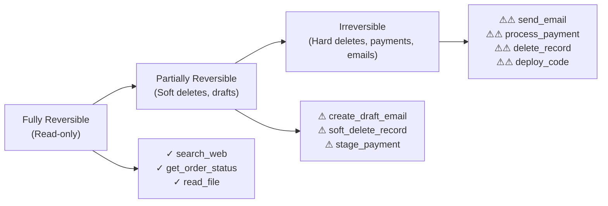

# Lesson 3.2 — Tool Selection, Error Handling, and Safety

---

## The Problem: Tools Are the Agent's Biggest Risk Surface

When an agent's reasoning is wrong, it produces a bad text answer. When an agent's tool call is wrong — it sends an incorrect email, deletes the wrong file, charges a customer twice, or leaks private data — the consequences are real and irreversible. The tool layer is where agent errors cross from "wrong text" to "real-world damage."

This lesson covers three problems that arise from tool use and how to handle them in production systems: tool selection errors, tool execution failures, and unsafe tool actions.

---

## Tool Selection Strategies

When an agent has many tools (5+), selecting the right one becomes non-trivial. Three approaches:

### Approach 1: All Tools in Context (Default)
Pass all tool definitions to every LLM call. The LLM picks from all available tools.

**Works for:** ≤ 10 tools. Simple, reliable.
**Fails for:** 20+ tools — the LLM gets confused by too many similar-looking tools; context window fills up with definitions; selection quality degrades.

### Approach 2: Tool Retrieval (Dynamic Tool Selection)
Store tool definitions in a vector database. At each step, retrieve the top-K most relevant tools based on the current reasoning step, then pass only those K tools to the LLM.



**Works for:** 20–200+ tools. Reduces context size. Prevents confusion from unrelated tools.
**Risk:** The retrieval step might miss the correct tool if its description uses different vocabulary than the reasoning step.

### Approach 3: Hierarchical Tool Groups
Organize tools into categories. The LLM first picks a category, then picks a tool within that category.

```
Level 1: [Search, Compute, Communication, Database]
  ↓ LLM chooses "Database"
Level 2: [customer_db, order_db, inventory_db, hr_db]
  ↓ LLM chooses "order_db"
Level 3: [get_order, update_order, cancel_order, get_order_history]
  ↓ LLM chooses "get_order"
```

**Works for:** 100+ tools organized into clear domains.

---

## Error Handling: What to Do When Tools Fail

Tools fail. APIs return 429 (rate limit), 500 (server error), or empty results. The agent must handle failures gracefully.

**Error handling pattern:**



**Key principle:** Every error type should become an informative Observation that the LLM can reason about. Don't just silently retry — make the error visible so the LLM can change strategy.

**Exponential backoff for rate limits:**
```python
import time

def call_with_retry(tool_fn, max_retries=3):
    for attempt in range(max_retries):
        try:
            return tool_fn()
        except RateLimitError:
            if attempt == max_retries - 1:
                raise
            time.sleep(2 ** attempt)  # 1s, 2s, 4s
```

---

## Tool Safety: Preventing Real-World Damage

### The Irreversibility Spectrum

Tools exist on a spectrum from fully reversible to completely irreversible:



**Design principle:** Irreversible tools require extra safeguards. The agent should never call an irreversible tool without confirmation.

### Three Safety Mechanisms

**1. Confirmation step before irreversible actions:**
Before calling `send_email` or `process_payment`, the agent generates a confirmation message to the user: *"I'm about to send an email to john@company.com with subject 'Q3 Report'. Confirm? [Yes/No]"*. Only on explicit confirmation does the tool execute. This is the core of Human-in-the-Loop (covered in Lesson 7.2).

**2. Tool permissions and scoping:**
Define separate tools for read vs write operations. Grant agents only the tools they need for their task. An agent answering customer questions needs `get_order_status` — it should never have access to `cancel_order` or `issue_refund`. Principle of least privilege applied to tool access.

**3. Schema validation before execution:**
Validate all tool parameters before executing, not after. If `process_payment` receives a negative amount or an invalid currency code, reject the call with an error Observation before any money moves. The framework — not the LLM — is responsible for validation.

---

## Concrete Example: Amazon Seller Reimbursement Agent

An agent helps sellers claim reimbursements for lost/damaged inventory. Tools available:
- `search_inventory_discrepancies(seller_id, date_range)` → read-only ✓
- `get_claim_eligibility(discrepancy_id)` → read-only ✓
- `draft_claim(discrepancy_id, amount)` → soft state, reversible ✓
- `submit_claim(claim_id)` → **irreversible** — triggers payment ⚠

**Safe design:**
1. Agent searches discrepancies, checks eligibility, drafts a claim — all safe steps
2. Before submitting: "I've drafted a reimbursement claim for $847.20 for 12 lost units of ASIN B001 between Apr 1–30. This will trigger a payment to your account. Confirm submission? [Yes/No]"
3. On confirmation: `submit_claim(claim_id=C12345)` executes
4. Payment issued

Without the confirmation step: a small bug in the claim amount calculation could trigger an incorrect payment that is difficult to reverse.

---

> **Interview note:** *"How do you handle tool failures in an agent? What happens if an API times out?"*
> Every tool failure should become an informative Observation that the LLM can reason about — don't swallow errors silently. For transient failures (rate limits, timeouts): use exponential backoff and retry up to N times (typically 3). For persistent failures: (1) Try a different tool that can achieve the same goal; (2) If no alternative, generate an Observation saying "This tool is unavailable. I cannot retrieve [X]" and let the LLM decide whether to ask the user or produce a partial answer. Never let a tool failure leave the agent in an unknown state — every failure path should have a defined handling strategy.

> **Interview note:** *"How do you prevent an agent from taking dangerous actions?"*
> Three layers: (1) Least privilege — only give the agent the tools it needs. An answering agent has no need for delete or write tools. Remove them from the tool set entirely. (2) Confirm before irreversible — for any tool that sends messages, charges money, or deletes data: require explicit user confirmation before execution. Show the user exactly what will happen, get approval, then act. (3) Schema validation before execution — validate all tool parameters in the framework (not the LLM) before the tool runs. A negative payment amount or invalid email format should be caught and returned as an error Observation, never executed.

---

## Summary

- Tool selection strategies: all-in-context (≤10 tools), retrieval-based (20–200+ tools), hierarchical groups (100+ tools organized by domain).
- Every tool error is an Observation the LLM should reason about: empty results → change strategy; schema error → retry with correct parameters; rate limit → exponential backoff; persistent failure → fallback or escalate.
- Tools exist on an irreversibility spectrum: read-only (safe), soft-state (recoverable), irreversible (emails, payments, deletes — require safeguards).
- Three safety mechanisms: confirmation before irreversible actions (Human-in-the-Loop), least-privilege tool access (only give tools needed), and framework-level schema validation before execution.
- Amazon context: seller reimbursement agents, order management agents — all need irreversibility-aware tool design to prevent financial errors that are difficult to reverse.
