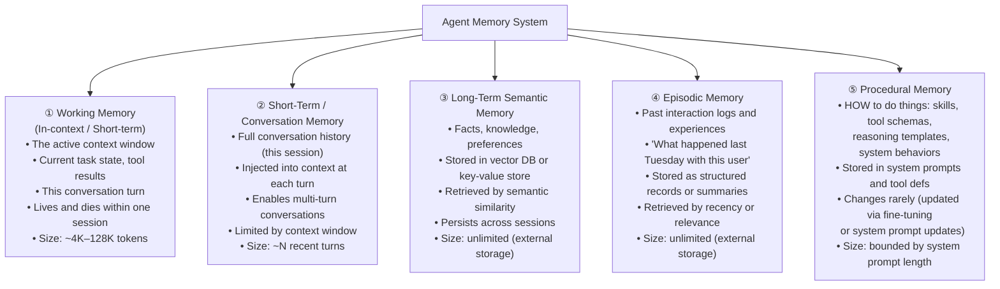
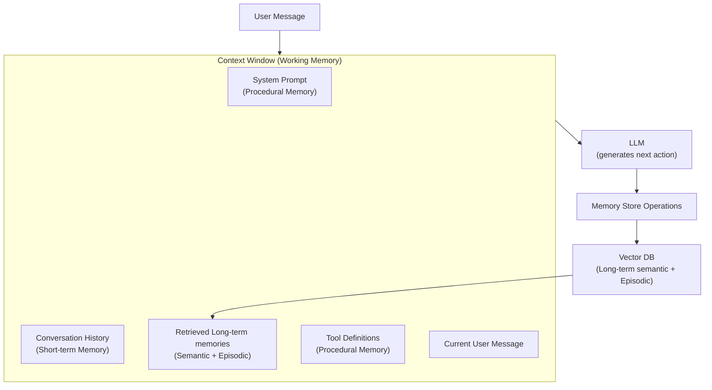

# Lesson 4.1 — Memory Taxonomy: All Five Types

---

## The Problem: Agents Are Amnesiac by Default

An LLM has no persistent state. Every time you call the API, it starts fresh. It does not remember the conversation from yesterday, the user's preferences set last week, or the tools it called two steps ago in the same task. Without explicit memory architecture, every agent call is the agent's first moment of existence.

For a useful agent — one that remembers who you are, what you've asked before, what it has already done in the current task, and how to behave — you need to architect memory deliberately. There are five distinct types of memory in agent systems, each serving a different purpose and stored differently.

---

## The Five Memory Types

---

## Type 1: Working Memory (In-Context)

**What it is:** Everything currently in the LLM's context window. The prompt, the conversation so far, tool results, the agent's thoughts — all of it lives here.

**How it works:** No special infrastructure needed. The context window IS the working memory.

**Limitation:** Fixed maximum size (the model's context length — e.g., 128K tokens for Claude 3.5). When the conversation or task exceeds this, you must truncate, summarize, or move information to external storage.

**Analogy:** RAM (Random Access Memory) in a computer — fast, immediately accessible, but finite and volatile. When the session ends, it disappears.

---

## Type 2: Conversation Memory (Short-Term)

**What it is:** The history of the current session — what the user said, what the agent responded, which tools were called. This is injected into the context at each turn so the agent can refer back to earlier messages.

**How it works:**
- Simple: inject the full conversation history (`messages=[{role:"user", content:...}, {role:"assistant", content:...}]`)
- For long sessions: use a **sliding window** (only the last N turns), **summarization** (compress old turns into a summary), or **hybrid** (summary + recent turns)

**Limitation:** Conversation history grows token by token. A 2-hour customer support session might exceed even a 128K context window. Without management, old turns get dropped.

**Analogy:** Short-term memory in humans — what you remember from this conversation, but not from last week's conversation.

---

## Type 3: Long-Term Semantic Memory

**What it is:** Persistent facts, user preferences, domain knowledge, and learned information stored externally and retrieved when needed.

**How it works:** Information is stored as vector embeddings in a vector database (like Amazon OpenSearch k-NN, Pinecone, or Weaviate). At each reasoning step, the agent queries the memory store with a semantic search — "what do I know about this user's preferences?" — and relevant memories are injected into the context.

**Examples:**
- "User prefers morning delivery times" — stored after learning it in session 1, retrieved in sessions 2, 3, ...
- "This customer has had 3 previous return complaints" — retrieved when handling a new return
- Domain knowledge: "Amazon's return policy for electronics is 30 days"

**Analogy:** Long-term memory in humans — facts you know from years ago, retrieved when relevant.

---

## Type 4: Episodic Memory

**What it is:** Memories of specific past events, interactions, and experiences. Not just facts ("user prefers morning delivery") but records of what happened ("On May 15, the user reported their order was damaged. Agent issued a refund. Resolution: positive.").

**How it works:** Each session or significant event is logged as a structured record. When the agent encounters a similar situation, it retrieves relevant episodes to guide its behavior.

**Examples:**
- "The last time we ran this SQL query, it timed out — use the indexed version instead"
- "When this user last had a shipping issue, they escalated quickly — be proactive about updates"
- "We tried approach X for this class of problem last month — it failed for reason Y — avoid it"

**Analogy:** Episodic memory in humans — "I remember that time we tried..." Personal, event-specific, time-stamped.

---

## Type 5: Procedural Memory

**What it is:** The agent's "skills" and "how-to" knowledge — how to use tools, what format to follow, what reasoning steps to take for a given task type, safety rules. This is the most stable memory type — it changes rarely.

**How it lives:** Primarily in the system prompt (the fixed instructions given to the LLM before every conversation) and in tool definitions. Procedural memory can also be encoded in fine-tuned model weights.

**Examples:**
- "Always check return eligibility before offering a refund"
- "When the user's query is ambiguous, ask one clarifying question before proceeding"
- "Use the billing_api for payment questions, never the customer_db"
- Tool schemas: the agent "knows" how to call `search_products` because the schema is always in context

**Analogy:** Muscle memory or learned skills in humans — how to ride a bike, how to type — you don't have to consciously recall the steps.

---

## The Full Memory Architecture for a Production Agent

*At each turn: system prompt + conversation history + retrieved memories + tool definitions + current message = the full context. The LLM reasons over all of this. New information discovered during the session is written back to the vector DB for future sessions.*

---

## Concrete Example: Alexa+ Memory Architecture

Alexa+ (Amazon's AI-upgraded Alexa) must:
- Remember what you're saying right now (working memory)
- Remember this conversation so far: "earlier you said you're allergic to shellfish" (conversation memory)
- Remember your preferences across sessions: "your preferred wake-up time is 7am" (long-term semantic)
- Remember past experiences: "last month I helped you order flowers for your anniversary — coming up again?" (episodic)
- Know how to behave: "always confirm before placing orders" (procedural, in system prompt)

Without all five types, Alexa+ would ask you your wake-up time every morning, forget your allergies every conversation, and have no idea your anniversary is coming up.

---

> **Interview note:** *"What are the different types of memory in an agent system?"*
> Five types: (1) Working memory — the active context window, ephemeral within the session. (2) Conversation/short-term memory — the current session's message history, injected into context at each turn. (3) Long-term semantic memory — persistent facts and preferences stored in a vector DB, retrieved by semantic similarity. (4) Episodic memory — records of past specific events and interactions, retrieved when handling similar situations. (5) Procedural memory — how-to knowledge encoded in the system prompt and tool definitions, rarely changes. Each type is stored and retrieved differently. Production agents typically need all five for sophisticated long-running behavior.

> **Interview note:** *"How do you handle a conversation that exceeds the context window length?"*
> Three strategies: (1) Sliding window — keep only the last N turns, drop the oldest. Simple but loses information. (2) Summarization — when the conversation reaches a threshold (e.g., 80% of context length), have a separate LLM call summarize the early turns into a compact paragraph. Replace the old turns with this summary. Preserves key information at the cost of fidelity. (3) Selective retrieval — store all turns in an external store, retrieve only the turns most semantically relevant to the current query. This is episodic/long-term memory applied to conversation history — most powerful but most complex. In practice: combine summarization (for general context) with semantic retrieval (for specific past facts).

---

## Summary

- **Working memory**: the context window — active, fast, finite, ephemeral. Lost when the session ends.
- **Conversation memory**: the current session's history injected into context. Managed with sliding window or summarization when it grows too long.
- **Long-term semantic memory**: persistent facts and preferences in a vector DB. Retrieved by semantic similarity at each reasoning step.
- **Episodic memory**: records of specific past events. Retrieved when handling similar situations. Enables "learned from experience" behavior.
- **Procedural memory**: how-to knowledge — system prompt, tool schemas, safety rules. Stable, rarely changes.
- Production agents need all five: working + conversation enable present-tense reasoning; long-term + episodic enable personalization and learning; procedural enables consistent, safe behavior.
