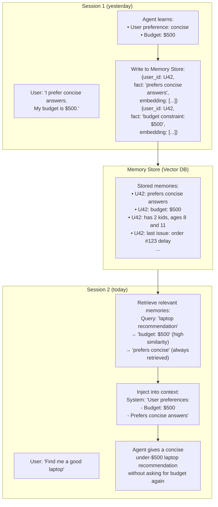
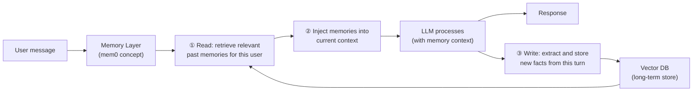

# Lesson 4.2 — Long-Term Memory in Practice: Vector Stores, mem0, and Cold Start

---

## The Problem: Conversation Ends, Knowledge Disappears

Every session ends. When a user returns the next day and asks "continue from where we left off," the agent has no idea what "where we left off" means — it starts fresh. For an enterprise assistant, a customer support agent, or a personalized shopping agent, this is a serious limitation. Users must re-explain their context on every session. The agent cannot improve from experience. Personalization is impossible without persistent memory.

Long-term memory solves this by persisting important information across sessions. This lesson covers how it works in practice — the storage layer, the retrieval mechanism, and the cold-start problem.

---

## The Long-Term Memory Architecture

Long-term memory is a **read-write external store** that the agent accesses at each session:



*Memory is written during sessions and retrieved at the start of subsequent sessions. The user never has to repeat themselves.*

---

## What to Store: Memory Extraction

Not everything said in a session should be stored. Storing too much creates noise; storing too little loses valuable information. The agent (or a separate memory-extraction component) must decide:

**What to store:**
- User preferences: "prefers bullet points", "always ships to San Francisco", "vegetarian"
- User facts: "has a Prime membership", "purchased this product before", "account tier: Gold"
- Important events: "reported a defective product on 2026-05-15", "asked about return policy 3 times"
- Task outcomes: "tried approach X → failed for reason Y"

**What NOT to store:**
- Routine Q&A that won't be relevant in future sessions
- Intermediate reasoning steps (too verbose, not useful out of context)
- Repetitions of information already stored

**Memory extraction pipeline:**
```
End of session (or after each turn) →
  LLM call: "What important facts from this conversation should be remembered for future sessions?"
  → Returns list of facts →
  → Each fact embedded → stored in vector DB with user_id, timestamp, category tags
```

---

## mem0: The Memory Layer Pattern

**mem0** (and similar systems like MemGPT) implement the memory layer concept: a dedicated middleware that sits between the agent and the LLM, automatically managing memory read and write operations.

**What mem0 does (the concept, not the specific library):**



**Three operations at every turn:**
1. **Read**: semantic search — "given this new message, what past memories are relevant?" → retrieve top-K memories
2. **Inject**: prepend retrieved memories to the context as a "Memory:" section before the conversation history
3. **Write**: after the LLM responds, extract any new memorable facts and store them

This abstracts memory management away from the agent — the agent just sees a context enriched with relevant past information.

---

## The Cold Start Problem

**Cold start** is the situation when the agent has no memory of the user at all — first-ever interaction. The agent has no preferences, no history, no facts about the user. How do you handle this gracefully?

**Three cold-start strategies:**

### Strategy 1: Default Behavior Profile
Provide a generic user profile as the starting context:
```
No memories available for this user yet.
Default assumptions:
- Respond in English at a medium complexity level
- Do not assume budget constraints
- Ask for preferences before making personalized recommendations
```

### Strategy 2: Initial Onboarding
The agent's first interaction actively collects preferences:
```
"Welcome! To help me serve you better:
1. What kind of responses do you prefer — detailed or concise?
2. What's your primary use case today?"
```

Responses are immediately stored as long-term memories.

### Strategy 3: Inference from Context
Even without explicit memory, infer from available signals:
- User's account tier (Gold/Prime/Standard) → infer price sensitivity
- Purchase history from system data → infer categories of interest
- Location → infer shipping preferences
- Device type → infer tech sophistication

**Amazon's approach** (Alexa+, Rufus): Strategy 3 first — use account data, purchase history, and behavioral signals as implicit long-term memory before ever needing explicit memory storage. Explicit preference storage is an overlay on top of this.

---

## Memory Retrieval: What Gets Injected

Not all stored memories are relevant to every turn. Memory retrieval is a semantic search:
- Query: the current user message + recent conversation context
- Results: top-K memories by cosine similarity (K=3–7 typically)
- Injected into context as a "Memory" section

**Example context structure:**
```
[System Prompt]
You are a helpful Amazon shopping assistant.

[Memory]
Relevant user memories:
- This user prefers concise responses (confidence: high)
- User's budget range: $300-$600 (from 2026-04-15)
- User previously purchased Sony WH-1000XM5 headphones (2026-03-01)
- User has 2 children, ages 8 and 11 (from 2026-05-20)

[Conversation History]
User: "Find me a gift for my daughter's birthday"
...
```

The agent immediately knows budget, that this is likely for a child, and past purchase history — without the user having to say any of this.

---

> **Interview note:** *"How would you design persistent memory for an Amazon shopping assistant like Rufus?"*
> Three layers: (1) Implicit memory from account data — purchase history, browsing behavior, Prime status — already available without any extra infrastructure. Use this as the foundation. (2) Explicit semantic memory — a vector DB (e.g., Amazon OpenSearch with k-NN) storing user preference facts extracted from past conversations. At each session start, retrieve top-K relevant memories based on the current query. Write new preferences discovered during the session. (3) Episodic memory — log significant past events (returns, complaints, rare purchases) as structured records. Retrieve when handling a similar situation. The retrieval is semantic — "user asked about gifts" retrieves "has kids ages 8 and 11" and "previously bought toys."

> **Interview note:** *"What is the cold-start problem in agent memory, and how do you handle it?"*
> Cold start: the agent has no stored memories for a new user, so it cannot personalize behavior. Three approaches: (1) Default profile — start with generic behavior and ask clarifying questions before making recommendations. (2) Active onboarding — first session collects explicit preferences (response style, interests, budget) and stores them immediately. (3) Inference from existing data — for an Amazon agent, purchase history, browsing behavior, and account tier are already available signals. These provide implicit personalization without needing explicit memory storage. In practice, use all three: inference from existing data as the baseline, active onboarding for explicit preferences, and graceful default behavior when nothing is available.

---

## Summary

- Long-term memory persists important information across sessions using an external store (vector DB), solving the "fresh start" problem.
- Memory lifecycle: **write** (extract memorable facts at session end), **retrieve** (semantic search at session start), **inject** (prepend to context as "Memory" section).
- mem0 / memory layer pattern: middleware that automatically handles read-write-inject for every turn, abstracting memory management from the agent itself.
- **Cold start**: no prior memories available. Handle with: default behavior profile, active onboarding questions, or inference from existing account/behavioral data. Amazon agents use all three.
- What to store: user preferences, facts, significant past events, task outcomes. What NOT to store: routine Q&A, intermediate reasoning, already-stored duplicates.
