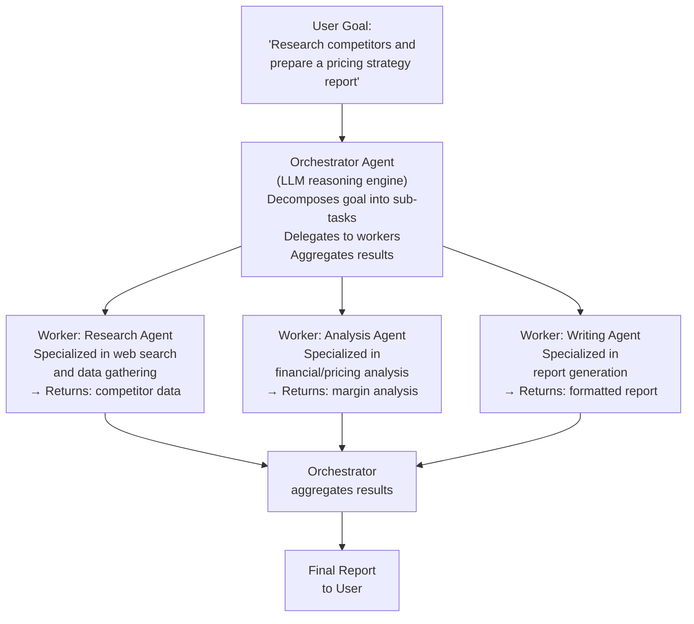
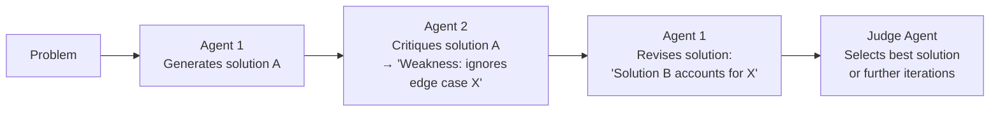
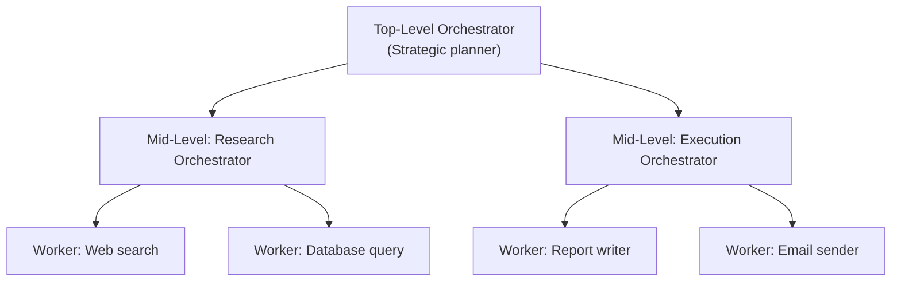

# Lesson 5.1 — Multi-Agent Patterns: Orchestrator-Worker and Beyond

---

## The Problem: One Agent Cannot Do Everything Well

A single LLM agent faces a tension: the more tools and knowledge you give it, the more confused it becomes — too many tools in context degrades selection quality, too much domain knowledge creates interference, and a system prompt trying to describe 20 different task types becomes unwieldy.

The solution is the same as in software engineering: **decomposition and specialization.** Instead of one generalist agent handling everything, build multiple specialized agents and an orchestrator that routes work to the right one.

Multi-agent systems also unlock **parallelism** — independent sub-tasks can be delegated to agents running simultaneously, dramatically reducing end-to-end latency for complex workflows.

---

## Pattern 1: Orchestrator-Worker (Supervisor Pattern)

The dominant pattern in production. One orchestrator agent receives the user's goal and delegates sub-tasks to specialized worker agents.



**Key properties:**
- Workers run in **parallel** for independent tasks (W1 + W2 can run simultaneously; W3 waits for both)
- Each worker has a **focused tool set** — the research agent only has web search tools; the analysis agent only has compute tools
- The orchestrator has **no specialized tools** — it only delegates, aggregates, and makes routing decisions
- **Single point of coordination**: the orchestrator knows the overall goal and state

**Amazon example:** Amazon Q Business's "Research" task — the orchestrator decomposes a complex business question into a research sub-task (web + internal docs), an analysis sub-task (compute + SQL), and a formatting sub-task (template engine).

---

## Pattern 2: Peer-to-Peer (Collaborative / Debate)

Agents operate as equals, collaborating or critiquing each other without a fixed hierarchy. Two variants:

### Debate variant: Improve quality through disagreement


**Use case:** Code review (Agent 1 writes code, Agent 2 reviews), fact-checking (Agent 1 makes claims, Agent 2 verifies), red-teaming (Agent 2 tries to break Agent 1's solution).

### Collaboration variant: Different perspectives, combined
- Agent 1: Customer perspective
- Agent 2: Technical perspective
- Agent 3: Business/cost perspective
- Aggregator: Combines all three into a balanced recommendation

**Use case:** Design review, risk analysis, product recommendations.

---

## Pattern 3: Hierarchical Multi-Agent

A multi-level version of orchestrator-worker, where workers can themselves be orchestrators of lower-level agents:



**Use case:** Complex enterprise workflows where different phases are themselves complex enough to require their own orchestration.

---

## Choosing the Right Pattern

| Scenario | Best Pattern | Why |
|---|---|---|
| Complex task with clear phases | Orchestrator-Worker | Clear decomposition, parallel execution |
| Task requiring quality review | Peer-to-Peer (debate) | Catches errors the original agent missed |
| Multi-stakeholder analysis | Peer-to-Peer (collaboration) | Multiple specialized perspectives combined |
| Enterprise workflows with sub-workflows | Hierarchical | Natural mapping to organizational structure |
| Short interactive tasks | Single agent | Multi-agent overhead not justified |

---

## Agent Communication: How Agents Talk to Each Other

Agents communicate by passing messages — structured data in a defined format. Three communication styles:

**1. Direct message passing (simplest):**
The orchestrator calls the worker agent's API with a task description and receives a result. The worker is treated as a "tool" — a black box that takes input and returns output.

**2. Shared state / blackboard:**
All agents read from and write to a shared context store (a database or in-memory dict). Any agent can see what other agents have written. No direct messages needed.

**3. Message queue (for async workflows):**
The orchestrator publishes tasks to a message queue (SQS, Kafka). Workers consume and process. Results are published to another queue. The orchestrator subscribes to results. Fully asynchronous — workers run at their own pace.

For most production agent systems: direct message passing (synchronous) for short tasks, message queue (asynchronous) for long-running workflows.

---

## Concrete Example: Amazon Alexa+ Smart Home

A user says: *"Get the house ready for movie night."*

This single command triggers a multi-agent workflow:

```
Orchestrator Agent:
  Decomposes: 1. Control lights, 2. Set thermostat, 3. Control TV, 4. Order snacks if needed

  → Worker: Smart Home Agent (lights + thermostat tools)
    → Dims living room lights to 30%, sets temp to 68°F

  → Worker: Entertainment Agent (TV/streaming tools)
    → Turns on TV, opens Netflix, goes to "continue watching"

  → Worker: Shopping Agent (Amazon Fresh tools)
    → Checks pantry inventory (low on popcorn)
    → Suggests: "Shall I order popcorn for Prime delivery?"

All three workers run in parallel → total latency ≈ max(individual latencies), not sum.
```

Single agent approach: one agent with all smart home + entertainment + shopping tools → confused selection, sequential execution, degraded performance. Multi-agent: clear specialization, parallel execution, far better performance.

---

> **Interview note:** *"When would you use a multi-agent system instead of a single agent?"*
> Three situations: (1) Specialization needed — different phases of the task require very different tools and expertise; one agent with everything performs worse than specialized agents. (2) Parallelism needed — independent sub-tasks can run simultaneously; a single agent runs them sequentially. (3) Quality-critical tasks — a debate/review pattern where one agent generates and another critiques dramatically reduces error rates vs self-review. Don't use multi-agent when: the task is simple (overhead outweighs benefit), the sub-tasks are highly interdependent (constant coordination defeats the purpose), or you need predictable, auditable workflows (single agent + pipeline is more reliable).

> **Interview note:** *"How does an orchestrator agent know how to decompose a task and delegate to the right worker?"*
> The orchestrator uses its LLM reasoning to decompose the task (task decomposition — Lesson 2.3) and determines which worker to delegate each sub-task to based on: (1) Worker descriptions in the system prompt — "Worker A specializes in financial analysis, Worker B in document generation." The orchestrator treats workers like tools with descriptions. (2) Capability matching — the orchestrator reasons: "this sub-task requires web search → delegate to the Research worker." (3) Dependency tracking — the orchestrator must know which sub-tasks depend on others (e.g., Report generation depends on Research output) to schedule correctly. This is why the orchestrator itself needs strong reasoning capability — it is essentially a planner with delegation authority.

---

## Summary

- **Orchestrator-Worker**: one orchestrator decomposes the goal, delegates sub-tasks to specialized workers in parallel, aggregates results. The dominant production pattern.
- **Peer-to-Peer**: agents collaborate or debate as equals — debate for quality review (Agent 1 generates, Agent 2 critiques), collaboration for multi-perspective analysis.
- **Hierarchical**: workers can themselves be orchestrators of sub-workers — maps to complex enterprise workflows.
- Agent communication: direct message passing (simple, synchronous), shared state/blackboard, or message queues (async, long-running).
- Use multi-agent when: specialization improves quality, parallelism reduces latency, or quality review is needed. Use single agent when: the task is simple, sub-tasks are interdependent, or reliability/auditability is paramount.
