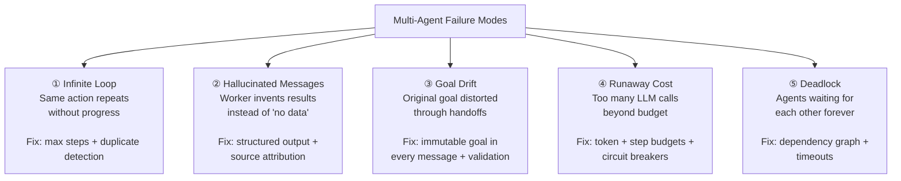

# Lesson 5.2 — Agent Communication, Failure Modes, and Drift

---

## The Problem: Multi-Agent Systems Fail in New Ways

A single agent has a single point of failure. A multi-agent system has N agents × M inter-agent communication channels × K tools per agent = many failure surfaces. Worse, failures in multi-agent systems often cascade — one agent's bad output becomes another agent's input, and the error amplifies rather than being caught.

This lesson covers the communication layer between agents, the most critical failure modes, and how to detect and prevent them in production.

---

## How Agents Communicate: The Message Protocol

Agents in a multi-agent system pass messages to each other. A well-structured agent-to-agent message includes:

```json
{
  "from_agent": "orchestrator",
  "to_agent": "research_worker",
  "task_id": "T-2026-0601-001",
  "task_description": "Search for the top 5 laptops under $500 on Amazon and competitor sites",
  "constraints": {
    "max_results": 5,
    "include_specs": ["RAM", "storage", "screen_size"],
    "deadline_seconds": 30
  },
  "context": {
    "user_goal": "Prepare a laptop buying guide for college students",
    "already_retrieved": ["Amazon results — done"]
  },
  "expected_output_format": "JSON array of {name, price, specs, source}"
}
```

**Critical fields:**
- `task_description`: precise, unambiguous. Vague tasks produce vague worker outputs.
- `constraints`: what limits apply (time, scope, format)
- `context`: what the worker needs to know about the broader goal
- `expected_output_format`: how the worker's output should be structured for the orchestrator to use

**Without a defined message format:** Workers return outputs in different formats; the orchestrator cannot parse them; errors cascade.

---

## The Five Critical Failure Modes

### Failure 1: Infinite Loop

**What happens:** An agent repeatedly calls a tool or delegates to a sub-agent without making progress. Each iteration costs tokens and time but produces no output. The system runs indefinitely until externally terminated or until cost limits are hit.

**Example:** Research agent can't find data → tries a different query → also fails → tries original query again → loops.

**Prevention:**
- Hard iteration limit (e.g., max 15 steps per agent)
- Duplicate detection: if the same (action, input) pair occurs twice, terminate that branch
- Progress detection: after N steps with no "new information" discovered, terminate

---

### Failure 2: Hallucinated Inter-Agent Messages

**What happens:** An agent fabricates results it does not actually have. Instead of returning "No results found," it invents plausible-looking data. The orchestrator treats this as real and proceeds. The final output is confidently wrong.

**Example:** Research worker returns 5 competitor prices — all hallucinated because its web search returned empty results. The analysis worker computes real-looking margin analysis on fake data.

**Prevention:**
- Workers must return structured output with explicit source attribution: `{"result": [...], "source": "web_search", "result_count": 5}`
- `result_count: 0` is an explicit signal the orchestrator can detect and handle (ask user, try different approach)
- Orchestrator validates worker outputs before passing to next worker: check that expected fields are present, that claimed data sources were actually called

---

### Failure 3: Goal Drift

**What happens:** Through multiple handoffs and re-phrasings, the original goal gets subtly distorted. Each agent slightly reinterprets the task description; over several steps, the final output addresses a different question than the user asked.

**Example:**
- User goal: "Find affordable laptops for students who do video editing"
- Orchestrator delegates: "Find laptops under $500 for students"
- Research agent interprets: "Find top laptops under $500" (drops student context)
- Analysis agent receives: "Rank laptops by performance" (drops price context)
- Final output: high-performance workstations, mostly over $500

**Prevention:**
- The original user goal is passed as immutable context in every inter-agent message — workers cannot override it
- At each handoff, the orchestrator explicitly states: "The original user goal is: X. Your sub-task is: Y."
- Orchestrator validates final output against original goal before returning to user

---

### Failure 4: Runaway Cost

**What happens:** A poorly bounded agent loop or multi-agent workflow makes far more LLM calls and tool calls than intended. At $0.01–$0.05 per LLM call, a 100-step loop across 5 agents can cost $5–$25 per user query.

**Prevention:**
- Token budget per task: `max_tokens_per_task = 50000` (across all agents in this workflow)
- Step budget: `max_steps_per_agent = 10`, `max_total_steps_per_workflow = 50`
- Cost estimation before starting: for known task types, estimate token usage and warn if it seems high
- Real-time cost monitoring with circuit breakers: if cost exceeds $X, terminate and return partial results

---

### Failure 5: Communication Deadlock

**What happens:** In bidirectional or peer-to-peer agent systems, Agent A waits for Agent B's output before proceeding, while Agent B waits for Agent A's output. Both wait forever.

**Prevention:**
- Define a clear dependency graph before execution — no circular dependencies
- Set timeouts on all inter-agent calls: if no response in N seconds, treat as failure and handle
- Orchestrator-worker pattern (hierarchical) avoids deadlock by design — workers never call each other

---

## Failure Mode Summary Diagram



---

## Detecting Drift: The Orchestrator's Validation Role

In production, the orchestrator must actively validate that work is staying on track. Two validation approaches:

**Mid-task validation:** After each worker returns, the orchestrator checks: "Does this output make sense given the original goal? Does it have the expected format? Are the values plausible?" If validation fails, the orchestrator can re-delegate with a corrective prompt.

**Goal alignment check:** Before producing the final output, the orchestrator runs a final check: "Given the original user goal [X], does this output actually address it?" This is a separate LLM call that acts as a QA gate.

---

## Concrete Example: Detecting and Handling Hallucination

The Research worker returns:
```json
{
  "results": [
    {"name": "Dell XPS 15", "price": 489, "source": "bestbuy.com"},
    ...
  ],
  "source": "web_search",
  "result_count": 5
}
```

The orchestrator validation checks:
1. Is `result_count` > 0? ✓ Yes
2. Does each result have required fields (`name`, `price`, `source`)? ✓ Yes
3. Are all prices within the expected range ($0–$500)? ✓ Yes
4. Does `source` indicate an actual tool call was made? ✓ "web_search" — the tool was in the tool call log

If any check fails, the orchestrator re-delegates with: "Your previous output was missing required fields. Please retry and ensure every result includes name, price (must be under $500), and source URL."

---

> **Interview note:** *"What are the most common failure modes in multi-agent systems?"*
> Five: (1) Infinite loops — an agent retries without progress, consuming tokens and cost. Fix: max steps + duplicate detection. (2) Hallucinated inter-agent messages — a worker invents results instead of saying "no data found." Fix: structured output with source attribution + orchestrator validation. (3) Goal drift — the original user goal gets subtly distorted through multiple handoffs. Fix: pass immutable original goal in every message, validate final output against it. (4) Runaway cost — too many LLM calls, no budget limit. Fix: token and step budgets with circuit breakers. (5) Deadlock — agents waiting for each other in bidirectional systems. Fix: dependency graph with no circular deps, timeouts on all inter-agent calls.

---

## Summary

- Structured inter-agent messages must include: precise task description, constraints, context (including the original user goal), and expected output format. Vague messages cause vague outputs.
- Five failure modes: infinite loops, hallucinated messages, goal drift, runaway cost, and deadlock. Each has a specific prevention strategy.
- **Goal drift prevention**: include the immutable original user goal in every inter-agent message. Orchestrator validates final output against original goal.
- **Hallucination prevention**: workers return structured output with source attribution and result counts. Orchestrator validates before passing to next worker.
- **Cost control**: token budgets per task, step budgets per agent, real-time monitoring with circuit breakers.
