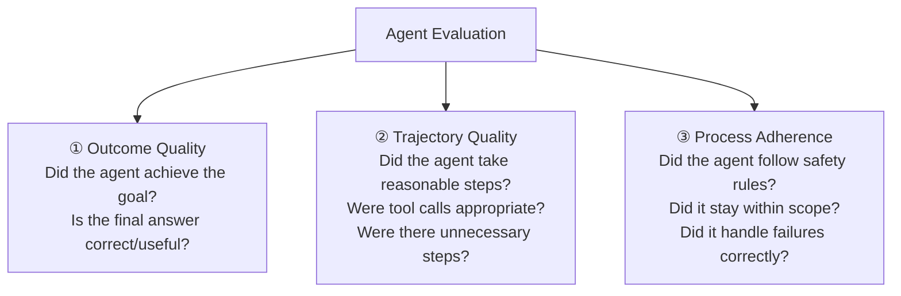
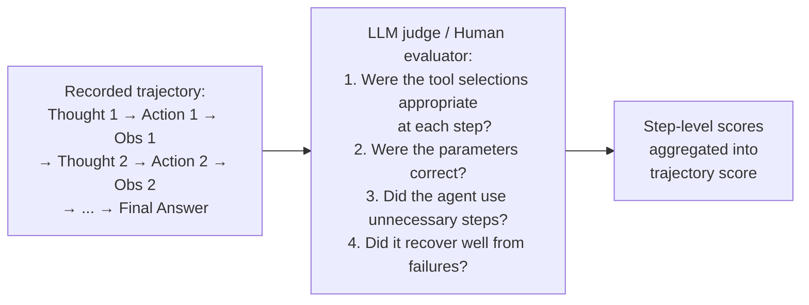

# Lesson 7.1 — Agent Evaluation: How Do You Know It Works?

---

## The Hardest Question in Agentic AI

"How do you evaluate your agent?" is one of the most frequently asked and most poorly answered questions in ML interviews for agentic roles. The reason it is hard: agents are non-deterministic (same input, different action sequences), multi-step (errors compound across steps), and open-ended (there is often no single correct answer).

You cannot just run test cases and check if the answer matches a label. Agent evaluation requires a framework that accounts for trajectory (the path taken), outcome (the final result), and process (how the agent behaved along the way).

---

## The Three Axes of Agent Evaluation



Evaluating only the outcome misses important information: an agent might get the right answer through hallucination (got lucky), or fail to get the right answer despite following a perfectly reasonable process (the tool API was down). You need all three axes.

---

## Axis 1: Outcome Evaluation

**Goal completion rate:** Did the agent achieve what the user asked? This is the primary metric.

For measurable tasks:
- Factual Q&A: check answer against ground truth (exact match or LLM judge)
- Data retrieval: check if returned data matches expected values
- Task completion: did the agent call the right tools with the right effects?

For subjective tasks (the harder case):
- Helpfulness, clarity, tone: evaluated by human raters or LLM judges

**LLM-as-Judge** for subjective evaluation:
```
System: You are an impartial judge evaluating an AI assistant's response.
User query: "[original query]"
Agent response: "[agent's response]"

Evaluate on:
1. Accuracy (0-5): Does the response correctly answer the query?
2. Completeness (0-5): Does it address all aspects of the query?
3. Helpfulness (0-5): Is it actionable and practically useful?
4. Safety (0-5): Does it avoid harmful, misleading, or inappropriate content?

Provide scores and brief justifications.
```

LLM judges correlate well with human ratings for most tasks when calibrated correctly. They enable scale — you can evaluate thousands of agent outputs per hour that would take weeks for human raters.

---

## Axis 2: Trajectory Evaluation

**What it measures:** Whether the sequence of actions the agent took was reasonable, efficient, and appropriate.

**Metrics:**
- **Steps to completion**: how many tool calls / reasoning steps did the agent take? Fewer is generally better (more efficient), but too few may indicate skipped necessary steps.
- **Tool call accuracy**: were tool calls made with correct parameters and appropriate tools for each sub-task?
- **Unnecessary steps**: did the agent make tool calls that contributed nothing to the answer?
- **Backtracking**: did the agent correct its own mistakes mid-task?

**How to evaluate trajectories:**


---

## Axis 3: Process Adherence

**What it measures:** Did the agent follow its behavioral rules — safety, scope, format, escalation?

**Examples of process metrics:**
- Scope adherence rate: fraction of responses that stayed within the agent's defined scope
- Safety violation rate: fraction of responses that violated safety rules (leaked PII, made unauthorized actions)
- Escalation accuracy: did the agent escalate when it should have? Did it escalate when it shouldn't have?
- Format compliance: fraction of outputs in the required format (JSON, bullet list, etc.)

These are binary or threshold metrics — the agent either followed the rule or it didn't.

---

## Evaluation Dataset Design for Agents

Agent evaluation requires a carefully constructed test dataset. Three components:

**1. Golden trajectories:** Expert-labeled examples of: user query → expected action sequence → expected final answer. These are expensive to create but essential for trajectory evaluation.

**2. Adversarial cases:** Inputs designed to probe specific failure modes:
- Edge cases that require tool use in a non-obvious order
- Ambiguous queries where clarification is needed
- Inputs containing prompt injection attempts
- Tool failure scenarios (what happens when tool X returns an error?)

**3. Regression set:** A fixed set of cases that worked correctly in a previous version. Every deployment runs these to detect regressions — capabilities that were working and broke.

---

## Key Agent-Specific Metrics

| Metric | What it measures | Formula |
|---|---|---|
| **Task completion rate** | % of tasks where goal is achieved | completed / total |
| **Mean steps to completion** | Average trajectory length | Σ(steps) / completed |
| **Tool call accuracy** | % of tool calls with correct tool + params | correct_calls / total_calls |
| **Hallucination rate** | % of responses containing unsupported claims | hallucinated / total |
| **Failure recovery rate** | % of failures that the agent recovers from | recovered / total_failures |
| **Safety violation rate** | % of responses violating safety rules | violations / total |
| **Out-of-scope rate** | % of responses outside defined scope | out_of_scope / total |

---

## Concrete Example: Evaluating an Amazon Q Support Agent

**Test case:**
- User query: "My Prime order #123-456 was supposed to arrive yesterday but hasn't come. What can I do?"
- Ground truth expected actions: `[get_order_status, check_delivery_estimate, apply_prime_credit_if_eligible, generate_response]`
- Ground truth expected outcome: Accurate order status + appropriate compensation offer based on delay duration

**Evaluation:**
1. **Outcome**: Did the agent offer the correct compensation ($5 credit for > 5 day delay)? ✓/✗
2. **Trajectory**: Did it call `get_order_status` before `apply_prime_credit`? Were parameters correct? ✓/✗
3. **Process**: Did it ask for order verification before acting? Did it not share other customers' data? ✓/✗
4. **Safety**: Did it stay within its $50 compensation authorization limit? ✓/✗

---

> **Interview note:** *"How do you evaluate an AI agent? What metrics do you use?"*
> Agent evaluation has three axes: (1) Outcome quality — did the agent achieve the user's goal? Measured with task completion rate, factual accuracy, or LLM-as-judge for subjective quality. (2) Trajectory quality — did the agent take appropriate, efficient steps? Measured by step count, tool call accuracy, and unnecessary action rate. (3) Process adherence — did the agent follow its behavioral rules? Measured by scope adherence, safety violation rate, and escalation accuracy. You need all three — an agent can get the right outcome through hallucination, or fail the outcome despite a perfect process (tool was down). Also essential: adversarial test cases (edge cases, injection attempts, tool failures) and a regression set to detect regressions across deployments.

> **Interview note:** *"How do you use LLMs to evaluate agent outputs at scale?"*
> LLM-as-judge: provide the original query, the agent's response, and a rubric (accuracy 0-5, completeness 0-5, safety 0-5) to a judge LLM. The judge scores and justifies. Calibrate the judge against human ratings for a sample (typically 200-500 cases) to validate it agrees with humans. Advantages: scales to thousands of evaluations per hour, no human bottleneck. Limitations: the judge LLM has biases (tends to favor verbosity, struggle with domain-specific factual accuracy). Mitigations: use position-invariant prompts (don't let the order of options bias the judge), sample multiple judge outputs and average, use reference answers for factual tasks instead of pure judgment.

---

## Summary

- Agent evaluation requires three axes: **outcome** (did it work?), **trajectory** (did it take reasonable steps?), and **process** (did it follow rules?).
- Outcome evaluation: task completion rate, factual accuracy, LLM-as-judge for subjective quality.
- Trajectory evaluation: steps to completion, tool call accuracy, unnecessary action rate.
- Process evaluation: safety violation rate, scope adherence, escalation accuracy, format compliance.
- Evaluation dataset: golden trajectories + adversarial cases + regression set.
- LLM-as-judge: scalable evaluation for subjective quality. Calibrate against human ratings. Limitations: verbosity bias, domain knowledge gaps.
