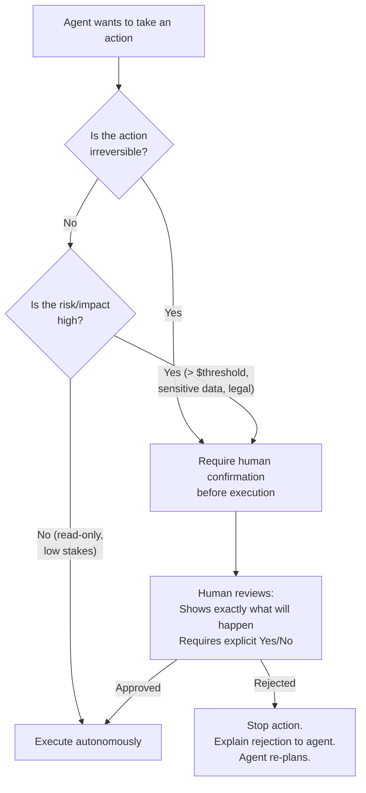
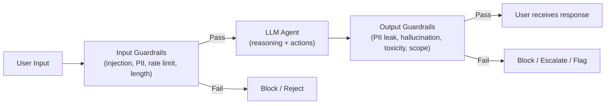

# Lesson 7.2 — Human-in-the-Loop, Guardrails, and Failure Modes

---

## The Problem: Agents Can Cause Real Damage

An agent that autonomously sends emails, charges credit cards, modifies databases, and deploys code needs safeguards. Unlike a chatbot (where the worst outcome is a bad text response), an agentic system's mistakes are real-world actions with real-world consequences. Three mechanisms protect against this: Human-in-the-Loop (HITL) checkpoints, guardrails, and failure mode handling.

---

## Human-in-the-Loop (HITL)

HITL is not about distrust of AI — it is about appropriate control boundaries. Some decisions require human judgment, authorization, or accountability regardless of how capable the agent is.

### When to Require Human Approval



**The three HITL triggers:**
1. **Irreversibility**: sending email, processing payment, deleting data, deploying code.
2. **High stakes**: actions above a cost threshold, involving PII, or with legal implications.
3. **Low confidence**: the agent's confidence is below threshold (see Lesson 7.1) — human confirms before proceeding.

### HITL Implementation Pattern

```python
async def execute_with_hitl_check(
    action_type: str,
    action_params: dict,
    agent_reasoning: str,
    user_interface,
    hitl_config: dict
) -> dict:
    """
    Gate irreversible or high-stakes actions behind human confirmation.
    """
    
    # Check if this action type requires confirmation
    requires_confirmation = (
        action_type in hitl_config["always_confirm"] or
        action_params.get("amount", 0) > hitl_config["amount_threshold"] or
        action_type in hitl_config["sensitive_actions"]
    )
    
    if not requires_confirmation:
        return await execute_action(action_type, action_params)
    
    # Build a clear, human-readable description of what will happen
    preview = format_action_preview(action_type, action_params)
    
    confirmation_request = {
        "title": "Agent Action Requires Your Approval",
        "description": preview,
        "agent_reasoning": agent_reasoning,  # Why the agent wants to do this
        "impact": describe_impact(action_type, action_params),
        "reversibility": "This action cannot be undone.",
        "options": ["Approve", "Reject", "Modify"]
    }
    
    user_decision = await user_interface.request_confirmation(confirmation_request)
    
    if user_decision["choice"] == "Approve":
        result = await execute_action(action_type, action_params)
        return {"executed": True, "result": result}
    
    elif user_decision["choice"] == "Modify":
        # User wants to change something — return modified params to agent
        return {
            "executed": False,
            "reason": "user_modified",
            "user_modifications": user_decision.get("modifications"),
            "agent_instruction": "User requested modifications. Adjust your plan accordingly."
        }
    
    else:  # Reject
        return {
            "executed": False,
            "reason": "user_rejected",
            "user_feedback": user_decision.get("reason", ""),
            "agent_instruction": f"User rejected this action. Reason: {user_decision.get('reason')}. Consider an alternative approach."
        }
```

**The key design principle:** Show the user exactly what will happen — not "I am going to send a message" but "I am going to send an email to john@company.com with the subject 'Q3 Report' containing the following content: [preview]. This will be sent immediately and cannot be recalled."

---

## Guardrails

Guardrails are automated safety checks that run on inputs and outputs — they do not require human involvement and operate at millisecond speed.

### Input Guardrails (Pre-LLM)

Checks before the LLM processes the input:

```python
class InputGuardrails:
    
    async def validate(self, user_input: str, user_context: dict) -> dict:
        """
        Run all input guardrails. Returns block/allow decision.
        """
        results = {}
        
        # 1. Prompt injection detection
        injection_score = await self._detect_prompt_injection(user_input)
        if injection_score > 0.8:
            return {
                "allowed": False,
                "reason": "prompt_injection_detected",
                "action": "block"
            }
        results["injection_score"] = injection_score
        
        # 2. PII in input (should not be sending PII to external LLM APIs)
        pii_types = self._detect_pii(user_input)
        if pii_types and "credit_card" in pii_types:
            return {
                "allowed": False,
                "reason": "pii_in_input",
                "action": "block",
                "message": "Please do not include payment card details in your messages."
            }
        
        # 3. Rate limit per user
        query_count = await self._get_recent_query_count(
            user_context["user_id"], window_minutes=5
        )
        if query_count > 50:
            return {
                "allowed": False,
                "reason": "rate_limit_exceeded",
                "action": "throttle"
            }
        
        # 4. Query length check
        if len(user_input.split()) > 2000:
            return {
                "allowed": False,
                "reason": "input_too_long",
                "action": "truncate_or_reject"
            }
        
        return {"allowed": True, "results": results}
```

### Output Guardrails (Post-LLM)

Checks after the LLM generates a response, before it reaches the user:

```python
class OutputGuardrails:
    
    async def validate(self, output: str, context: dict) -> dict:
        """
        Run all output guardrails. Can block, modify, or flag output.
        """
        
        # 1. PII in output (check if agent leaked data it shouldn't)
        pii_in_output = self._detect_pii(output)
        sensitive_pii = {"ssn", "credit_card", "bank_account"} & set(pii_in_output)
        if sensitive_pii:
            return {
                "safe": False,
                "action": "block",
                "reason": f"Output contains sensitive PII: {sensitive_pii}"
            }
        
        # 2. Hallucination check (for factual tasks)
        if context.get("task_type") == "factual_qa":
            hallucination_score = await self._check_faithfulness(
                output, context.get("retrieved_context", [])
            )
            if hallucination_score < 0.6:
                return {
                    "safe": False,
                    "action": "flag_for_review",
                    "reason": "Low faithfulness score — potential hallucination"
                }
        
        # 3. Toxic content check
        toxicity_score = await self._check_toxicity(output)
        if toxicity_score > 0.7:
            return {
                "safe": False,
                "action": "block",
                "reason": "toxic_content_detected"
            }
        
        # 4. Scope check (agent stayed within its defined scope)
        if context.get("agent_scope"):
            scope_violation = self._check_scope(output, context["agent_scope"])
            if scope_violation:
                return {
                    "safe": False,
                    "action": "block",
                    "reason": f"Response outside defined scope: {scope_violation}"
                }
        
        return {"safe": True}
```

### Guardrail Layering



---

## Agent Failure Modes (Single Agent)

Beyond multi-agent failures (Lesson 5.2), single agents have specific failure patterns:

| Failure Mode | Description | Example | Fix |
|---|---|---|---|
| **Reasoning loop** | Agent reasons itself in circles, never acting | Keeps saying "I need to verify..." | Max reasoning steps limit |
| **Scope creep** | Agent exceeds its task boundary | Customer service agent starts offering legal advice | Strict scope definition in system prompt + output guardrail |
| **Over-delegation** | Agent uses tools for everything, even when it knows the answer | Calls search for simple math | Explicit guidance: "only call tools when you cannot answer from existing context" |
| **Catastrophic tool call** | Correct reasoning, wrong tool parameters | `delete_user(user_id="all")` instead of specific user | Schema validation + parameter whitelisting |
| **Context window saturation** | Conversation + tool results fill context; agent loses track of original goal | Long research task degrades mid-way | Periodic summarization (Lesson 7.3) |
| **Sycophancy** | Agent agrees with user's incorrect assumption | "You're right, the deadline is next week" | Calibration prompt: "do not agree to avoid conflict; only confirm if you are certain" |

---

> **Interview note:** *"How do you build a safe agentic system for production?"*
> Three complementary layers: (1) HITL checkpoints — for irreversible or high-stakes actions (payments, emails, deletions), require explicit user confirmation before executing. Show the user exactly what will happen. (2) Guardrails — automated fast checks on inputs (prompt injection, PII, rate limits) and outputs (PII leakage, hallucination score, toxicity, scope adherence). These run at millisecond speed and don't require human involvement. (3) Scope restriction — define the agent's permitted scope narrowly in the system prompt AND in output guardrails. A customer support agent should not be able to offer legal advice or access other users' data even if prompted to. Defense in depth: no single layer is sufficient; all three together make the system safe.

---

## Summary

- HITL triggers: irreversibility (emails, payments, deletions), high stakes (above cost threshold, legal implications), low confidence. Show users exactly what will happen; require explicit Yes/No approval.
- When rejected: the rejection reason becomes an Observation for the agent to re-plan.
- Input guardrails: prompt injection detection, PII checks, rate limiting, length validation — runs before LLM.
- Output guardrails: PII leakage detection, hallucination/faithfulness scoring, toxicity check, scope validation — runs after LLM before user sees response.
- Single-agent failure modes: reasoning loops, scope creep, over-delegation, catastrophic parameters, context saturation, sycophancy — each with a specific mitigation.
