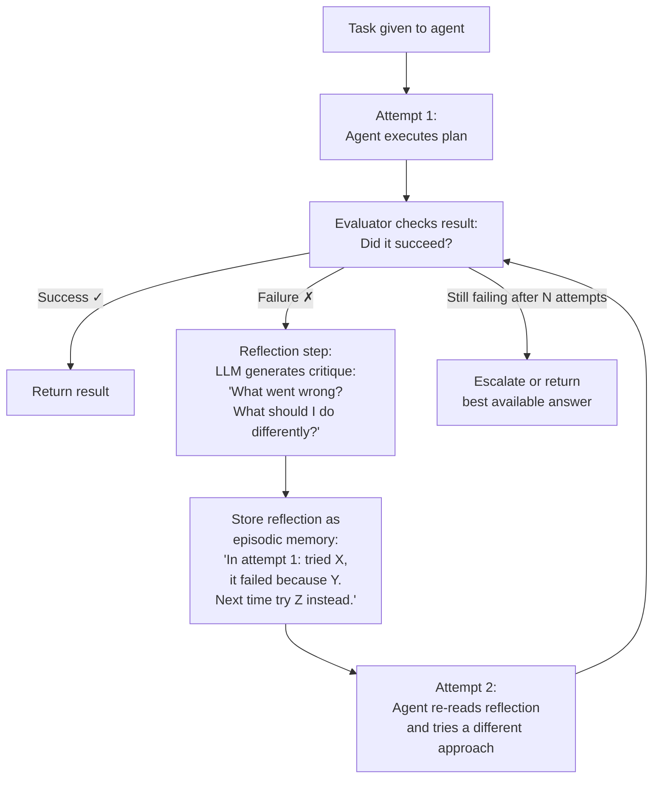

# Lesson 8.1 — Reflexion and Self-Healing Agents

---

## The Problem: First-Attempt Failure Without Correction

A standard ReAct agent executes a plan, gets results, and reports the outcome — whether good or bad. If the first approach fails (wrong tool, bad query, incomplete answer), the agent just... fails. It has no mechanism to reflect on what went wrong and try a better approach.

Humans do not work this way. When you try something and it fails, you think about why it failed and try a different approach. Reflexion adds this self-reflection and self-correction loop to agents.

---

## What Is Reflexion?

Reflexion (Shinn et al., 2023) is a framework that gives agents a structured way to learn from their own failures within a session. The core idea: after a task attempt fails, have the agent (or a separate reflection LLM) generate a verbal critique of what went wrong, store this as an "episodic memory" of the failure, and use it to guide a better next attempt.



The reflection is stored in a "scratchpad" that persists across attempts — the agent enters each new attempt aware of what it already tried and why it failed.

---

## The Reflection Prompt

The quality of the reflection determines whether the next attempt improves. A good reflection prompt:

```python
REFLECTION_PROMPT = """You are an expert evaluator reviewing an agent's failed task attempt.

TASK: {original_task}

ATTEMPT {attempt_number} TRAJECTORY:
{agent_trajectory}  # The full thought/action/observation history

OUTCOME: {outcome}  # What was the actual result?

EVALUATION: {evaluation_result}  # Why did this fail?

Generate a REFLECTION that will help the agent succeed on the next attempt:
1. What specific mistake did the agent make?
2. What was the root cause of the failure?
3. What concrete alternative approach should be tried next?
4. What should the agent absolutely NOT do again?

Be specific. Generic advice like "try harder" is not useful.
Reference specific tool calls, observations, or reasoning steps by name.

REFLECTION:"""
```

**Example reflection in practice:**

```
Task: "Find the current price of Tesla stock and compare it to the 52-week high."

Attempt 1 trajectory:
- Thought: I'll search for Tesla stock price
- Action: search_web(query="Tesla stock price")
- Observation: General news articles about Tesla, no current price data
- Action: search_web(query="TSLA current price")
- Observation: More articles, still no real-time price

Outcome: Agent returned "I could not find the current stock price."
Evaluation: FAILED — real-time financial data requires a specialized financial API, not web search.

REFLECTION:
Root cause: Used general web search for real-time financial data. 
Web search returns articles and commentary, not real-time price feeds.
What to do differently: Use the `financial_data_api` tool with ticker="TSLA" 
and fields=["current_price", "52_week_high"]. This tool specifically handles 
real-time market data.
What NOT to do: Do not use search_web for any real-time financial metrics.
Always use financial_data_api for price, volume, or market cap queries.
```

This reflection is much more useful than "try a different approach." The agent enters Attempt 2 knowing exactly which tool to use.

---

## Self-Healing Agents

A self-healing agent is a broader concept: an agent that detects when something goes wrong (a tool failure, a wrong output, an inconsistency in results) and automatically recovers — without returning to the user for help.

### Three Self-Healing Patterns

**Pattern 1: Tool Failure Recovery**

When a tool fails or returns unexpected output, the agent automatically tries an alternative:

```python
async def self_healing_tool_call(
    primary_tool: str,
    primary_params: dict,
    fallback_tools: list[dict],  # [{tool, params}] ordered by preference
    agent_context: str,
    llm_client
) -> dict:
    """
    Try primary tool. On failure, automatically try fallbacks.
    """
    
    try:
        result = await execute_tool(primary_tool, primary_params)
        if result.get("success"):
            return result
        failure_reason = result.get("error", "Unknown error")
    except Exception as e:
        failure_reason = str(e)
    
    # Primary failed — try fallbacks
    for fallback in fallback_tools:
        # Generate fallback params using LLM (may need adjustment for the different tool)
        adapted_params = await adapt_params_for_fallback(
            original_params=primary_params,
            original_tool=primary_tool,
            fallback_tool=fallback["tool"],
            failure_reason=failure_reason,
            llm_client=llm_client
        )
        
        try:
            result = await execute_tool(fallback["tool"], adapted_params)
            if result.get("success"):
                # Log the recovery for observability
                log_recovery(
                    primary_tool=primary_tool,
                    fallback_tool=fallback["tool"],
                    failure_reason=failure_reason
                )
                return {**result, "recovered_via": fallback["tool"]}
        except Exception:
            continue  # Try next fallback
    
    # All attempts exhausted
    return {
        "success": False,
        "error": f"All tools exhausted. Primary: {failure_reason}",
        "tools_tried": [primary_tool] + [f["tool"] for f in fallback_tools]
    }
```

**Pattern 2: Output Validation + Self-Correction**

After generating an output, the agent validates it against expected criteria. If validation fails, it corrects:

```python
async def generate_with_self_correction(
    task: str,
    validator: callable,
    llm_client,
    max_corrections: int = 2
) -> str:
    """
    Generate output. Validate. If invalid, provide error feedback and regenerate.
    """
    
    prompt = task
    
    for attempt in range(max_corrections + 1):
        response = await llm_client.chat.completions.create(
            model="gpt-4o",
            messages=[{"role": "user", "content": prompt}],
            max_tokens=1000
        )
        output = response.choices[0].message.content
        
        # Validate the output
        validation_result = validator(output)
        
        if validation_result["valid"]:
            return output
        
        # Validation failed — add correction feedback to prompt
        error_feedback = validation_result["errors"]
        prompt = f"""{task}

PREVIOUS ATTEMPT (attempt {attempt + 1}) WAS INVALID:
Output: {output}
Errors: {error_feedback}

Please fix these specific errors and try again:"""
    
    # Max corrections reached — return last attempt with warning
    return output  # Or raise an exception, depending on requirements
```

**Pattern 3: Consistency Checking**

When the agent retrieves information from multiple sources, check for consistency. If sources conflict, the agent detects the conflict and resolves it:

```python
async def retrieve_with_consistency_check(
    query: str,
    tools: list[str],
    llm_client
) -> dict:
    """
    Retrieve from multiple sources. Detect conflicts. Resolve or flag.
    """
    
    results = {}
    for tool in tools:
        results[tool] = await execute_tool(tool, {"query": query})
    
    # Check for conflicts
    conflict_check_prompt = f"""Given these results from multiple sources, are there any factual conflicts?

Query: {query}

Results:
{format_results(results)}

If there are conflicts:
1. Identify what specifically conflicts
2. Determine which source is more authoritative for this type of information
3. State your confidence in the resolution

If no conflicts: say "No conflicts detected."

Output JSON: {{"conflict": true/false, "conflict_details": "...", "resolution": "...", "authoritative_source": "..."}}"""
    
    conflict_response = await llm_client.chat.completions.create(
        model="gpt-4o-mini",
        messages=[{"role": "user", "content": conflict_check_prompt}],
        response_format={"type": "json_object"},
        max_tokens=200,
        temperature=0.0
    )
    
    import json
    conflict_info = json.loads(conflict_response.choices[0].message.content)
    
    if conflict_info.get("conflict"):
        # Resolve by preferring authoritative source
        authoritative = conflict_info.get("authoritative_source")
        return {
            "result": results.get(authoritative),
            "conflict_detected": True,
            "conflict_details": conflict_info["conflict_details"],
            "resolution": conflict_info["resolution"]
        }
    
    # No conflict — return the highest-confidence result
    return {"result": results[tools[0]], "conflict_detected": False}
```

---

## Reflexion vs Standard ReAct: When to Use Which

| Scenario | Best approach |
|---|---|
| Simple, deterministic tasks (single correct action) | ReAct — reflexion overhead not needed |
| Tasks where first-attempt failure is likely | Reflexion — structured retry with self-reflection |
| Tasks requiring creative exploration (coding, writing) | Reflexion — improves quality over multiple attempts |
| Real-time, latency-critical tasks | ReAct — reflexion adds 1-2 extra LLM calls per retry |
| Multi-attempt optimization with a quality signal | Reflexion — can iterate toward better quality |

**Key insight:** Reflexion is most powerful when there is a clear evaluator — a function or LLM that can reliably tell the agent whether its output is correct. Without a reliable evaluator, the agent cannot know if its reflection led to genuine improvement.

---

> **Interview note:** *"What is Reflexion, and how does it improve on basic ReAct?"*
> ReAct executes actions and reacts to observations but does not reflect on its failures — if the first approach fails, it may repeat the same mistake or fail with a different wrong approach. Reflexion adds a structured reflection step: after a failed attempt, a critique is generated ("what went wrong, what should be done differently") and stored as episodic memory. The agent enters each subsequent attempt with explicit knowledge of past failure modes. This dramatically reduces repeated mistakes and guides the agent toward better strategies. Reflexion is most useful for tasks where: (1) first-attempt failure is likely (novel or complex tasks), (2) there is a reliable evaluator to judge success, and (3) latency is not critical (each retry adds LLM calls). It is less appropriate for real-time, simple, or deterministic tasks.

---

## Summary

- **Reflexion**: after a failed task attempt, generate a verbal critique of what went wrong → store as episodic memory → use it to guide the next attempt. Reduces repeated mistakes.
- The reflection prompt quality determines improvement quality — be specific about root cause, alternative approach, and what NOT to repeat.
- **Self-healing patterns**: (1) tool failure recovery with fallbacks, (2) output validation + self-correction loop, (3) multi-source consistency checking.
- Reflexion requires a reliable evaluator — without one, the agent cannot know if its reflection actually improved anything.
- Use ReAct for simple/real-time tasks; use Reflexion for complex tasks where first-attempt failure is likely and latency allows retry.
