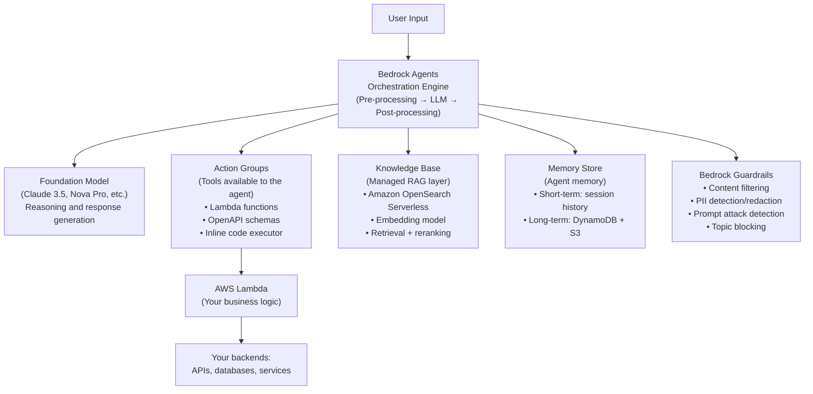
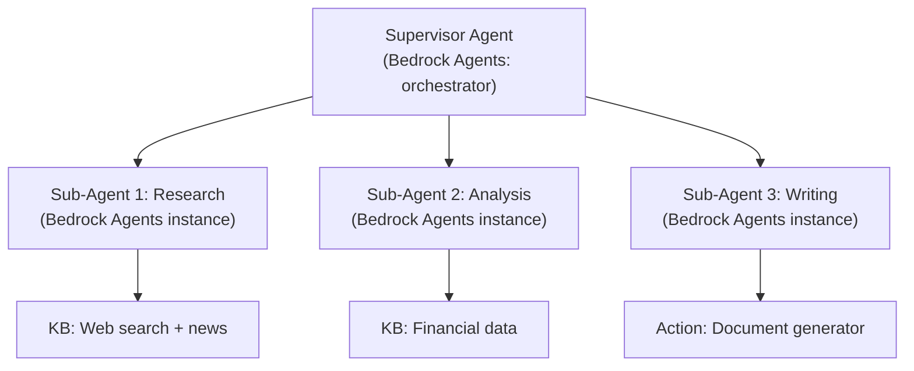

# Lesson 8.2 — Amazon Bedrock Agents: Components and Architecture

---

## Why This Matters for Amazon Interviews

Amazon Bedrock Agents is Amazon's managed agent platform. If you are interviewing for a role involving Alexa+, Rufus, Amazon Q, or any Bedrock-related product, you should understand the architecture of the platform you would be building on. Even if you are not using Bedrock directly, understanding Bedrock Agents gives you a concrete, production-tested reference for how the concepts from Lessons 1–8 are implemented at Amazon scale.

---

## What Is Amazon Bedrock Agents?

Bedrock Agents is a fully managed service that lets you build AI agents without managing infrastructure. You define:
- The agent's foundation model (which LLM to use)
- The agent's instructions (system prompt)
- The agent's tools (called "Action Groups")
- The agent's knowledge base (a managed RAG layer)
- The agent's memory configuration

Bedrock Agents handles the orchestration loop, tool routing, memory management, and safety layers automatically.

---

## Architecture Overview



---

## Component 1: Action Groups (Tools)

Action Groups are the Bedrock equivalent of tool definitions. They tell the agent what it can do.

**Three types of Action Groups:**

**1. Lambda-backed Action Groups (most common):**
You define an OpenAPI schema describing the available functions. Bedrock generates the tool definitions for the LLM from this schema. When the LLM decides to call a tool, Bedrock invokes the corresponding Lambda function.

```yaml
# OpenAPI schema defining an action group
openapi: "3.0.0"
info:
  title: "Order Management API"
  description: "Tools for managing customer orders"

paths:
  /getOrderStatus:
    get:
      summary: "Get the status of a customer order"
      description: "Returns the current status and estimated delivery date for an order"
      operationId: "getOrderStatus"
      parameters:
        - name: orderId
          in: query
          required: true
          description: "The unique identifier for the order"
          schema:
            type: string
        - name: customerId
          in: query
          required: true
          description: "The customer's ID to verify order ownership"
          schema:
            type: string
      responses:
        "200":
          description: "Order status response"
          content:
            application/json:
              schema:
                type: object
                properties:
                  status:
                    type: string
                    enum: [pending, processing, shipped, delivered, cancelled]
                  estimatedDelivery:
                    type: string
                    format: date
                  trackingNumber:
                    type: string
```

**2. Code Interpreter:**
A built-in Action Group that gives the agent the ability to write and execute Python code in a sandboxed environment. Useful for data analysis, calculations, chart generation.

**3. User Confirmation (HITL):**
You can configure specific functions to require user confirmation before execution — Bedrock Agents has native HITL support via a `RETURN_CONTROL` mechanism. The agent returns to the caller with a prompt for confirmation; the caller's code handles the UI, gets user approval, and resumes the agent.

---

## Component 2: Knowledge Bases (Managed RAG)

Bedrock Knowledge Bases provides a managed RAG pipeline. You do not have to build the ingestion, chunking, embedding, or retrieval infrastructure — Bedrock handles it.

**What it includes:**
- **Ingestion pipeline**: connects to S3, ingests documents, chunks them (with configurable strategies: fixed-size, hierarchical, semantic), embeds them.
- **Vector store**: Amazon OpenSearch Serverless (managed, serverless vector search).
- **Retrieval**: vector search, with optional hybrid search and re-ranking.
- **Query rewriting**: optional built-in query expansion.

**The managed retrieval flow:**
```
Agent needs information →
Bedrock Agents invokes KB retrieval →
  Embed query → Search OpenSearch Serverless →
  Re-rank results (optional cross-encoder) →
  Return top-K chunks with metadata →
Agent uses chunks in reasoning
```

**When to use Bedrock KB vs. your own RAG:**
- Bedrock KB: fast setup, managed infrastructure, good for standard retrieval patterns.
- Your own RAG (Lesson 2–8 in the RAG curriculum): more control over chunking strategy, custom embedding models, complex hybrid search, specialized vector DBs (Qdrant, Pinecone), fine-tuned retrievers.

---

## Component 3: Bedrock Guardrails

Bedrock Guardrails is a managed safety layer that applies before and after the LLM — analogous to the input/output guardrails from Lesson 7.2 but managed by AWS.

**Guardrail types:**

| Guardrail | What it does |
|---|---|
| Content filters | Block/flag: hate speech, violence, sexual content, profanity — with configurable thresholds |
| Denied topics | Define topics the agent must never discuss (e.g., "competitors' products", "legal advice") |
| Word filters | Block specific words/phrases |
| PII redaction | Automatically detect and redact PII from both inputs and outputs |
| Grounding check | Verify that the response is grounded in the retrieved KB context — reduces hallucination |
| Prompt attack detection | Detect prompt injection attempts |

**Critical architectural point:** Guardrails in Bedrock apply to both the input (pre-LLM) and the output (post-LLM). They are separate from the LLM — the model does not know they exist. This is the correct design: safety at the framework level, not trusting the LLM to self-censor.

---

## Component 4: Agent Memory

Bedrock Agents supports two memory types natively (as of 2024–2025):

**Session memory (short-term):** Within a session, the agent maintains full conversation history. Handled automatically.

**Long-term memory:** When enabled, important facts from sessions are automatically extracted and stored. On future sessions, relevant memories are retrieved and injected into context. Powered by DynamoDB (structured storage) + S3 (raw session logs) + OpenSearch (semantic retrieval of past memories).

This is the mem0 pattern from Lesson 4.2 — implemented as a managed service.

---

## Component 5: Multi-Agent Collaboration

Bedrock Agents supports multi-agent systems natively via "Agent Supervisor" and "Sub-agent" configurations:



Each sub-agent is a separate Bedrock Agent instance with its own tools, knowledge bases, and system prompt. The supervisor delegates tasks to sub-agents using the same mechanism as calling any other action — sub-agents appear as "tools" to the supervisor.

---

## How the Bedrock Agents Orchestration Loop Works

Understanding the internal loop helps you debug issues and design prompts correctly:

```
1. Pre-processing:
   - Apply input guardrails
   - Validate input format
   - Apply session memory injection

2. Orchestration loop (repeats until done or max iterations):
   a. Inject: system prompt + session history + KB context + memory
   b. LLM generates: next action or final response
   c. If final response → go to post-processing
   d. If action: route to Action Group → invoke Lambda → get result
   e. Append action + result to session context
   f. Loop back to (a)

3. Post-processing:
   - Apply output guardrails
   - Format final response
   - Update session memory (extract memorable facts)
   - Return to caller
```

**The prompt Bedrock uses internally** — Bedrock uses a proprietary orchestration prompt format (ReAct-style) that it constructs for each FM. You control the "Instructions" section (your system prompt equivalent) and the tool descriptions (via OpenAPI schema), but you do not control the full prompt template. This is both a pro (less to maintain) and a con (less control over reasoning format).

---

## When to Use Bedrock Agents vs. Building Your Own

| Factor | Use Bedrock Agents | Build your own |
|---|---|---|
| Speed to production | Fast — managed infrastructure | Slower — build everything |
| AWS ecosystem integration | Native (IAM, Lambda, S3) | Custom integration needed |
| Customization of orchestration | Limited — Bedrock's internal loop | Full control (LangGraph, custom) |
| Embedding model choice | Bedrock-supported models only | Any model you host |
| Chunking strategy | Fixed or hierarchical (managed) | Fully custom |
| Cost | API + managed service pricing | Compute costs only |
| Compliance/data residency | AWS region controls | Full control |
| Complex multi-hop retrieval | Harder — limited RAG customization | Fully custom RAG pipeline |

**Amazon interview context:** Knowing Bedrock Agents shows you understand the AWS product ecosystem. For an Applied Scientist or MLE role, demonstrating that you can choose between managed and custom based on requirements (not just "use the managed service") is the right answer.

---

> **Interview note:** *"How does Amazon Bedrock Agents implement the ReAct framework?"*
> Bedrock Agents implements a proprietary ReAct-style orchestration loop internally. The LLM (your chosen FM — Claude, Titan Nova, etc.) receives a structured prompt containing the agent instructions, session history, retrieved KB context, and tool definitions (from OpenAPI schemas). The LLM generates either a "Final Response" or an "Action" (tool call). Bedrock parses the action, routes it to the corresponding Lambda function, receives the result, appends it as an Observation, and calls the LLM again — exactly the ReAct loop from Lesson 2.2. The key difference from a custom ReAct implementation: you don't control the full prompt template, only the "Instructions" section and tool schemas. This simplifies building at the cost of less control over the reasoning format.

> **Interview note:** *"If you were building a customer support agent for Amazon, would you use Bedrock Agents or build custom? Why?"*
> It depends on requirements. For a standard customer support agent (order status, returns, basic Q&A over FAQ docs): Bedrock Agents is the right choice — Lambda integration with backend APIs is straightforward, Bedrock KB handles document retrieval, Guardrails handles content filtering, memory is managed. Time to production is weeks, not months. For a specialized agent with custom retrieval (e.g., RAG with a fine-tuned embedding model, Qdrant for vector search with complex hybrid queries, code-based tool orchestration with custom retry logic): build custom. Bedrock's managed pipeline does not support bringing your own vector DB or embedding model outside the Bedrock ecosystem. For most initial deployments, start with Bedrock Agents (speed to production) and migrate specific components to custom as you identify limitations that block your requirements.

---

## Summary

- **Bedrock Agents** is Amazon's managed agent platform: define FM, instructions, Action Groups (tools), Knowledge Base (RAG), Memory, and Guardrails — Bedrock handles the orchestration loop.
- **Action Groups**: Lambda-backed (OpenAPI schema → Bedrock generates tool defs → Lambda executes), Code Interpreter (sandboxed Python), or User Confirmation (HITL via RETURN_CONTROL).
- **Knowledge Bases**: managed RAG — S3 ingestion, OpenSearch Serverless, configurable chunking, hybrid search, reranking. Fast to set up; limited customization.
- **Bedrock Guardrails**: content filtering, denied topics, PII redaction, grounding check, prompt attack detection — applied at framework level, not LLM level.
- **Multi-agent**: native supervisor-worker pattern where sub-agents appear as action groups to the supervisor.
- Use Bedrock Agents for standard use cases (speed, AWS integration). Build custom when you need: custom embedding models, specialized vector DBs, complex retrieval pipelines, or full control over orchestration prompt.
