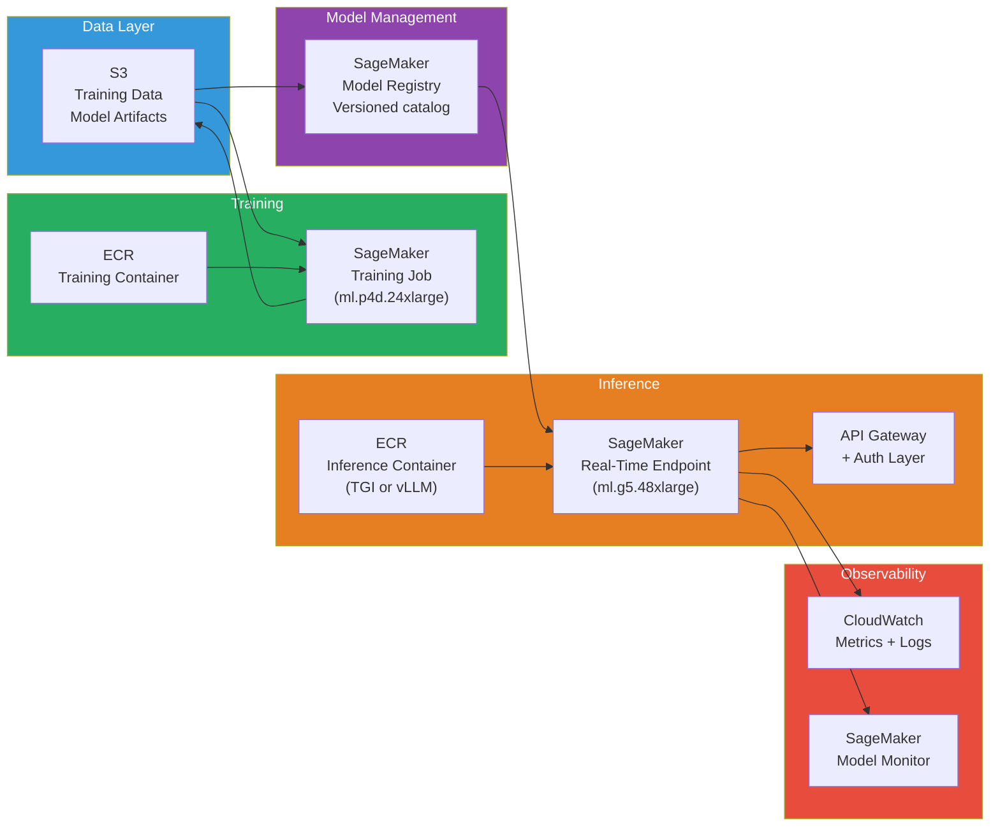

# Lesson 10.1 — AWS Services for ML: The Map of What Everything Does

> **The interview question this answers:** "What AWS services would you use to deploy an LLM pipeline?" The answer requires knowing not just the services by name, but what problem each solves and how they connect.

---

## Why You Need a Map Before You Build

AWS has over 200 services. For ML specifically, the relevant services span compute, storage, orchestration, monitoring, and security. Going into an interview without a clear mental map of these services — and how they connect — means you will either name the wrong service for a given problem or fail to mention a critical one.

This lesson builds that map.

---

## The Core ML Services

### Amazon SageMaker — The Central ML Platform

SageMaker is not a single service — it is a collection of managed ML capabilities under one umbrella. Understanding which SageMaker sub-service does what is the most important knowledge for any ML deployment interview.

```mermaid
flowchart TD
    SM["Amazon SageMaker"]

    SM --> Training["SageMaker Training Jobs\nManaged GPU/CPU compute\nfor model training\nPay only for training duration"]
    SM --> Endpoints["SageMaker Real-Time Endpoints\nPersistent HTTP inference endpoint\nBilled per uptime second\nSupports auto-scaling"]
    SM --> Async["SageMaker Async Inference\nLong-running inference\nResults stored to S3\nNo timeout limit"]
    SM --> Batch["SageMaker Batch Transform\nOffline batch inference\nProcess large datasets\nPay per job duration"]
    SM --> Serverless["SageMaker Serverless Inference\nPay-per-request\nAuto-scales to zero\nCold start latency"]
    SM --> Pipelines["SageMaker Pipelines\nDAG-based ML workflow\nOrchestrates training → eval → deploy\nCI/CD for ML"]
    SM --> Registry["SageMaker Model Registry\nVersioned model catalog\nApproval workflow\nLineage tracking"]
    SM --> Monitor["SageMaker Model Monitor\nData drift detection\nModel quality tracking\nBias monitoring"]
    SM --> Experiments["SageMaker Experiments\nTrack training runs\nCompare hyperparameters\nMetric logging"]
    SM --> JumpStart["SageMaker JumpStart\nPre-built model zoo\nOne-click fine-tuning\nHuggingFace + open-source models"]
```



**The services you use most often for LLM deployment:**
- **Training Jobs**: run your fine-tuning workloads on managed GPU instances
- **Real-Time Endpoints**: deploy the fine-tuned model for synchronous inference
- **Pipelines**: automate the full train → evaluate → register → deploy workflow
- **Model Registry**: version and track models across the lifecycle

---

### EC2 GPU Instances — Raw Compute

When SageMaker's managed abstractions are too restrictive (complex setup, non-standard frameworks), you deploy directly on EC2. You control the environment completely.

**GPU instance families relevant to LLM work:**

| Instance | GPU | GPU Memory | vCPU | RAM | On-Demand Cost |
|---|---|---|---|---|---|
| g5.xlarge | 1× A10G | 24 GB | 4 | 16 GB | ~$1.0/hr |
| g5.2xlarge | 1× A10G | 24 GB | 8 | 32 GB | ~$1.2/hr |
| g5.12xlarge | 4× A10G | 96 GB | 48 | 192 GB | ~$5.7/hr |
| g5.48xlarge | 8× A10G | 192 GB | 192 | 768 GB | ~$16.3/hr |
| p4d.24xlarge | 8× A100 40GB | 320 GB | 96 | 1.1 TB | ~$32.8/hr |
| p4de.24xlarge | 8× A100 80GB | 640 GB | 96 | 1.1 TB | ~$40.9/hr |
| p5.48xlarge | 8× H100 80GB | 640 GB | 192 | 2 TB | ~$98.3/hr |

**SageMaker instance types** map to EC2 instances with an `ml.` prefix: `ml.g5.xlarge` is the SageMaker managed version of `g5.xlarge`.

**AWS-specific accelerators for inference:**
- **ml.inf2.xlarge** (AWS Inferentia2): 2 Inferentia chips, 32 GB accelerator memory, ~$0.76/hr — significantly cheaper than GPU for high-throughput inference on supported models
- **ml.trn1.2xlarge** (AWS Trainium): optimized for training, ~$1.34/hr

---

### S3 — Storage for Everything

S3 (Simple Storage Service) is the backbone of every ML pipeline on AWS.

**What lives in S3 for an LLM pipeline:**
- Training datasets (tokenized or raw)
- Model checkpoints during training
- Final model artifacts (weights + tokenizer)
- Inference input/output for batch transform and async inference
- Training logs and metrics
- Container images? No — that's ECR (below)

**Key S3 concepts for ML:**
- **Versioning**: enable on your model artifact bucket — always know which version is deployed
- **Lifecycle policies**: automatically archive old checkpoints to Glacier after 30 days
- **S3 Transfer Acceleration**: faster uploads for large model files from non-AWS locations
- **S3 Select**: query CSV/Parquet data directly without loading full files

---

### ECR — Container Registry

ECR (Elastic Container Registry) stores your Docker images. When you build a custom inference server (vLLM container, custom Python inference code), you push the image to ECR and reference it from SageMaker or ECS/EKS.

```bash
# Build and push a custom inference container to ECR
aws ecr create-repository --repository-name my-llm-inference

docker build -t my-llm-inference:v1 .
docker tag my-llm-inference:v1 123456789.dkr.ecr.us-east-1.amazonaws.com/my-llm-inference:v1
docker push 123456789.dkr.ecr.us-east-1.amazonaws.com/my-llm-inference:v1
```

SageMaker provides many pre-built DLC (Deep Learning Container) images — for PyTorch, HuggingFace TGI, TensorFlow — that you can use without building your own.

---

### IAM — Permissions and Security

IAM (Identity and Access Management) controls who and what can access which resources. ML pipelines touch many services, and IAM mistakes are the most common source of deployment failures.

**Key IAM roles in an ML pipeline:**

| Role | Who uses it | What it needs access to |
|---|---|---|
| SageMaker Execution Role | SageMaker service | S3 (read/write artifacts), ECR (pull images), CloudWatch (write logs) |
| Training Job Role | Training container | S3 (read data, write checkpoints), CloudWatch |
| Lambda Deployment Role | Lambda function triggering deployment | SageMaker (create endpoint), S3 (read artifacts) |
| CI/CD Role | GitHub Actions / CodePipeline | SageMaker (submit training jobs), ECR (push images) |

---

### CloudWatch — Logging and Monitoring

CloudWatch collects logs and metrics from all AWS services. For ML:
- **Training job logs**: stdout/stderr from your training container stream to CloudWatch Logs
- **Endpoint metrics**: invocation count, latency, error rates (Lesson 10.4 covers these in depth)
- **Alarms**: trigger notifications or auto-scaling actions based on metric thresholds

---

### Supporting Services You Must Know

| Service | Role in ML Pipeline |
|---|---|
| **AWS Lambda** | Serverless trigger functions — post-training evaluation, deployment triggers, lightweight pre/post-processing |
| **AWS Step Functions** | Orchestration for complex multi-step workflows (alternative to SageMaker Pipelines for cross-service workflows) |
| **Application Load Balancer (ALB)** | Load balance across multiple EC2 inference instances; route traffic to SageMaker endpoints |
| **API Gateway** | REST API fronting for SageMaker endpoints (adds auth, rate limiting, request/response transformation) |
| **AWS Secrets Manager** | Store API keys, database credentials — never hardcode credentials in container images |
| **VPC** | Private network isolation — training data and model weights should not be publicly routable |

---

## The Standard Architecture: Connecting the Services



> **Interview note:** "What AWS services would you use to deploy a fine-tuned LLM?" The map answer: "S3 for storing model artifacts and training data. SageMaker Training Jobs for managed GPU training. ECR for custom inference containers. SageMaker Model Registry to version and approve model releases. SageMaker Real-Time Endpoints (with a TGI or custom vLLM container from ECR) for serving inference. CloudWatch for logging and metrics. SageMaker Model Monitor for production data drift. IAM for access control across all of these."

---

## Summary

- **SageMaker** is a collection of managed ML services: Training Jobs (managed compute), Real-Time Endpoints (persistent inference), Batch Transform (offline), Async Inference (long tasks), Pipelines (orchestration), Model Registry (versioning), Model Monitor (drift detection).
- **EC2 GPU instances**: g5 family (A10G GPUs) for cost-effective inference, p4d/p4de (A100) for high-throughput and large models, p5 (H100) for cutting-edge, ml.inf2 (Inferentia2) for cost-optimized high-throughput inference.
- **S3**: stores all training data, checkpoints, and model artifacts. Enable versioning on artifact buckets.
- **ECR**: stores custom Docker images for training and inference containers. Use SageMaker DLCs when possible to avoid building from scratch.
- **IAM**: every component needs the right execution role. Most deployment failures involve missing S3 read permissions or ECR pull permissions.
- **CloudWatch**: logs and metrics from all services — training loss curves, endpoint latency, error rates.
- The standard pattern: S3 → SageMaker Training → S3 (artifact) → Model Registry → SageMaker Endpoint (pulling from ECR) → API Gateway → clients.

---
