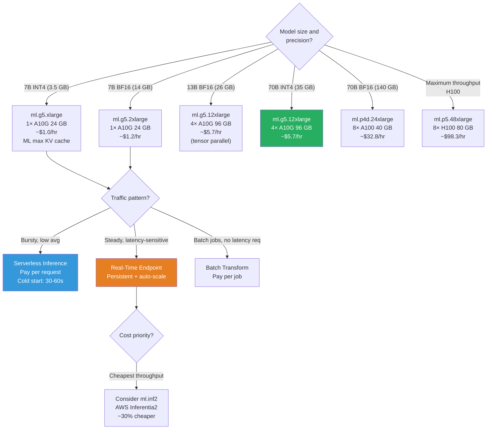

# Lesson 10.3 — AWS Infrastructure for Serving: Instance Types, Endpoint Variants, and Auto-Scaling

---

## The Infrastructure Decision Problem

Choosing the wrong infrastructure is expensive in two directions: over-provisioning (paying for unused capacity) and under-provisioning (latency SLA violations, user-visible failures). For LLM serving, where GPU instances cost $1–$40/hour and requests can burst unpredictably, getting this right matters.

This lesson covers: choosing the right instance type, choosing the right endpoint type, multi-model endpoints for cost sharing, and configuring auto-scaling to handle traffic spikes without paying for idle capacity.

---

## Instance Type Selection

### The Decision Logic

GPU memory is the hard constraint. Model weights + KV cache must fit. Beyond that, you optimize for cost-per-request.



### AWS Inferentia2 (ml.inf2 family) — The Cost-Optimization Play

For high-throughput production serving where cost-per-request matters, AWS Inferentia2 is worth evaluating.

| Instance | Accelerators | Accelerator Memory | On-Demand Cost | vs GPU |
|---|---|---|---|---|
| ml.inf2.xlarge | 2 Inferentia2 | 32 GB | $0.76/hr | ~35% cheaper than g5.xlarge |
| ml.inf2.8xlarge | 8 Inferentia2 | 128 GB | $2.97/hr | ~30% cheaper than g5.12xlarge |
| ml.inf2.48xlarge | 12 Inferentia2 | 192 GB | $12.98/hr | ~20% cheaper than g5.48xlarge |

**Trade-offs with Inferentia2:**
- Requires model compilation to AWS Neuron format (30-minute one-time process)
- Not all model architectures are supported — LLaMA, Mistral, Falcon are supported
- Maximum throughput comparable to A10G at lower cost for supported models
- Not suitable for development/experimentation — compilation friction makes iteration slow

```bash
# Compile a model for Inferentia2
pip install optimum[neuronx]

optimum-cli export neuron \
    --model meta-llama/Meta-Llama-3-8B-Instruct \
    --batch_size 1 \
    --sequence_length 4096 \
    --num_cores 2 \
    ./llama3-8b-neuron
```

---

## Endpoint Types — Matching Traffic Patterns

### Real-Time Endpoint (Default Choice)

- Persistent endpoint, always running, billed per second of uptime
- Low latency: ~50–200ms overhead (model compute dominates for LLMs)
- Synchronous: caller blocks until response is ready
- Hard timeout: SageMaker has a 60-second max response timeout (configurable to 60s in standard, up to 15 minutes with async)

**When to use:** Any user-facing application where users expect immediate responses. The standard choice for LLM APIs.

```python
# Invoke real-time endpoint
response = sagemaker_runtime.invoke_endpoint(
    EndpointName="llama3-8b-endpoint",
    ContentType="application/json",
    Body=json.dumps({"inputs": "...", "parameters": {...}})
)
```

### Async Inference Endpoint

- Requests are queued and processed asynchronously
- Response written to S3; caller polls for completion or uses SNS notification
- No response timeout (suitable for very long generation tasks)
- Billed per second of endpoint uptime + $0.0002 per 1000 requests
- The endpoint can scale to zero when queue is empty (cost savings for batch workloads)

**When to use:** Long-form document generation (reports, essays), batch processing, tasks where users accept 10s–10min wait.

```python
# Submit async inference request
response = sagemaker_runtime.invoke_endpoint_async(
    EndpointName="llama3-8b-async",
    ContentType="application/json",
    InputLocation="s3://my-bucket/inputs/request-001.json",  # Input from S3
    InvocationTimeoutSeconds=3600,
)

output_s3_uri = response["OutputLocation"]
# Poll for completion or receive SNS notification when done
```

### Serverless Inference

- No persistent endpoint — containers spin up on request
- Billed only per request (compute time × memory allocated)
- Cold start: 30–60 seconds first request, ~1 second warm
- Memory: 1–6 GB configurable (not enough for most LLMs — only viable for very small models or CPU-only)
- Max response timeout: 60 seconds

**When to use:** Very low traffic (< 1 request/minute), development and testing, very small models (< 3B, CPU inference).

**When NOT to use:** Any LLM serving — cold start latency of 30–60 seconds is unacceptable for user-facing LLM applications. GPU instances are not supported for serverless.

```python
# Serverless endpoint configuration (small models only)
from sagemaker.serverless import ServerlessInferenceConfig

serverless_config = ServerlessInferenceConfig(
    memory_size_in_mb=6144,      # Max 6 GB
    max_concurrency=10,
    provisioned_concurrency=0,   # 0 = all cold starts
)
```

### Batch Transform

- Run inference on a dataset stored in S3; results written back to S3
- No endpoint to manage — job runs and terminates
- Billed only for compute used during the job
- No latency requirement

**When to use:** Offline processing — embed a million documents, run inference on a test dataset for evaluation, generate training data from a larger model.

```python
from sagemaker.transformer import Transformer

transformer = Transformer(
    model_name="llama3-8b-model",
    instance_type="ml.g5.12xlarge",
    instance_count=2,              # Parallelize across 2 instances
    output_path="s3://my-bucket/batch-output/",
    strategy="MultiRecord",        # Process multiple records per request
    max_payload=6,                 # Max payload size in MB
)

transformer.transform(
    data="s3://my-bucket/batch-input/",
    content_type="application/jsonlines",
    split_type="Line",
)

transformer.wait()
print("Batch transform complete.")
```

---

## Multi-Model Endpoints — One Endpoint, Many Models

If you have many small specialized models (per-customer fine-tunes, per-domain variants), running a separate endpoint for each is expensive. Multi-Model Endpoints (MME) load many models on a single endpoint, loading and unloading models from memory based on demand.

**How MME works:**
1. All model artifacts live in a shared S3 prefix
2. Each inference request specifies which model to invoke (via `TargetModel` parameter)
3. SageMaker loads the requested model into GPU memory on demand
4. Least-recently-used models are evicted from GPU memory when capacity is needed
5. One endpoint billing → many models served

**When to use MME:**
- Many small models (< 2B parameters) where each has low, unpredictable traffic
- Per-customer fine-tunes where you cannot predict which customer is active
- Not recommended for large models (7B+) — loading a 7B model on demand takes 30+ seconds

```python
from sagemaker.multidatamodel import MultiDataModel

# All model artifacts in one S3 prefix
model_data_prefix = "s3://my-bucket/models/"

mme = MultiDataModel(
    name="multi-model-endpoint",
    model_data_prefix=model_data_prefix,
    model=base_model,
    sagemaker_session=sess,
)

# Add models dynamically (copy artifact to S3 prefix)
mme.add_model(model_data_source="s3://my-bucket/model-a.tar.gz", model_data_path="model-a/")
mme.add_model(model_data_source="s3://my-bucket/model-b.tar.gz", model_data_path="model-b/")

predictor = mme.deploy(instance_type="ml.g5.2xlarge", initial_instance_count=1)

# Invoke specific model
response = predictor.predict(
    data={"inputs": "..."},
    target_model="model-a/model.tar.gz"
)
```

---

## Auto-Scaling: Never Pay for Idle, Never Drop Requests

A real-time endpoint with a fixed instance count either over-provisions (paying for idle GPU at night) or under-provisions (latency/errors during traffic spikes). Auto-scaling solves this.

### Configuring Auto-Scaling

```python
import boto3

as_client = boto3.client("application-autoscaling")

# Step 1: Register the endpoint as a scalable target
as_client.register_scalable_target(
    ServiceNamespace="sagemaker",
    ResourceId=f"endpoint/llama3-8b-endpoint/variant/AllTraffic",
    ScalableDimension="sagemaker:variant:DesiredInstanceCount",
    MinCapacity=1,      # Always keep at least 1 instance running
    MaxCapacity=5,      # Never exceed 5 instances
)

# Step 2: Configure the scaling policy
# Scale on: invocations per instance per minute
as_client.put_scaling_policy(
    PolicyName="LLMScalingPolicy",
    ServiceNamespace="sagemaker",
    ResourceId=f"endpoint/llama3-8b-endpoint/variant/AllTraffic",
    ScalableDimension="sagemaker:variant:DesiredInstanceCount",
    PolicyType="TargetTrackingScaling",
    TargetTrackingScalingPolicyConfiguration={
        "TargetValue": 10.0,         # Target: 10 invocations per instance per minute
        "PredefinedMetricSpecification": {
            "PredefinedMetricType": "SageMakerVariantInvocationsPerInstance"
        },
        "ScaleInCooldown": 600,      # Wait 10 min before scaling in (avoid flapping)
        "ScaleOutCooldown": 120,     # Wait 2 min before scaling out (responsive to spikes)
    }
)
```

**Scaling metric options for LLM endpoints:**
- `SageMakerVariantInvocationsPerInstance`: requests per minute per instance — the standard LLM metric
- `SageMakerVariantCPUUtilization`: CPU utilization — not ideal for GPU workloads
- Custom CloudWatch metric: measure GPU utilization or actual latency P95 — most accurate but requires custom metric emission

**Scaling strategy for LLMs:**
- **Scale out fast** (ScaleOutCooldown: 60–120s): a traffic spike can cause cascading timeouts if you wait too long
- **Scale in slow** (ScaleInCooldown: 600s): GPU instances take 5–10 minutes to start; keeping extra instances briefly after traffic drops is cheaper than the user experience cost of cold starts

---

## Production Endpoint Configuration (Complete Example)

```python
from sagemaker.session import Session

sm_client = boto3.client("sagemaker")

# Create endpoint config with production settings
sm_client.create_endpoint_config(
    EndpointConfigName="llama3-8b-prod-config",
    ProductionVariants=[{
        "VariantName": "AllTraffic",
        "ModelName": "llama3-8b-model",
        "InitialInstanceCount": 2,          # Start with 2 for HA
        "InstanceType": "ml.g5.2xlarge",
        "InitialVariantWeight": 1.0,
        "ContainerStartupHealthCheckTimeoutInSeconds": 600,
        "ModelDataDownloadTimeoutInSeconds": 1800,  # 30 min for large model
    }],
    # Data capture for model monitoring (Lesson 10.4)
    DataCaptureConfig={
        "EnableCapture": True,
        "InitialSamplingPercentage": 10,    # Capture 10% of requests
        "DestinationS3Uri": "s3://my-bucket/data-capture/",
        "CaptureOptions": [
            {"CaptureMode": "Input"},
            {"CaptureMode": "Output"}
        ]
    }
)
```

---

## Summary

- Instance type selection is memory-constrained: model weights + KV cache headroom must fit. 7B BF16=14GB (g5.2xlarge), 70B INT4=35GB (g5.12xlarge), 70B BF16=140GB (p4d.24xlarge).
- **ml.inf2 (Inferentia2)** is 20–35% cheaper than equivalent GPU for supported models (LLaMA, Mistral) but requires Neuron compilation — suitable for stable production, not development.
- **Real-time endpoint**: persistent, synchronous, always-on. The standard choice for user-facing LLM APIs.
- **Async inference**: queue-based, results to S3. Use for long-form generation (reports, essays) or batch workloads where users accept wait.
- **Serverless inference**: cold-start latency (30–60s) makes it unsuitable for most LLM serving. Use for very small models and very low traffic.
- **Batch Transform**: offline, S3 in/out, no persistent endpoint. Use for evaluation, embedding large datasets, or generating training data.
- **Multi-Model Endpoints**: one endpoint, many models. Use for many small models with unpredictable per-model traffic.
- Auto-scaling: register endpoint as scalable target, configure target tracking on InvocationsPerInstance. Scale out fast (120s cooldown), scale in slow (600s cooldown) to avoid cold-start costs.

---
