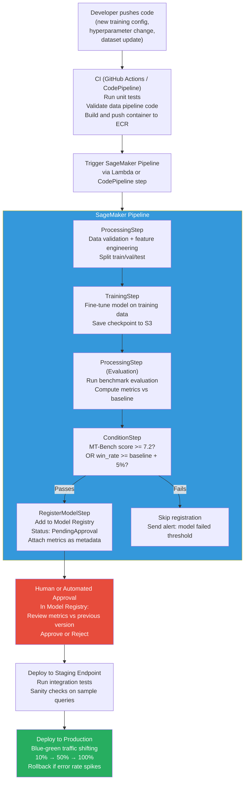

# Lesson 10.5 — Production ML Pipeline: SageMaker Pipelines, Model Registry, and CI/CD for ML

> **The interview question this answers:** "Walk me through your end-to-end deployment pipeline on AWS — from code change to production."

---

## Why You Need a Pipeline

Manual ML deployment — running training scripts by hand, copying model files to S3, updating endpoints manually — works for a single researcher. It breaks in production for three reasons:

1. **Reproducibility:** Without a pipeline, "how exactly was this model trained?" becomes unanswerable after a few weeks.
2. **Safety:** Manual deployments skip quality gates. A model that performs worse than its predecessor gets deployed because nobody ran the comparison automatically.
3. **Speed:** Manual processes take days; automated pipelines take hours. Every hour between a training run completing and its deployment is latency in your improvement cycle.

The pipeline enforces consistency: every model goes through the same preparation, evaluation, approval, and deployment steps — automatically.

---

## The Full End-to-End ML Pipeline



---

## Building the SageMaker Pipeline

SageMaker Pipelines orchestrates ML workflows as a DAG (Directed Acyclic Graph) of steps. Each step is a managed SageMaker job.

```python
import sagemaker
from sagemaker.workflow.pipeline import Pipeline
from sagemaker.workflow.steps import ProcessingStep, TrainingStep
from sagemaker.workflow.parameters import ParameterString, ParameterFloat
from sagemaker.workflow.conditions import ConditionGreaterThanOrEqualTo
from sagemaker.workflow.condition_step import ConditionStep
from sagemaker.workflow.model_step import ModelStep
from sagemaker.workflow.fail_step import FailStep

sess = sagemaker.Session()
role = sagemaker.get_execution_role()

# Pipeline parameters — allow runtime customization
training_dataset_s3 = ParameterString(
    name="TrainingDatasetS3Uri",
    default_value="s3://my-bucket/datasets/latest/"
)
base_model_id = ParameterString(
    name="BaseModelId",
    default_value="meta-llama/Meta-Llama-3-8B-Instruct"
)
min_mt_bench_score = ParameterFloat(
    name="MinMTBenchScore",
    default_value=7.2
)

# ──────────────────────────────────
# Step 1: Data Processing
# ──────────────────────────────────
from sagemaker.processing import ScriptProcessor

data_processor = ScriptProcessor(
    image_uri="763104351884.dkr.ecr.us-east-1.amazonaws.com/pytorch-training:2.1-gpu-py310",
    command=["python3"],
    instance_type="ml.m5.4xlarge",
    instance_count=1,
    role=role,
)

step_process = ProcessingStep(
    name="DataValidationAndSplit",
    processor=data_processor,
    inputs=[...],     # S3 input paths
    outputs=[...],    # S3 output paths for train/val/test splits
    code="scripts/data_processing.py",
    job_arguments=[
        "--input-s3", training_dataset_s3,
        "--min-examples", "1000",
        "--val-split", "0.05",
    ]
)

# ──────────────────────────────────
# Step 2: Training
# ──────────────────────────────────
from sagemaker.huggingface import HuggingFace

estimator = HuggingFace(
    entry_point="train.py",
    source_dir="./training_code",
    role=role,
    instance_type="ml.p4d.24xlarge",
    instance_count=1,
    transformers_version="4.36",
    pytorch_version="2.1",
    py_version="py310",
    hyperparameters={
        "base_model_id": base_model_id,
        "epochs": 2,
        "learning_rate": 2e-4,
        "lora_rank": 16,
        "batch_size": 4,
    }
)

step_train = TrainingStep(
    name="FineTuning",
    estimator=estimator,
    inputs={
        "train": TrainingInput(
            s3_data=step_process.properties.ProcessingOutputConfig.Outputs["train"].S3Output.S3Uri
        ),
        "validation": TrainingInput(
            s3_data=step_process.properties.ProcessingOutputConfig.Outputs["validation"].S3Output.S3Uri
        )
    },
    depends_on=[step_process]
)

# ──────────────────────────────────
# Step 3: Evaluation
# ──────────────────────────────────
eval_processor = ScriptProcessor(
    image_uri="...",
    instance_type="ml.g5.2xlarge",
    instance_count=1,
    role=role,
)

step_eval = ProcessingStep(
    name="EvaluateModel",
    processor=eval_processor,
    inputs=[
        ProcessingInput(
            source=step_train.properties.ModelArtifacts.S3ModelArtifacts,
            destination="/opt/ml/processing/model"
        )
    ],
    outputs=[
        ProcessingOutput(
            source="/opt/ml/processing/evaluation",
            destination="s3://my-bucket/evaluation-reports/",
            output_name="evaluation"
        )
    ],
    code="scripts/evaluate.py",
    depends_on=[step_train]
)

# ──────────────────────────────────
# Step 4: Conditional Registration
# ──────────────────────────────────
from sagemaker.workflow.properties import PropertyFile

evaluation_report = PropertyFile(
    name="EvaluationReport",
    output_name="evaluation",
    path="evaluation.json"  # JSON file with metrics from evaluation step
)

# Condition: only register if MT-Bench score meets threshold
condition_pass = ConditionGreaterThanOrEqualTo(
    left=JsonGet(
        step_name=step_eval.name,
        property_file=evaluation_report,
        json_path="mt_bench_score"
    ),
    right=min_mt_bench_score
)

# Model registration step (runs if condition passes)
step_register = ModelStep(
    name="RegisterModel",
    step_args=model.register(
        content_types=["application/json"],
        response_types=["application/json"],
        inference_instances=["ml.g5.2xlarge"],
        transform_instances=["ml.g5.2xlarge"],
        model_package_group_name="LLMProduction",
        approval_status="PendingApproval",  # Requires human approval before deployment
        model_metrics={...},  # Attach evaluation metrics
    ),
)

# Fail step if evaluation does not pass
step_fail = FailStep(
    name="ModelFailedEvaluation",
    error_message=Join(
        on=" ",
        values=["MT-Bench score below threshold:", min_mt_bench_score]
    )
)

# ConditionStep branches to register or fail
step_condition = ConditionStep(
    name="CheckModelQuality",
    conditions=[condition_pass],
    if_steps=[step_register],
    else_steps=[step_fail],
    depends_on=[step_eval]
)

# ──────────────────────────────────
# Assemble and run the pipeline
# ──────────────────────────────────
pipeline = Pipeline(
    name="LLMFineTuningPipeline",
    parameters=[training_dataset_s3, base_model_id, min_mt_bench_score],
    steps=[step_process, step_train, step_eval, step_condition],
    sagemaker_session=sess,
)

pipeline.upsert(role_arn=role)

# Trigger the pipeline
execution = pipeline.start(
    parameters={
        "TrainingDatasetS3Uri": "s3://my-bucket/datasets/v3/",
        "MinMTBenchScore": 7.2
    }
)
execution.wait()
```

---

## Model Registry: Versioned Model Catalog

The Model Registry stores every model version with its metrics, training configuration, and approval status. It is the source of truth for "what is deployed where and why."

```python
import boto3

sm_client = boto3.client("sagemaker")

# List all model versions in the registry
response = sm_client.list_model_packages(
    ModelPackageGroupName="LLMProduction",
    SortBy="CreationTime",
    SortOrder="Descending"
)

for pkg in response["ModelPackageSummaryList"]:
    print(f"Version: {pkg['ModelPackageVersion']}")
    print(f"  Status: {pkg['ModelApprovalStatus']}")
    print(f"  Created: {pkg['CreationTime']}")
    print(f"  ARN: {pkg['ModelPackageArn']}")

# Approve a model version (triggers deployment in CD pipeline)
sm_client.update_model_package(
    ModelPackageArn="arn:aws:sagemaker:us-east-1:123456:model-package/LLMProduction/5",
    ModelApprovalStatus="Approved",
    ApprovalDescription="MT-Bench 7.8, IFEval 82%, +5% win rate vs v4. Approved for production."
)
```

**The approval workflow:**
1. Pipeline registers model with `PendingApproval` status
2. Automated notification sent to ML team (via SNS/email)
3. Team reviews metrics in Model Registry (MT-Bench, IFEval, win rate vs previous version)
4. Approver clicks "Approve" in SageMaker Studio or via API
5. Approval triggers an EventBridge event → Lambda → deploys to staging endpoint

---

## Automated CD: From Model Approval to Production

```python
# Lambda function triggered by EventBridge on model approval
import boto3
import json

sm_client = boto3.client("sagemaker")
ssm_client = boto3.client("ssm")

def handler(event, context):
    """Deploy approved model to staging, then production."""
    
    model_package_arn = event["detail"]["ModelPackageArn"]
    
    # Step 1: Create SageMaker Model from registry entry
    model_name = f"llm-model-{context.aws_request_id[:8]}"
    sm_client.create_model(
        ModelName=model_name,
        Containers=[{
            "ModelPackageName": model_package_arn
        }],
        ExecutionRoleArn=ssm_client.get_parameter(
            Name="/ml/sagemaker-role-arn"
        )["Parameter"]["Value"]
    )
    
    # Step 2: Deploy to staging endpoint (update existing endpoint config)
    staging_endpoint = "llama3-8b-staging"
    
    staging_config = f"{model_name}-staging-config"
    sm_client.create_endpoint_config(
        EndpointConfigName=staging_config,
        ProductionVariants=[{
            "VariantName": "AllTraffic",
            "ModelName": model_name,
            "InitialInstanceCount": 1,
            "InstanceType": "ml.g5.2xlarge",
        }]
    )
    
    sm_client.update_endpoint(
        EndpointName=staging_endpoint,
        EndpointConfigName=staging_config
    )
    
    # Step 3: Wait for staging to be InService, run integration tests
    waiter = sm_client.get_waiter("endpoint_in_service")
    waiter.wait(EndpointName=staging_endpoint)
    
    if run_integration_tests(staging_endpoint):
        deploy_to_production(model_name)
    else:
        rollback_staging()
        notify_team("Integration tests failed for model: " + model_package_arn)
```

---

## Blue-Green Deployment: Safe Traffic Shifting to Production

Never switch 100% of traffic to a new model at once. Use canary/blue-green deployment to gradually shift traffic while monitoring for errors.

```python
# Production endpoint has two variants during rollout:
# - "Blue" (existing model): receives 90% of traffic
# - "Green" (new model): receives 10% initially

sm_client.update_endpoint_weights_and_capacities(
    EndpointName="llama3-8b-production",
    DesiredWeightsAndCapacities=[
        {"VariantName": "Blue", "DesiredWeight": 90},
        {"VariantName": "Green", "DesiredWeight": 10},
    ]
)

# Monitor for 30 minutes: error rate, latency
# If healthy, increase green traffic
import time
time.sleep(1800)  # 30 minutes

if is_healthy(endpoint="llama3-8b-production", variant="Green"):
    # 50% traffic
    sm_client.update_endpoint_weights_and_capacities(
        EndpointName="llama3-8b-production",
        DesiredWeightsAndCapacities=[
            {"VariantName": "Blue", "DesiredWeight": 50},
            {"VariantName": "Green", "DesiredWeight": 50},
        ]
    )
    
    time.sleep(1800)  # Another 30 minutes
    
    if is_healthy(endpoint="llama3-8b-production", variant="Green"):
        # Full cutover — delete Blue variant
        sm_client.update_endpoint_weights_and_capacities(
            EndpointName="llama3-8b-production",
            DesiredWeightsAndCapacities=[
                {"VariantName": "Green", "DesiredWeight": 100},
            ]
        )
```

**Automatic rollback trigger:**
```python
def is_healthy(endpoint: str, variant: str) -> bool:
    cw = boto3.client("cloudwatch")
    
    # Check error rate on the variant
    response = cw.get_metric_statistics(
        Namespace="AWS/SageMaker",
        MetricName="Invocations5XXErrors",
        Dimensions=[
            {"Name": "EndpointName", "Value": endpoint},
            {"Name": "VariantName", "Value": variant}
        ],
        StartTime=datetime.utcnow() - timedelta(minutes=15),
        EndTime=datetime.utcnow(),
        Period=900,
        Statistics=["Sum"]
    )
    
    total_errors = sum(dp["Sum"] for dp in response["Datapoints"])
    
    # Also check latency P99
    # ...
    
    return total_errors < 5  # Less than 5 errors in last 15 minutes
```

---

## Summary: The Full Pipeline at a Glance

| Stage | Tool | What happens |
|---|---|---|
| Code change | GitHub / CodeCommit | Developer pushes training config or data update |
| CI | GitHub Actions / CodePipeline | Unit tests, container build + ECR push |
| Data processing | SageMaker ProcessingStep | Validate, clean, split dataset |
| Training | SageMaker TrainingStep | Fine-tune model, save artifact to S3 |
| Evaluation | SageMaker ProcessingStep | Run MT-Bench, IFEval, win rate metrics |
| Quality gate | SageMaker ConditionStep | Fail pipeline if metrics below threshold |
| Registration | SageMaker Model Registry | Register with `PendingApproval`, attach metrics |
| Human review | SageMaker Studio / API | Team reviews, approves or rejects |
| Staging deploy | Lambda + SageMaker update_endpoint | Deploy to staging, run integration tests |
| Production deploy | Lambda + traffic shifting | 10% → 50% → 100% with error monitoring |
| Rollback | Automated via CloudWatch alarm | Revert traffic weights if error rate spikes |

> **Interview note:** "Walk me through your deployment pipeline." The answer should hit: CI testing → SageMaker Pipeline (data → train → eval → conditional registration) → Model Registry with PendingApproval → human approval → Lambda CD trigger → staging deploy + integration tests → blue-green production rollout with automated rollback. Always mention the quality gate (ConditionStep) and approval workflow — these are what distinguish a production pipeline from a manual process.

---
