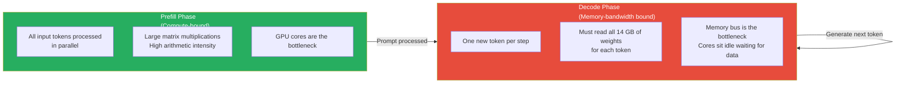

# Lesson 11.1 — The Inference Bottleneck: Why LLM Inference Is Memory-Bandwidth Bound

---

## The Insight That Changes How You Think About All Inference Optimizations

Most engineers assume LLM inference is slow because of computation — too many floating-point operations per token. The actual bottleneck is different: it is **memory bandwidth**, not compute. Understanding this distinction is the foundation of every optimization in this Part. Without it, techniques like quantization, KV cache, and continuous batching seem like isolated tricks. With it, they all become obvious consequences of the same root problem.

---

## Two Types of Operations — Two Different Bottlenecks

Modern GPUs have two key specs that bound different workloads:
- **Compute throughput** (FLOPs/s): how many floating-point operations per second the GPU can do
- **Memory bandwidth** (bytes/s): how fast the GPU can read data from its VRAM (HBM)

An operation is **compute-bound** when the GPU's cores are the bottleneck — adding more cores would make it faster. An operation is **memory-bandwidth bound** when the memory bus is the bottleneck — the cores sit idle waiting for data to arrive.

The key metric is **arithmetic intensity**: the ratio of compute operations to memory bytes read.

```
Arithmetic intensity = FLOPs performed / bytes read from memory
```

If arithmetic intensity is high (lots of math per byte read) → compute-bound.
If arithmetic intensity is low (few operations per byte read) → memory-bandwidth bound.

For the A100 80GB GPU (a standard training/inference GPU):
- FP16 compute: 312 TFLOPS = 312 × 10¹² FLOPs/s
- Memory bandwidth: 2 TB/s = 2 × 10¹² bytes/s
- **The ridge point**: 312 / 2 = 156 FLOPs per byte. If your operation does fewer than 156 FLOPs per byte read, you are bandwidth-bound.

---

## LLM Inference Has Two Distinct Phases

### Phase 1: Prefill (Processing the Input Prompt)

When a request arrives, the first thing the model does is process all input tokens together in parallel. For a 1000-token prompt, this is one large matrix multiplication: input tokens (1000 × d) × weight matrices.

This operation has **high arithmetic intensity** — you read the weight matrix once and perform many operations across all 1000 token positions simultaneously.

Prefill is **compute-bound**. Adding more FLOPs capacity (faster GPU) makes prefill faster.

### Phase 2: Decode (Generating Output Tokens One at a Time)

After prefill, the model generates output tokens autoregressively — one token per step. At each step, the model processes a single new token through every layer.

For each generated token, the model must:
- Read every weight matrix through every layer of the model
- Perform relatively few operations on that single token position

For a 7B model in FP16: reading all weights = `7 × 10⁹ × 2 bytes = 14 GB per token generated`.



---

## The Bandwidth Ceiling: Concrete Math

How fast can a 7B model on an A100 generate tokens?

- Model size in FP16: `7B × 2 bytes = 14 GB`
- A100 memory bandwidth: `2 TB/s = 2,000 GB/s`
- Time to read all weights once: `14 GB / 2,000 GB/s = 0.007 seconds = 7 ms`
- Maximum generation speed: `1 / 0.007s ≈ 143 tokens/second`

This is a hard ceiling. No matter how fast your GPU's compute cores are, you **cannot generate faster than you can read the weights**. An A100 has 312 TFLOPS of compute — but during decode, those cores sit idle most of the time, waiting for 14 GB of weight data to stream from VRAM.

For a 70B model in FP16:
- Model size: `70B × 2 bytes = 140 GB`
- Time to read all weights: `140 GB / 2,000 GB/s = 70 ms`
- Maximum generation speed: `~14 tokens/second on a single A100`

This is why 70B models feel much slower than 7B models — the gap is directly proportional to model size, because the bottleneck is reading bytes, not doing math.

> **Interview note:** "Why is LLM inference slow?" The wrong answer is "because it requires lots of computation." The right answer: "LLM token generation is memory-bandwidth bound, not compute bound. For each token generated, the GPU must read all model weights from VRAM. A 7B model in FP16 means reading 14 GB per token. On an A100 with 2 TB/s bandwidth, that is a hard floor of ~7 ms per token, giving a ceiling of ~143 tokens/second regardless of compute capacity. The GPU cores sit mostly idle during generation — they are waiting for data to arrive from VRAM."

---

## Why This Changes Everything About Inference Optimization

Once you understand the bandwidth bottleneck, every optimization technique becomes obvious:

**Quantization (Lesson 11.4):** Reduce bytes per weight from 2 (FP16) to 1 (INT8) or 0.5 (INT4). Fewer bytes to read per token → directly reduces the bandwidth bottleneck → proportionally faster generation. An INT4 model is theoretically 4× faster to generate from than FP16 on bandwidth-bound hardware.

**KV Cache (Lesson 11.2):** Avoid recomputing past attention keys and values by caching them. Without KV cache, every generation step reads not just weights but also recomputes all past token states — multiplying the already-expensive read cost.

**Batching / Continuous Batching (Lesson 11.3):** If you process N requests simultaneously, you read the weights once and do N times the useful work. The bandwidth cost is amortized over N requests. Batching directly attacks the bandwidth inefficiency by increasing arithmetic intensity during decode.

**Speculative Decoding (Lesson 11.5):** Generate multiple tokens for the cost of one large model forward pass. The large model reads its weights once but verifies N tokens — N× more useful tokens per read.

**Flash Attention (Lesson 11.6):** Moves attention computation from HBM (slow VRAM, 2 TB/s) to SRAM (on-chip cache, ~20 TB/s). Attacks the memory hierarchy, not just bandwidth.

---

## The Prefill vs Decode Distinction for System Design

Understanding the two-phase structure has direct implications for how you architect serving systems:

**Prefill is latency-sensitive.** Users feel the first-token latency (time to first token, TTFT). If the prompt is 10,000 tokens, prefill takes a noticeable fraction of a second even on fast hardware. This is why chunked prefill and prefill parallelism matter.

**Decode throughput determines cost.** The cost of serving a request is dominated by the decode phase — you are paying for GPU time proportional to output tokens generated. Higher throughput (more tokens/second) = lower cost per token.

**They have different optimization strategies.** Prefill benefits from larger batches (more compute parallelism). Decode benefits from quantization (less bandwidth used per token) and continuous batching (amortize bandwidth cost over multiple requests).

---

## Summary

- LLM token generation is **memory-bandwidth bound**, not compute-bound. The bottleneck during decode is reading model weights from VRAM, not performing matrix multiplications.
- For each token generated, the GPU reads all model weights: 14 GB for a 7B FP16 model. An A100's 2 TB/s bandwidth gives a theoretical ceiling of ~143 tokens/second — a hard limit regardless of compute.
- LLM inference has two phases: **prefill** (processing input tokens in parallel — compute-bound) and **decode** (generating output tokens one at a time — bandwidth-bound). They have different bottlenecks and different optimization strategies.
- Every inference optimization technique is a direct response to the bandwidth bottleneck: quantization reduces bytes per weight, batching amortizes bandwidth across requests, KV caching avoids redundant reads, speculative decoding generates more tokens per bandwidth-consuming step.
- Understanding this bottleneck is the mental model that makes all of Lessons 11.2–11.7 make sense.

---
