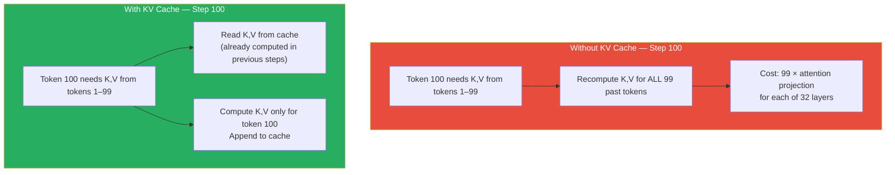
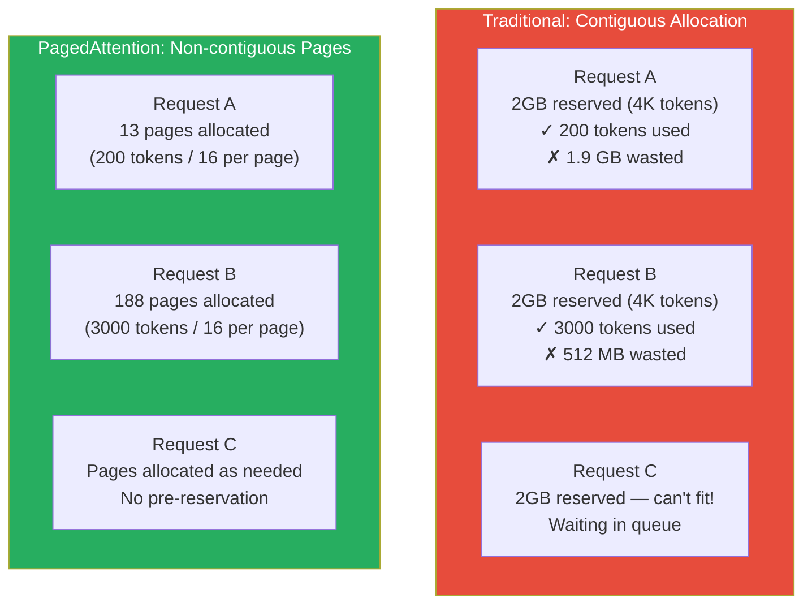

# Lesson 11.2 — KV Cache: What It Is, Memory Cost, and Paged Attention

> *Read Lesson 11.1 first. KV cache is a direct response to the bandwidth bottleneck described there.*

---

## The Problem Without KV Cache

Transformer attention computes, for each token position, three vectors: Query (Q), Key (K), and Value (V). Attention for a token at position i attends over all previous positions — it needs the Keys and Values from positions 0 through i-1.

Now consider what happens during token generation without any caching. You have generated 99 tokens and are generating token 100.

To compute attention for token 100, you need Keys and Values from tokens 1 through 99. You have two choices:
1. **Recompute them from scratch.** Run all 99 previous tokens through the attention projection matrices again.
2. **Cache them.** Store the K and V vectors as you generate each token; reuse them on subsequent steps.

Without caching, generating token N requires O(N) recomputation of all previous token states. Total work for a 500-token output is O(1 + 2 + 3 + ... + 500) = O(N²). Generation becomes quadratically slower as sequences get longer.

**The KV cache** eliminates this by storing K and V for every token, every layer, as they are generated. Each decode step appends new entries to the cache and reads previous entries. Total work is O(N) — linear, not quadratic.



---

## The Exact Memory Cost of KV Cache

KV cache memory is significant and often underestimated. Let us compute it precisely for LLaMA-2 7B.

Model configuration:
- Layers: 32
- Attention heads: 32
- Head dimension: 128
- Data type: FP16 (2 bytes)

KV cache size per token in the sequence:
```
2 (K and V) × 32 (layers) × 32 (heads) × 128 (head_dim) × 2 (bytes) = 524,288 bytes = 512 KB per token
```

This means:
- For a 2,048-token sequence: `512 KB × 2,048 = 1 GB`
- For a 4,096-token sequence: `512 KB × 4,096 = 2 GB`
- For 50 concurrent requests at 2,048 tokens each: `1 GB × 50 = 50 GB` — more than the model itself (14 GB)

| Model | KV Cache Size per Token | Max seq len with 40 GB reserved for KV |
|---|---|---|
| LLaMA-2 7B | 512 KB | ~80,000 tokens across all concurrent requests |
| LLaMA-2 13B | 800 KB | ~51,000 tokens |
| LLaMA-2 70B | 2 MB | ~20,000 tokens |
| LLaMA-3 8B (GQA) | ~128 KB | ~320,000 tokens |

*LLaMA-3 and similar models use Grouped Query Attention (GQA), which dramatically reduces KV cache size — covered below.*

> **Interview note:** "What is the memory cost of KV cache?" Strong answer: "For LLaMA-2 7B, the KV cache costs 512 KB per token across all 32 layers. A single request with a 2K-token sequence uses 1 GB. At 50 concurrent requests, KV cache alone consumes 50 GB — more than the 14 GB model weights. This is why KV cache memory management is a central problem in high-throughput LLM serving."

---

## Grouped Query Attention (GQA): Reducing KV Cache Size

Standard Multi-Head Attention (MHA) has separate Key and Value projection matrices for every attention head. If you have 32 heads, you store 32 Key vectors and 32 Value vectors per token per layer.

**Grouped Query Attention (GQA)** shares Key and Value matrices across groups of Query heads:
- With 32 query heads and 8 KV heads (groups of 4): you store only 8 K vectors and 8 V vectors per token
- KV cache size shrinks by 4× compared to MHA

**Multi-Query Attention (MQA)** is the extreme: one single K head and one V head shared across all Query heads. KV cache is 32× smaller, but quality can degrade on some tasks.

Most modern models use GQA (LLaMA-3, Mistral, Qwen, Gemma). This is why LLaMA-3 8B has a per-token KV cache cost of ~128 KB vs LLaMA-2 7B's 512 KB — a 4× reduction from GQA.

---

## The Memory Fragmentation Problem

Here is the practical problem that exists even with KV cache: requests have **unpredictable lengths**.

If you pre-allocate contiguous memory for each request assuming max sequence length (e.g., 4,096 tokens), two things happen:
1. Short requests (200 tokens) waste 95% of their allocated memory
2. Memory fragmentation makes it impossible to pack many requests

Suppose you have 80 GB of VRAM. The model uses 14 GB. That leaves 66 GB for KV cache. If each request pre-allocates 4K tokens × 512 KB = 2 GB, you can serve only 33 concurrent requests — even though short requests use a fraction of that.

This is the problem PagedAttention solves.

---

## PagedAttention: The vLLM Innovation

PagedAttention (Kwon et al., 2023 — the vLLM paper) borrows from operating system virtual memory management. Instead of contiguous pre-allocation, it stores KV cache in **fixed-size pages** of non-contiguous memory.

Each page holds the KV cache for a fixed block of tokens (e.g., 16 tokens). Pages are allocated on demand as each request generates more tokens. Multiple requests' pages are interleaved in GPU memory — no wasted pre-allocation.



**Benefits of PagedAttention:**

1. **Near-zero internal fragmentation:** Only the last page per request is partially filled. Waste is at most 15 tokens per request.
2. **Prefix sharing (copy-on-write):** Multiple requests that start with the same system prompt can **share** those KV cache pages. The system prompt is computed once; all requests point to the same physical pages. For systems with a long fixed system prompt, this eliminates a major source of redundant computation and memory use.
3. **2–4× more concurrent requests** on the same hardware compared to naive contiguous allocation.

---

## What This Means for System Design

KV cache is the resource that determines how many concurrent requests a server can handle at a given GPU count.

- **Throughput** is determined by how many requests you can keep in-flight simultaneously (limited by KV cache memory)
- **Latency** is determined by how efficiently each generation step runs

When you are sizing a serving deployment, the question is always: how much VRAM is left over after model weights, and how many concurrent requests can that KV cache headroom support?

For a 7B model on an A100 80GB:
- Model weights (FP16): 14 GB
- Safety margin: ~5 GB
- Available for KV cache: ~61 GB
- At 512 KB/token, 1K average sequence length: `61 GB / (1K × 512 KB)` ≈ 119 concurrent requests

With quantization (INT4 weights = 3.5 GB), the model headroom frees 10.5 GB more for KV cache — directly increasing concurrency.

---

## Summary

- KV cache stores the Key and Value vectors for every past token, every layer, avoiding O(N²) recomputation. Without it, generation time scales quadratically with sequence length.
- KV cache memory cost for LLaMA-2 7B: 512 KB per token. A single 2K-token request uses 1 GB. 50 concurrent requests use 50 GB — more than the model itself.
- GQA (Grouped Query Attention) reduces KV cache size by sharing K/V matrices across groups of query heads. LLaMA-3 uses GQA with 8 KV heads, reducing KV cache 4× vs MHA.
- Traditional contiguous KV cache allocation wastes memory on short requests and limits concurrency via fragmentation.
- PagedAttention (vLLM) stores KV cache in non-contiguous fixed-size pages, eliminating fragmentation and enabling prefix sharing across requests. This gives 2–4× more concurrency on the same hardware.
- KV cache memory is the primary lever controlling how many concurrent requests a server can handle. Model quantization frees VRAM from weights, directly increasing the headroom available for KV cache and concurrency.

---
