# Lesson 11.3 — Continuous Batching: How vLLM Serves Thousands of Requests Without Wasting GPU Time

> *This lesson assumes you understand the bandwidth bottleneck from Lesson 11.1. Batching is the primary tool for amortizing that bandwidth cost.*

---

## Why Batching Matters for Bandwidth-Bound Inference

From Lesson 11.1: each generated token requires reading all model weights from VRAM. For a 7B model, that is 14 GB per decode step. If you are serving one request at a time, you read 14 GB to produce one token for one user.

If you instead serve 32 requests simultaneously, you still read 14 GB — but you produce 32 tokens in that same step. The bandwidth cost is shared across 32 users. The effective cost per token drops by 32×.

This is the core argument for batching: it converts bandwidth-bound serial work into parallel work, dramatically increasing GPU utilization and throughput.

The problem is doing it right. Naive batching has a critical flaw that makes it far less effective than it should be.

---

## Static Batching — The Naive Approach and Its Fatal Flaw

In static (or synchronous) batching, you:
1. Collect a batch of N requests
2. Process the entire batch together through all generation steps
3. Release the batch when **all** requests in it are finished

The flaw: **requests finish at different times**. If your batch contains one request needing 20 tokens and another needing 500 tokens, here is what happens:

```
Request A: ████████████████████░░░░░░░░░░░░░░░░░░░░░░░░░░░░░░  (20 tokens, done at step 20)
Request B: ████████████████████████████████████████████████████  (500 tokens)

GPU usage: ████ = working   ░░░░ = GPU slot idle, waiting for batch to complete
```

Request A finishes at step 20 but its GPU slot sits idle from step 21 to step 500 — waiting for Request B to finish before the batch can be released and new requests accepted.

If the batch has 32 requests with highly variable lengths, many slots are idle at any given step. GPU utilization collapses. You are paying for 80 GB of A100 compute and using 20% of it.

---

## Continuous Batching — The Correct Approach

Continuous batching (also called iteration-level scheduling or in-flight batching, introduced in the Orca paper, 2022) solves this with one insight: **check after every single decode step whether any request has finished, and immediately fill that slot with a new request.**

The batch is not fixed for the duration of a sequence. It changes composition at every step.

```mermaid
flowchart TD
    subgraph Static["Static Batching"]
        S1["Batch: A, B, C, D formed at t=0"]
        S2["Step 1–20: All 4 process together"]
        S3["Step 21–50: A and C done, slots idle"]
        S4["Step 51–200: Only B and D left, 50% GPU idle"]
        S5["Step 201: Batch complete, release all"]
        S6["Accept new requests ONLY here"]
        S1 --> S2 --> S3 --> S4 --> S5 --> S6
    end

    subgraph Continuous["Continuous Batching"]
        C1["Batch: A, B, C, D at step 0"]
        C2["Step 20: A finishes → immediately add E"]
        C3["Step 51: C finishes → immediately add F"]
        C4["Step 200: B finishes → immediately add G"]
        C5["GPU is always full\nNo idle slots"]
        C1 --> C2 --> C3 --> C4 --> C5
    end

    style Static fill:#e74c3c,color:#fff
    style Continuous fill:#27ae60,color:#fff
```



The result: the GPU is running at close to maximum capacity at all times. Requests enter and leave the batch continuously without any slot ever sitting idle.

The Orca paper (which introduced this technique) reported **23× throughput improvement** over static batching on some workloads. In practice, real-world improvements are 5–15× depending on request length distribution.

> **Interview note:** "What is continuous batching and why does it matter?" Strong answer: "In static batching, the batch is fixed until all requests complete, leaving GPU slots idle whenever short requests finish before long ones. Continuous batching (iteration-level scheduling) checks after every decode step whether any request has finished and immediately inserts a new one from the queue. The GPU batch is always full. This is the key innovation in vLLM and TGI — it is why production serving systems achieve 5–23× higher throughput than naive implementations."

---

## Prefill vs Decode in a Continuous Batching System

Continuous batching introduces a complexity: prefill and decode steps have different compute characteristics. When a new request is inserted, its input prompt must be prefilled (compute-bound, parallel over all input tokens). Existing requests are in decode mode (bandwidth-bound, one token per step).

Mixing prefill and decode steps for different requests in the same batch step creates "prefill stalls" — the decode requests are delayed while the new request's prompt is being processed.

**Chunked prefill** addresses this: instead of processing the entire new prompt in one step, process it in chunks over several steps. This keeps the batch more balanced and prevents long prompts from stalling all decode requests.

vLLM 0.4+ implements chunked prefill by default. The chunk size is configurable.

---

## Scheduler Policies: How Requests Are Prioritized

A continuous batching system needs a **scheduler** that decides which requests to add to the batch when a slot opens. Common strategies:

**First-Come-First-Served (FCFS):** Simple queue. Requests are processed in arrival order. Fair but not optimal — a very long request can hog GPU time.

**Shortest-Job-First (SJF):** Prioritize shorter requests. Reduces average latency. Problem: requires knowing output length in advance (you don't) and can starve long requests.

**Preemption:** If a long-running request is blocking many shorter ones, pause it (save its KV cache state) and process the short ones first. vLLM supports preemption via KV cache swapping to CPU memory. Expensive — swapping KV cache to CPU is slow — but necessary to guarantee latency SLAs for high-priority requests.

**Priority queues:** Assign priority levels (premium users, SLA tiers) and always fill the batch from highest priority first.

---

## The Queuing Theory View

Continuous batching is essentially a **multi-server queuing system** where:
- **Servers** = GPU decode slots (batch size)
- **Arrivals** = inference requests
- **Service time** = time to generate the full response (variable, proportional to output length)

With static batching, servers are blocked (slot held even when idle) — this is like a bank teller who cannot serve the next customer until everyone in the current group has finished their transaction. Continuous batching lets the teller serve the next person the moment someone leaves.

**Little's Law:** In steady state, `L = λW` where L is average number of requests being served, λ is arrival rate, and W is average service time. For a given throughput (λ), reducing average service time (W) by eliminating idle wait time directly reduces L — meaning lower GPU memory pressure and better latency for everyone.

---

## Practical Implications for Deployment

**Batch size limit:** You cannot make the batch infinitely large. Each active request holds KV cache memory (from Lesson 11.2). The maximum batch size is determined by available KV cache memory. vLLM's scheduler continuously monitors KV cache usage and refuses new requests when memory is near capacity (with graceful backpressure).

**Throughput vs latency trade-off:** Larger batches = more throughput, higher average latency (each step processes more requests but each request waits for the step to complete). Smaller batches = lower latency, lower throughput. For interactive applications, limit batch size. For batch processing, maximize it.

**Output length estimation:** Some systems try to estimate output length from the input to schedule requests more efficiently. In practice, LLM output lengths are highly unpredictable — policies that require accurate length prediction tend to fall back to FCFS anyway.

---

## Summary

- Batching amortizes bandwidth cost: reading 14 GB of weights to serve 32 requests costs the same as serving 1. Throughput scales (nearly) linearly with batch size up to the memory limit.
- **Static batching** holds GPU slots until all requests in the batch complete — idle slots when short requests finish before long ones. GPU utilization collapses with variable-length workloads.
- **Continuous batching** (iteration-level scheduling) inserts new requests the moment any request finishes, keeping every slot active at all times. The Orca paper reports 5–23× throughput improvement over static batching.
- Prefill and decode have different compute profiles. Mixing them in a batch causes prefill stalls — chunked prefill mitigates this by spreading prompt processing across multiple decode steps.
- The scheduler determines which requests enter the batch when slots open (FCFS, priority, preemption). KV cache memory sets the maximum concurrency limit.
- Continuous batching is the single most impactful throughput optimization in modern LLM serving systems — it is the core innovation behind vLLM, TGI, and most production inference engines.

---
