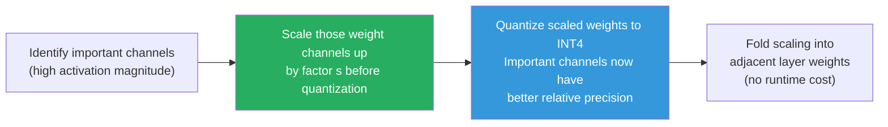

# Lesson 11.4 — Quantization for Inference: INT8, GPTQ, AWQ, and INT4

> *The bandwidth bottleneck from Lesson 11.1 makes this lesson's core logic clear: fewer bytes per weight = faster reads = faster generation.*

---

## Why Quantization Is the Most Direct Inference Optimization

Every inference optimization technique ultimately attacks the bandwidth bottleneck. Quantization is the most direct attack: reduce the number of bytes per weight parameter. Fewer bytes = less to read = faster generation.

- FP16: 2 bytes per parameter
- INT8: 1 byte per parameter → 2× bandwidth reduction → up to 2× faster decode
- INT4: 0.5 bytes per parameter → 4× bandwidth reduction → up to 4× faster decode

The question is: can you reduce precision without unacceptable quality loss? The answer, with the right quantization techniques, is yes for most use cases — and understanding the techniques is what this lesson is about.

---

## The Quantization Challenge: Outlier Activations

Naively converting FP16 weights to INT8 (mapping the min-max range to 127 levels) works reasonably for convolutional networks. For transformers, it fails.

**Why?** Transformers have **outlier features** — certain dimensions of the hidden state have activation values 10–100× larger than the average. These large outliers dominate the min-max range. When you quantize to INT8, you set your quantization levels based on this range. The outlier gets good precision; the majority of values, clustered near zero, get crammed into a few quantization levels and lose all precision.

This is the core challenge that all good transformer quantization methods solve differently.

---

## LLM.int8() — Mixed-Precision Decomposition

**LLM.int8()** (Dettmers et al., 2022) identifies outlier features by inspecting the activation distribution before quantization. Features (columns of the weight matrix) that have outlier values are separated and computed in FP16. All other features are quantized to INT8.

```
Matrix multiplication in INT8:
    Identify outlier columns (typically 0.1-1% of columns)
    
    Split:  W = [W_normal | W_outlier]
            X = [X_normal | X_outlier]
    
    Compute: result = INT8_matmul(W_normal, X_normal)   [fast]
                    + FP16_matmul(W_outlier, X_outlier) [accurate]
```

**Result:** Roughly 2× memory reduction (weights stored in INT8 except outlier rows), with near-zero quality degradation (< 1% on most benchmarks). Inference is faster due to reduced memory reads.

**Limitation:** The mixed-precision split adds some overhead — not quite the full 2× speedup you would expect from pure INT8 due to the FP16 outlier computation and the overhead of decomposing the matrices. In practice, LLM.int8() delivers more memory savings than speed improvements on many hardware configurations.

---

## GPTQ — Post-Training Quantization with Error Compensation

**GPTQ** (Frantar et al., 2022) is a post-training quantization method for INT4 and INT8. It is a layer-wise, weight-only quantization approach that compensates for quantization errors introduced in earlier weights when quantizing later weights in the same layer.

**The core insight:** When you quantize a weight to INT4, you introduce an error ε = W_quantized - W_original. This error affects all future computations through that weight. GPTQ uses a second-order optimization (based on the Optimal Brain Surgeon framework) to compensate: after quantizing each weight, adjust the remaining unquantized weights in the same row to minimize the error introduced.

**How it works at a high level:**
1. Process one weight at a time within each layer
2. Quantize the weight to INT4
3. Compute the quantization error
4. Update remaining weights in the same row to compensate for this error
5. Repeat across all weights

**Result:** GPTQ achieves high-quality INT4 quantization that is significantly better than naive INT4. On a 7B model, GPTQ-INT4 typically loses < 2% on perplexity compared to FP16.

**Practical characteristics:**
- Calibration required: needs a small dataset (typically 128 samples) to compute second-order information
- Calibration runs once offline (minutes to hours depending on model size)
- The resulting quantized model can be loaded and served directly
- Supported by AutoGPTQ library and many serving frameworks

---

## AWQ — Activation-Aware Weight Quantization

**AWQ** (Lin et al., 2023) takes a different approach to the outlier problem. Instead of separating outlier computations (LLM.int8()) or compensating errors post-hoc (GPTQ), it asks: which weights are actually important, and how can we protect them during quantization?

**The insight:** Weights that correspond to **high-magnitude activation channels** matter more. If a particular input dimension consistently has large values, its corresponding weights need higher precision to avoid amplifying quantization errors through the large activations.

**AWQ approach:**
1. Run calibration data through the model; collect per-channel activation magnitudes
2. Scale up the important weights (the ones with high corresponding activation magnitudes) by a factor s before quantization: `W_scaled = W × s`
3. Compensate by scaling down the corresponding input activations: `X_scaled = X / s`
4. Now quantize `W_scaled` — the important weights have larger magnitude relative to the quantization grid, so they get more precise quantization levels
5. The scaling is folded into adjacent layers — no runtime overhead



**Result:** AWQ consistently outperforms GPTQ at the same bit width (INT4), especially at lower bit widths where the precision matters more. AWQ-INT4 models often outperform GPTQ-INT4 by 1–3% perplexity.

**Practical characteristics:**
- Calibration required: similar to GPTQ
- Supported by the AutoAWQ library and llama.cpp's AWQ format
- Preferred over GPTQ for highest quality INT4 quantization

---

## GGUF / GGML Quantization Formats

GGUF is the file format used by **llama.cpp** and **Ollama**. It supports a range of quantization levels with different quality-speed trade-offs:

| GGUF Format | Bits per weight | Quality vs FP16 | Use case |
|---|---|---|---|
| Q8_0 | 8-bit | ~99% | Highest quality, significant memory savings |
| Q6_K | 6-bit | ~98% | Excellent balance |
| Q5_K_M | 5-bit | ~97% | Strong CPU inference choice |
| Q4_K_M | 4-bit | ~95% | Best balance for most use cases |
| Q4_0 | 4-bit (basic) | ~93% | Older format, Q4_K_M preferred |
| Q3_K_M | 3-bit | ~88% | Very small models, noticeable quality loss |
| Q2_K | 2-bit | ~75% | Extreme compression, significant degradation |

The `K` variants use k-quants — a smarter quantization that applies different precision to different parts of the weight matrices based on their importance. Always prefer K variants over the basic versions.

**GGUF is primarily for CPU inference** (llama.cpp, Ollama). GPU inference typically uses GPTQ or AWQ formats loaded through vLLM or TGI.

---

## The Quality vs Speed vs Memory Trade-off Matrix

| Method | Bits | Memory vs FP16 | Quality loss | Speed vs FP16 | Best for |
|---|---|---|---|---|---|
| FP16 (baseline) | 16 | 1× | None | 1× | Maximum quality, research |
| BF16 | 16 | 1× | Negligible | ~1× | Training, best inference quality |
| LLM.int8() | 8 | 0.5× | < 1% | ~1.2× | Memory savings, minimal quality concern |
| GPTQ INT8 | 8 | 0.5× | < 1% | ~1.5× | Quality-preserving memory reduction |
| GPTQ INT4 | 4 | 0.25× | 1–3% | ~2.5× | Production inference, high throughput |
| AWQ INT4 | 4 | 0.25× | 0.5–2% | ~2.5× | Best quality INT4 for production |
| GGUF Q4_K_M | 4 | 0.25× | ~5% | 2–3× (CPU) | CPU/edge inference |
| GGUF Q2_K | 2 | 0.125× | ~25% | 4× (CPU) | Extreme edge, quality acceptable |

> **Interview note:** "Which quantization format would you choose for production serving of a 70B model?" Strong answer: "For GPU serving on A100s, AWQ INT4. It reduces the 140 GB model to ~35 GB, fitting on a single A100, with typically < 2% quality degradation. AWQ outperforms GPTQ at INT4 because it protects important weights by scaling them before quantization. Load it through vLLM using AutoAWQ. For CPU-based edge inference, GGUF Q4_K_M via llama.cpp is the standard choice."

---

## Weight-Only vs Activation Quantization

Everything covered so far is **weight-only quantization** — weights are stored and loaded in lower precision, but activations (the intermediate values during the forward pass) remain in FP16 or BF16.

**Activation quantization** (quantizing both weights and activations to INT8 for matrix multiplications) enables faster INT8 tensor core operations on NVIDIA GPUs. This requires both weight and activation to be in INT8 at the point of multiplication.

- **SmoothQuant** (Xiao et al., 2023) migrates the quantization difficulty from activations to weights, making both quantizable without outlier problems
- **FP8 quantization** (on H100 GPUs) enables 8-bit floating point (with a dynamic range) for both weights and activations, giving near-INT4 memory savings with better numerical behavior

FP8 activation quantization is the frontier of production inference on H100 hardware — TensorRT-LLM and vLLM 0.5+ support it.

---

## Summary

- Quantization directly attacks the bandwidth bottleneck: fewer bytes per weight = fewer bytes to read per token = faster generation. INT4 is theoretically 4× faster than FP16 for bandwidth-bound decode.
- **The outlier problem:** transformer activations have outlier features that break naive uniform quantization. Every good quantization method addresses this differently.
- **LLM.int8():** separates outlier columns for FP16 computation; everything else in INT8. Memory savings with near-zero quality loss. Slower speedup than pure INT8 due to mixed-precision overhead.
- **GPTQ:** layer-wise error compensation. Quantizes one weight at a time and adjusts remaining weights to compensate. High-quality INT4 with < 2% perplexity loss.
- **AWQ:** scale important weights (identified by activation magnitude) before quantization for better relative precision. Outperforms GPTQ at INT4 by 1–3%.
- **GGUF:** CPU-focused format with multiple precision levels (Q4_K_M is the standard choice for most uses). K-variants use smart quantization sensitive to weight importance.
- For production GPU serving: AWQ INT4 is the current best-practice for INT4 quality. For CPU/edge: GGUF Q4_K_M.

---
