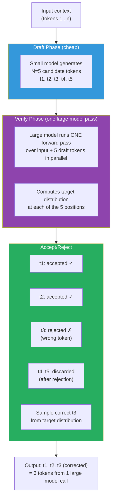

# Lesson 11.5 — Speculative Decoding: Generating Multiple Tokens for the Cost of One

---

## The Fundamental Constraint of Autoregressive Generation

From Lesson 11.1: each decode step reads all model weights once to generate one token. For a 7B model, that is 14 GB of memory reads for a single token. You cannot generate token N+1 until token N is complete — the model needs to condition on the previous token to generate the next one.

This sequential dependency seems unbreakable. You cannot parallelize across time in autoregressive generation. Or can you?

Speculative decoding (Leviathan et al., 2023; Chen et al., 2023) found a way around it. Not by breaking the autoregressive dependency, but by exploiting a key insight about transformer forward passes.

---

## The Key Insight: Verification Is Cheap

Here is the insight: a transformer can verify N tokens in the same time it takes to generate 1.

Why? During the prefill phase (Lesson 11.1), the model processes all input tokens **in parallel**. Given a sequence of tokens, the model simultaneously computes the probability distribution for what comes after each position. This is O(N) in the number of positions when done in parallel (versus O(N²) attention — but that is a separate concern).

So: if you could somehow propose N candidate tokens cheaply, you could verify all N of them with a single large model forward pass — getting N tokens for the cost of one.

The question: where do you get cheap candidate tokens?

**A small draft model.**

---

## The Speculative Decoding Algorithm

Speculative decoding uses two models:
- **Draft model (small):** A much smaller, faster model (e.g., 68M or 160M parameters) that generates candidate tokens cheaply
- **Target model (large):** The full model you actually want to run (e.g., 7B or 70B parameters)

**Algorithm:**

```
Step 1 — DRAFT: The small draft model generates N tokens speculatively.
         Fast — the draft model is small, cheap to run.

Step 2 — VERIFY: The large target model runs ONE forward pass 
         over the entire sequence (input + N draft tokens).
         This is a prefill-like operation — processes all N+1 positions in parallel.
         For each position i, the target model outputs its own probability distribution.

Step 3 — ACCEPT OR REJECT:
         For each draft token t_i (from position 1 to N):
           - If target model agrees (or assigns high enough probability): ACCEPT
           - If target model disagrees: REJECT t_i and all subsequent draft tokens
             Generate a corrected token from target model's distribution at that position.

Step 4 — RESULT:
         All accepted tokens + one corrected token = final output for this round.
         Restart from Step 1 with the new context.
```



---

## Why This Is Lossless — The Math

The crucial property: **speculative decoding produces the exact same output distribution as running the target model alone.**

This is not an approximation. It is mathematically exact.

The rejection sampling step is the key. When the draft model proposes token t and the target model disagrees, you do not just use the target model's top choice. You sample from a corrected distribution: `max(0, P_target - P_draft)`, then normalize. This ensures the final distribution matches P_target exactly.

The output quality is identical to running the large model alone. Speculative decoding trades draft model compute for reduced large model invocations — without touching the quality of any accepted token.

> **Interview note:** "Is speculative decoding an approximation?" This is a common trap question. The answer is no — it is lossless. The rejection sampling mechanism mathematically guarantees that the output distribution is identical to the target model's distribution. You get the same quality as running the 70B model alone, but faster.

---

## The Speedup: Acceptance Rate Determines Everything

The speedup from speculative decoding depends entirely on how often the draft model's tokens are accepted by the target model. This is called the **acceptance rate (α)**.

If α = 0.8 and you draft N = 5 tokens:
- Expected accepted tokens per round: `α^1 + α^2 + α^3 + α^4 + α^5 ≈ 0.8 + 0.64 + 0.51 + 0.41 + 0.33 ≈ 2.7 tokens accepted`
- Plus 1 corrected token at the rejection point = ~3.7 tokens per large model call
- vs 1 token per large model call without speculative decoding
- **~3.7× speedup** in tokens-per-second for the large model

If α = 0.5: ~1.9 tokens per large model call → ~1.9× speedup
If α = 0.9: ~4.5 tokens per large model call → ~4.5× speedup

**What affects acceptance rate?**
- **How similar the models are:** Draft and target from the same model family (e.g., LLaMA-160M and LLaMA-70B) have much higher agreement than unrelated models.
- **Task type:** Predictable, low-entropy tasks (code completion, continuing a structured format) have high acceptance rates. Creative writing with many valid continuations has lower acceptance.
- **Draft model quality:** Larger, better draft models have higher acceptance rates but cost more compute.

---

## Self-Speculative Decoding (Medusa, EAGLE, etc.)

The requirement for a separate draft model is a deployment hassle — you need two models loaded in memory. Variants avoid this:

**Medusa** (Cai et al., 2024): adds multiple "Medusa heads" to the target model — parallel output heads that predict tokens 2, 3, 4, 5 steps ahead simultaneously. The main model verifies by running one forward pass. Medusa heads are fine-tuned separately and add only ~10% to model size. No separate draft model needed.

**EAGLE** (Li et al., 2024): uses the target model's own hidden states (at the layer before the final output head) as context for a small speculative head that predicts the next hidden state, then decodes the next token from it. Achieves higher acceptance rates than Medusa because it uses richer internal context.

**Draft token reuse (via lookahead):** Some methods generate multiple potential continuations from the model itself using different sampling paths and verify them in parallel.

---

## Hardware Requirements and Practical Deployment

Speculative decoding is most effective when:
- **The target model is bandwidth-bound** (always true in production decode settings)
- **There is spare compute capacity** to run the draft model without adding latency (usually the case since the target model's cores are mostly idle during decode)
- **The task has a reasonably high acceptance rate** (> 0.6 to see meaningful speedup)

For a 7B target model: a 68M or 160M draft model (100× smaller) runs in negligible time compared to the target model's bandwidth-bound decode step. The draft compute is essentially free.

For a 70B target model: you might use a 7B model as the draft — still 10× smaller. The draft model cost is now non-trivial but the verification speedup compensates.

**In vLLM:** speculative decoding is supported via the `--speculative-model` flag. You specify the draft model, and vLLM handles the draft-verify loop with PagedAttention for both.

```bash
# Run vLLM with speculative decoding
python -m vllm.entrypoints.openai.api_server \
    --model meta-llama/Llama-2-70b-chat-hf \
    --speculative-model meta-llama/Llama-2-7b-chat-hf \
    --num-speculative-tokens 5
```

---

## When Speculative Decoding Is and Is Not the Right Choice

| Condition | Verdict |
|---|---|
| Large target model (70B+), bandwidth-bound | Strong candidate — high speedup potential |
| Tasks with predictable outputs (code, templates, structured output) | High acceptance rate → high speedup |
| Batch size is already large | Diminishing returns — batching already amortizes bandwidth |
| Small target model (7B) | Lower speedup — draft model overhead relatively larger |
| Creative writing / diverse sampling | Lower acceptance rate → lower speedup |
| Memory is the constraint (no room for draft model) | Use quantization instead |

---

## Summary

- Speculative decoding exploits the fact that a transformer can **verify N tokens in the same time it generates 1** — verifying a sequence of N tokens is a parallel operation equivalent to one prefill step.
- A small draft model proposes N candidate tokens cheaply. The large target model verifies all N in one forward pass. Accepted tokens are used; the first rejected token is corrected and following draft tokens discarded.
- The output is **mathematically lossless** — identical distribution to running the target model alone, guaranteed by rejection sampling.
- Speedup is `~(1/(1-α^N))` where α is the acceptance rate. At α=0.8, N=5: approximately 3.7× tokens per large model call.
- The key variable is acceptance rate — how often the draft model agrees with the target. Highest on predictable tasks; lowest on diverse creative tasks.
- Variants like Medusa and EAGLE eliminate the need for a separate draft model by adding speculative heads to the target model itself, reducing memory overhead.
- Most effective for large models (70B+) at batch sizes where the target model is bandwidth-bound and spare compute exists for the draft model.

---
