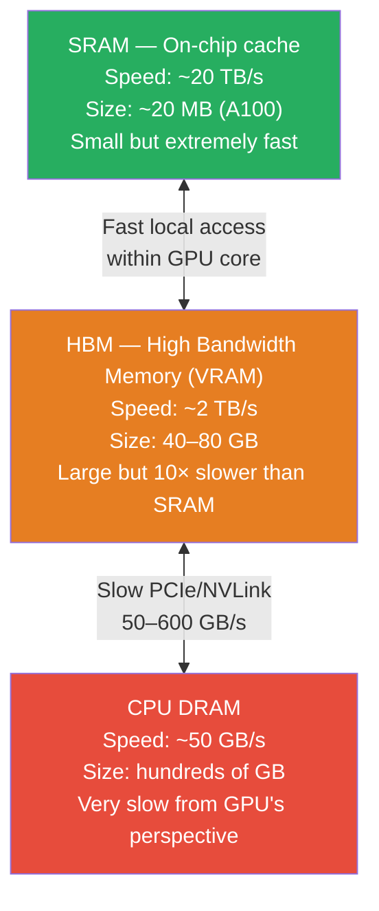
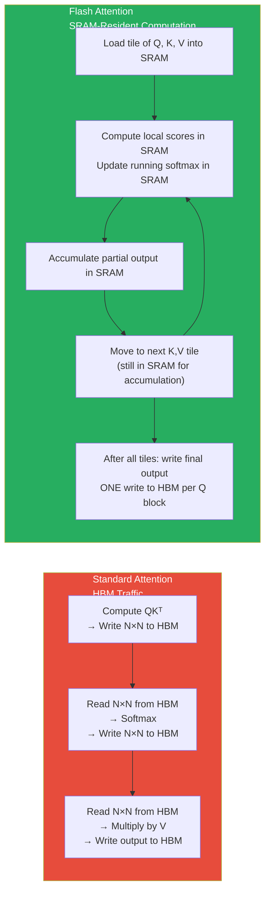

# Lesson 11.6 — Flash Attention: Why Standard Attention Is Slow and How the Kernel Fixes It

---

## The Problem With Standard Attention

Attention is the core operation of every transformer. For a sequence of N tokens with model dimension d, standard multi-head attention computes:

```
Attention(Q, K, V) = softmax(QKᵀ / √d_k) V
```

The problem is hidden in that `QKᵀ` term. This produces an **N × N attention matrix** — one score for every pair of tokens. For N = 1024, that is 1,048,576 values. For N = 8192, it is 67 million values. For N = 100,000 (long context), it is 10 billion values.

This matrix must be:
1. Computed (FLOPs: O(N²d))
2. Written to GPU memory (HBM) — the full N×N matrix
3. Read back from HBM to apply softmax
4. Written again to HBM after softmax
5. Read again to multiply by V
6. Written to HBM one more time for the output

The memory traffic — the reads and writes to HBM — is the bottleneck. HBM bandwidth is ~2 TB/s. SRAM (on-chip GPU cache) bandwidth is ~20 TB/s — 10× faster. Standard attention constantly moves data between SRAM and HBM, wasting this 10× bandwidth advantage.

---

## The Memory Hierarchy on a GPU

To understand why Flash Attention matters, you need to understand where data lives on a GPU:



SRAM is where GPU math happens. HBM is where large tensors live (weights, KV cache, activations). Every time data moves from HBM to SRAM for computation and back, you are burning bandwidth.

Standard attention creates a massive N×N matrix that does not fit in SRAM. Every operation on it requires constant HBM reads and writes.

---

## Flash Attention: The Tiling Solution

Flash Attention (Dao et al., 2022) solves this with a simple but powerful idea: **never materialize the full N×N attention matrix in HBM**. Instead, compute attention in small blocks (tiles) that fit in SRAM, using the log-sum-exp trick to compute the exact softmax without seeing all scores at once.

**The tiling approach:**

1. Divide Q into blocks of size (B_r × d)
2. Divide K and V into blocks of size (B_c × d)
3. For each block of Q, iterate over all blocks of K and V:
   - Load block of Q, K, V into SRAM (fast)
   - Compute local attention scores: Q_block × K_block^T
   - Update running softmax using the online normalization trick
   - Accumulate partial result into output
4. After processing all K,V blocks for a Q block: write final output (one write to HBM)

The key: **you only write the output to HBM once**. The intermediate N×N attention matrix is never materialized — it is computed block-by-block in SRAM and immediately used.



**Result:**
- HBM reads/writes: O(N²) → **O(N)** — linear instead of quadratic
- Memory usage: O(N²) → **O(N)** — no large intermediate matrices
- Speed: 3–7× faster attention on A100 compared to standard PyTorch attention
- No approximation — exact same numerical result as standard attention (up to floating point rounding)

---

## The Online Softmax Trick

The math that makes tiling possible. Standard softmax requires all scores to compute the normalization:

```
softmax(x_i) = exp(x_i) / Σ_j exp(x_j)
```

You need all x_j values to compute the denominator. In standard attention, this requires materializing all N attention scores before applying softmax.

The online softmax (Milakov & Gimelshein, 2018) computes softmax incrementally:
- Maintain a running maximum m and a running sum of exponentials l
- For each new block of scores, update m and l and rescale previous partial results

This allows the exact softmax to be computed incrementally across tiles — without ever storing all N scores simultaneously. Flash Attention builds on this to enable the tiling computation described above.

---

## Flash Attention 2 and 3

**Flash Attention 2** (Dao, 2023): Same algorithmic foundation but with better parallelism within each tile:
- Reduces non-matrix-multiply FLOPs (softmax operations outside the matrix multiply)
- Better work partitioning between warps within a GPU thread block
- Handles causal masking more efficiently (skips tiles that are fully masked)
- ~2× faster than Flash Attention 1 on A100

**Flash Attention 3** (Shah et al., 2024): Designed specifically for H100 GPUs:
- Uses FP8 computation (H100 has dedicated FP8 tensor cores)
- Exploits H100's asynchronous WGMMA (Warp Group Matrix Multiply-Accumulate) instructions
- Overlaps softmax computation with the next matrix multiply
- ~1.5–2× faster than Flash Attention 2 on H100

**Memory savings comparison (sequence length 8192, 7B model, all heads):**

| Method | Peak memory for attention | Speed vs baseline |
|---|---|---|
| Standard PyTorch | ~18 GB (N×N matrices) | 1× |
| Flash Attention 1 | ~2 GB (O(N) only) | 3–4× |
| Flash Attention 2 | ~2 GB | 5–7× |
| Flash Attention 3 (H100) | ~2 GB | 8–12× |

The memory savings are what unlock long-context training and inference. A 100K-token context with standard attention would require ~5 TB of attention matrix memory. Flash Attention makes it feasible.

---

## Where Flash Attention Applies

Flash Attention applies wherever self-attention is computed:

**Training:** Flash Attention 2 is the default in most modern training frameworks (Axolotl, LlamaFactory, Unsloth all use it). It reduces peak training memory and speeds up attention by 5-7×.

**Inference prefill phase:** During prefill, the model processes all input tokens in parallel — exactly where standard attention's O(N²) cost hurts most. Flash Attention dramatically speeds up prefill for long prompts.

**Inference decode phase:** During decode, only one new token is added per step. Sequence length is short from the model's perspective (one Q vector attends over KV cache entries). Flash Attention still applies but the absolute speedup is smaller since N=1 for the query.

**How to enable:**
```python
# In transformers >= 4.36, enable Flash Attention 2
model = AutoModelForCausalLM.from_pretrained(
    "meta-llama/Llama-2-7b-hf",
    torch_dtype=torch.bfloat16,
    attn_implementation="flash_attention_2"  # Enable FA2
)
```

```python
# Install Flash Attention
pip install flash-attn --no-build-isolation
```

---

## Flash Attention vs Standard Attention: When the Difference Shows Most

Flash Attention's advantage is **sequence-length dependent**. For short sequences (< 512 tokens), the standard implementation is fast enough — the attention matrix is small. As sequence length grows, Flash Attention's advantage compounds:

- N=512: ~2× faster
- N=2048: ~4× faster  
- N=8192: ~7× faster
- N=32768: ~15× faster

For modern LLM applications with long system prompts, multi-turn conversations, or long-context RAG (passing many retrieved documents), Flash Attention is not optional — it is essential for feasible inference latency.

> **Interview note:** "Why is Flash Attention faster than standard attention?" The answer: "Standard attention materializes the full N×N attention score matrix in HBM (VRAM), requiring O(N²) HBM reads and writes. Flash Attention tiles the computation so it runs entirely in SRAM (10× faster than HBM), never writing intermediate matrices to HBM. It uses the online softmax trick to compute exact attention without needing all scores simultaneously. Memory complexity drops from O(N²) to O(N), enabling long-context inference, and speed improves 3–15× depending on sequence length."

---

## Summary

- Standard attention materializes an N×N attention score matrix in HBM, requiring O(N²) memory reads and writes. For N=8192, this is 67M values moved to HBM and back — the main bottleneck.
- HBM bandwidth (~2 TB/s) is 10× slower than SRAM (~20 TB/s). Standard attention wastes this by constantly moving the N×N matrix between them.
- Flash Attention tiles Q, K, V into SRAM-sized blocks and uses online softmax to accumulate exact attention results without materializing the full N×N matrix. HBM traffic drops from O(N²) to O(N).
- Result: exact (lossless) attention computation at 3–15× faster speed with O(N) memory — enabling long-context inference that would be infeasible with standard attention.
- Flash Attention 2 improves parallelism within tiles (~2× vs FA1). Flash Attention 3 targets H100 with FP8 and async instructions (~1.5–2× vs FA2).
- Enable with `attn_implementation="flash_attention_2"` in HuggingFace transformers. Used by default in all modern training frameworks (Axolotl, Unsloth, LlamaFactory).
- Most impactful for long sequences — critical for multi-turn conversations, long system prompts, and RAG with large retrieved contexts.

---
