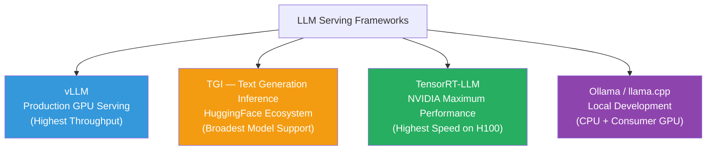

# Lesson 11.7 — Inference Serving Frameworks: vLLM vs TGI vs TensorRT-LLM vs Ollama

---

## Why the Framework Choice Matters

The model itself is only half the inference story. The serving framework determines how efficiently that model handles real traffic — multiple concurrent requests, variable sequence lengths, streaming responses, autoscaling. Choosing the wrong framework for your use case leaves performance on the table or creates operational complexity you do not need.

This lesson maps each major framework to its design goals, technical differentiators, and the scenarios where it is the right choice.

---

## The Four Major Frameworks



---

## vLLM

**Origin:** UC Berkeley, 2023. Paper: "Efficient Memory Management for Large Language Model Serving with PagedAttention."

**The core innovation:** PagedAttention (Lesson 11.2) and continuous batching (Lesson 11.3). These two techniques together make vLLM the highest-throughput general-purpose serving solution.

**Technical features:**
- PagedAttention: non-contiguous KV cache, near-zero fragmentation, prefix sharing
- Continuous batching: always-full GPU utilization
- Flash Attention 2 by default
- Tensor parallelism: distribute model across multiple GPUs (activated with `--tensor-parallel-size N`)
- Speculative decoding support
- OpenAI-compatible API out of the box
- Supports: GPTQ, AWQ, FP8, bitsandbytes quantization
- Supports: LLaMA, Mistral, Qwen, Gemma, Falcon, and most major model families

**When to use vLLM:**
- Production serving where throughput is the primary goal
- High-concurrency endpoints (10s to 1000s of concurrent users)
- When you need the OpenAI API interface (easy drop-in replacement for many clients)
- GPU-native deployment (NVIDIA GPUs, ideally A100/H100)

**Deployment:**
```bash
# Install
pip install vllm

# Start server — OpenAI-compatible API
python -m vllm.entrypoints.openai.api_server \
    --model meta-llama/Llama-3-8b-instruct \
    --tensor-parallel-size 2 \           # Split across 2 GPUs
    --quantization awq \                  # AWQ INT4 quantization
    --max-model-len 8192 \               # Max context length
    --gpu-memory-utilization 0.90        # Use 90% of GPU memory for KV cache
```

**Limitation:** Configuration can be complex for advanced scenarios. Less model-agnostic than TGI — adding a new architecture requires a custom implementation (though most major ones are already included).

---

## TGI — Text Generation Inference (HuggingFace)

**Origin:** HuggingFace, used to power HuggingFace Inference API. Open-sourced 2022.

**The core proposition:** The best-integrated framework for models hosted on HuggingFace Hub. If your model is on HuggingFace Hub and your team uses the HF ecosystem, TGI is the path of least resistance.

**Technical features:**
- Continuous batching (similar to vLLM)
- Flash Attention 2 integration
- Tensor parallelism
- GPTQ, AWQ, EETQ quantization support
- Speculative decoding
- Token streaming
- Broad model support via HuggingFace transformers integration
- Docker-first deployment (Hugging Face's philosophy)
- Prometheus metrics built-in

**When to use TGI:**
- Your model is on HuggingFace Hub and you want minimum friction
- You are deploying on Amazon SageMaker (AWS provides a TGI deep learning container)
- You need Prometheus/Grafana monitoring out of the box
- Your team is already in the HuggingFace ecosystem

**Deployment:**
```bash
# Docker-based deployment (recommended by HuggingFace)
docker run --gpus all --shm-size 1g \
    -p 8080:80 \
    -v $HOME/models:/data \
    ghcr.io/huggingface/text-generation-inference:latest \
    --model-id meta-llama/Meta-Llama-3-8B-Instruct \
    --num-shard 2 \                    # Tensor parallelism across 2 GPUs
    --quantize gptq \
    --max-total-tokens 8192
```

**Limitation:** Historically slightly lower throughput than vLLM (vLLM's PagedAttention is more memory-efficient than TGI's equivalent). Configuration is Docker-centric, which can be inflexible in some deployment environments.

---

## TensorRT-LLM (NVIDIA)

**Origin:** NVIDIA, 2023. Built on TensorRT, NVIDIA's high-performance inference runtime.

**The core proposition:** Maximum performance on NVIDIA hardware. If you have H100s and need every last drop of throughput, TensorRT-LLM extracts it. It is not a serving framework itself — it is a model compilation and optimization engine. You compile your model with TensorRT-LLM, then serve it with Triton Inference Server (NVIDIA's serving layer).

**Technical features:**
- Compiles models into optimized CUDA kernels for specific GPU targets
- Exploits H100-specific capabilities: FP8 compute, TMA (Tensor Memory Accelerator), WGMMA
- In-flight batching (continuous batching)
- Inflight fused multi-head attention (FMHA)
- Weight-only INT4/INT8 quantization, SmoothQuant for activation quantization
- Tensor, pipeline, and sequence parallelism
- Typically 2–4× faster than vLLM on the same H100 hardware for compatible workloads

**When to use TensorRT-LLM:**
- You have NVIDIA H100 (or A100) GPUs and throughput is critical
- You can absorb the engineering complexity (compilation, Triton integration)
- Your model and use case are stable — recompilation is needed for any change
- Enterprise-scale serving where the performance premium justifies the ops cost

**The trade-off — complexity:**
- Model compilation takes hours for large models
- Recompilation needed when: model changes, GPU target changes, batch size changes
- Debugging is harder than Python-based frameworks
- Setup involves TensorRT-LLM compilation + Triton Inference Server + model store

**Practical reality:** Most teams start with vLLM. If they hit a throughput wall and have H100 hardware, they evaluate TensorRT-LLM. Many teams find vLLM's throughput is sufficient and avoid TensorRT-LLM's complexity.

---

## Ollama / llama.cpp

**Origin:** llama.cpp was created by Georgi Gerganov (2023) as a pure C++ implementation of LLaMA inference designed to run on CPUs. Ollama wraps llama.cpp with a user-friendly CLI and API.

**The core proposition:** Run LLMs locally on consumer hardware (MacBook, Windows PC, consumer NVIDIA/AMD GPU) without Python, CUDA toolkits, or complex setup. Pull a model, run it, done.

**Technical features (llama.cpp):**
- GGUF format quantization (Q2 through Q8) — all discussed in Lesson 11.4
- CPU inference with AVX2/AVX-512 optimization
- Partial GPU offloading (run some layers on GPU, rest on CPU)
- Supports: LLaMA, Mistral, Qwen, Phi, Gemma, and most open models in GGUF format
- Apple Silicon (Metal) acceleration

**Ollama on top of llama.cpp:**
- `ollama pull llama3` — one command to download and run
- REST API on localhost (OpenAI-compatible endpoints in recent versions)
- Model management (multiple models, easy switching)
- Cross-platform: macOS, Linux, Windows

**When to use Ollama:**
- Local development and testing
- Prototyping before committing to GPU infrastructure
- Edge deployment on laptops or small devices
- Personal use, small teams without GPU infrastructure
- Privacy-sensitive use cases (data never leaves the machine)

**When NOT to use Ollama:**
- Production serving at scale — llama.cpp is not designed for high-concurrency
- High-throughput requirements — CPU inference is 10–50× slower than GPU
- Large models requiring precision > Q4 — quality and speed trade-offs are significant

---

## Framework Comparison Matrix

| Dimension | vLLM | TGI | TensorRT-LLM | Ollama/llama.cpp |
|---|---|---|---|---|
| **Primary use case** | Production GPU serving | HF ecosystem serving | Maximum NVIDIA performance | Local development |
| **Core innovation** | PagedAttention | HF integration | GPU kernel compilation | CPU-first, GGUF |
| **Throughput** | ⭐⭐⭐⭐ | ⭐⭐⭐ | ⭐⭐⭐⭐⭐ | ⭐ |
| **Ease of setup** | ⭐⭐⭐ | ⭐⭐⭐ | ⭐ | ⭐⭐⭐⭐⭐ |
| **Model support breadth** | ⭐⭐⭐⭐ | ⭐⭐⭐⭐⭐ | ⭐⭐⭐ | ⭐⭐⭐⭐ |
| **Quantization support** | GPTQ, AWQ, FP8 | GPTQ, AWQ | INT4, INT8, FP8, SmoothQuant | GGUF (all levels) |
| **Hardware** | NVIDIA GPU | NVIDIA GPU | NVIDIA GPU only | CPU, any GPU, Apple Silicon |
| **AWS SageMaker support** | Custom container | Native DLC container | Custom container | Not production use |
| **OpenAI API compatibility** | ✓ Native | ✓ Native | Via Triton gateway | ✓ Recent versions |

---

## Decision Guide: Which Framework for Which Scenario

**Starting a new production deployment on AWS with NVIDIA GPUs:**
→ **vLLM** as default. Deploy as a custom SageMaker container or on EC2 with a load balancer. Simple, well-documented, high throughput.

**Your model is on HuggingFace Hub, your team uses the HF ecosystem:**
→ **TGI**. The SageMaker TGI DLC (Deep Learning Container) makes deployment straightforward. `docker pull` and configure.

**You have H100 GPUs and need maximum performance for a high-traffic API:**
→ **TensorRT-LLM** if you can absorb the setup complexity. Evaluate throughput difference vs vLLM first — if vLLM is sufficient, avoid the complexity.

**Developer testing, rapid prototyping, or running models on a laptop:**
→ **Ollama**. Install once, `ollama run llama3`, done.

**Edge deployment with strict privacy requirements or no cloud access:**
→ **llama.cpp** directly (or Ollama if you want the API). GGUF Q4_K_M for the best quality/size balance.

> **Interview note:** "Walk me through how you would deploy a fine-tuned LLaMA-3 70B model to serve 1000 concurrent users on AWS." Strong answer: "I would use vLLM deployed on a cluster of A100 or H100 instances behind an Application Load Balancer. The 70B model in AWQ INT4 is ~35 GB, fitting on a single A100 80GB. For 1000 concurrent users, I would use auto-scaling with multiple vLLM instances. vLLM's PagedAttention handles the KV cache memory efficiently, and continuous batching keeps GPU utilization high. I would expose the OpenAI-compatible endpoint, configure a max-model-len matching my use case, and set GPU memory utilization to 0.9 to maximize KV cache headroom. For monitoring, I would add Prometheus metrics and alert on request queue depth."

---

## Summary

- **vLLM**: best general-purpose production serving. PagedAttention + continuous batching = highest throughput on standard GPU clusters. OpenAI API compatible, simple setup, active development.
- **TGI**: best for HuggingFace ecosystem. Broadest model compatibility via transformers integration. Native SageMaker container. Slightly lower throughput than vLLM but less difference in recent versions.
- **TensorRT-LLM**: highest throughput on NVIDIA H100 — 2–4× faster than vLLM — but requires model compilation and Triton integration. High complexity, justified only at large scale with stable workloads.
- **Ollama / llama.cpp**: best for local development and edge. CPU-native, GGUF quantization, one-command setup. Not suitable for production scale.
- For AWS production: vLLM as custom SageMaker container or EC2 + ALB is the default choice. TGI with native SageMaker DLC is the second option for HF-ecosystem teams.
- The framework choice does not change model quality — it changes how efficiently that quality is served under real traffic.

---
