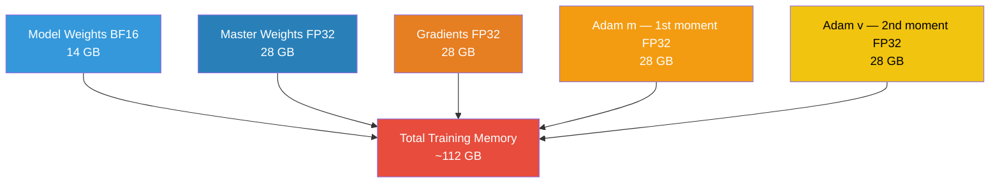
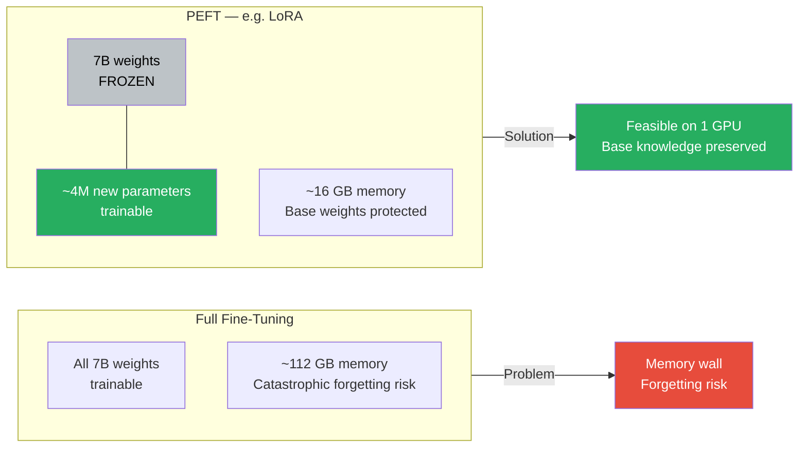
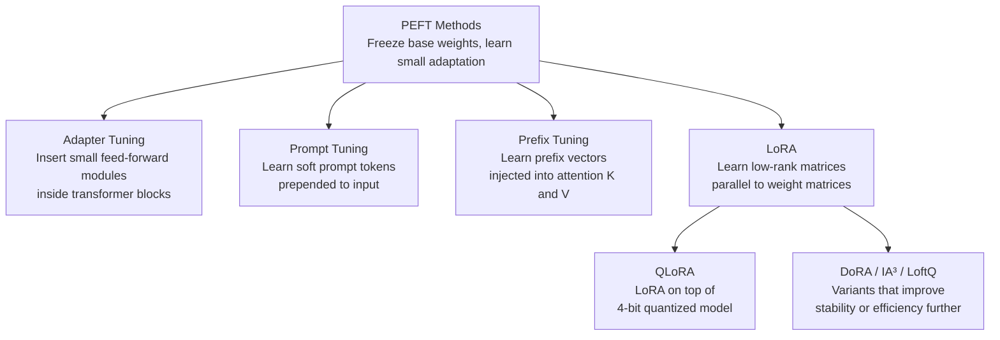

# Lesson 3.1 — Why PEFT Exists: The Full Fine-Tuning Memory Problem, Catastrophic Forgetting, and the Case for Parameter Efficiency

---

## The Problem You Hit on Day One

You have a pre-trained 7B parameter model. You have a domain-specific dataset. You want to fine-tune the model on it. You look up how to do full fine-tuning, set up the training loop, and hit run.

Then you get an out-of-memory error.

Not a small one. You needed 112 GB of GPU memory for a model that fits comfortably in 14 GB at inference time. That ratio — 8× more memory to train than to run — is not a bug. It is a direct consequence of how gradient-based optimization works, and understanding it is the first thing you need to understand about PEFT.

Full fine-tuning is not just expensive in theory. For most teams, it is simply impossible without a cluster of high-end GPUs. A single A100 80GB GPU — which costs thousands of dollars per month in cloud — still cannot hold a full fine-training run for a 13B model. This is the problem PEFT was built to solve.

---

## The Memory Math of Full Fine-Tuning

When you train a model, you do not just need to store the model's weights. You need to store everything the optimizer needs to update those weights: gradients and optimizer states. Let us count this precisely for a 7B parameter model using mixed precision training (the standard approach).

**At inference time:**
- Model weights in BF16: `7B × 2 bytes = 14 GB`

**At training time (mixed precision with Adam):**

| What is stored | Precision | Bytes per param | Total for 7B |
|---|---|---|---|
| Model weights (forward/backward pass) | BF16 | 2 | 14 GB |
| Master copy of weights (for optimizer update) | FP32 | 4 | 28 GB |
| Gradients | FP32 | 4 | 28 GB |
| Adam first moment (m — running mean of gradients) | FP32 | 4 | 28 GB |
| Adam second moment (v — running variance of gradients) | FP32 | 4 | 28 GB |
| **Total** | | **18 bytes** | **~112 GB** |

The model itself is 14 GB. Training it requires 112 GB. That is the 8× ratio.

Why does Adam need two extra copies of the gradients (the m and v moments)? Because Adam does not update weights with the raw gradient — it uses an adaptive learning rate per parameter, computed from the running mean and variance of past gradients. That memory is unavoidable with Adam. Switch to SGD and you save the optimizer states, but SGD converges much worse on transformers.

Why Two Copies of Weights are NeededDuring Mixed-Precision Training, the system maintains two versions of the weights to balance speed and mathematical accuracy.The Step-by-Step Training Loop
1. **Forward Pass (Speed):** The system uses the BF16 weights (14 GB) because 16-bit math runs incredibly fast on modern GPUs.
2. **Backward Pass (Feedback):** The system calculates the training errors and generates the FP32 Gradients (28 GB).
3. **Optimizer Update (Accuracy):** The Adam optimizer applies these tiny gradient updates directly to the FP32 Master Copy (28 GB). Because 32-bit precision has more decimal places, tiny numbers do not get rounded to zero.
4. **The Sync (Reset):** The system converts the newly updated FP32 master weights back down to BF16, overwriting the BF16 weights (14 GB) to start the next step

*Memory components during full fine-tuning of a 7B model. The model itself is 14 GB. The optimizer turns that into ~112 GB.*

This is before accounting for activation memory (the intermediate values stored during the forward pass for use in backpropagation). With large batch sizes, activations add tens of gigabytes more.

> **Interview note:** When asked "why is fine-tuning expensive?", do not say "because the model is large." Say: "The model weights are 14 GB in BF16, but training with Adam requires keeping master FP32 weights, FP32 gradients, and two FP32 optimizer state tensors — one for the gradient mean and one for the variance — bringing total memory to around 112 GB for a 7B model. That is the 8× training overhead, and it is why full fine-tuning a 7B model requires at least two A100 80GB GPUs."

---

## The Second Problem: Catastrophic Forgetting

Even if you have the hardware, full fine-tuning has a second serious problem: catastrophic forgetting.

Pre-training on hundreds of billions of tokens teaches the model an enormous amount — how language works, factual knowledge, reasoning patterns, coding patterns, arithmetic, common sense. All of this is encoded in the weights through billions of gradient updates spread across a massive, diverse dataset.

When you fine-tune on a narrow task — say, customer support conversations — your gradient updates are optimizing entirely for that task. The updates push every weight toward performing better on support conversations. In doing so, they overwrite some of the general-purpose patterns that were built during pre-training.

The result: after fine-tuning, the model is better at customer support but noticeably worse at general reasoning, following complex instructions, or tasks it could handle before. The model has "forgotten" parts of its pre-training.

This is not hypothetical. It is a commonly observed failure mode. Teams fine-tune a model, evaluate it on the target task (looks good!), then deploy and discover it is now worse at adjacent tasks they did not test. The forgetting is subtle and uneven — you rarely lose everything, but you lose enough to matter.

Why does this happen? Because in full fine-tuning, there is nothing protecting the pre-trained weights. The gradient descent algorithm does not know that these weights encode valuable general knowledge — it only optimizes for the loss on your fine-tuning dataset.

> **Interview note:** Catastrophic forgetting is a common interview topic. The key points are: (1) it happens because gradient updates on a narrow task overwrite general pre-training patterns, (2) it is hard to detect unless you specifically test for it on tasks outside your fine-tuning domain, and (3) PEFT methods reduce it because they leave the pre-trained weights frozen and only update a small number of new parameters.

---

## The Ideal Solution

Given these two problems — memory cost and catastrophic forgetting — what would the ideal solution look like?

It would:
1. **Not update the original pre-trained weights at all.** If the weights stay frozen, they cannot forget anything.
2. **Learn only a small number of new parameters** that capture the task-specific adaptation. Small number = small memory footprint for gradients and optimizer states.
3. **Achieve close to full fine-tuning performance** despite fewer trainable parameters.

This is exactly what Parameter-Efficient Fine-Tuning (PEFT) methods do. They freeze the original pre-trained weights and add a small number of new parameters — in different ways, in different places — that are trained to capture the adaptation.

*Full fine-tuning vs PEFT: the memory and forgetting trade-off.*

---

## How Much Do PEFT Methods Actually Save?

Here is a concrete comparison for a 7B model. LoRA at rank 16 targeting the query and value projection matrices adds roughly 4–40 million trainable parameters depending on configuration, against 7 billion total.

| | Full Fine-Tuning | LoRA (r=16) |
|---|---|---|
| **Trainable parameters** | 7,000,000,000 | ~20,000,000 (0.3%) |
| **Gradient memory** | 28 GB | ~160 MB |
| **Optimizer state memory** | 56 GB | ~320 MB |
| **Total training memory** | ~112 GB | ~18 GB |
| **Hardware needed** | 2+ A100 80GB | 1× RTX 3090 24GB |
| **Catastrophic forgetting** | High risk | Very low risk |
| **Task performance** | Best possible | 90–98% of full FT |

The performance gap between full fine-tuning and LoRA is often smaller than expected. On many tasks, LoRA at a reasonable rank achieves performance within 1–3% of full fine-tuning while requiring 6–8× less memory. For some narrow tasks, LoRA actually outperforms full fine-tuning because the smaller number of trainable parameters acts as a regularizer that prevents overfitting.

---

## The PEFT Landscape at a Glance

All PEFT methods share the same core idea — freeze the base weights and learn a small adaptation — but they differ in *where* they inject the new parameters and *how* they structure those parameters.

*The PEFT family. Each lesson in this Part covers one branch in depth.*

Each method has specific strengths and weaknesses that make it the right choice in different situations. The following lessons cover each one in depth. After reading them all, Lesson 3.7 gives you the comparison matrix to choose between them.

---

## Summary

- Full fine-tuning of a 7B model requires ~112 GB of GPU memory — not because the model is 14 GB, but because Adam's optimizer states (two FP32 tensors per parameter) and the FP32 master weights multiply the memory requirement by ~8×.
- Gradients alone require 28 GB for a 7B model in FP32. Optimizer states add another 56 GB. This is unavoidable with standard training.
- Catastrophic forgetting happens because gradient updates on a narrow fine-tuning dataset overwrite the general patterns encoded in pre-trained weights, with nothing protecting them.
- PEFT methods solve both problems by freezing all original weights and training only a small set of new parameters — reducing trainable parameter count from 7B to tens of millions.
- LoRA at rank 16 on a 7B model reduces training memory from ~112 GB to ~18 GB, with typical task performance within 1–3% of full fine-tuning.
- All PEFT methods share the same core idea but differ in where and how they inject trainable parameters — Adapter Tuning, Prompt Tuning, Prefix Tuning, LoRA, and QLoRA are the main families, each covered in the following lessons.

---
