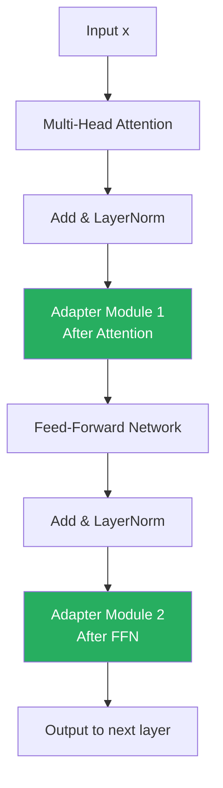

# Lesson 3.2 — Adapter Tuning: Architecture, Mechanics, and Trade-offs

> *This lesson builds on Lesson 3.1. Make sure you understand why PEFT exists before continuing.*

---

## The Idea Behind Adapters

Adapter Tuning (Houlsby et al., 2019) was one of the first PEFT methods to gain traction. The insight is simple: instead of modifying the pre-trained weights, insert small learnable modules *between* the existing layers. The original weights stay completely frozen. The new modules learn the task-specific adaptation.

The beauty of this design is the **residual connection**. If the adapter's weights are initialized close to zero, the adapter is effectively a no-op — the model behaves exactly like the pre-trained model. Training then nudges the adapter weights away from zero, gradually teaching the task-specific behavior. This initialization strategy is what prevents catastrophic forgetting: the model starts from its pre-trained behavior and adapts from there rather than being overwritten.

---

## Where Adapters Sit in the Transformer

A standard transformer block has two sub-layers:
1. Multi-Head Self-Attention (MHA)
2. Feed-Forward Network (FFN)

Each sub-layer is followed by a residual connection and a layer norm.

In the original Houlsby et al. design, an adapter module is inserted **after both sub-layers** — once after attention and once after FFN. Later work (like Pfeiffer et al.'s AdapterFusion) found that inserting only after FFN (a single adapter per layer) achieves nearly the same results with half the parameters.


*Transformer block with Houlsby-style adapters. Green modules are the only trainable components. Everything else is frozen.*

---

## Inside the Adapter Module

Each adapter is a small bottleneck feed-forward network:

```
input (dimension d)
    ↓
Down-projection: W_down ∈ ℝ^(d×r)    [squeeze to bottleneck]
    ↓
Nonlinearity (GeLU or ReLU)
    ↓
Up-projection: W_up ∈ ℝ^(r×d)        [expand back to d]
    ↓
Add residual (skip connection from input)
    ↓
output (dimension d)
```

In math: `output = x + W_up(GeLU(W_down(x)))`

The `r` here is the **bottleneck dimension** — sometimes called the adapter rank. This is the key hyperparameter that controls the capacity and the parameter count of each adapter.

**Parameter count per adapter:**
- Down-projection: `d × r`
- Up-projection: `r × d`
- Total: `2 × d × r`

**Concrete example** for LLaMA-2 7B (hidden dimension d = 4096), with bottleneck r = 64:
- Parameters per adapter: `2 × 4096 × 64 = 524,288`
- Adapters per layer: 2 (Houlsby-style) or 1 (Pfeiffer-style)
- Layers in LLaMA-2 7B: 32
- **Total with Houlsby**: `32 × 2 × 524,288 ≈ 33.5M params (0.48% of 7B)`
- **Total with Pfeiffer**: `32 × 1 × 524,288 ≈ 16.8M params (0.24% of 7B)`

This is the only memory that needs gradients and optimizer states — a tiny fraction of the full 112 GB training cost.

---

## The Residual Connection: Why It Matters

The residual connection `output = x + adapter(x)` is not just an architectural detail — it is the mechanism that preserves the pre-trained model's behavior throughout training.

At initialization, `W_down` and `W_up` are initialized such that the adapter output is near zero. The residual means the full layer output is approximately `x + 0 = x` — the original input passes through unchanged. The pre-trained model's capabilities are fully preserved from step one.

As training progresses, the adapter weights shift just enough to encode the new task-specific behavior. The base model's representations flow through unchanged, and the adapter adds a learned correction on top. This is fundamentally different from full fine-tuning, where every weight update risks overwriting pre-trained knowledge.

---

## The Inference Overhead Problem

Here is the critical trade-off that LoRA later solved: **adapter modules cannot be merged into the base weights.**

The adapter computation is: `output = x + W_up(GeLU(W_down(x)))`. The GeLU nonlinearity is what prevents this from being simplified into a single matrix operation. You cannot fold the adapter into the original weights without changing the computation.

This means at inference time, every forward pass through every transformer block must run the adapter computation in addition to the original layer. For a 32-layer model with 2 adapters per layer, that is 64 extra feed-forward operations per inference call.

In practice this overhead is **5–10% slower inference** compared to the base model, depending on adapter size and hardware. For applications with strict latency requirements, this is a real cost.

This is the main reason LoRA became more popular than Adapter Tuning — LoRA's linear structure allows its weights to be merged into the base model weights after training, giving you zero inference overhead. We cover this in Lesson 3.4.

> **Interview note:** If asked "what is the main limitation of Adapter Tuning compared to LoRA?", the answer is inference latency. Adapters add a non-linearity (GeLU) inside the module, which prevents their weights from being mathematically merged into the original weight matrix. LoRA uses only linear operations (matrix multiplication), which means after training you can do `W' = W₀ + BA` and replace the original weights entirely — zero runtime cost at inference. Adapters have no equivalent merge operation.

---

## When to Use Adapter Tuning

Adapter tuning still has valid use cases, even in a world where LoRA exists.

**Use adapters when:**
- You need to serve **multiple tasks from a single base model** (multi-task serving). Each task gets its own adapter. At inference, you swap adapters without reloading the base model. Libraries like AdapterHub and the `adapters` library (formerly `adapter-transformers`) are built for exactly this pattern.
- Your task requires adaptation of the **full depth of the model** (not just attention layers). Some tasks benefit from adapting both the attention and FFN components in every layer, which adapters make natural to configure.
- You are doing **continual learning** — adding new tasks over time. The modular, stackable nature of adapters makes this clean.

**Do not use adapters when:**
- Inference latency is critical. Use LoRA (merge-and-deploy).
- You are memory-constrained and need to push the limit. LoRA and QLoRA are more aggressive.
- You are working with very small models (< 1B parameters). The adapter's bottleneck is less effective when the base model's representations are already narrow.

---

## Concrete Example: Domain Adaptation for a Legal Assistant

Suppose you are building a legal document analysis assistant using LLaMA-2 7B as the base. You have 50K examples of legal Q&A pairs. You want to serve this alongside a medical assistant from the same base model (two tenants on the same infrastructure).

With Adapter Tuning:
- Fine-tune Adapter Set A (33M params) on the legal dataset → call it `legal_adapter.bin`
- Fine-tune Adapter Set B (33M params) on the medical dataset → call it `medical_adapter.bin`
- Load LLaMA-2 7B once into memory (14 GB)
- At inference, load the appropriate adapter based on the incoming request

This is impossible to do as cleanly with LoRA merging — once you merge LoRA weights into the base model, you have a different model per task and need to load each separately.

---

## Summary

- Adapter Tuning inserts small bottleneck feed-forward modules (down-project → GeLU → up-project → residual) inside transformer blocks after attention and/or FFN sub-layers.
- All original weights are frozen. Only adapter weights (~0.2–0.5% of total parameters) are trained, reducing optimizer memory by ~200×.
- The residual connection with near-zero initialization ensures the model starts from its pre-trained behavior — the adapter adds learned corrections without overwriting base knowledge.
- The critical limitation: the GeLU nonlinearity inside adapters prevents weight merging, so inference always runs the adapter computation, adding ~5–10% latency.
- LoRA replaced adapters as the dominant PEFT method specifically because LoRA uses only linear operations, enabling post-training weight merging with zero inference overhead.
- Adapters remain the better choice for multi-task serving scenarios (multiple adapters, one base model) and continual learning workflows.

---
