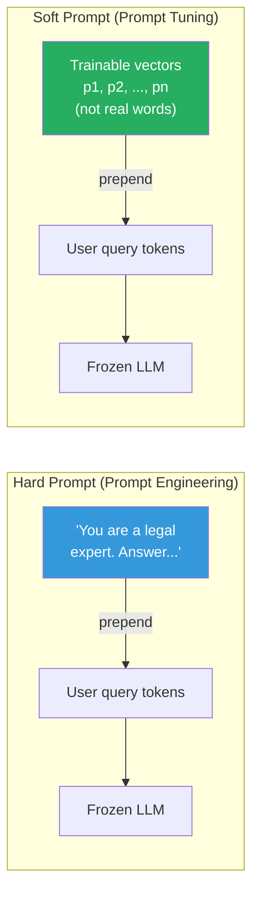
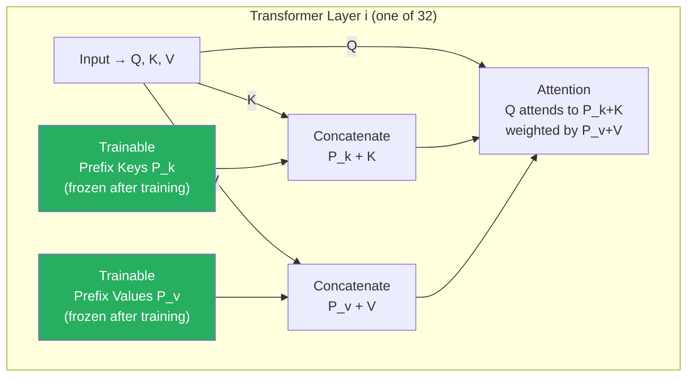

# Lesson 3.3 — Prompt Tuning and Prefix Tuning: Soft Prompts, Attention Prefixes, and Why They Struggle on Small Models

> *This lesson covers two related but distinct methods. Read both sections — the contrast between them is the most instructive part.*

---

## The Different Kind of PEFT

Adapter Tuning and LoRA modify the model's weight matrices to encode task-specific behavior. Prompt Tuning and Prefix Tuning take a different approach entirely: instead of changing what the model *is*, they change what the model *sees*.

The idea comes from observing how powerful natural language prompts are for steering model behavior. If you prepend "You are a legal expert. Answer precisely and cite relevant statutes:" to every query, the model behaves differently — and better for legal tasks — without any weight changes. This is prompt engineering: crafting the right *hard prompt* (actual text tokens).

Hard prompts work, but they are brittle. They depend on finding the right human-readable phrasing, the token budget spent on instructions reduces the space for content, and you are constrained to meaningful text — you cannot express arbitrary steering vectors in natural language.

**What if the prompt did not have to be human-readable?** What if instead of searching for the right words, you learned continuous embedding vectors that steer the model optimally for your task — even if those vectors do not correspond to any real words?

That is the core insight behind both Prompt Tuning and Prefix Tuning.

---

## Prompt Tuning

### What It Does

Prompt Tuning (Lester et al., 2021) keeps the entire language model frozen and learns a small set of **trainable embedding vectors** that are prepended to the input sequence before the first transformer layer.

Think of it as: instead of writing a prompt in words, you are learning the optimal prompt as a sequence of continuous vectors in embedding space. The model sees these vectors as if they were token embeddings, but they are not tied to any real vocabulary — they are free-floating parameters optimized directly by gradient descent.


*Hard prompt vs soft prompt. The soft prompt vectors are in the same embedding space as real tokens but are not constrained to represent actual words.*

### The Parameter Count

If you use `n` soft prompt tokens and the model's embedding dimension is `d`, you have exactly `n × d` trainable parameters.

For LLaMA-2 7B (d = 4096) with 20 soft prompt tokens:
- `20 × 4096 = 81,920 trainable parameters`
- This is 0.0012% of the 7B base model

This is an almost absurdly small number of trainable parameters. The memory savings are extreme. The question is: does it work?

### The Large-Model Dependency

Here is the critical fact about Prompt Tuning: **it only works well on very large models.**

The original paper showed this clearly. At model sizes below ~1B parameters, Prompt Tuning performs significantly worse than full fine-tuning. As model size increases past 10B, the gap closes and Prompt Tuning approaches full fine-tuning quality.

Why this dependence on scale? The soft prompt tokens influence the model only through the attention mechanism at the first layer. The frozen model must learn to interpret and propagate the signal from these unfamiliar embedding vectors through all its layers. Large models have enough representational flexibility to do this — their attention heads can adapt their responses to novel input patterns. Small models are too rigid; they cannot effectively extract signal from learned embeddings that do not correspond to their training vocabulary.

> **Interview note:** If asked "why doesn't Prompt Tuning work on small models?", the answer is: Prompt Tuning relies on the model's frozen attention mechanism to propagate the signal from soft prompt tokens through all layers. Large models (10B+) have enough representational flexibility and multi-head attention capacity to do this. Smaller models are too rigid — their attention patterns were learned on natural text tokens, and they cannot meaningfully generalize to arbitrary learned vectors injected only at the embedding level.

---

## Prefix Tuning

### The Problem With Prompt Tuning's Depth

Prompt Tuning injects trainable vectors only at the input embedding level — the first layer. The soft prompt tokens influence the model only as much as the attention mechanism propagates them through subsequent layers. For deep networks (32–96 layers), this signal can fade or distort.

Prefix Tuning (Li and Liang, 2021) solves this by injecting trainable vectors **at every transformer layer** — not just the input. Specifically, it prepends learnable prefix vectors directly into the **Key and Value matrices** of every attention head in every layer.

### How Prefix Tuning Works

In standard self-attention, for each query token, the model computes attention over all Key-Value pairs in the sequence. Prefix Tuning adds `n` learned prefix vectors to the Keys and Values before this computation.

Standard attention for a sequence of length L:
```
Q ∈ ℝ^(L×d_k),   K ∈ ℝ^(L×d_k),   V ∈ ℝ^(L×d_v)
Attention(Q, K, V) = softmax(QKᵀ / √d_k) V
```

With prefix tuning, `n` trainable prefix vectors P_k and P_v are prepended:
```
K' = [P_k ; K] ∈ ℝ^((n+L)×d_k)
V' = [P_v ; V] ∈ ℝ^((n+L)×d_v)
Attention(Q, K', V') = softmax(Q K'ᵀ / √d_k) V'
```

Every query token now attends to the prefix vectors as well as the actual content. The prefix vectors act as a persistent, task-specific context that every attention computation in every layer is aware of.


*Prefix Tuning at a single attention layer. Trainable prefix vectors are concatenated to Keys and Values. This happens at every layer in the model.*

### Parameter Count for Prefix Tuning

For each layer, you have:
- Prefix Keys: `n × d_k` per head × number of heads = `n × d_model`
- Prefix Values: `n × d_v` per head × number of heads = `n × d_model`
- Total per layer: `2 × n × d_model`
- Total across all layers: `2 × n × d_model × num_layers`

For LLaMA-2 7B (d=4096, 32 layers) with n=10 prefix tokens:
- `2 × 10 × 4096 × 32 = 2,621,440 ≈ 2.6M trainable parameters`

Much more than Prompt Tuning's 82K, but still trivially small compared to 7B. And the deeper injection means the prefix signal is present and active at every layer's attention computation, not just propagated from layer 1.

---

## Prompt Tuning vs Prefix Tuning: Key Differences

| | Prompt Tuning | Prefix Tuning |
|---|---|---|
| **Where injected** | Input embedding layer only | Key and Value of every attention layer |
| **Signal depth** | Must propagate through all layers | Present at every layer directly |
| **Trainable params** | `n × d` (e.g., 82K) | `2 × n × d × layers` (e.g., 2.6M) |
| **Works on small models** | No — needs 10B+ | Slightly better, still needs 1B+ |
| **Inference overhead** | Minimal (just extra input tokens) | Slight KV cache overhead per layer |
| **Task control granularity** | Coarser | Finer |
| **Typical use today** | Rare in production | Rare in production |

The "works on small models" row is the most important. Both methods share the fundamental limitation that the base model is completely frozen. All adaptation must happen through the learned prefix/prompt vectors being useful to the frozen attention mechanism. Small models lack the flexibility for this. LoRA became dominant partly because it does not have this constraint — LoRA directly modifies the matrices the model uses to compute, rather than trying to steer a frozen model from the outside.

---

## Why Both Methods Are Rarely Used Today (And When They Still Are)

In 2024, most practitioners use LoRA or QLoRA. Prompt Tuning and Prefix Tuning are largely historical — important to understand conceptually, rarely deployed.

**Why they were displaced:**
- Both methods underperform LoRA at equivalent or higher parameter counts on most tasks
- Both require large base models to work well, which limits flexibility
- Prefix Tuning adds persistent KV cache overhead at inference (the prefix vectors expand the effective sequence length)
- LoRA is simpler to configure, works across all model sizes, and achieves better empirical results

**Where they still have legitimate use:**
- **Prefix Tuning** is still used in some multi-task and continual learning scenarios where you want a clean separation between the base model and task-specific parameters. Each task gets its own prefix; the base model is shared.
- **Prompt Tuning** is sometimes used in NLP classification tasks where the model is very large (GPT-3 scale) and you want near-zero trainable parameters with API-only access — you can only modify the input, not the model weights.
- Both methods are important for interviews because they represent the conceptual exploration that led to LoRA — understanding their limitations is what makes LoRA's design choices make sense.

> **Interview note:** A common interview pattern is "compare PEFT methods." For Prompt and Prefix Tuning, the key insight to demonstrate is: both methods work by steering a fully frozen model using learned input-space or key-value-space vectors. This is fundamentally weaker than LoRA, which directly modifies the model's weight matrices in a parameter-efficient way. The frozen model must "cooperate" with these steering vectors, which requires the model to be large enough to have flexible attention. LoRA does not have this dependency — it adapts the model at the weight level and works effectively even on 1B scale models.

---

## Concrete Example: Prompt Tuning for Sentiment Classification on GPT-3

Suppose you have API access to GPT-3 (text-davinci-003 era) and want to adapt it for product sentiment classification without fine-tuning access.

With Prompt Tuning (if you had weight access):
- Initialize 20 soft prompt tokens (20 × 12,288 = 245,760 params for GPT-3's embedding dimension)
- Freeze all 175B GPT-3 parameters
- Train only the soft prompt on your labeled sentiment dataset
- At inference: prepend the learned soft tokens before every input

The trained soft tokens essentially encode "classify sentiment as positive, negative, or neutral based on product reviews" in a compressed vector form that the large model interprets well — without burning any of your actual input token budget on human-readable instructions.

For a 175B model, this works reliably. For a 7B model, you would see a significant quality drop compared to LoRA fine-tuning.

---

## Summary

- **Prompt Tuning** prepends `n` trainable embedding vectors to the input. Only these `n × d` parameters are trained (~82K for a 7B model). The entire base model is frozen. Works only on models ≥ 10B parameters.
- **Prefix Tuning** injects trainable prefix vectors directly into the Key and Value matrices of every attention layer. More parameters than Prompt Tuning (~2.6M for 7B, 32 layers), and present at every layer — giving stronger, more consistent task signal.
- Both methods rely entirely on the frozen model's attention mechanism to make use of the learned vectors. This creates a hard dependency on model scale — small models (< 1B) are too rigid.
- The fundamental limitation of both: you are steering a frozen model from the outside, not modifying what it knows. LoRA is stronger because it directly modifies the weight matrices the model computes with.
- In practice, both have been largely displaced by LoRA, but they remain important conceptually — their failure modes explain exactly why LoRA was designed the way it was.
- Valid current use cases: multi-task serving with prefix swapping (Prefix Tuning), or prompt adaptation for API-only large models (Prompt Tuning).

---
