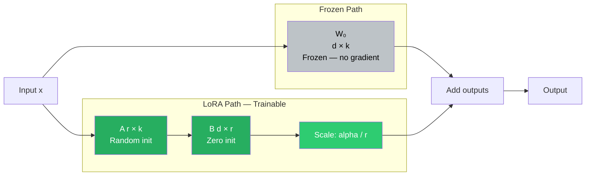

# Lesson 3.4 — LoRA: Low-Rank Adaptation, the Math Behind It, and How to Configure It

> *This is the most important lesson in Part 3. LoRA is the dominant PEFT method in production today. Every configuration choice has a reason — understand the reason, not just the value.*

---

## The Starting Insight

Adapter Tuning and Prefix Tuning freeze the base model and work around it. LoRA (Hu et al., 2021) takes a different approach: it freezes the base model but directly modifies the weight matrices themselves — just in a parameter-efficient way.

The insight comes from a 2020 paper by Aghajanyan et al. that studied the "intrinsic dimensionality" of fine-tuning. The finding: when you fine-tune a large pre-trained model, the updates to its weight matrices are **approximately low-rank**. Even though a weight matrix W is d×k (millions of values), the meaningful change ΔW during fine-tuning can be well approximated by a matrix of rank r, where r is much smaller than d or k.

This makes intuitive sense. Pre-training has already found a rich, high-dimensional representation of language. Fine-tuning on a specific task only needs to steer that representation in a relatively small number of directions — the task-specific information lives in a low-dimensional subspace.

LoRA's design follows directly from this: instead of updating W directly (expensive), decompose the update ΔW into the product of two small matrices.

---

## The Math

A weight matrix in a transformer (say, the query projection in attention) has shape W₀ ∈ ℝ^(d×k). In full fine-tuning, you update it to W' = W₀ + ΔW, where ΔW has the same shape d×k — millions of parameters to train.

LoRA constrains ΔW to be a low-rank matrix: **ΔW = B × A**

Where:
- **A ∈ ℝ^(r×k)** — a small matrix that "compresses" the input from k dimensions to r dimensions
- **B ∈ ℝ^(d×r)** — a small matrix that "expands" from r dimensions back to d dimensions
- **r** is the rank — typically 4, 8, 16, or 32. Much smaller than d or k (which might be 4096)

The forward pass through a LoRA-adapted layer:

```
output = W₀ x + (alpha/r) × B A x
```

Where:
- `W₀ x` is the frozen original layer's output (not updated, no gradient)
- `B A x` is the LoRA adaptation: first compress x with A, then expand with B
- `alpha/r` is a scaling factor (explained below)


*LoRA runs two paths in parallel. The frozen path handles the original model computation. The LoRA path adds a low-rank correction. Only A and B have gradients.*

---

## Parameter Savings: The Concrete Math

For a single weight matrix W₀ of shape d×k:
- Full fine-tuning trainable params: `d × k`
- LoRA trainable params: `r×k + d×r = r(d + k)`

For LLaMA-2 7B, the attention Q and V projection matrices have d = k = 4096:
- Full FT per matrix: `4096 × 4096 = 16,777,216`
- LoRA at r=8 per matrix: `8 × (4096 + 4096) = 65,536`
- **Reduction: 256× fewer parameters per matrix**

In a full LoRA configuration targeting q, k, v, and o projections across 32 layers at r=16:
- LoRA trainable params: `4 matrices × 32 layers × 16 × (4096 + 4096) ≈ 16.8M`
- vs 7B total: **0.24% of model parameters**
- Gradient + optimizer state memory for LoRA params only: `16.8M × 12 bytes ≈ 200 MB`
- vs full fine-tuning gradient + optimizer states: `~84 GB`

---

## Initialization: The Math Behind Why B is Zero and A is Random

This is not arbitrary. The initialization strategy is a critical design choice that directly affects training stability and convergence. 

LoRA creates a side-path by multiplying two smaller matrices, $A$ and $B$, to calculate the update:
$$\Delta W = B \times A$$

To make training work successfully, the initialization at **Step 0** must satisfy two strict conditions:
1. **The Net Output must be Zero**: The adapter must not distort or corrupt the pre-trained model's rich representations at the start of training.
2. **Break Symmetry**: The gradients must be able to calculate different, unique updates for different neurons so the model can actually learn complex task-specific features.

---

### The 4 Design Choices: Why Only One Works

| Option | Initial State of $A$ and $B$ | $\Delta W$ at Step 0 | Success / Failure | Primary Issue |
|---|---|---|---|---|
| **Option 1** | $A = 0, \quad B = 0$ | $0 \times 0 = 0$ | ❌ **Fail** | **Symmetry Problem:** All neurons learn identical features. |
| **Option 2** | $A = \text{Random}, \quad B = \text{Random}$ | $\text{Random} \times \text{Random} \neq 0$ | ❌ **Fail** | **Explosion/Instability:** Injects massive random noise at Step 0. |
| **Option 3** | $A = 0, \quad B = \text{Random}$ | $\text{Random} \times 0 = 0$ | ❌ **Fail** | **Dead Gradient:** Updates for $B$ are mathematically frozen at start. |
| **Option 4** | $A = \text{Random}, \quad B = 0$ | $0 \times \text{Random} = 0$ | **✅ Success** | **Golden Standard:** Safe start, breaks symmetry, live gradients. |

#### ❌ Option 1: Initialize Both as Zero ($A = 0, B = 0$)
- **Result:** $\Delta W = 0 \times 0 = 0$. (Passes Condition 1).
- **Why it fails (The Symmetry Problem):** Because every single neuron starts with the exact same weight value (zero), they will all receive the exact same mathematical gradient during backpropagation. The network gets stuck in a loop where every neuron learns the exact same feature, completely eliminating the model's capacity to learn complex, diverse patterns.

#### ❌ Option 2: Initialize Both as Random ($A = \text{Random}, B = \text{Random}$)
- **Result:** $\Delta W = \text{Random} \times \text{Random} = \text{Random Noise}$.
- **Why it fails (The Explosion/Instability Problem):** At Step 0, the adapter injects massive, unstructured random noise into the pre-trained model. This immediately corrupts the model's existing pre-trained knowledge base and severely destabilizes early training, leading to high initial loss and poor convergence.

#### ❌ Option 3: Swap It ($A = 0, B = \text{Random}$)
- **Result:** $\Delta W = \text{Random} \times 0 = 0$. (Passes Condition 1).
- **Why it fails (The Dead Gradient Problem):** Even though it yields a starting $\Delta W = 0$, this choice cripples early learning because of the calculus chain rule. Let's look at the gradient equation:
  $$\frac{\partial L}{\partial B} = \frac{\partial L}{\partial (\Delta W)} A^T$$
  Since $A = 0$, the gradient for $B$ becomes mathematically locked at zero ($\frac{\partial L}{\partial B} = 0$) at Step 0. Matrix $B$ cannot update at all at the start, severely bottlenecking and crippling early training.

#### ✅ Option 4: The Golden Standard ($A = \text{Random}, B = 0$)
- **Result:** $\Delta W = 0 \times \text{Random} = 0$.
- **Why it works perfectly:**
  - **Safe Start:** Since $B$ is initialized to $0$, the total starting output of the adapter path is exactly $0$. The model behaves identically to the original pre-trained AI at Step 0, preserving existing capabilities.
  - **Symmetry Broken:** Since $A$ is filled with unique random values, every neuron gets a unique starting signature, breaking symmetry immediately and allowing diverse features to be learned.
  - **Live Gradients:** Because $A \neq 0$, the gradient for $B$ ($\frac{\partial L}{\partial B} = \frac{\partial L}{\partial (\Delta W)} A^T$) is non-zero and active right from Step 0. Once $B$ updates and becomes non-zero, the gradient for $A$ ($\frac{\partial L}{\partial A} = B^T \frac{\partial L}{\partial (\Delta W)}$) also becomes active, letting both matrices learn fluidly.

---

### Interview Cheat Sheet: LoRA Initialization

* **Q: Why not initialize both matrices as zero?**
  * **A:** It causes the symmetry problem. Every neuron would receive the exact same gradient during backpropagation, leading to identical updates and destroying the network's capacity to learn distinct features.
* **Q: Why not initialize both matrices randomly?**
  * **A:** It injects massive random noise into a highly optimized, pre-trained model at Step 0, corrupting its existing knowledge and destabilizing early training.
* **Q: Why $A = \text{Random}, B = 0$ instead of $A = 0, B = \text{Random}$?**
  * **A:** Both ensure that the initial update $\Delta W = 0$. However, if $A = 0$, the gradient for $B$ is mathematically locked at zero ($\frac{\partial L}{\partial B} = \frac{\partial L}{\partial (\Delta W)} A^T = 0$), freezing $B$'s updates. Having $A = \text{Random}$ and $B = 0$ keeps the starting impact at zero while keeping the gradients for $B$ alive and breaking symmetry for all neurons.

---

## The Alpha Scaling Parameter

The forward pass is: `output = W₀ x + (alpha/r) × BA x`

The `alpha/r` scaling factor controls the magnitude of the LoRA update relative to the original weights.

- If `alpha = r`: scaling = 1 (the raw LoRA output is used as-is)
- If `alpha = 2r`: scaling = 2 (the LoRA update is amplified by 2×)
- If `alpha = r/2`: scaling = 0.5 (the LoRA update is dampened)

**Why have alpha at all?** When you change the rank `r`, the scale of the matrix product `BA` changes. A higher rank means each individual entry in BA is influenced by more terms — the values drift. Alpha lets you decouple the capacity of the LoRA (controlled by r) from how strongly it pushes the output (controlled by alpha).

**Common practice:**
- `alpha = r`: neutral scaling, equivalent to not scaling at all
- `alpha = 2r`: a commonly used heuristic that works well in practice
- Many practitioners simply fix `alpha = 16` or `alpha = 32` regardless of r and tune only r. This works because the optimizer (Adam) adapts to the effective learning rate from the scaling anyway.

> **Interview note:** A strong candidate can explain: "Alpha and rank are related but control different things. Rank controls the expressivity of the adaptation — how many independent directions the LoRA update can represent. Alpha controls the magnitude of the update. You can think of alpha/r as an effective learning rate multiplier for the LoRA path. Common practice is to set alpha = 2r, but many teams fix alpha and only tune r."

---

## Which Modules to Target

LoRA can be applied to any linear layer in the transformer. The question is: which ones should you target?

**Attention matrices (most common):**
- `q_proj` — query projection
- `k_proj` — key projection
- `v_proj` — value projection
- `o_proj` — output projection of attention

**FFN matrices (for broader adaptation):**
- `gate_proj` — gating in SwiGLU FFN
- `up_proj` — up projection
- `down_proj` — down projection

**The original LoRA paper** applied only to q and v projections in attention and showed strong results. Later research showed that targeting more modules — including k, o, and FFN — consistently helps, at the cost of more trainable parameters.

**Practical guidance:**

| Target configuration | Trainable params (7B, r=16) | Best for |
|---|---|---|
| `q_proj, v_proj` only | ~8.4M | Narrow single-task adaptation |
| `q, k, v, o_proj` | ~16.8M | Most instruction tuning tasks |
| All attention + FFN | ~40-50M | Broad behavioral changes, general instruction following |

> **Interview note:** "Which modules do you target with LoRA?" Weak answer: "q and v." Strong answer: "The original paper uses q and v, which is sufficient for narrow tasks. For instruction tuning or broad behavioral changes, targeting all four attention projections (q, k, v, o) and sometimes the FFN matrices gives consistently better results. The trade-off is more trainable parameters — but even with all attention + FFN targeted at r=16, you're under 50M params on a 7B model, which is still only ~0.7% of the total."

---

## Choosing the Rank: What r Controls

Rank `r` is the most impactful hyperparameter in LoRA. It controls the "capacity" of the adaptation — how many independent directions the LoRA update can represent.

Think of it this way: a rank-1 matrix has only one independent direction of variation. A rank-8 matrix can represent 8 independent directions. The more complex and diverse the adaptation you need, the higher the rank you need.

| Rank | Use case | Character |
|---|---|---|
| r=2 or r=4 | Single-task, very narrow (e.g., JSON output format only) | Minimal capacity, fast, very few params |
| r=8 | Standard narrow fine-tuning, domain-specific style | Good default for simple tasks |
| r=16 | General instruction tuning, domain + behavior change | Most common production choice |
| r=32 | Broad behavioral change, complex instruction following | Higher quality, more params |
| r=64 or r=128 | Approaching full fine-tuning quality; diminishing returns | Rarely needed |

**How to pick:** Start with r=16. Check validation loss. If it is still clearly improving with higher rank in ablation tests, increase. If r=8 matches r=16 on your specific task, save the memory.

---

## Merging LoRA Weights After Training

After training, you have:
- The frozen base model W₀
- The trained LoRA matrices A and B

For deployment, you can merge them: `W' = W₀ + (alpha/r) × BA`

You replace W₀ with W' and discard A and B. The result is a model that:
- Behaves identically to the LoRA-adapted model
- Has **zero inference overhead** — no separate LoRA computation path
- Is the same size as the original model

This is the key advantage over Adapter Tuning. Because LoRA uses only matrix multiplication (no nonlinearity), the weight merge is mathematically exact.

If you need to serve multiple tasks from the same base model without merging, you can also keep the LoRA weights separate and load them dynamically — this is what libraries like `peft` support with the `load_adapter` pattern.

---

## Code: Configuring LoRA with the PEFT Library

```python
from peft import LoraConfig, get_peft_model, TaskType
from transformers import AutoModelForCausalLM

# Load base model
model = AutoModelForCausalLM.from_pretrained(
    "meta-llama/Llama-2-7b-hf",
    torch_dtype=torch.bfloat16,
    device_map="auto"
)

config = LoraConfig(
    r=16,                          # Rank: capacity of the adaptation
    lora_alpha=32,                 # Scaling: alpha/r = 2, standard heuristic
    target_modules=[               # Which weight matrices to adapt
        "q_proj", "k_proj",
        "v_proj", "o_proj"
    ],
    lora_dropout=0.05,             # Dropout on LoRA path for regularization
    bias="none",                   # Don't train bias terms (rarely needed)
    task_type=TaskType.CAUSAL_LM   # Causal LM for GPT-style models
)

# Wrap the model — only LoRA params will have requires_grad=True
model = get_peft_model(model, config)

# Verify parameter counts
model.print_trainable_parameters()
# trainable params: 16,777,216 || all params: 6,758,404,096 || trainable%: 0.2483
```

To merge after training:
```python
# Merge LoRA weights into base model (zero inference overhead)
merged_model = model.merge_and_unload()

# Save the merged model — same format as a regular HuggingFace model
merged_model.save_pretrained("./llama2-7b-finetuned")
```

---

## Summary

- LoRA's core insight: fine-tuning updates ΔW are low-rank. Instead of updating the full d×k weight matrix, decompose ΔW = BA where B is d×r and A is r×k, with r ≪ d, k.
- The forward pass adds both paths: `output = W₀x + (alpha/r) × BAx`. W₀ is frozen. Only A and B are trained.
- B is initialized to zero so that BA=0 at step 0 — the model starts from exact pre-trained behavior.
- `alpha` controls the magnitude of the LoRA update independent of rank. Common heuristic: `alpha = 2r`. Many practitioners fix `alpha=16` or `alpha=32` and tune only r.
- Rank `r` controls adaptation capacity. r=16 is the standard starting point for instruction tuning. Higher rank for broader behavioral changes, lower for narrow tasks.
- Target at minimum `q_proj` and `v_proj`. For production instruction tuning, target all attention projections. For maximum quality, include FFN matrices.
- After training, merge weights via `W' = W₀ + (alpha/r)BA`. This is mathematically exact (no nonlinearity) and eliminates all inference overhead — LoRA's decisive advantage over Adapter Tuning.
- Typical LoRA at r=16 on 7B: 16.8M trainable params (0.24%), reducing training memory from ~112 GB to ~18 GB, with performance within 1–3% of full fine-tuning.

---
