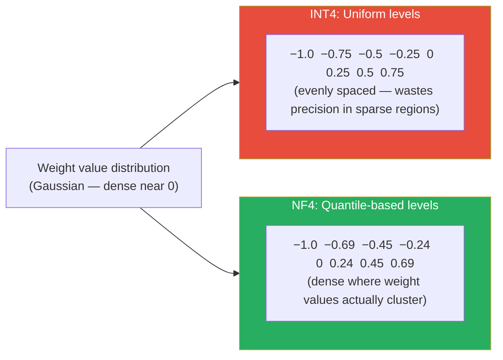
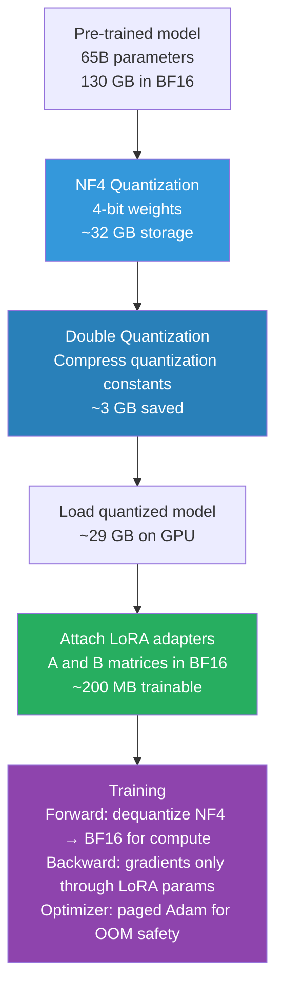

# Lesson 3.5 — QLoRA: 4-Bit Quantization + LoRA, and How It Fits 65B Training on One GPU

> *This lesson builds directly on Lesson 3.4. Understand LoRA first — QLoRA is LoRA with the base model compressed. The compression technique is what this lesson is about.*
>
> *If you want a deep understanding of **how quantization works** — the full mechanics of INT8, GPTQ, AWQ, and NF4, and why naive quantization fails — read **Lesson 3.5A: Quantization Deep Dive** alongside this lesson. This lesson covers the QLoRA system; 3.5A covers the quantization foundation it stands on.*

---

## The Problem LoRA Alone Does Not Solve

LoRA reduces the memory used for *training* (gradients + optimizer states) from ~112 GB to ~18 GB for a 7B model. This is a huge win. But notice: 14 GB of that 18 GB is still the frozen base model sitting in GPU memory in BF16.

For a 7B model, 18 GB fits on a 24 GB RTX 3090 — just barely. For a 13B model, the frozen base model alone is 26 GB in BF16. For a 65B model, it is 130 GB. LoRA on a 65B model still requires at least two A100 80GB GPUs just to hold the base weights.

What if you could compress the base model itself before loading it — storing it in 4 bits instead of 16? The base model memory would drop by 4×. A 65B model in 4-bit takes ~32 GB. Add LoRA training overhead and you are at ~48 GB — fitting on a single A100 80GB GPU.

This is exactly what QLoRA (Dettmers et al., 2023) does. The question is: how do you quantize a model to 4 bits without destroying its quality?

---

## The Quantization Problem

Quantization means representing weights with fewer bits. Instead of 16-bit floats (BF16), use 4-bit integers. Memory per parameter drops from 2 bytes to 0.5 bytes — a 4× reduction.

The challenge: standard 4-bit quantization introduces errors. A weight matrix has values distributed across some range — typically a roughly bell-shaped distribution centered near zero. If you naively map that range to 16 evenly-spaced 4-bit levels (INT4), you waste levels at the extremes (where few values live) and have poor precision at the center (where most values are).

The error from this imprecision degrades model quality. For a frozen base model being used as the foundation for LoRA, even small quantization errors accumulate across all layers and degrade the LoRA adaptation. Naive 4-bit quantization does not work well enough.

QLoRA solves this with **NF4 — NormalFloat4**.

---

## NF4: Information-Theoretically Optimal 4-Bit Quantization

The core insight of NF4: weight values in neural networks are **not uniformly distributed** — they follow a roughly **normal (Gaussian) distribution** centered at zero. Standard INT4 places quantization levels at uniform intervals, wasting precision. NF4 places levels at the **quantiles of the normal distribution**.


*NF4 concentrates quantization levels where weight values actually live — near zero. INT4 distributes them uniformly, wasting precision.*

What does "quantile-based" mean concretely? If you have 16 quantization levels (4-bit = 2⁴ = 16 values), you place each level at the point where the normal distribution CDF = k/16. This means each quantization bin contains the same number of expected weight values — none of the 16 levels are wasted.

The result: **NF4 achieves lower quantization error than INT4 for normally distributed weights**, which is the case for pre-trained transformers. Dettmers et al. showed empirically that a QLoRA-fine-tuned model matches LoRA fine-tuning performance (in BF16) within 1% on most benchmarks — the NF4 quantization error is small enough that the LoRA adaptation can compensate.

### Why NF4's Levels Can Be Computed Once — Not Re-Estimated Per Tensor

There's a subtlety worth understanding, because it's *why* NF4 is cheap to use at scale, not just accurate.

In general, "quantile quantization" (placing bin boundaries so each bin holds an equal share of a tensor's actual values) requires knowing the tensor's real empirical quantiles. Computing those exactly means sorting or rank-estimating millions of values — expensive, and you'd have to redo it **per tensor**, since every weight matrix's raw values differ. In practice, this is avoided with fast *approximate* quantile-estimation algorithms (e.g., SRAM quantiles). But approximation introduces error, and that error is **worst exactly at the tails** — the largest-magnitude values, which are often the most important ones for model behavior. So naive quantile quantization has a built-in weak spot precisely where you can least afford one.

NF4 sidesteps this with a distributional assumption: pretrained weights are **zero-centered Gaussian, differing between tensors only by a scale factor σ**. If the *shape* of the distribution is fixed and only the *scale* varies, you don't need to estimate quantiles per tensor at all:

1. Compute the quantiles of a **standard** N(0,1) distribution exactly, once, analytically (via the inverse CDF) — no sorting, no sampling, no approximation error, because you're working with a known theoretical distribution, not noisy empirical data.
2. For any real weight block, normalize it by its own scale (this per-block scale is exactly the **quantization constant** introduced below) so it lines up with that same standard shape.
3. Reuse the same fixed 16 quantile boundaries for every block in every layer, forever.

| | Arbitrary / unknown distribution | Fixed-shape distribution (up to a scale) |
|---|---|---|
| Quantile source | Estimated per tensor from data | Computed once from theory (inverse CDF) |
| Cost | Expensive, repeated per tensor | Cheap, computed a single time |
| Accuracy at outliers | Degraded by approximation error | Exact — no approximation involved |
| What must be stored per tensor | Nothing extra beyond estimation cost | One scalar (the quantization constant) |

This is also *why* the per-block quantization constant exists — it isn't only there to rescale values back to their original range after dequantization. It's the single number that lets one fixed, precomputed table of quantile boundaries correctly serve every block in the model, no matter how different their raw magnitudes are.

---

## Double Quantization: Compressing the Quantization Constants

4-bit quantization does not work on the entire weight matrix at once. It works on small blocks of weights (typically 64 values at a time). For each block, you store a **quantization constant** — a scaling factor that maps the 4-bit levels back to the original floating-point range.

These constants are stored in FP32: 4 bytes each. For a model with N total parameters, quantized in blocks of 64:
- Number of blocks: `N / 64`
- Memory for constants: `(N / 64) × 4 bytes = N/16 bytes`

For a 7B model: `7B / 16 ≈ 438 MB` just for quantization constants. Not catastrophic, but meaningful.

**Double quantization** quantizes these constants themselves — from FP32 (4 bytes each) down to 8-bit (1 byte each), using a second quantization step with block size 256.

Memory savings from double quantization:
- Before: `4 bytes` per constant
- After: `1 byte` per constant (8-bit)
- Plus a second-level constant per 256 constants: `4 bytes / 256 = 0.016 bytes`
- Net: approximately **0.37 bits per parameter** saved

For a 65B model: `0.37 × 65B / 8 ≈ 3 GB` additional savings from double quantization alone.

---

## Paged Optimizers: Preventing OOM During the Optimizer Step

Even with a compressed 4-bit base model and small LoRA parameters, one more problem arises: the optimizer step.

Adam maintains two state tensors per trainable parameter (m and v moments). For LoRA parameters alone — say 20M params at FP32 — that is `20M × 8 bytes = 160 MB`. Small. But during the optimizer step, GPU memory usage spikes temporarily beyond the steady-state. On a GPU that is already near its limit, this spike causes out-of-memory crashes.

**Paged optimizers** use NVIDIA's Unified Memory feature. When the GPU runs out of memory during the optimizer step, it automatically pages optimizer states to CPU RAM and pages them back when needed. This is transparent — you do not explicitly manage the paging.

The cost: if the GPU has to page, those optimizer steps are slower (CPU RAM bandwidth vs GPU HBM bandwidth). In practice, with a correctly sized setup, paging happens rarely and the throughput impact is small. But paged optimizers are what make QLoRA training runs that push GPU memory limits stay stable.

---

## The Full QLoRA Stack

QLoRA is three techniques combined:


*The QLoRA stack. The base model is compressed to 4-bit NF4 (frozen). LoRA adapters in BF16 are the only trainable components. Computation happens in BF16 (dequantized at runtime).*

**Important**: the 4-bit weights are stored in NF4 but **computation always happens in BF16**. Before each matrix multiplication, the block of 4-bit weights is dequantized to BF16 on-the-fly. This means you get the storage efficiency of 4-bit but the numerical stability of 16-bit arithmetic during the actual computation. The dequantization happens at the CUDA kernel level and is fast.

---

## Why Quantized Weights Can't Be Trained Directly: The Gradient Problem

This is the piece that explains *why* QLoRA needs LoRA at all — why you can't just quantize a model to 4-bit and fine-tune the quantized weights themselves directly, skipping adapters entirely.

### What's actually stored is not a float

An NF4 weight isn't a scaled-down float sitting in memory. It's a **4-bit integer code** — an index into the fixed 16-entry NF4 lookup table described above. A block of weights in GPU memory looks like a list of small integers (0–15) plus one shared scale constant. The real floating-point value only exists transiently, the moment it's looked up and multiplied by the block's scale for a computation — then it's discarded.

### The rounding step is a step function — and step functions have no usable gradient

Turning a continuous weight value into one of those 16 discrete codes is a **round-to-nearest-bin** operation. As a function, this is a **step function**: nudging the input slightly almost never changes the output at all, and on the rare occasions it does, the output *jumps* discontinuously rather than changing smoothly. The derivative of a step function is **zero almost everywhere**, and **undefined** exactly at the jump points.

This matters because backpropagation needs `∂Loss/∂W` to know which direction to nudge each weight. If `W` is quantized, that gradient is either exactly zero (no signal at all) or undefined — there is no meaningful way to tell the optimizer "increase this weight a little" when "a little" almost never changes which bin it lands in. This is precisely why naive full-precision-to-low-bit quantization "breaks down during training" (the QLoRA paper's own phrase for it) even though it works fine for inference, where no gradients are needed at all.

This is a known problem in the broader quantization-aware training (QAT) literature. The common workaround elsewhere is the **Straight-Through Estimator (STE)**: pretend, only for the backward pass, that the rounding operation has a gradient of 1 (identity) — i.e., let the gradient "pass straight through" as if quantization hadn't happened. It's a useful approximation, but it is not the true derivative, and it tends to degrade badly at very low bit-widths like 4-bit, which is exactly the regime QLoRA operates in.

### QLoRA's fix: don't compute a gradient *of* W at all

QLoRA doesn't attempt to solve the STE problem. It sidesteps the whole issue architecturally:

- **Gradient *of* W** (`∂Loss/∂W`, needed to update W) — QLoRA **never computes this**. The base model's weights are frozen for the entire training run; there is no optimizer state and no update step for them at all.
- **Gradient *through* W** (needed so that the chain rule can keep propagating `∂Loss/∂(activations)` back to earlier layers, so the LoRA adapters attached upstream still get correct gradients) — this is fine, because for a *fixed* set of codes, dequantization is just `lookup_value × scale`, which behaves as a constant linear map with respect to the layer's **input activations**. Differentiating with respect to the activations flowing through a fixed matrix is completely standard; the only thing that was ever non-differentiable is the rounding operation used to *produce* the codes in the first place — and QLoRA never needs to differentiate that, because it never updates the codes.

All trainable capacity instead lives in the separate, full-precision (BF16) low-rank path — the LoRA `A` and `B` matrices — which were never quantized and have no differentiability problem to begin with.

| | Gradient of W (update W) | Gradient through W (propagate to earlier layers) |
|---|---|---|
| Needed for | Updating the quantized weights themselves | Backprop reaching upstream LoRA adapters |
| Blocked by rounding's zero/undefined derivative? | Yes — this is the actual problem | No — dequantization is a fixed linear op per step |
| Does QLoRA compute this? | **Never** — W is frozen, no optimizer state exists for it | Yes — required for LoRA to train at all |

> **Interview note:** "Why can't you just fine-tune the quantized base model directly, without LoRA?" Strong answer: "Quantization is a round-to-nearest operation — a step function — so its gradient is zero almost everywhere and undefined at the jumps. That means `∂Loss/∂W` is unusable if W is quantized; this is the classic problem in quantization-aware training, usually patched with a Straight-Through Estimator, which is an approximation that degrades at very low bit-widths like 4-bit. QLoRA avoids the problem entirely rather than solving it: it freezes the quantized base weights completely — no gradient of W is ever computed — and puts all trainable capacity in separate full-precision LoRA adapters. Gradients still flow *through* the frozen dequantized weights via the chain rule to reach those adapters, since for a fixed set of codes, dequantization is just a constant lookup-and-scale, which is differentiable with respect to the activations passing through it."

---

## Manual Walkthrough: Forward and Backward Pass By Hand

Everything above is easier to trust once you've traced the arithmetic yourself. Real NF4 uses 16 levels per block of 64 weights — too many to trace by hand — so here we use a **simplified 3-bit, 8-level palette** on a tiny 2×3 block. The mechanism is identical; only the level count changes.

**Simplified palette** (denser near zero, like real NF4):
```
code:  0     1     2     3     4    5    6    7
value: -1.0 -0.65 -0.38 -0.13 0.13 0.38 0.65 1.0
```

**Setup.** Frozen base weight `W` (2×3), LoRA adapters with rank r=1 (`A` is 1×3, `B` is 2×1, scaling α/r = 1), and an input `x`:
```
W = [ 0.9  -1.3   0.2 ]        A = [0.1, -0.2, 0.05]
    [ 1.5   0.1  -0.7 ]        B = [0.3, -0.1]^T

x = [1.0, 0.5, -1.0]
```

### Step 1 — Quantize W once (this is what's actually stored)

**Scale constant:** `c = absmax(W) = 1.5`

**Normalize:** `W_norm = W / c`
```
[ 0.600  -0.867   0.133 ]
[ 1.000   0.067  -0.467 ]
```

**Map each value to its nearest palette entry, store only the code:**

| W_norm | nearest palette value | code stored |
|---|---|---|
| 0.600 | 0.65 | **6** |
| -0.867 | -1.0 | **0** |
| 0.133 | 0.13 | **4** |
| 1.000 | 1.0 | **7** |
| 0.067 | 0.13 | **4** |
| -0.467 | -0.38 | **2** |

**What actually lives in GPU memory, permanently:**
```
codes = [[6, 0, 4],
         [7, 4, 2]]     ← 3 bits each (4 bits for real NF4)
c     = 1.5              ← one scalar per block
```
No float weight value is stored anywhere — just small integers and one shared scale.

### Step 2 — Forward pass: dequantize on the fly

Right before the matmul, look up each code, multiply by `c`:
```
W_dequant = [ 0.65×1.5  -1.0×1.5   0.13×1.5 ]   =  [ 0.975  -1.5    0.195 ]
            [ 1.0×1.5    0.13×1.5 -0.38×1.5 ]      [ 1.5     0.195 -0.57  ]
```
This is close to the original `W` but not identical — that gap is the quantization error.

**Base path:** `h_base = W_dequant @ x`
```
row0: 0.975(1.0) + (-1.5)(0.5) + 0.195(-1.0) = 0.975 - 0.75 - 0.195 = 0.030
row1: 1.5(1.0)   + 0.195(0.5)  + (-0.57)(-1.0) = 1.5 + 0.0975 + 0.57 = 2.1675
h_base = [0.030, 2.1675]
```

**LoRA path:** `h_lora = B @ (A @ x)`
```
z = A@x = 0.1(1.0) + (-0.2)(0.5) + 0.05(-1.0) = 0.1 - 0.1 - 0.05 = -0.05
h_lora = B·z = [0.3×(-0.05), -0.1×(-0.05)] = [-0.015, 0.005]
```

**Total output:** `h = h_base + h_lora = [0.015, 2.1725]`

`W_dequant` is discarded immediately after this — it is never written back to memory in float form.

### Step 3 — Backward pass: gradients only for A and B

Say the incoming loss gradient is `dL/dh = [1.0, -0.5]` (arbitrary, for illustration).

**Gradient w.r.t. B** (since `h_lora = B·z`, z is a scalar):
```
dL/dB = dL/dh × z = [1.0×(-0.05), -0.5×(-0.05)] = [-0.05, 0.025]
```

**Gradient w.r.t. z, then chained to A:**
```
dL/dz = B^T @ dL/dh = 0.3(1.0) + (-0.1)(-0.5) = 0.35
dL/dA = dL/dz × x = 0.35 × [1.0, 0.5, -1.0] = [0.35, 0.175, -0.35]
```

**`dL/dW` is never computed.** `W` had to be dequantized *forward* (to produce `h_base`, and — in a deeper network — to keep propagating `dL/dx` to earlier layers), but since `W` is frozen there is no optimizer state and no update step for it. Only `A` and `B` are updated, e.g. via paged AdamW:
```
A ← A - lr × dL/dA
B ← B - lr × dL/dB
```
`W`'s codes and `c` never change for the entire training run.

### What lives where

| Object | Precision | Where stored | Lifetime |
|---|---|---|---|
| `W` codes | 3-bit int (4-bit for real NF4) | GPU memory | Entire training run |
| `c` (scale) | fp32/fp16 | GPU memory | Entire training run |
| `W_dequant` | BF16 | GPU memory | Microseconds, per matmul |
| `A`, `B` | BF16 (+ fp32 master in optimizer) | GPU memory | Entire run, updated every step |
| `dL/dW` | — | **never exists** | n/a |

This is exactly why the memory savings hold up in practice: for a 7B model, `W` in BF16 is ~14 GB, but as NF4 codes it's ~3.5 GB, and the transient BF16 tiles only ever exist block-by-block during a matmul — never for the whole model at once.

---

## Key Empirical Findings From the Paper (Worth Knowing)

Beyond the three memory-saving techniques, the QLoRA paper reports two results about *how* to configure LoRA that are easy to miss but change what "correct" QLoRA usage looks like:

- **LoRA must be applied to all linear layers, not just attention, to match 16-bit performance.** The paper states this directly: *"Using LoRA on all transformer layers is critical to match 16-bit performance."* Attaching adapters only to the attention projections (`q_proj`, `k_proj`, `v_proj`, `o_proj`) — a very common simplified example in tutorials — leaves a real performance gap versus full fine-tuning. Adapters also need to be attached to the MLP/feed-forward linear layers (e.g. `gate_proj`, `up_proj`, `down_proj` in LLaMA-style models) to close that gap.
- **LoRA rank barely matters once adapters are on all layers.** The paper found very little statistical difference in performance between rank 8 and rank 256, once the "all linear layers" condition above is satisfied — rank is not the lever that determines whether QLoRA matches full fine-tuning; *which* layers get adapters is. In their main experiments the authors default to `r=64, α=16` across all model sizes rather than tuning rank per model.

> **Interview note:** "What LoRA configuration mistakes hurt QLoRA the most?" Strong answer: "Not the rank — the paper shows rank has little effect once you've done the important thing, which is attaching LoRA adapters to *every* linear layer, including the MLP layers, not just the attention projections. Restricting adapters to attention alone is the change most likely to leave a real performance gap versus full 16-bit fine-tuning."

---

## Memory Comparison: Where QLoRA Sits

| Setup | Base model memory | LoRA overhead | Total approx. | Hardware needed |
|---|---|---|---|---|
| Full fine-tuning (7B) | 28 GB (FP32) | 84 GB gradients+states | ~112 GB | 2× A100 80GB |
| LoRA on BF16 (7B) | 14 GB (BF16) | ~4 GB | ~18 GB | 1× RTX 3090 24GB |
| QLoRA NF4 (7B) | 3.5 GB (NF4) | ~4 GB | ~10 GB | 1× RTX 3080 12GB |
| QLoRA NF4 (13B) | 6.5 GB (NF4) | ~5 GB | ~14 GB | 1× RTX 3090 24GB |
| QLoRA NF4 (65B) | 32 GB (NF4) | ~16 GB | ~48 GB | 1× A100 80GB |
| QLoRA NF4 (70B) | 35 GB (NF4) | ~18 GB | ~55 GB | 1× A100 80GB |

QLoRA is what democratized fine-tuning of large models. Before QLoRA (mid-2023), fine-tuning a 65B model required a multi-GPU cluster costing hundreds of dollars per hour. With QLoRA, it fits on a single rented A100 at ~$3/hour.

> **Interview note:** "What is QLoRA and why does it matter?" The strong answer: "QLoRA combines three techniques. First, the base model is quantized to 4-bit using NF4 (NormalFloat4), which places quantization levels at the quantiles of the normal distribution — matching the actual distribution of transformer weights and minimizing precision loss. Second, double quantization compresses the quantization constants themselves, saving ~0.37 bits per parameter. Third, paged optimizers prevent GPU OOM during the optimizer step by using NVIDIA unified memory to page Adam states to CPU when needed. Together, these let you fine-tune a 65B model on a single A100 80GB GPU that previously required a multi-GPU cluster."

---

## The Trade-offs: When to Use QLoRA vs LoRA

QLoRA trades a small amount of quality and speed for a large reduction in memory requirements.

| | LoRA (BF16 base) | QLoRA (NF4 base) |
|---|---|---|
| **Base model precision** | BF16 | NF4 (4-bit) |
| **Training speed** | Faster (no dequantization) | ~20-30% slower (dequantization overhead) |
| **Memory** | ~18 GB for 7B | ~10 GB for 7B |
| **Quality ceiling** | Higher (no quantization error) | Slightly lower (~1% gap on most benchmarks) |
| **Hardware needed (7B)** | 1× RTX 3090 | 1× RTX 3080 or better |
| **Hardware needed (65B)** | 4× A100 80GB | 1× A100 80GB |
| **Best for** | When you have the VRAM | When you are GPU memory-constrained |

The ~1% quality gap is real but small. For most production use cases, it is within noise. If you are doing a final production fine-tune for a high-stakes application, consider LoRA in BF16 on more hardware. For experimentation, rapid iteration, and resource-constrained environments, QLoRA is the right choice.

---

## Code: QLoRA Setup with BitsAndBytes + PEFT

```python
import torch
from transformers import AutoModelForCausalLM, BitsAndBytesConfig
from peft import LoraConfig, get_peft_model, TaskType

# Step 1: Configure 4-bit NF4 quantization
bnb_config = BitsAndBytesConfig(
    load_in_4bit=True,                      # Load model in 4-bit
    bnb_4bit_quant_type="nf4",              # Use NF4 (not standard INT4)
    bnb_4bit_compute_dtype=torch.bfloat16, # Dequantize to BF16 for computation
    bnb_4bit_use_double_quant=True,         # Enable double quantization
)

# Step 2: Load the quantized model — stored in NF4, computed in BF16
model = AutoModelForCausalLM.from_pretrained(
    "meta-llama/Llama-2-70b-hf",
    quantization_config=bnb_config,
    device_map="auto"  # Automatically map layers to available GPUs/CPU
)

# Step 3: Prepare model for k-bit training (needed for gradient checkpointing compatibility)
from peft import prepare_model_for_kbit_training
model = prepare_model_for_kbit_training(model)

# Step 4: Attach LoRA — same as standard LoRA, runs in BF16 on top of NF4 base
# NOTE: the paper found that targeting attention projections alone leaves a real
# performance gap vs 16-bit full fine-tuning — "using LoRA on all transformer
# layers is critical to match 16-bit performance." For a paper-faithful setup,
# also include the MLP projections, e.g. add "gate_proj", "up_proj", "down_proj"
# (LLaMA-style) to target_modules, or pass target_modules="all-linear".
lora_config = LoraConfig(
    r=16,
    lora_alpha=32,
    target_modules=["q_proj", "k_proj", "v_proj", "o_proj"],
    lora_dropout=0.05,
    bias="none",
    task_type=TaskType.CAUSAL_LM
)
model = get_peft_model(model, lora_config)
model.print_trainable_parameters()
# trainable params: 83,886,080 || all params: 69,706,096,640 || trainable%: 0.1203

# Step 5: Use paged AdamW to handle memory spikes during optimizer step
from transformers import TrainingArguments
training_args = TrainingArguments(
    optim="paged_adamw_32bit",  # Paged optimizer — pages to CPU RAM if GPU OOM
    bf16=True,                  # Training in BF16
    gradient_checkpointing=True # Trade compute for more memory savings
)
```

---

## Summary

- QLoRA solves the problem LoRA alone does not: the frozen base model's memory footprint. It quantizes the base model to 4-bit NF4 before loading, reducing a 65B model from 130 GB to ~32 GB.
- NF4 (NormalFloat4) places 4-bit quantization levels at the quantiles of the normal distribution, not uniformly. This matches how transformer weights are actually distributed and minimizes quantization error.
- NF4's quantile boundaries are computed **once**, analytically, from a standard Gaussian — not re-estimated per tensor — because weights are assumed to share one fixed distribution shape that differs only by a per-block scale (the quantization constant). This avoids both the cost and the outlier-heavy error of empirical quantile estimation.
- Double quantization quantizes the per-block scaling constants from FP32 to 8-bit, saving an additional ~0.37 bits per parameter (~3 GB on a 65B model).
- Computation always happens in BF16 — weights are dequantized block-by-block at runtime. Storage is 4-bit (integer codes into a lookup table); arithmetic is 16-bit.
- Quantization (rounding to the nearest code) is a step function with a gradient that is zero almost everywhere and undefined at the jumps — this is *why* quantized weights can't be trained directly with ordinary backprop, and why naive quantization "breaks down during training" even though it's fine for inference.
- QLoRA avoids this problem rather than solving it: the quantized base weights are frozen completely, so `∂Loss/∂W` is never computed. Gradients still flow *through* the frozen, dequantized weights (a fixed linear operation) to reach the separate, full-precision LoRA adapters, which are the only parameters ever updated.
- Concretely: base weights are stored only as small integer codes plus one per-block scale; the actual float value is reconstructed transiently for a matmul and thrown away; gradients are computed and applied only for the LoRA `A`/`B` matrices.
- Paged optimizers (paged AdamW) use NVIDIA unified memory to page optimizer states to CPU RAM when GPU memory spikes during the optimizer step, preventing OOM crashes on memory-constrained setups.
- The paper found that *which layers* get LoRA adapters matters far more than the rank: adapters on all linear layers (attention **and** MLP) are needed to match 16-bit performance, while performance is largely insensitive to rank once that condition holds.
- QLoRA is ~20–30% slower than LoRA and has a ~1% quality gap on most benchmarks — a trade-off that is worth it whenever GPU memory is the constraint.
- QLoRA democratized fine-tuning: a 65B model that previously required a multi-GPU cluster now fits on a single A100 80GB GPU.

---