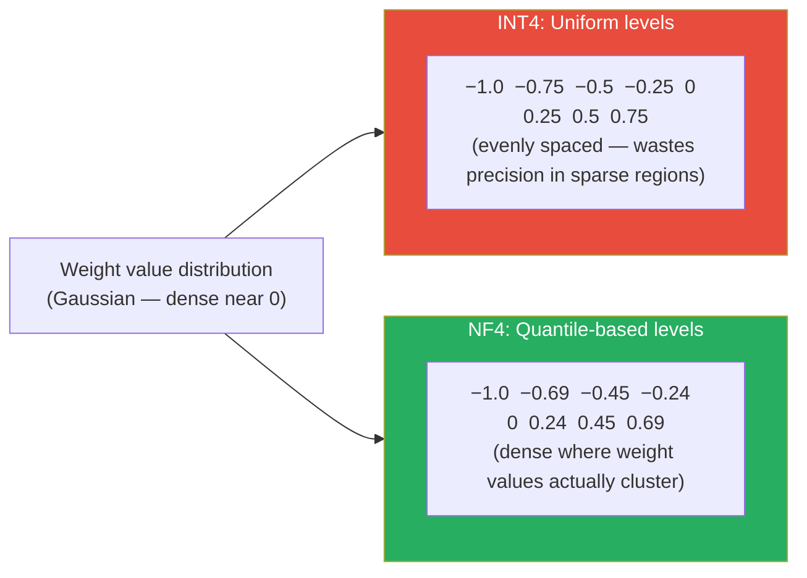
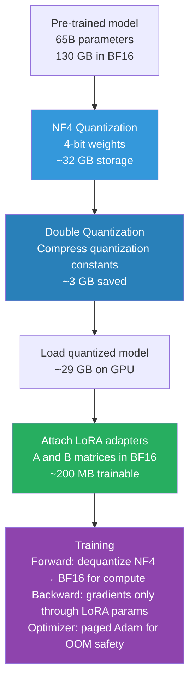

# Lesson 3.5 — QLoRA: 4-Bit Quantization + LoRA, and How It Fits 65B Training on One GPU

> *This lesson builds directly on Lesson 3.4. Understand LoRA first — QLoRA is LoRA with the base model compressed. The compression technique is what this lesson is about.*

---

## The Problem LoRA Alone Does Not Solve

LoRA reduces the memory used for *training* (gradients + optimizer states) from ~112 GB to ~18 GB for a 7B model. This is a huge win. But notice: 14 GB of that 18 GB is still the frozen base model sitting in GPU memory in BF16.

For a 7B model, 18 GB fits on a 24 GB RTX 3090 — just barely. For a 13B model, the frozen base model alone is 26 GB in BF16. For a 65B model, it is 130 GB. LoRA on a 65B model still requires at least two A100 80GB GPUs just to hold the base weights.

What if you could compress the base model itself before loading it — storing it in 4 bits instead of 16? The base model memory would drop by 4×. A 65B model in 4-bit takes ~32 GB. Add LoRA training overhead and you are at ~48 GB — fitting on a single A100 80GB GPU.

This is exactly what QLoRA (Dettmers et al., 2023) does. The question is: how do you quantize a model to 4 bits without destroying its quality?

---

## The Quantization Problem

Quantization means representing weights with fewer bits. Instead of 16-bit floats (BF16), use 4-bit integers. Memory per parameter drops from 2 bytes to 0.5 bytes — a 4× reduction.

The challenge: standard 4-bit quantization introduces errors. A weight matrix has values distributed across some range — typically a roughly bell-shaped distribution centered near zero. If you naively map that range to 16 evenly-spaced 4-bit levels (INT4), you waste levels at the extremes (where few values live) and have poor precision at the center (where most values are).

The error from this imprecision degrades model quality. For a frozen base model being used as the foundation for LoRA, even small quantization errors accumulate across all layers and degrade the LoRA adaptation. Naive 4-bit quantization does not work well enough.

QLoRA solves this with **NF4 — NormalFloat4**.

---

## NF4: Information-Theoretically Optimal 4-Bit Quantization

The core insight of NF4: weight values in neural networks are **not uniformly distributed** — they follow a roughly **normal (Gaussian) distribution** centered at zero. Standard INT4 places quantization levels at uniform intervals, wasting precision. NF4 places levels at the **quantiles of the normal distribution**.


*NF4 concentrates quantization levels where weight values actually live — near zero. INT4 distributes them uniformly, wasting precision.*

What does "quantile-based" mean concretely? If you have 16 quantization levels (4-bit = 2⁴ = 16 values), you place each level at the point where the normal distribution CDF = k/16. This means each quantization bin contains the same number of expected weight values — none of the 16 levels are wasted.

The result: **NF4 achieves lower quantization error than INT4 for normally distributed weights**, which is the case for pre-trained transformers. Dettmers et al. showed empirically that a QLoRA-fine-tuned model matches LoRA fine-tuning performance (in BF16) within 1% on most benchmarks — the NF4 quantization error is small enough that the LoRA adaptation can compensate.

---

## Double Quantization: Compressing the Quantization Constants

4-bit quantization does not work on the entire weight matrix at once. It works on small blocks of weights (typically 64 values at a time). For each block, you store a **quantization constant** — a scaling factor that maps the 4-bit levels back to the original floating-point range.

These constants are stored in FP32: 4 bytes each. For a model with N total parameters, quantized in blocks of 64:
- Number of blocks: `N / 64`
- Memory for constants: `(N / 64) × 4 bytes = N/16 bytes`

For a 7B model: `7B / 16 ≈ 438 MB` just for quantization constants. Not catastrophic, but meaningful.

**Double quantization** quantizes these constants themselves — from FP32 (4 bytes each) down to 8-bit (1 byte each), using a second quantization step with block size 256.

Memory savings from double quantization:
- Before: `4 bytes` per constant
- After: `1 byte` per constant (8-bit)
- Plus a second-level constant per 256 constants: `4 bytes / 256 = 0.016 bytes`
- Net: approximately **0.37 bits per parameter** saved

For a 65B model: `0.37 × 65B / 8 ≈ 3 GB` additional savings from double quantization alone.

---

## Paged Optimizers: Preventing OOM During the Optimizer Step

Even with a compressed 4-bit base model and small LoRA parameters, one more problem arises: the optimizer step.

Adam maintains two state tensors per trainable parameter (m and v moments). For LoRA parameters alone — say 20M params at FP32 — that is `20M × 8 bytes = 160 MB`. Small. But during the optimizer step, GPU memory usage spikes temporarily beyond the steady-state. On a GPU that is already near its limit, this spike causes out-of-memory crashes.

**Paged optimizers** use NVIDIA's Unified Memory feature. When the GPU runs out of memory during the optimizer step, it automatically pages optimizer states to CPU RAM and pages them back when needed. This is transparent — you do not explicitly manage the paging.

The cost: if the GPU has to page, those optimizer steps are slower (CPU RAM bandwidth vs GPU HBM bandwidth). In practice, with a correctly sized setup, paging happens rarely and the throughput impact is small. But paged optimizers are what make QLoRA training runs that push GPU memory limits stay stable.

---

## The Full QLoRA Stack

QLoRA is three techniques combined:


*The QLoRA stack. The base model is compressed to 4-bit NF4 (frozen). LoRA adapters in BF16 are the only trainable components. Computation happens in BF16 (dequantized at runtime).*

**Important**: the 4-bit weights are stored in NF4 but **computation always happens in BF16**. Before each matrix multiplication, the block of 4-bit weights is dequantized to BF16 on-the-fly. This means you get the storage efficiency of 4-bit but the numerical stability of 16-bit arithmetic during the actual computation. The dequantization happens at the CUDA kernel level and is fast.

---

## Memory Comparison: Where QLoRA Sits

| Setup | Base model memory | LoRA overhead | Total approx. | Hardware needed |
|---|---|---|---|---|
| Full fine-tuning (7B) | 28 GB (FP32) | 84 GB gradients+states | ~112 GB | 2× A100 80GB |
| LoRA on BF16 (7B) | 14 GB (BF16) | ~4 GB | ~18 GB | 1× RTX 3090 24GB |
| QLoRA NF4 (7B) | 3.5 GB (NF4) | ~4 GB | ~10 GB | 1× RTX 3080 12GB |
| QLoRA NF4 (13B) | 6.5 GB (NF4) | ~5 GB | ~14 GB | 1× RTX 3090 24GB |
| QLoRA NF4 (65B) | 32 GB (NF4) | ~16 GB | ~48 GB | 1× A100 80GB |
| QLoRA NF4 (70B) | 35 GB (NF4) | ~18 GB | ~55 GB | 1× A100 80GB |

QLoRA is what democratized fine-tuning of large models. Before QLoRA (mid-2023), fine-tuning a 65B model required a multi-GPU cluster costing hundreds of dollars per hour. With QLoRA, it fits on a single rented A100 at ~$3/hour.

> **Interview note:** "What is QLoRA and why does it matter?" The strong answer: "QLoRA combines three techniques. First, the base model is quantized to 4-bit using NF4 (NormalFloat4), which places quantization levels at the quantiles of the normal distribution — matching the actual distribution of transformer weights and minimizing precision loss. Second, double quantization compresses the quantization constants themselves, saving ~0.37 bits per parameter. Third, paged optimizers prevent GPU OOM during the optimizer step by using NVIDIA unified memory to page Adam states to CPU when needed. Together, these let you fine-tune a 65B model on a single A100 80GB GPU that previously required a multi-GPU cluster."

---

## The Trade-offs: When to Use QLoRA vs LoRA

QLoRA trades a small amount of quality and speed for a large reduction in memory requirements.

| | LoRA (BF16 base) | QLoRA (NF4 base) |
|---|---|---|
| **Base model precision** | BF16 | NF4 (4-bit) |
| **Training speed** | Faster (no dequantization) | ~20-30% slower (dequantization overhead) |
| **Memory** | ~18 GB for 7B | ~10 GB for 7B |
| **Quality ceiling** | Higher (no quantization error) | Slightly lower (~1% gap on most benchmarks) |
| **Hardware needed (7B)** | 1× RTX 3090 | 1× RTX 3080 or better |
| **Hardware needed (65B)** | 4× A100 80GB | 1× A100 80GB |
| **Best for** | When you have the VRAM | When you are GPU memory-constrained |

The ~1% quality gap is real but small. For most production use cases, it is within noise. If you are doing a final production fine-tune for a high-stakes application, consider LoRA in BF16 on more hardware. For experimentation, rapid iteration, and resource-constrained environments, QLoRA is the right choice.

---

## Code: QLoRA Setup with BitsAndBytes + PEFT

```python
import torch
from transformers import AutoModelForCausalLM, BitsAndBytesConfig
from peft import LoraConfig, get_peft_model, TaskType

# Step 1: Configure 4-bit NF4 quantization
bnb_config = BitsAndBytesConfig(
    load_in_4bit=True,                      # Load model in 4-bit
    bnb_4bit_quant_type="nf4",              # Use NF4 (not standard INT4)
    bnb_4bit_compute_dtype=torch.bfloat16, # Dequantize to BF16 for computation
    bnb_4bit_use_double_quant=True,         # Enable double quantization
)

# Step 2: Load the quantized model — stored in NF4, computed in BF16
model = AutoModelForCausalLM.from_pretrained(
    "meta-llama/Llama-2-70b-hf",
    quantization_config=bnb_config,
    device_map="auto"  # Automatically map layers to available GPUs/CPU
)

# Step 3: Prepare model for k-bit training (needed for gradient checkpointing compatibility)
from peft import prepare_model_for_kbit_training
model = prepare_model_for_kbit_training(model)

# Step 4: Attach LoRA — same as standard LoRA, runs in BF16 on top of NF4 base
lora_config = LoraConfig(
    r=16,
    lora_alpha=32,
    target_modules=["q_proj", "k_proj", "v_proj", "o_proj"],
    lora_dropout=0.05,
    bias="none",
    task_type=TaskType.CAUSAL_LM
)
model = get_peft_model(model, lora_config)
model.print_trainable_parameters()
# trainable params: 83,886,080 || all params: 69,706,096,640 || trainable%: 0.1203

# Step 5: Use paged AdamW to handle memory spikes during optimizer step
from transformers import TrainingArguments
training_args = TrainingArguments(
    optim="paged_adamw_32bit",  # Paged optimizer — pages to CPU RAM if GPU OOM
    bf16=True,                  # Training in BF16
    gradient_checkpointing=True # Trade compute for more memory savings
)
```

---

## Summary

- QLoRA solves the problem LoRA alone does not: the frozen base model's memory footprint. It quantizes the base model to 4-bit NF4 before loading, reducing a 65B model from 130 GB to ~32 GB.
- NF4 (NormalFloat4) places 4-bit quantization levels at the quantiles of the normal distribution, not uniformly. This matches how transformer weights are actually distributed and minimizes quantization error.
- Double quantization quantizes the per-block scaling constants from FP32 to 8-bit, saving an additional ~0.37 bits per parameter (~3 GB on a 65B model).
- Computation always happens in BF16 — weights are dequantized block-by-block at runtime. Storage is 4-bit; arithmetic is 16-bit.
- Paged optimizers (paged AdamW) use NVIDIA unified memory to page optimizer states to CPU RAM when GPU memory spikes during the optimizer step, preventing OOM crashes on memory-constrained setups.
- QLoRA is ~20–30% slower than LoRA and has a ~1% quality gap on most benchmarks — a trade-off that is worth it whenever GPU memory is the constraint.
- QLoRA democratized fine-tuning: a 65B model that previously required a multi-GPU cluster now fits on a single A100 80GB GPU.

---
