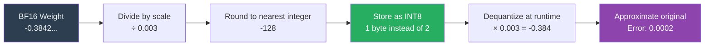
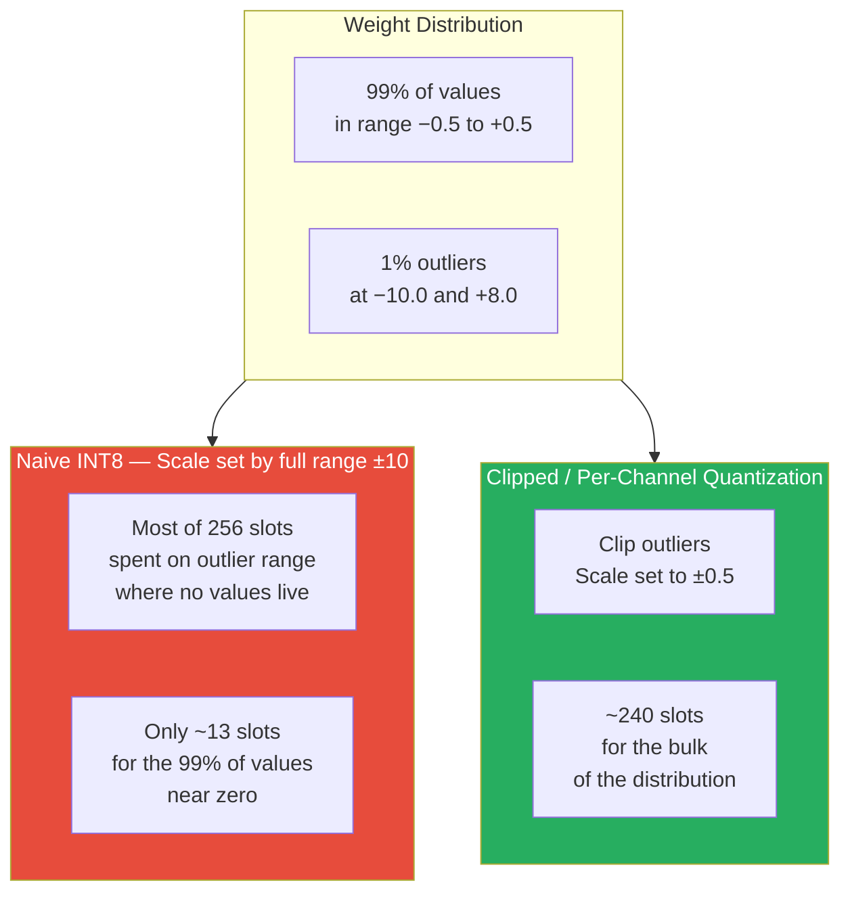
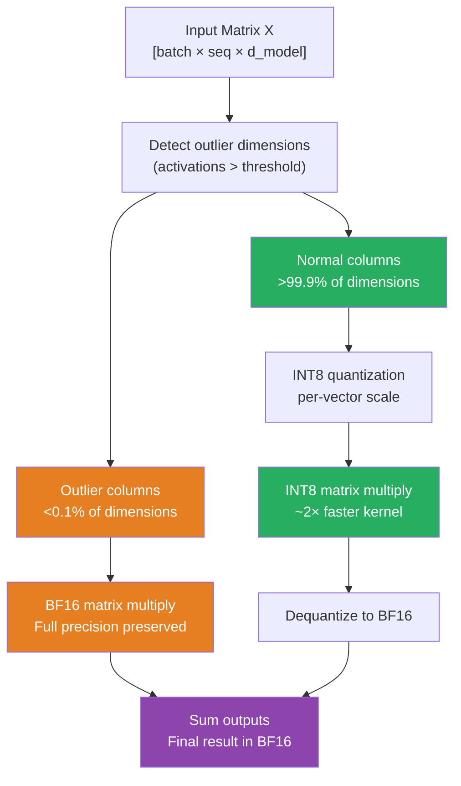
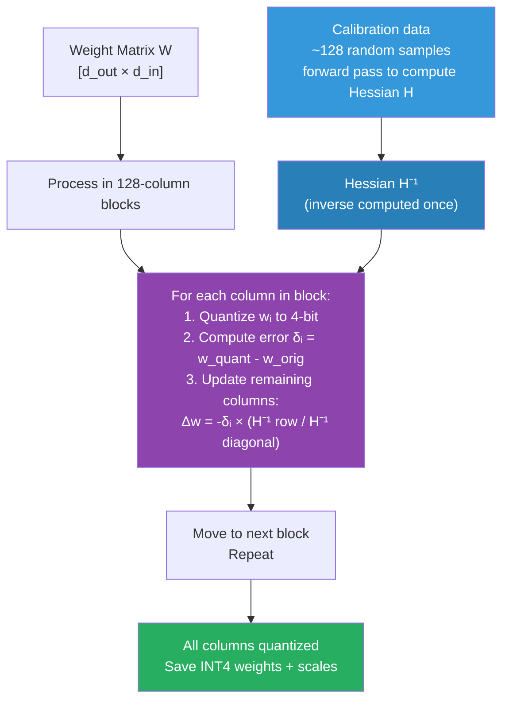
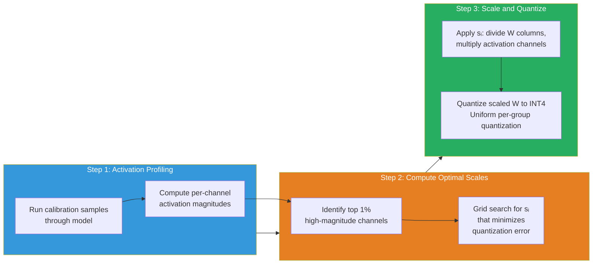
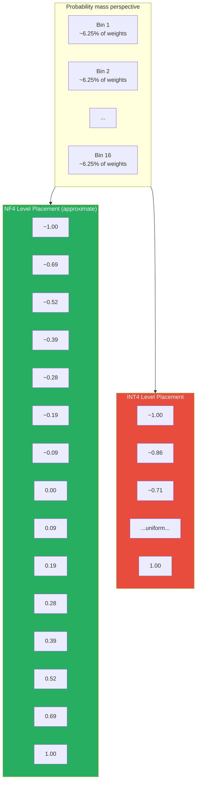
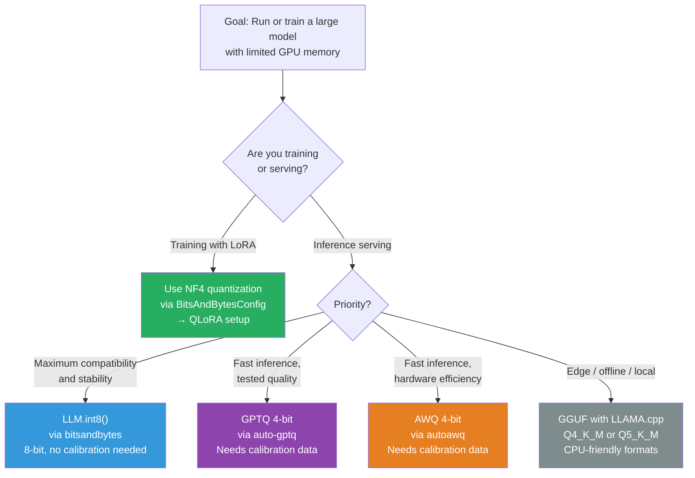

# Lesson 3.5A — Quantization Deep Dive: How Neural Networks Are Compressed to 4-Bit

> *Lesson 3.5 (QLoRA) assumes you understand what quantization is and why NF4 is better than INT4. This lesson fills that gap. Read this before or alongside Lesson 3.5 if you want to understand the "why" behind the numbers — not just what buttons to press.*

---

## The Problem: Models Are Too Big to Move

A 7B parameter model stored in BF16 occupies 14 GB of memory. A 70B model takes 140 GB. These numbers create real constraints: you cannot run inference on a 70B model on a single A100 80GB GPU if BF16 is your only storage format. You certainly cannot fine-tune it there.

The instinct is obvious — use fewer bits per number. Instead of 16 bits per weight, use 8 bits. Or 4. The memory footprint drops proportionally. A 70B model at 4-bit takes roughly 35 GB — now it fits on a single A100.

But this is not free. Every time you reduce the number of bits available to represent a value, you lose precision. The question that drives all of quantization research is: **how much precision can you sacrifice before the model noticeably degrades — and can you be smarter about where you spend your limited precision?**

Answering that question well is what separates naive quantization (which breaks models) from production-grade quantization (which barely touches quality). This lesson explains the full picture: what quantization actually does to numbers, why naive approaches fail, and how modern methods — INT8, GPTQ, AWQ, NF4 — each solve the problem differently.

---

## What Quantization Actually Means

Before anything else, build the mental model correctly.

A BF16 number uses 16 bits: 1 sign bit, 8 exponent bits, 7 mantissa bits. It can represent values from roughly −3.4×10³⁸ to +3.4×10³⁸ with about 3 decimal digits of precision.

An INT8 number uses 8 bits: it represents 256 distinct integer values, typically −128 to +127.

When you quantize a weight matrix from BF16 to INT8, you are mapping a continuous range of floating-point values onto 256 discrete integer slots. The transformation looks like this:

```
W_quantized = round( W_original / scale )
W_dequantized = W_quantized × scale
```

Where `scale` is a floating-point constant that maps the observed range of `W_original` to the [−128, +127] range. The **quantization error** is the difference between `W_original` and `W_dequantized` — the rounding error introduced by collapsing a continuous value into one of 256 slots.

For INT4 (16 slots), the rounding error is larger. For INT2 (4 slots), it is enormous. The art of quantization is minimizing this error in a way that does not cascade into visible output degradation.


*The quantization-dequantization round-trip. The error introduced at the rounding step is the core cost of quantization.*

---

## Why Naive Quantization Fails: The Outlier Problem

Here is the failure mode that everyone who works with quantization encounters. Take a real transformer weight matrix. Plot the distribution of its values. Most values are clustered tightly near zero — say, between −0.5 and +0.5. But there are a handful of extreme outliers: a few values at −10.0 or +8.0.

Now quantize. Your scale is determined by the full observed range: roughly [−10, +10]. You map 256 INT8 slots across a 20-unit range, giving a resolution of `20 / 256 ≈ 0.078` per slot. But 99% of your values are in [−0.5, +0.5] — a 1-unit range. These values get only `1 / 0.078 ≈ 13` distinct integer representations. Thirteen slots for 99% of your data. The precision is terrible for the values that actually matter most.


*The outlier problem. A naive global scale wastes most of the INT8 range on values that barely exist in the distribution.*

This is not theoretical. LLM.int8() (Dettmers et al., 2022) empirically showed that large transformer models develop **systematic outlier features** in specific dimensions — dimensions where activation values are consistently 100× larger than average. Standard INT8 quantization breaks model quality specifically because of these outliers.

> **Interview note:** "Why does naive INT8 quantization hurt large language models?" The weak answer: "Because you lose precision." The strong answer: "LLMs develop systematic outlier dimensions — specific embedding dimensions with activation values 100× larger than the rest. A global scale has to accommodate these outliers, which compresses the precision available for the vast majority of values near zero. For models above ~6.7B parameters, these outliers appear reliably, which is why naive 8-bit quantization works acceptably for small models but breaks larger ones."

---

## INT8 Quantization: LLM.int8() — Mixed-Precision Decomposition

LLM.int8() solves the outlier problem without clipping outliers or degrading them. The insight is surgical: **decompose the matrix multiplication into two separate operations** — one for the outlier dimensions (computed in BF16) and one for the normal dimensions (computed in INT8).

**How it works, step by step:**

1. **Identify outlier columns.** Before quantization, scan the activations and flag any dimension where values are consistently above a threshold (default: absolute value > 6.0). These are the outlier dimensions. In practice, fewer than 0.1% of dimensions are outliers.

2. **Split the computation.** For the matrix multiply `Y = XW`, partition columns of `X` (and corresponding rows of `W`) into outlier columns and normal columns.

3. **Compute outlier part in BF16.** The small set of outlier columns are multiplied in full BF16 precision — no quantization applied.

4. **Quantize and compute normal part in INT8.** The remaining 99.9%+ of columns are quantized per-vector to INT8 and multiplied using INT8 CUDA kernels.

5. **Sum the results.** The BF16 output and the INT8 output (dequantized to BF16) are added together to produce the final result.


*LLM.int8() mixed-precision decomposition. Outlier dimensions stay in BF16. Everything else moves to INT8. The results are summed.*

**Memory result:** Weights that previously occupied 2 bytes each now occupy 1 byte each (for the 99.9% normal weights). Memory roughly halves. Quality loss versus BF16: typically less than 1% on standard benchmarks for models above 6.7B parameters.

**Limitation:** The INT8 kernel introduces latency overhead on some GPU configurations. LLM.int8() is most beneficial for memory-bound inference on large models. For smaller models, the overhead sometimes negates the benefit.

---

## GPTQ: Post-Training Quantization to 4-Bit via Second-Order Optimization

LLM.int8() stops at 8-bit. Getting to 4-bit with acceptable quality requires a fundamentally different approach — you cannot just round each weight independently. GPTQ (Frantar et al., 2022) does 4-bit quantization using **second-order information about weight sensitivity**.

**The core problem with naive 4-bit:** Rounding each weight to the nearest 4-bit value independently ignores the fact that weights interact. When you quantize weight `w₁`, you introduce an error `δ₁`. That error affects the output of the layer. The impact of `δ₁` on the output depends on both `w₁`'s value and the **Hessian** — the second-order sensitivity matrix that captures how the loss changes with each weight. A weight with a large Hessian entry matters a lot; rounding it poorly causes severe output degradation.

GPTQ exploits this. It is built on **Optimal Brain Quantization (OBQ)**, which says: when you must quantize a weight (introduce an error), compensate by updating the remaining unquantized weights to absorb the error. The update direction comes from the Hessian.

**GPTQ's practical simplification:**

OBQ is exact but slow — updating all remaining weights after each quantization step is `O(d³)` operations. GPTQ makes two approximations to make it tractable for 175B+ parameter models:

1. **Quantize in column order, not sensitivity order.** Processing columns left-to-right (rather than by descending sensitivity) is much faster and empirically loses little quality.
2. **Apply lazy batch updates.** Instead of recomputing the Hessian-based compensation after every single weight, accumulate updates in blocks of 128 columns and apply them together.


*GPTQ quantization process. The Hessian is computed once from calibration data. Column-by-column, each weight is quantized and the remaining weights are adjusted to compensate for the introduced error.*

**What calibration data does:** GPTQ requires a small set of representative text samples (typically 128 sequences from the target domain or general text like C4/WikiText). These are run through the model in a forward pass to compute the Hessian. The Hessian captures which weights matter most for producing the correct output — this is what GPTQ uses to decide how to distribute quantization error.

**Quality result:** GPTQ at 4-bit (INT4) achieves perplexity within ~0.5–1 perplexity point of the BF16 baseline on most models above 6B parameters. At 3-bit, quality degrades noticeably. At 2-bit, the model is generally too degraded for production use.

> **Interview note:** "What is GPTQ and how does it differ from naive 4-bit quantization?" The weak answer: "GPTQ uses a smarter rounding method." The strong answer: "GPTQ uses second-order information — specifically the inverse Hessian — to compensate for quantization error. When weight `wᵢ` is rounded, the error is propagated to remaining unquantized weights in a way that minimizes the total impact on the layer's output. This compensation step, done column by column with lazy batching for speed, is what lets GPTQ reach 4-bit quality that naive rounding cannot — because naive rounding treats each weight independently and ignores how errors accumulate."

---

## AWQ: Activation-Aware Quantization — Protecting the Weights That Matter

GPTQ compensates for quantization error after rounding. AWQ (Lin et al., 2023) takes a different strategy: **identify the small fraction of weights that are most important and protect them before quantization.**

**The key empirical finding:** Not all weights in a matrix are equally important. About **1% of weights** — specifically those that correspond to activation channels with large magnitudes — have outsized impact on model output. If these weights are quantized with poor precision, model quality collapses. If they are kept precise, 4-bit quantization works well even without Hessian-based error compensation.

**AWQ's mechanism — per-channel scaling:**

Instead of keeping important weights in higher precision (which would be irregular and hard to implement efficiently), AWQ **scales the weight channels** before quantization. The intuition:

If activation channel `xᵢ` has a large magnitude, the weight `wᵢ` that multiplies it has disproportionate effect. AWQ divides `wᵢ` by a scale factor `sᵢ > 1` (making `wᵢ` smaller and thus easier to quantize precisely), and multiplies the corresponding activation by `sᵢ` (to preserve the output). The net math is the same. But after scaling, `wᵢ/sᵢ` is smaller, and quantizing it to 4-bit introduces less relative error.

```
Original: y = xᵢ × wᵢ
After AWQ scaling: y = (xᵢ × sᵢ) × (wᵢ / sᵢ) — mathematically identical

But: wᵢ / sᵢ is smaller → 4-bit quantization error is smaller relative to the value
```


*AWQ pipeline. Profile activations to find important channels, compute per-channel scales that reduce quantization sensitivity for those channels, then apply standard INT4 quantization on the scaled weights.*

**Why AWQ over GPTQ?**

AWQ does not modify weights during quantization — it only rescales them. This means the quantized model can be quantized **hardware-efficiently** with regular INT4 kernels, without the column-by-column update loop GPTQ requires. AWQ is faster to apply and produces models that run faster at inference because the resulting weight layout is more regular.

| | GPTQ | AWQ |
|---|---|---|
| **Mechanism** | Hessian-based error compensation | Activation-aware per-channel scaling |
| **Quantization time** | Slower (column-by-column Hessian update) | Faster (scaling + standard quantization) |
| **Inference speed** | Good | Slightly better (more regular memory layout) |
| **Quality at 4-bit** | Very good | Very good (often comparable to GPTQ) |
| **Calibration data** | Required (~128 samples) | Required (~128 samples) |
| **Supports 3-bit?** | Yes (quality degrades) | Yes (quality degrades) |
| **Best use case** | When GPTQ tooling is already in your stack | When inference efficiency matters most |

---

## NF4: Quantization Designed for Neural Network Weight Distributions

NF4 (NormalFloat4) is the quantization format used by QLoRA. It is not an inference-serving format like GPTQ or AWQ — it is a **storage format for frozen base models during LoRA fine-tuning**. But understanding it precisely is what separates shallow knowledge of QLoRA from deep understanding.

The core insight: INT4 places 16 quantization levels at **uniform intervals** across the observed weight range. But neural network weights are **not uniformly distributed** — they follow a roughly Gaussian distribution centered at zero. Uniform intervals waste levels at the sparse tails and are too coarse at the dense center.

NF4 places quantization levels at the **quantiles of the standard normal distribution**. Concretely: if you have 16 levels, place them at the values `q` where `Φ(q) = k/16` for `k = 0, 1, ..., 15` (where `Φ` is the normal CDF). The result: each quantization bin covers the same **probability mass** of the distribution. No bin is wasted.


*NF4 concentrates levels near zero where transformer weights are dense. INT4 distributes uniformly — wasting levels at the sparse extremes.*

**The normalization step:** Each weight block (typically 64 values) is first rescaled by its absolute maximum value before NF4 quantization is applied. This maps the block to the [−1, +1] range, where the NF4 levels are defined. The absolute maximum is stored as a FP32 constant per block (the "quantization constant"). Double quantization then compresses these constants further — covered in Lesson 3.5.

**Why NF4 is specifically for fine-tuning, not inference serving:**

NF4 requires dequantization before every matrix multiply — the CUDA kernel reads 4-bit values, expands them to BF16, then computes. This is fast enough for training (where you do one forward and one backward pass per step) but slower than GPTQ/AWQ for serving (where you do thousands of forward passes per second). For inference serving of quantized models, use GPTQ or AWQ. For QLoRA fine-tuning, NF4 is the right choice because the dequantization overhead is acceptable and the format is designed for training stability.

---

## The Quantization Methods Side-by-Side

| | LLM.int8() | GPTQ (4-bit) | AWQ (4-bit) | NF4 (4-bit) |
|---|---|---|---|---|
| **Bits** | 8 | 4 | 4 | 4 |
| **Memory vs BF16** | ~0.5× | ~0.25× | ~0.25× | ~0.25× |
| **Mechanism** | Mixed-precision outlier decomposition | Hessian-based error compensation | Activation-aware channel scaling | Quantile-based level placement |
| **Calibration data needed** | No | Yes (~128 samples) | Yes (~128 samples) | No |
| **Quality loss (7B+)** | <1% | <1% on most benchmarks | <1% on most benchmarks | <1% (for fine-tuning) |
| **Inference speed** | Slower than BF16 | Near BF16 with optimized kernels | Near BF16 or slightly faster | Slower (dequantize each matmul) |
| **Primary use case** | Large model inference, memory-constrained serving | Offline quantization for fast inference serving | Fast, hardware-efficient inference serving | QLoRA fine-tuning (storage format) |
| **Library** | `bitsandbytes` | `auto-gptq`, `optimum` | `autoawq`, `llm-awq` | `bitsandbytes` (via `BitsAndBytesConfig`) |

> **Interview note:** "Walk me through the tradeoffs between GPTQ and AWQ for production inference." The strong answer covers three dimensions: (1) **Quality**: both are within 1% of BF16 for models ≥7B; GPTQ has a longer track record, AWQ is newer but often comparable or better. (2) **Speed**: AWQ's regular memory access pattern means inference kernels can be more optimized — slightly faster on the same hardware. (3) **Quantization time**: GPTQ with Hessian updates is slower to quantize offline (minutes to hours depending on model size); AWQ is faster. For a production team, AWQ is often the better default for new projects.

---

## Where Quantization Fits in the Training vs Inference Picture

This is the mental model you need to hold in your head when reasoning about quantization choices:


*Decision tree for choosing a quantization method based on your goal.*

One more format worth knowing: **GGUF** (used by llama.cpp). This is the CPU-friendly quantization format that enables running 7B–70B models on MacBook Pro or consumer PCs without a GPU. GGUF supports multiple quantization levels (Q4_K_M, Q5_K_M, Q8_0, etc.) where the suffix describes the bit depth and the grouping strategy. For GPU-based inference, prefer GPTQ or AWQ. For local CPU inference, GGUF is the standard.

---

## A Concrete Example: Quantizing Llama-3 8B for Production Serving

Suppose your team has trained an instruction-following Llama-3 8B model (SFT + DPO) and you need to serve it at production scale on A10G GPUs (24 GB each).

**BF16 footprint:** 16 GB for the model weights alone. Fits on a single A10G, but leaves only 8 GB for KV cache and activations. With a large batch or long context, you will OOM.

**Your options:**

- **LLM.int8():** Reduces to ~8 GB. Quick to apply, no calibration needed. Inference is slightly slower than BF16 due to the mixed-precision overhead. Good for immediate deployment.
- **GPTQ 4-bit:** Reduces to ~4 GB. Requires an hour of offline quantization with a calibration set drawn from your fine-tuning data. Inference speed with optimized kernels (ExLlamaV2) is near BF16. Leaves 20 GB for KV cache — now you can serve long contexts or large batches. Quality drop: ~0.5 perplexity points.
- **AWQ 4-bit:** Same footprint as GPTQ (~4 GB). Faster to quantize offline (~30 min). Similar quality. Slightly better inference throughput on certain GPU architectures.

For this use case, GPTQ or AWQ at 4-bit is the right call. You have the calibration data (your fine-tuning set works perfectly), the offline quantization time is acceptable, and the memory savings directly translate to higher throughput and longer context support in production.

```python
from awq import AutoAWQForCausalLM
from transformers import AutoTokenizer

# Step 1: Load calibration data (use your own domain data for best results)
# Here we use a small generic set as an example
quant_config = {
    "zero_point": True,   # Asymmetric quantization (handles non-zero-centered distributions)
    "q_group_size": 128,  # Quantize in groups of 128 weights — balance between quality and overhead
    "w_bit": 4,           # 4-bit weights
    "version": "GEMM"     # Kernel variant: GEMM for batch inference, GEMV for single-token decode
}

model = AutoAWQForCausalLM.from_pretrained("path/to/llama3-8b-finetuned")
tokenizer = AutoTokenizer.from_pretrained("path/to/llama3-8b-finetuned")

# Step 2: Quantize. The model runs calibration samples internally.
# Use text from your target domain for best quality preservation.
model.quantize(tokenizer, quant_config=quant_config)

# Step 3: Save quantized model
model.save_quantized("path/to/llama3-8b-awq-4bit")
tokenizer.save_pretrained("path/to/llama3-8b-awq-4bit")

# Step 4: Load quantized model for inference
from awq import AutoAWQForCausalLM
model = AutoAWQForCausalLM.from_quantized(
    "path/to/llama3-8b-awq-4bit",
    fuse_layers=True  # Fuse attention layers for faster inference
)
```

---

## Summary

- Quantization maps floating-point weights onto fewer bits (INT8, INT4) to reduce memory. The cost is rounding error; the goal of every quantization method is to minimize how that error affects model output.
- Naive quantization fails on large LLMs because of outlier dimensions — a tiny fraction of weights with extremely large magnitudes that force the quantization scale to expand, destroying precision for the majority of values near zero.
- **LLM.int8()** handles outliers by decomposing each matrix multiply into an outlier component (computed in BF16) and a normal component (computed in INT8). No calibration data needed. Memory cost: ~0.5× BF16.
- **GPTQ** achieves 4-bit quantization using second-order optimization: when a weight is rounded, remaining weights are adjusted via the inverse Hessian to compensate. Requires calibration data. Quality: within ~1% of BF16 for 7B+ models.
- **AWQ** protects the 1% of weight channels that matter most (those multiplied by high-magnitude activations) by scaling them before quantization, reducing their relative rounding error. Faster to apply than GPTQ, similar quality, slightly better inference throughput.
- **NF4** places 4-bit quantization levels at the quantiles of the normal distribution — matching how transformer weights are actually distributed — instead of uniform intervals. This is the format used by QLoRA for frozen base models during fine-tuning.
- For inference serving: use GPTQ or AWQ (4-bit). For fine-tuning with QLoRA: use NF4 via `BitsAndBytesConfig`. For CPU-based local inference: GGUF via llama.cpp.
- Calibration data quality matters: quantizing with domain-specific calibration data (your fine-tuning set) consistently outperforms quantizing with generic text. The calibration samples teach the quantizer which weights and activations matter for your specific task.

---
