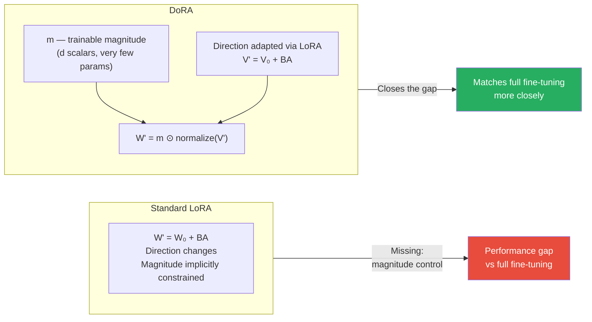

# Lesson 3.6 — Beyond LoRA: DoRA, IA³, and LoftQ — What They Improve and When to Use Them

> *If LoRA is the baseline you should know cold, these three are the "what came next" — each fixing a specific limitation LoRA has. Know what problem each solves and you can answer any question about them.*

---

## Why Methods After LoRA Exist

LoRA is not perfect. It has three known limitations that motivated follow-on research:

1. **LoRA only adapts the direction of weight updates, not the magnitude.** A weight matrix encodes both *how much* to activate (magnitude) and *in which direction* to activate (direction). LoRA's low-rank ΔW = BA changes direction but not magnitude independently. Full fine-tuning naturally adapts both.

2. **LoRA still has a non-trivial parameter count** at higher ranks. For scenarios with very limited data (few-shot) or extreme memory constraints, even 10–20M trainable LoRA params is too many.

3. **QLoRA's initialization leaves quantization error uncompensated.** QLoRA initializes B=0, meaning LoRA starts adding zero correction to a model that is already perturbed by 4-bit quantization error. It has to spend training budget compensating for that initial error.

DoRA, IA³, and LoftQ each address one of these problems directly.

---

## DoRA — Weight-Decomposed Low-Rank Adaptation

### The Problem It Solves

Liu et al. (2024) analyzed the difference in how LoRA and full fine-tuning change weight matrices. They found that full fine-tuning tends to update both the **magnitude** and **direction** of weights simultaneously. LoRA, because it adds ΔW = BA as a pure additive term, changes mostly the direction of the resulting weight matrix while the magnitude change is constrained by the rank.

This is a subtle but real capacity limitation. For tasks that require significant behavioral shifts — not just narrow domain adaptation but meaningful changes in how the model reasons or responds — LoRA is systematically underpowered in magnitude adjustment.

### What DoRA Does

DoRA decomposes any weight matrix W into two components:
- **Magnitude** m — a scalar per output neuron (a vector of length d)
- **Direction** V — the normalized weight matrix V = W / ||W|| (unit norm per column)

So: `W = m ⊙ (V / ||V||)` (element-wise multiplication of magnitude with normalized direction)

During fine-tuning:
- **m (magnitude) is directly trainable** — just a vector of d scalars, very few parameters
- **Direction is adapted via LoRA** — `V' = V₀ + ΔV` where ΔV = BA as in standard LoRA

The forward pass:

```
output = (m / ||V₀ + BA||) ⊙ (V₀ + BA) x
```

This allows the model to independently scale the magnitude of each output dimension while also adjusting the direction via LoRA — matching what full fine-tuning does naturally.



### Results and Cost

DoRA consistently outperforms LoRA by 1–3% across most benchmarks, closing more of the gap to full fine-tuning. The additional parameters from the magnitude vector are minimal: just d parameters per adapted matrix (e.g., 4096 scalars for a 4096-dimensional layer).

In the `peft` library, DoRA is a single flag:

```python
config = LoraConfig(
    r=16,
    lora_alpha=32,
    use_dora=True,  # Enable DoRA decomposition
    target_modules=["q_proj", "k_proj", "v_proj", "o_proj"],
    task_type=TaskType.CAUSAL_LM
)
```

**When to use DoRA:** When LoRA quality is not quite hitting your target and you want to squeeze more performance without going to full fine-tuning. It is a near drop-in replacement for LoRA with consistent upside and negligible additional cost.

> **Interview note:** "What is DoRA and how does it differ from LoRA?" The answer: "LoRA adapts weight matrices by adding ΔW = BA, which effectively changes the direction of the weight but constrains how magnitude can change. DoRA decomposes weight matrices into magnitude and direction components, making magnitude directly trainable (a d-dimensional vector per matrix) while direction is still adapted via LoRA. This matches what full fine-tuning does naturally — both magnitude and direction change — and closes 1–3% of the remaining performance gap between LoRA and full fine-tuning."

---

## IA³ — Infused Adapter by Inhibiting and Amplifying Inner Activations

### The Problem It Solves

LoRA at even rank 4 adds thousands of parameters per matrix. For few-shot scenarios (100–1000 examples) or extreme memory constraints, even LoRA may overfit or be unnecessarily heavy.

IA³ (Liu et al., 2022) asks: what is the most minimal possible intervention that can still meaningfully adapt a pre-trained model?

### What IA³ Does

Instead of learning a matrix correction (LoRA) or an inserted module (Adapters), IA³ learns a single **learned scaling vector** per adapted component — and applies it via element-wise multiplication on the activations.

Three places in each transformer block get learned scaling vectors:
- **Keys** in attention: `K' = l_k ⊙ K`
- **Values** in attention: `V' = l_v ⊙ V`
- **Intermediate activations** in FFN: `FFN'(x) = (l_ff ⊙ γ(x W₁)) W₂`

Where l_k, l_v, l_ff are learned vectors (one scalar per feature dimension).

These scalars can be > 1 (amplify) or < 1 (inhibit), selectively boosting or dampening specific activations — hence "inhibiting and amplifying."

### Parameter Count

For a model with hidden dimension d and FFN intermediate dimension d_ff:
- Per layer: l_k (d scalars) + l_v (d scalars) + l_ff (d_ff scalars)
- For LLaMA-2 7B (d=4096, d_ff=11008, 32 layers): `32 × (4096 + 4096 + 11008) = 32 × 19200 ≈ 614K parameters`

**614K parameters for a 7B model** — about 27× fewer than LoRA at r=16. This is extreme parameter efficiency.

IA³ merges cleanly into the weight matrices after training (the scaling vectors fold into W), so inference overhead is zero.

### Limitation

The capacity is genuinely lower than LoRA. IA³ works well for:
- Few-shot adaptation (where LoRA would overfit)
- Tasks that need subtle style or behavior shifts, not deep knowledge changes
- Scenarios where you have dozens or hundreds of tasks and need minimal per-task overhead

It does not match LoRA quality for general instruction tuning or broad domain adaptation. Think of IA³ as the right tool at the extreme efficiency end of the spectrum, not as a replacement for LoRA.

---

## LoftQ — LoRA-Fine-Tuning-Aware Quantization

### The Problem It Solves

QLoRA has a hidden initialization mismatch. Here is the sequence:

1. Load model in FP16 (original weights W_fp16)
2. Quantize to NF4: W_nf4 ≈ W_fp16 (but with quantization error: W_fp16 - W_nf4 ≠ 0)
3. Initialize LoRA: A=random, B=0, so ΔW = BA = 0 at step 0
4. Training starts from a model that already has quantization error baked in, with LoRA contributing nothing yet

The model is not starting from the pre-trained behavior. It is starting from a *perturbed* version of pre-trained behavior (the quantization error). LoRA has to spend early training correcting this error before it can start learning the actual task.

### What LoftQ Does

Li et al. (2023) propose an alternating optimization to find LoRA initialization that directly compensates for the quantization error.

The goal: find A, B, and quantized weights Q(W) such that:
```
W_fp16 ≈ Q(W) + BA
```

The initialization minimizes `||W_fp16 - (Q(W) + BA)||` — the LoRA matrices start as the best low-rank approximation of the quantization error, not as zeros.

The algorithm alternates between:
1. Given current A, B: find the best quantization Q(W)
2. Given current Q(W): find the best A, B via SVD of the residual W_fp16 - Q(W)

This runs for a few iterations at initialization time (not during training) and produces a starting point where the quantized model plus LoRA is already close to the original FP16 model.

### Result

LoftQ models converge faster than QLoRA and achieve better final performance, especially at lower ranks (r=4, r=8) where the LoRA has limited capacity to compensate for quantization error.

**When to use LoftQ:** When you need QLoRA (memory constraint forces 4-bit quantization) but want to squeeze every bit of quality out. It is a better-initialized QLoRA — the setup is more involved, but the quality gain is consistent.

---

## Summary

- **DoRA** decomposes weight matrices into magnitude (trainable vector) + direction (adapted via LoRA), matching what full fine-tuning does naturally. It consistently outperforms LoRA by 1–3% with negligible additional parameters. Use it as a drop-in upgrade when LoRA quality is not enough.
- **IA³** learns only element-wise scaling vectors applied to attention keys, values, and FFN intermediate activations — roughly 614K parameters for a 7B model. Extremely efficient, works well for few-shot scenarios, but lower capacity than LoRA for broad tasks.
- **LoftQ** fixes QLoRA's initialization mismatch: instead of starting LoRA at zero (while the base model has quantization error), it initializes A and B to approximate the quantization error. Converges faster and achieves better quality than standard QLoRA at equivalent rank. Use it when memory forces 4-bit quantization but quality matters.
- These three methods represent the frontier of PEFT research. Knowing what problem each solves — not just their names — is what distinguishes a strong interview answer.

---
