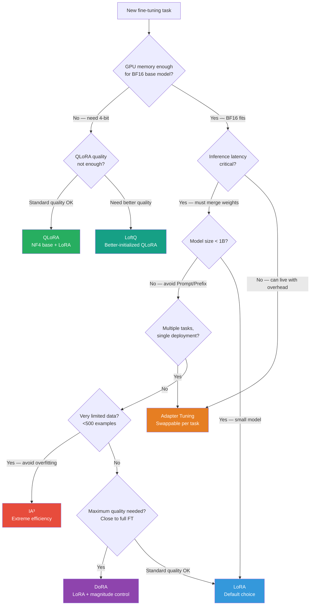

# Lesson 3.7 — PEFT Method Comparison: The Decision Matrix

> *This is the capstone of Part 3. Everything covered in Lessons 3.1–3.6 feeds into this lesson. Use it as a decision guide and interview preparation sheet.*

---

## The Question This Lesson Answers

You have a fine-tuning task. You know the model size, your hardware, your data, and your quality requirements. Which PEFT method do you choose — and more importantly, *why*?

This is one of the most common practical interview questions in ML engineering: "Walk me through how you would decide which fine-tuning approach to use." A weak answer names a method. A strong answer names a method and explains the decision criteria that led there.

This lesson gives you that reasoning framework.

---

## The Full Comparison Table

| Dimension | Adapter Tuning | Prompt Tuning | Prefix Tuning | LoRA | QLoRA | DoRA | IA³ | LoftQ |
|---|---|---|---|---|---|---|---|---|
| **Where it modifies** | FFN modules inserted in layers | Input embeddings | Attention K/V at every layer | Weight matrices (low-rank ΔW) | Weight matrices on NF4 base | Weight matrices (magnitude + direction) | Activation scaling vectors | Weight matrices on NF4 (better init) |
| **Trainable params (7B, typical)** | ~17–34M | ~82K | ~2.6M | ~8–50M | ~8–50M | ~8–50M + d per matrix | ~614K | ~8–50M |
| **Base model precision** | BF16 | BF16 | BF16 | BF16 | NF4 (4-bit) | BF16 | BF16 | NF4 (4-bit) |
| **Training memory (7B)** | ~18 GB | ~15 GB | ~16 GB | ~18 GB | ~10 GB | ~18 GB | ~15 GB | ~10 GB |
| **Inference overhead** | Yes (~5–10%) | Minimal | Small (extended KV cache) | None (merge weights) | None (merge weights) | None (merge weights) | None (merge into weights) | None (merge weights) |
| **Works on small models (<1B)** | Yes | No | Marginal | Yes | Yes | Yes | Yes | Yes |
| **Quality vs full FT** | 90–96% | 70–90%* | 80–93%* | 93–99% | 91–98% | 95–99% | 85–93% | 92–98% |
| **Multi-task serving** | Best (swap adapters) | Fair | Fair | Good (no merge) | Good | Good | Good | Good |
| **Setup complexity** | Medium | Low | Low | Low | Medium | Low | Low | High |

*Percentages are approximate, task-dependent, and only valid for models ≥10B.

---

## The Decision Framework

Do not start from the method. Start from your constraints. Work through these questions in order:

*Work through the decision tree from top to bottom. The first constraint that applies determines the candidate method.*

---

## The Most Common Scenarios and What to Pick

**Scenario 1: Fine-tuning a 7B or 13B model for instruction following, standard hardware (1–2 GPUs)**

Pick: **LoRA at r=16, targeting all attention projections.**
Why: BF16 fits, no special hardware needed, standard quality, zero inference overhead after merging, well-supported by `peft` + `trl`.

---

**Scenario 2: Fine-tuning a 65B or 70B model on a single A100 80GB**

Pick: **QLoRA (NF4 base + LoRA r=16)**
Why: BF16 base model alone is 130 GB. NF4 brings it to ~35 GB. The only method that makes a 70B fine-tune feasible on a single GPU. Quality gap vs LoRA is ~1–2%, acceptable for most use cases.

If quality is paramount: **LoftQ** (better initialization over standard QLoRA, convergences faster at lower rank).

---

**Scenario 3: Serving 50 different task-specific models from one base model**

Pick: **Adapter Tuning**
Why: Load the base model once, swap lightweight adapter weights per request. LoRA works too but requires keeping separate LoRA weight files and loading them — adapters have better library support for multi-task swapping (AdapterHub, `adapters` library). The 5–10% inference overhead is acceptable when the benefit is 50× model reuse.

---

**Scenario 4: Few-shot fine-tuning — 200 examples, risk of overfitting**

Pick: **IA³**
Why: 614K trainable parameters is a natural regularizer on tiny datasets. LoRA at r=16 (16.8M params) would overfit badly on 200 examples. IA³'s extreme constraint is an asset here, not a limitation.

If IA³ quality is not enough: **LoRA at r=4 with high dropout (0.1+)** — very low rank acts as strong regularization.

---

**Scenario 5: LoRA quality is 96% of full FT, but you need closer to 99%**

Pick: **DoRA**
Why: Drop-in LoRA replacement with consistent 1–3% uplift. Add `use_dora=True` in LoraConfig. No other changes needed. The magnitude decomposition closes the systematic gap LoRA has with full fine-tuning.

If DoRA is still not enough: go to full fine-tuning (Part 4 covers this).

---

**Scenario 6: Rapid prototyping / exploring task feasibility**

Pick: **LoRA at r=8, q and v projections only**
Why: Fastest setup, least GPU memory, works everywhere. Gives you a baseline quality signal quickly. Upgrade to r=16 + all projections + DoRA for the production run once you've validated the task is learnable.

---

## What Interviewers Actually Test

Interviewers testing PEFT knowledge are almost never asking for the definition of each method. They are testing two things:

**1. Can you reason about trade-offs?**

The expected pattern: constraints → decision criteria → method choice → justification.

If asked "what PEFT method would you use?", never answer with just a name. Always structure it as: "Given [memory constraint / task type / data size / inference requirement], I would choose [method] because [specific reason tied to the constraint]."

**2. Can you explain the mechanism of the method you chose?**

After you name a method, they will ask "why does that work?" or "what is the key insight behind it?" Know the mechanism of at least the top three: LoRA (low-rank decomposition, B=0 init, weight merging), QLoRA (NF4 + double quant + paged optimizers), Adapters (bottleneck FFN + residual + no merge = inference cost).

> **Interview note:** "What PEFT method would you use to fine-tune a 70B model for a customer support chatbot, deployed on a single A100 80GB GPU serving 500 requests/minute?"
>
> Strong answer: "I would use QLoRA. The 70B model in BF16 is ~130 GB — it doesn't fit in 80 GB even without any LoRA overhead. With NF4 quantization the base is ~35 GB, leaving room for LoRA adapters and KV cache. At 500 req/min with sub-second latency expectations, I would merge the LoRA weights post-training so there's zero inference overhead. If quantization quality is insufficient after evaluation, I would switch to LoftQ for better initialization at the same memory cost."

---

## The Methods You Can Rule Out for Most Production Use

**Prompt Tuning:** Requires models ≥ 10B to be competitive. On 7B it significantly underperforms LoRA. Use only if you have API-only access to a very large model.

**Prefix Tuning:** Extends the KV cache at every layer (inference overhead), underperforms LoRA on smaller models. Historical importance, rarely deployed today.

**IA³ in high-data settings:** At scale (10K+ examples), IA³ capacity is genuinely too limited. The parameter constraint becomes a liability rather than a regularizer. Use LoRA.

---

## Quick Reference Card

| If your constraint is... | Use... |
|---|---|
| Model too large for BF16 (65B+) on single GPU | QLoRA |
| QLoRA but need maximum quality | LoftQ |
| Zero inference overhead (hard latency requirement) | LoRA or QLoRA or DoRA (all mergeable) |
| Multi-task: one base model, many tasks | Adapter Tuning |
| Very small dataset (< 500 examples) | IA³ or LoRA r=4 |
| LoRA quality not close enough to full FT | DoRA |
| Fastest setup for prototype / validation | LoRA r=8, q+v only |
| General production instruction tuning | LoRA r=16, all attention projections |

---

## Summary

- LoRA is the default choice for almost all scenarios: memory-efficient, zero inference overhead after merging, works on all model sizes, well-supported.
- QLoRA extends LoRA to large models (65B+) by quantizing the frozen base to NF4. Adds ~20-30% training slowdown and ~1–2% quality cost, but enables single-GPU fine-tuning of 70B+ models.
- DoRA is the best LoRA upgrade when you need the last 1–3% of quality — decomposing magnitude and direction to match what full fine-tuning does naturally.
- Adapter Tuning is the choice for multi-task serving where multiple task-specific adapters must be hot-swapped on a shared base model.
- IA³ is the choice for few-shot scenarios — its tiny parameter count is a regularizer, not a limitation.
- LoftQ is QLoRA with a better initialization that compensates for quantization error — use when QLoRA quality is not sufficient.
- The decision should always flow from constraints (memory → latency → data size → quality target), never from familiarity with a particular method.

---
