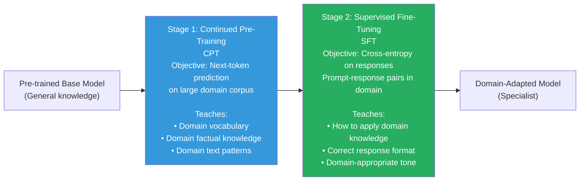

# Lesson 5.1 — Domain Adaptation: Teaching a Model a New Knowledge Domain

---

## What Domain Adaptation Is — and Why the Base Model Is Not Enough

Every large pre-trained model has a knowledge cutoff, a training distribution, and a vocabulary optimized for general text. When you deploy a model for a specialized domain — medicine, law, finance, or a niche engineering field — it runs into real limits:

- **Vocabulary gaps:** Medical literature uses terms like "myocardial infarction," "troponin elevation," "contraindicated." These words appear rarely in general web text. The model may have suboptimal tokenization for them and weak semantic representations.
- **Factual gaps:** Pre-training data over-represents popular topics. Clinical guidelines, legal precedents, and financial regulations are poorly represented.
- **Reasoning pattern gaps:** A doctor reasons differently about a patient case than a general assistant. A lawyer reasons from precedent and statutory interpretation. General pre-training does not instill these domain-specific reasoning patterns.

Domain adaptation is the process of closing these three gaps — vocabulary/representation, factual knowledge, and reasoning patterns — for a specific domain.

---

## The Two-Stage Strategy: CPT then SFT

The most effective approach combines two training stages:



These stages address different problems. CPT fills the knowledge and vocabulary gaps. SFT teaches the model how to apply that knowledge in dialogue.

You cannot skip CPT and go straight to SFT if the domain gap is large. Trying to teach a model to write clinical discharge summaries via SFT — when it barely understands pharmacological terminology — will fail. The model has nothing to draw on.

---

## Stage 1: Continued Pre-Training (CPT)

CPT uses the same objective as original pre-training: **next-token prediction** on domain text. No special labels required. The model learns by predicting the next token in domain documents.

**What CPT data looks like by domain:**

| Domain | Data sources | Typical scale |
|---|---|---|
| Medical | PubMed papers, clinical notes (de-identified), medical textbooks, uptodate articles | 10B–100B tokens |
| Legal | Court decisions, statutes, regulations, law review articles | 5B–50B tokens |
| Financial | SEC filings (10-K, 10-Q), earnings call transcripts, analyst reports | 5B–30B tokens |
| Code (specific language) | GitHub repos in target language, documentation, Stack Overflow | 10B–500B tokens |
| Scientific domain | arXiv papers, domain-specific journals | 5B–100B tokens |

**Key CPT hyperparameters:**
- **Learning rate:** Lower than initial pre-training. Use `1e-4` to `5e-5`. You are adapting, not training from scratch — aggressive LR will destroy general knowledge.
- **Epochs:** Typically 1–3 epochs on the domain corpus. More risks catastrophic forgetting (Lesson 8.5).
- **Data mixing:** Include a fraction (10–30%) of general text alongside domain text. This acts as an anchor that prevents forgetting general language patterns.

**What CPT actually changes:**
The model's weight space shifts to give better representations to domain tokens. Clinically rare words move from low-frequency, weakly represented embeddings to well-calibrated, semantically rich representations. The model can now "speak" the domain — before you have even told it what you want it to do.

> **Interview note:** "Why do you need CPT if SFT exists?" The answer: "SFT teaches the model *how to behave* — what format to use, when to say it does not know, how to reason about domain questions. But SFT only works if the model already has the *knowledge* to draw on. If the domain vocabulary is underrepresented in pre-training data, SFT cannot compensate — you are trying to teach behavior using knowledge the model does not have. CPT instills the knowledge first; SFT shapes how to apply it."

---

## Stage 2: Supervised Fine-Tuning (SFT) for the Domain

After CPT, the model knows the domain but does not know how to behave in a dialogue or task context. SFT teaches the behavioral layer.

**Domain SFT data formats:**

```
# Medical Q&A instruction format
{
  "messages": [
    {"role": "system", "content": "You are a clinical decision support assistant. Provide evidence-based medical information."},
    {"role": "user", "content": "What is the first-line treatment for community-acquired pneumonia in an otherwise healthy adult?"},
    {"role": "assistant", "content": "For a healthy adult with community-acquired pneumonia (CAP) and no comorbidities or recent antibiotic use, first-line treatment per IDSA/ATS guidelines is amoxicillin 1g three times daily for 5 days, or doxycycline as an alternative..."}
  ]
}
```

**Sources for domain SFT data:**
- Domain-specific Q&A: medical board exam questions, legal bar exam questions, financial certification exams
- Synthetically generated: use GPT-4 to generate instruction-response pairs over domain documents, then verify and filter
- Expert-written: manual annotation by domain specialists (expensive but highest quality)

---

## When to Skip CPT and Use SFT Only

Not every domain requires full CPT. Use only SFT when:
- The domain vocabulary is well-represented in the base model's pre-training (e.g., mainstream programming languages in a general model)
- The domain gap is primarily about *behavior*, not knowledge (e.g., teaching an already-knowledgeable model to respond in a specific format)
- The CPT corpus is small (< 1B tokens) — CPT on too little data may cause more forgetting than adaptation

Use CPT + SFT when:
- Domain has specialized terminology with low pre-training frequency (medical, legal, specialized scientific fields)
- Domain knowledge involves complex factual relationships not captured in general text
- High accuracy is required (medical, legal — hallucination is costly)

---

## Concrete Case Study: Medical LLM Adaptation

**Goal:** Adapt LLaMA-3 8B for clinical documentation assistance.

**CPT Phase:**
- Corpus: 50B tokens of de-identified clinical notes, PubMed abstracts, medical textbooks
- Duration: ~2 days on 8× A100 80GB GPUs at ~5B tokens/hour
- LR: 2e-5, cosine schedule with warmup, 20% general data mixing
- Result: perplexity on held-out clinical text drops 40%; model can now produce fluent clinical text

**SFT Phase:**
- Dataset: 50K instruction-response pairs — clinical Q&A, differential diagnosis exercises, medication reconciliation examples
- Duration: 6 hours on 8× A100 with QLoRA r=16
- Format: ChatML with clinical system prompt
- Result: model correctly formats clinical notes, gives evidence-cited responses, refuses questions outside its scope

**Evaluation:**
- MedQA benchmark (USMLE-style MCQ): base model 58%, CPT-only 62%, CPT+SFT 71%
- Manual evaluation by physicians: CPT+SFT rated significantly higher on clinical relevance and accuracy

---

## Summary

- Domain adaptation bridges three gaps in general pre-trained models: vocabulary/representation, factual knowledge, and domain reasoning patterns.
- The standard strategy is CPT → SFT in two stages. CPT (next-token prediction on large domain corpus) fills the knowledge gap. SFT (instruction-response pairs) teaches domain-specific behavior.
- CPT is not always necessary — skip it when the domain is well-represented in base model pre-training. Use it when domain has specialized terminology or knowledge density.
- During CPT: lower learning rate (1e-5 to 5e-5), mix ~20% general data to prevent catastrophic forgetting, train 1–3 epochs.
- Domain SFT data can be expert-written (highest quality, expensive), synthetically generated with GPT-4 (scalable, requires verification), or sourced from domain-specific exam materials.
- The medical domain example illustrates the quantitative lift: CPT+SFT can push benchmark scores 10–15 percentage points above SFT-only on specialized evaluations.

---
