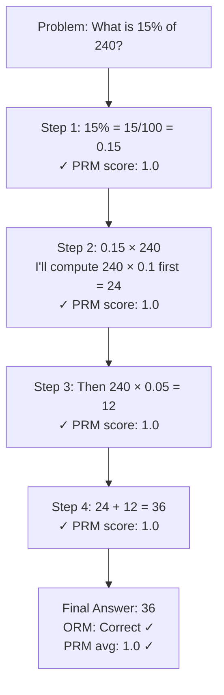
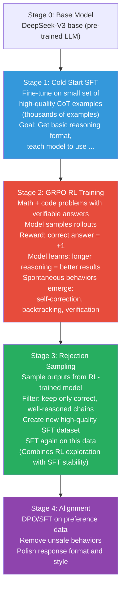

# Lesson 5.3 — Reasoning Capability Training: CoT, PRMs, ORMs, and the DeepSeek-R1 Approach

---

## What "Reasoning" Means in the Context of LLM Training

When we say a model "reasons," we mean it can break a complex problem into steps, work through those steps coherently, and arrive at the correct conclusion — even when the problem requires multiple logical jumps, constraints, or domain-specific knowledge.

Standard SFT on instruction-response pairs teaches the model to recognize patterns and produce high-quality responses. It does not reliably teach reasoning. A model trained only on `(question, answer)` pairs learns to output plausible-looking answers without necessarily developing the ability to think through hard problems.

Training reasoning capability requires explicitly teaching the model to use intermediate thinking steps — and using feedback signals that reward getting those steps right, not just arriving at a correct final answer by luck.

---

## Chain-of-Thought Distillation: The Simplest Approach

Chain-of-Thought (CoT) prompting (Wei et al., 2022) discovered that prompting a model with "think step by step" dramatically improves performance on multi-step reasoning tasks. The model produces intermediate reasoning before the final answer.

**CoT distillation** packages this into training data. You use a capable model (GPT-4, Claude) to generate full reasoning chains for difficult problems, then fine-tune a smaller model on `(problem, reasoning_chain, answer)` triples.

```
Training example:
Question: If a train travels 120 km in 2 hours, and then 180 km in 3 hours, 
          what is the average speed for the entire journey?

Reasoning: 
Step 1: Calculate total distance traveled.
        Total distance = 120 km + 180 km = 300 km

Step 2: Calculate total time taken.
        Total time = 2 hours + 3 hours = 5 hours

Step 3: Average speed = Total distance / Total time
        Average speed = 300 km / 5 hours = 60 km/h

Answer: The average speed is 60 km/h.
```

The model learns to produce reasoning steps before the answer. This improves accuracy on multi-step problems significantly.

**Limitation:** CoT distillation teaches the model to *mimic* reasoning traces from a teacher model. The model may learn the surface form of reasoning chains without truly reasoning — it pattern-matches to "this type of problem → this type of reasoning template." On genuinely novel problems outside the training distribution, pure CoT distillation models can fail.

---

## Outcome Reward Models (ORMs) vs Process Reward Models (PRMs)

To go beyond imitation learning, you need a feedback signal that evaluates reasoning quality. Two approaches:

### Outcome Reward Models (ORMs)

An ORM scores whether the **final answer is correct**. Binary or graded signal: correct/incorrect.

- **Simple to build:** For math problems, you can check if the final answer matches the ground truth automatically.
- **Does not require step-level annotation:** Just need correct answers.
- **Cannot distinguish good reasoning from bad reasoning that happens to get the right answer.** A model that skips steps but gets lucky gets the same reward as a model with a rigorous, verifiable chain.

### Process Reward Models (PRMs)

A PRM scores **each step** of a reasoning chain independently — not just the final answer.



vs a wrong-reasoning-right-answer case:

```
Step 1: 15% is close to 1/6. 240/6 = 40.  ← PRM: wrong approach, score 0.3
Step 2: So the answer is approximately 40. ← PRM: score 0.3
Final Answer: 40  (wrong) ← ORM catches this, PRM caught it earlier
```

PRMs can identify where reasoning goes wrong, enabling:
- Better selection of training data (use only reasoning chains where all steps are verified correct)
- Step-level feedback during RL training
- Detecting the point of failure in an otherwise plausible-looking chain

**Building PRMs requires step-level human annotation** — labelers must judge each step. This is expensive. OpenAI's "Let's Verify Step by Step" (Lightman et al., 2023) collected 800K step-level labels on math problems.

> **Interview note:** "What is the difference between a PRM and ORM?" PRMs score each reasoning step; ORMs score only the final answer. ORMs are easy to build (just need correct answers) but cannot distinguish good from lucky reasoning. PRMs enable step-level feedback — identifying exactly where reasoning fails — but require expensive step-level annotation. For math and code where you can verify answers automatically, ORMs are the practical choice. PRMs are used when you want to catch wrong intermediate reasoning that happens to produce correct answers.

---

## GRPO: The RL Approach Without a Reward Model

GRPO (Group Relative Policy Optimization) is the training algorithm used in DeepSeek-R1 and related systems. It does RL-style training for reasoning — without needing a trained reward model.

**The core idea:**

For each math or code problem with a verifiable answer:
1. Sample G responses (rollouts) from the model — different reasoning chains and answers
2. Score each rollout with a verifiable reward: +1 if final answer is correct, 0 or -1 if wrong (for math, you can check automatically)
3. Compute the **advantage** of each rollout relative to the group: `A_i = (r_i - mean(r)) / std(r)`
4. Update the model to increase probability of high-advantage rollouts, decrease low-advantage

```
Problem: "What is the square root of 169?"

Rollout 1: "169 = 13². So √169 = 13." → Answer: 13 ✓ Reward: +1
Rollout 2: "169 is close to 144. √144=12, so ≈12" → Answer: 12 ✗ Reward: 0
Rollout 3: "169 = 13 × 13 = 169. √169 = 13" → Answer: 13 ✓ Reward: +1
Rollout 4: "√169 ≈ √170 ≈ 13.04, so ≈13" → Answer: 13 ✓ Reward: +1
Rollout 5: "I cannot determine this." → Answer: none ✗ Reward: -1

Group mean reward: (1+0+1+1-1)/5 = 0.4
Advantages: Rollout 1: +1.2, Rollout 2: -0.8, ...
Update: increase probability of Rollouts 1, 3, 4; decrease 2, 5
```

No reward model needed — the reward signal is the verifiable outcome. This makes GRPO scalable to large datasets of math problems, coding challenges, or any domain where you can automatically verify answers.

**Why GRPO over PPO?** PPO requires a value function (critic network) that is hard to train stably for long reasoning chains. GRPO replaces the value baseline with the group mean — a much simpler, more stable alternative. It also does not need a reference model for KL penalty in the same way PPO does (it uses a normalized reward within each group).

---

## The DeepSeek-R1 Training Pipeline

DeepSeek-R1 is the clearest public example of training reasoning from scratch using RL on verifiable rewards. The pipeline has four stages:



**What makes Stage 2 remarkable:** The model was not explicitly taught to do self-correction, backtracking, or extended thinking. These behaviors **emerged** from RL training with outcome rewards. The model discovered that using more tokens for thinking leads to better answers, so it spontaneously developed longer, more elaborate reasoning chains.

The `<think>...</think>` special tokens bracket the model's internal reasoning. Everything inside is the scratchpad — the model can make mistakes, correct them, try different approaches. Only the final answer after `</think>` is evaluated.

---

## The "Thinking Tokens" Paradigm

The DeepSeek-R1 approach introduced a paradigm shift: **separating thinking from responding**.

```
<think>
Let me work through this step by step.

The problem asks for... actually wait, I misread. 
Let me re-read: it asks for X, not Y.

So I need to compute...
First approach: try method A... that gives 42. 
But wait, I should check if this satisfies constraint B.
42 × 3 = 126, which is > 100. So constraint B is violated.

Let me try method B instead...
</think>

The answer is 38.
```

During training, loss is computed on the full sequence (thinking + answer). The model learns that the thinking section is a scratchpad where it can explore freely. The final answer is what matters for reward.

This paradigm enables models to dynamically allocate compute to hard problems — spending more thinking tokens when the problem is hard, fewer when it is easy.

---

## Training Reasoning: The Practical Reality

| Approach | Data needed | Infrastructure | Quality ceiling | Best for |
|---|---|---|---|---|
| CoT distillation | 10K–100K CoT examples (GPT-4 generated) | Standard SFT | Medium — imitation learning | Quick baseline, modest improvement |
| ORM + rejection sampling | Verifiable problems + correct answers | SFT + optional RL | Good — filters to correct chains | Math, code reasoning |
| PRM training | Step-level annotations (expensive) | Complex | High — catches wrong reasoning | When step correctness matters |
| GRPO (DeepSeek-R1 style) | Verifiable problems (math, code) | Large-scale RL training | Highest — emergent capabilities | State-of-art reasoning models |

For most teams: **CoT distillation + ORM-based rejection sampling** is the practical entry point. Full GRPO training requires significant infrastructure and compute investment.

---

## Summary

- Instruction tuning alone does not reliably teach reasoning. Explicitly training on intermediate reasoning steps is necessary.
- **CoT distillation:** collect reasoning chains from capable models (GPT-4); fine-tune smaller model on `(problem, chain, answer)` triples. Fast to implement, teaches imitation of reasoning but not genuine exploration.
- **ORMs** score final answer correctness — easy to build, work for any domain with verifiable answers. **PRMs** score each reasoning step — better quality signal, requires expensive step-level annotation.
- **GRPO:** sample multiple rollouts per problem, score by verifiable outcome, update model based on group-relative advantage. No trained reward model needed. The algorithm behind DeepSeek-R1.
- DeepSeek-R1's four-stage pipeline: cold-start SFT → GRPO with verifiable rewards → rejection sampling into new SFT → alignment. The RL stage causes spontaneous emergence of self-correction, backtracking, and extended thinking.
- "Thinking tokens" (`<think>...</think>`) separate scratchpad reasoning from final responses, allowing dynamic compute allocation and self-correction within a single generation.

---
