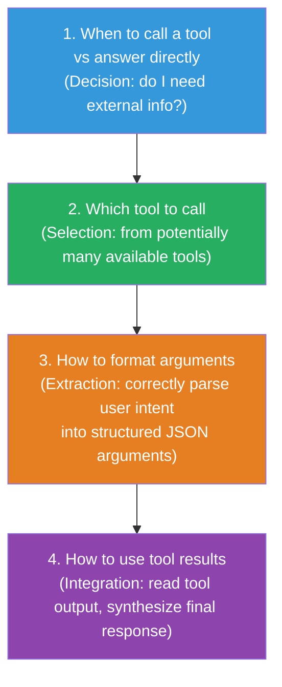

# Lesson 5.4 — Tool Use and Function Calling: How Models Learn to Select and Invoke Tools

---

## The Problem That Tool Use Solves

A language model generates text. It cannot browse the web, query a database, execute code, call an API, or check today's date. These are fundamental limitations — the model's knowledge is frozen at training time, and text generation cannot perform side effects in the world.

Tool use breaks this barrier. Instead of generating a final answer directly, the model generates a structured description of a tool call — specifying which tool to call and with what arguments. The execution environment invokes the tool, gets the result, and feeds it back to the model, which then generates the final response.

This transforms a text predictor into an **agent** that can take actions, retrieve live information, and perform computations.

---

## The Function Calling Interaction Pattern

The OpenAI function calling API established the de facto standard format. Understanding it is essential for building or evaluating tool-use training data.

**Step 1: Define available tools in the system message**

```json
{
  "tools": [
    {
      "type": "function",
      "function": {
        "name": "get_weather",
        "description": "Get the current weather for a city",
        "parameters": {
          "type": "object",
          "properties": {
            "city": {
              "type": "string",
              "description": "The city name, e.g. 'London'"
            },
            "unit": {
              "type": "string",
              "enum": ["celsius", "fahrenheit"]
            }
          },
          "required": ["city"]
        }
      }
    }
  ]
}
```

**Step 2: Model generates a tool call (not a text response)**

```json
{
  "role": "assistant",
  "tool_calls": [
    {
      "id": "call_xyz",
      "type": "function",
      "function": {
        "name": "get_weather",
        "arguments": "{\"city\": \"London\", \"unit\": \"celsius\"}"
      }
    }
  ]
}
```

**Step 3: User (execution environment) provides the tool result**

```json
{
  "role": "tool",
  "tool_call_id": "call_xyz",
  "content": "{\"temperature\": 14, \"condition\": \"cloudy\", \"humidity\": 82}"
}
```

**Step 4: Model generates the final response using tool result**

```json
{
  "role": "assistant",
  "content": "The current weather in London is 14°C and cloudy with 82% humidity."
}
```

---

## What the Model Must Learn

Training for tool use teaches four distinct skills, in increasing difficulty:



**Skill 1 (When to call)** is often overlooked but critical. A model that calls tools for every query — including ones it could answer from parametric knowledge — adds unnecessary latency and API costs. A model that never calls tools when needed is useless for agentic tasks.

**Skill 3 (Argument extraction)** is the most common failure point. The user says "what's the weather like in New York?" — the model must extract `"city": "New York"`, not `"city": "New York City"` or `"city": "NYC"`, and must know that "like" is not a parameter. This is a precise information extraction task.

---

## Training Data Format for Tool Calling

Tool-calling training data consists of multi-turn dialogues that include tool calls and tool results as intermediate turns. Every training example must be a complete trajectory:

```python
# One training example: a complete tool-calling interaction
{
  "messages": [
    {
      "role": "system",
      "content": "You are a helpful assistant with access to tools.",
      "tools": [...]  # Tool definitions
    },
    {
      "role": "user",
      "content": "What's the current stock price of Apple?"
    },
    {
      "role": "assistant",
      "content": None,  # No text response — goes to tool call
      "tool_calls": [{
        "id": "call_1",
        "function": {"name": "get_stock_price", "arguments": '{"ticker": "AAPL"}'}
      }]
    },
    {
      "role": "tool",
      "tool_call_id": "call_1",
      "content": '{"price": 189.42, "change": "+1.23%"}'
    },
    {
      "role": "assistant",
      "content": "Apple (AAPL) is currently trading at $189.42, up 1.23% today."
    }
  ]
}
```

**Loss masking for tool calling:** Apply loss only on:
- The assistant's tool call turn (model must learn to generate correct JSON)
- The assistant's final response (model must learn to synthesize the tool result)

Do NOT apply loss on: system message, user turns, tool result turns (these are inputs, not outputs the model should generate).

---

## Building Tool-Calling Training Data

This is the hardest part — getting diverse, high-quality, correctly-executed tool-call examples at scale.

**Approach 1: Manual construction**
- Domain experts write tool definitions and example interactions
- Highest quality, most reliable
- Expensive — 1 engineer-day per 50–100 examples

**Approach 2: GPT-4 generation + verification**
- Define tools; prompt GPT-4 with user queries and ask it to generate complete tool-calling trajectories
- Filter: check that JSON arguments are valid, required fields are present, argument types are correct
- Scale: thousands of examples per day
- Risk: GPT-4 sometimes generates plausible-looking but wrong arguments

**Approach 3: Execution-verified generation**
- Actually execute the tool calls and verify the result makes sense
- Example: for a database query tool, execute the generated SQL, verify it returns non-empty results and matches the query intent
- Highest quality for code and query generation scenarios — ground truth is execution

**Approach 4: Real user trajectories**
- Collect actual function-calling interactions from production systems
- Highest real-world validity but requires production deployment first

---

## Multi-Turn Tool Trajectories: Sequential and Parallel

Many real tasks require multiple tool calls in sequence, where each call informs the next.

**Sequential tool calls:**

```
User: "Compare today's weather in Tokyo and London and tell me which is warmer."

Turn 1 — Tool call: get_weather("Tokyo")
Turn 2 — Tool result: {"temperature": 22, "condition": "sunny"}
Turn 3 — Tool call: get_weather("London")  
Turn 4 — Tool result: {"temperature": 14, "condition": "cloudy"}
Turn 5 — Final response: "Tokyo at 22°C is warmer than London at 14°C today."
```

The model must learn: (a) that it needs two tool calls, not one, (b) to call them sequentially (since result of each doesn't affect the choice of the other but does affect the final synthesis), (c) to correctly synthesize two tool results into a comparative answer.

**Parallel tool calls** (supported in newer models): the model generates multiple tool calls simultaneously in one turn, enabling parallel execution:

```json
"tool_calls": [
  {"id": "call_1", "function": {"name": "get_weather", "arguments": "{\"city\": \"Tokyo\"}"}},
  {"id": "call_2", "function": {"name": "get_weather", "arguments": "{\"city\": \"London\"}"}}
]
```

Training for parallel calls requires data where the model simultaneously generates multiple tool calls in a single assistant turn.

---

## Evaluation: The Berkeley Function Calling Leaderboard (BFCL)

BFCL (Yan et al., 2024) is the standard benchmark for tool-use capability. It evaluates:

- **Simple function calling:** One tool, straightforward argument extraction
- **Multiple function calling:** Choosing the right tool from multiple options
- **Nested function calling:** Tool output as argument to another tool
- **Parallel function calling:** Multiple simultaneous calls
- **Multi-turn:** Maintaining correct context across conversation turns
- **Irrelevance detection:** Correctly declining to call a tool when none applies

Top-performing models on BFCL: GPT-4o, Claude 3.5, Gemini 1.5 Pro, and fine-tuned open models (Gorilla, xLAM).

A common production mistake: evaluating tool-use capability only on simple single-call scenarios, then discovering the model fails on multi-tool or multi-turn tasks in production.

> **Interview note:** "How would you fine-tune a model for tool use?" Strong answer: "I would build a training dataset of complete tool-calling trajectories — including tool definitions, user queries, the model's tool call (with correct JSON arguments), the tool result, and the final synthesized response. I would apply loss only on the assistant turns (the tool call JSON and the final response). The data needs to cover: when to call vs answer directly, which tool to select from multiple options, correct argument extraction, and multi-turn sequential calling. I would evaluate on BFCL after training, specifically checking irrelevance detection (not calling tools unnecessarily) and parallel/sequential multi-call scenarios."

---

## Summary

- Tool use transforms a text generator into an agent: instead of a final answer, the model outputs a structured tool call; the execution environment runs the tool and returns results; the model synthesizes a final response.
- The model must learn four skills: when to call (vs answer directly), which tool to select, how to extract arguments correctly into JSON, and how to synthesize tool results.
- Training data consists of complete multi-turn trajectories: system message with tool definitions → user query → assistant tool call → tool result → final response. Loss is applied only on assistant turns.
- Data construction approaches: manual (highest quality), GPT-4 generation + JSON validation (scalable), execution-verified generation (highest reliability for code/query tools).
- Multi-turn trajectories are essential: sequential calls (each informed by the last result) and parallel calls (simultaneous execution) represent real production use cases.
- BFCL is the standard benchmark — evaluate against it with special attention to irrelevance detection and multi-turn/parallel scenarios.

---
