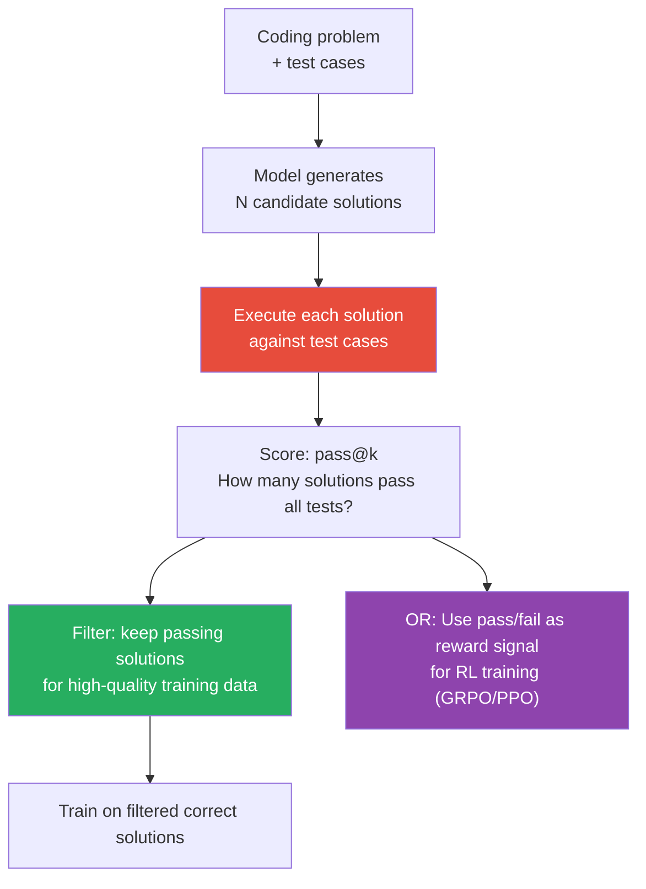

# Lesson 5.5 — Coding Capability Training: What Makes Code Special, FIM, and Execution Feedback

---

## Why Code Training Is Different From General Text Training

Code looks like text, but it behaves like nothing else in an LLM training corpus.

General text is forgiving. A slightly awkward sentence still communicates. A paragraph with a minor factual error still reads fluently. Code is not forgiving: a missing colon, a wrong variable name, an off-by-one index — any of these make the code completely non-functional. Code has a ground truth that text does not: it either executes correctly or it does not.

This binary correctness creates both an opportunity and a challenge. The opportunity: you have an automatic, objective quality signal — run the code and check the output. The challenge: standard language model training treats code as text tokens and measures token prediction accuracy, not functional correctness. A model that generates a plausible-looking but non-functional function scores nearly as well as one that generates working code.

Training for genuine coding capability requires going beyond token prediction.

---

## What Makes Code Data Special

### 1. Strong Structure

Code has enforced structure that natural language does not:
- **Syntax:** Every language has strict rules. Python enforces indentation. Java requires semicolons. Rust requires lifetime annotations. Violations are errors, not stylistic choices.
- **Scope and naming:** Variable names must be consistent within their scope. Functions must be called with the right number of arguments.
- **Type systems:** Statically typed languages have explicit type contracts. Even Python has implicit type expectations.

A tokenizer trained on natural language may poorly tokenize code identifiers, brackets, and operators. Models pre-trained primarily on text need significant code-specific data to learn structural rules.

### 2. Cross-File Dependencies

Real code rarely exists in isolation. A function calls methods from an imported library. A class inherits from a base class defined elsewhere. A SQL query references a table schema defined in a migration file.

The `import` statement at the top of a file represents a dependency. Training on isolated code snippets teaches none of this. **Repository-level training** — where the model sees entire repos with their file structures and cross-file dependencies — is what separates code models that can write functions from code models that can build systems.

### 3. Executable Ground Truth

Text quality is subjective. Code correctness is not. For problems with test cases:
- A solution either passes all tests or does not
- This creates a perfect reward signal for RL-based training

This is the same principle that makes GRPO (Lesson 5.3) so effective for reasoning training — and code has even more naturally verifiable problems than math.

---

## The Fill-in-the-Middle (FIM) Objective

Standard language model training goes left to right: given tokens 1...N, predict token N+1. This makes the model excellent at code completion — continuing code from a starting point.

But a key real-world use case is different: **insertion**. A developer has existing code before and after a gap and wants the model to fill in the middle. Left-to-right prediction cannot do this — the model has no access to the suffix.

**Fill-in-the-Middle (FIM)** adds a training objective specifically for this:

```
Standard:   [PREFIX...] → predict next token

FIM:        [FIM_PREFIX][code before gap][FIM_SUFFIX][code after gap][FIM_MIDDLE]
            → predict the middle section
```

During training, some examples are converted to FIM format: take a complete code snippet, choose a random span as the "middle," move the suffix to after the FIM_SUFFIX token, and train the model to generate the middle from the prefix+suffix context.

**Example:**

Original code:
```python
def calculate_average(numbers):
    total = sum(numbers)
    count = len(numbers)
    return total / count
```

FIM training example:
```
<fim_prefix>def calculate_average(numbers):
    total = sum(numbers)
<fim_suffix>
    return total / count<fim_middle>    count = len(numbers)
```

The model learns to attend to both the prefix (what came before) and the suffix (what comes after) to predict the correct middle section.

FIM is used by StarCoder, Code Llama, DeepSeek-Coder, and most production code models. Without FIM, models are poor at the "insert here" use case that code editors need for autocomplete.

---

## Execution Feedback: Using Test Results as Training Signal

The most powerful advancement in code model training is closing the loop between generation and execution.

**The basic pipeline:**



**Rejection sampling for code SFT:**
- Sample many candidate solutions from the model
- Execute each against the provided test suite
- Keep only solutions that pass all tests
- Use passing solutions as training data for the next SFT round
- Result: the model's own best outputs become its training data (self-improvement)

**GRPO/RL for code:**
- Same as math reasoning: sample multiple solutions, reward passing solutions (+1), penalize failing ones (-1 or 0)
- The model learns to generate correct code under exploration pressure
- AlphaCode 2, CodeRL, PPOCoder all use variants of this approach

---

## Code-Specific Datasets

| Dataset | Type | Scale | Key characteristic |
|---|---|---|---|
| The Stack (BigCode) | Raw code from GitHub | 6.4TB | 358 programming languages, permissively licensed |
| StarCoder data | Filtered GitHub + docs + issues | 783B tokens | Deduped, filtered for quality |
| Code Alpaca | Instruction following for code | 20K examples | GPT-3.5 generated, early benchmark |
| Evol-Instruct-Code | Evolved code instructions | 78K examples | WizardCoder approach — progressively harder |
| Magicoder (OSS-Instruct) | Code snippets → instruction generation | 75K examples | Uses snippets to generate novel problems |
| CodeContests | Competitive programming | ~13K problems | Hardest, with multiple test cases |
| HumanEval | Function completion | 164 problems | Standard eval benchmark |
| MBPP | Python programming problems | 374 problems | Simpler than HumanEval |

**The WizardCoder/Evol-Instruct approach** deserves special mention: instead of generating diverse instructions from scratch, it starts with simple coding problems and iteratively "evolves" them — adding constraints, requirements, edge cases, or combining multiple concepts. This produces a dataset that covers a wide range of difficulties and ensures the model sees genuinely hard problems.

---

## Repository-Level Context Training

Most code training uses function-level or file-level snippets. The frontier models go further: **repository-level training** where the model sees the entire repo context.

**What changes with repo-level training:**
- The model understands imports — it knows what functions are available from imported modules because it has seen the module code
- The model can write code that correctly uses project-specific conventions and abstractions
- The model can complete code that correctly references existing class hierarchies

**Implementation:** 
- Pack multiple files from the same repository into the context window
- Include import statements and referenced file contents
- Use repo-level FIM: the gap to fill might span multiple files

This requires long context windows (8K–100K tokens) and is computationally expensive — but produces code models that are useful for real codebases, not just toy problems.

---

## The pass@k Metric

Standard accuracy does not capture code model capability well. **pass@k** is the right metric:

`pass@k = fraction of problems where at least 1 of k generated solutions passes all tests`

- `pass@1`: strict — the first (greedy) solution must be correct
- `pass@10`: lenient — any of 10 sampled solutions must be correct

For deployment: `pass@1` is what matters (users want the first response to be correct). For research: `pass@10` or `pass@100` shows potential capability. Estimating `pass@k` from a small number of samples requires a bias-corrected estimator (Chen et al., 2021).

> **Interview note:** "How do you train a model to write better code?" Strong answer: "Start with a large pre-training corpus of code (GitHub data in the target language) including FIM training for insertion tasks. Fine-tune on high-quality instruction-response pairs (Evol-Instruct style evolved problems). Use execution feedback: sample multiple solutions per problem, run test cases, keep only passing solutions for SFT or use pass/fail as GRPO reward. For repository-level tasks, train with file-level context that includes imports and referenced definitions. Evaluate with pass@1 on HumanEval and MBPP — and on your own domain-specific test suite."

---

## Summary

- Code training differs from text training in three ways: strict syntax and structure that must be exactly right, cross-file dependencies that require repository-level context, and binary executable ground truth that enables automatic quality evaluation.
- **FIM (Fill-in-the-Middle):** Trains the model to predict a middle section given prefix and suffix context, enabling code insertion (autocomplete in existing code). Essential — without FIM, models can only append, not insert.
- **Execution feedback:** Actually running generated code against test cases provides the ground truth signal that token prediction cannot. Used for rejection sampling (filter to correct solutions for SFT) or as RL reward (GRPO/PPO with pass/fail reward).
- Code-specific training datasets: The Stack for raw pre-training, Evol-Instruct-Code for evolved instruction difficulty, Magicoder for OSS-inspired problems, CodeContests for the hardest benchmarks.
- Repository-level training — packing multiple files from the same repo into context — is necessary for models that work on real codebases rather than isolated functions.
- Evaluate with pass@1 (production metric) and pass@k (capability ceiling metric) using actual test execution, not just syntactic or semantic similarity.

---
