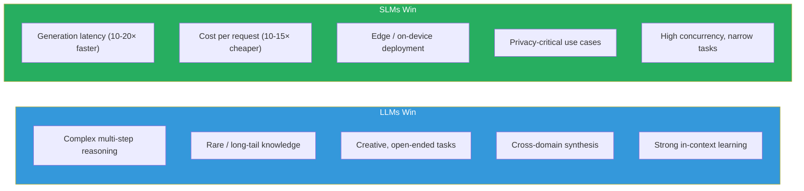

# Lesson 5.7 — LLM vs SLM: Architecture Differences, Training Philosophy, and Where Each Wins

---

## The Honest Question

When should you use a 70B model and when a 3.8B model? The answer is not "always use the biggest you can afford" and it is not "SLMs have caught up." The real answer requires understanding what each class of model is genuinely better at, why that is, and how production constraints shape the decision.

This lesson gives you the honest comparison — including where the gap is real and where it is closing faster than expected.

---

## The Scale Law Basis

The scaling hypothesis (Kaplan et al., 2020; Hoffmann et al., 2022 — Chinchilla) established that model performance improves predictably with scale: more parameters, more training data, more compute → better models, with no sign of diminishing returns up to frontier scale.

This is why organizations like OpenAI, Google, and Anthropic train models with 100B+ parameters. The returns are real.

But the scaling law measures **average performance across a broad distribution of tasks**. For specific, well-defined tasks with high-quality targeted training data, small models can substantially close the gap.

This is the core tension: LLMs win on breadth and capability ceiling; SLMs win on efficiency when the task scope is narrow and known.

---

## Architecture Differences

LLMs and SLMs are not fundamentally different architectures — they are both transformer-based. But the configuration choices differ in ways that matter:

| Dimension | LLM (e.g., 70B) | SLM (e.g., 3.8B) |
|---|---|---|
| **Parameter count** | 7B–700B+ | 0.1B–7B |
| **Number of layers** | 64–96 | 24–40 |
| **Model dimension (d)** | 8192–18432 | 2048–4096 |
| **Attention heads** | 64–128 | 16–32 |
| **KV heads (GQA)** | 8 GQA heads | 4–8 GQA heads (GQA universal) |
| **FFN multiplier** | 4× (or SwiGLU 2.67×) | 2.67×–3.5× |
| **Context length** | 8K–1M tokens | 4K–128K tokens |
| **Attention type** | Grouped Query Attention | GQA + sometimes sliding window |

**Key architectural distinction:** Almost all production SLMs use **Grouped Query Attention (GQA)** or **Multi-Query Attention (MQA)** as a non-negotiable. For edge deployment where KV cache memory is critical, having 4 KV heads instead of 32 reduces KV cache by 8× — enabling longer conversations without running out of device memory.

Sliding Window Attention (Mistral-style) further limits KV cache by only attending to a recent window, trading some long-range attention capability for memory efficiency.

---

## Training Philosophy Differences

This is the more important difference for practitioners.

**LLM training philosophy: Scale-first**
- Train on massive, broad datasets (1T–15T tokens)
- More data + more compute → emergent capabilities appear spontaneously
- Data diversity is the priority — web scale coverage of all domains
- Noise tolerance: the model is large enough to separate signal from noise
- Example: LLaMA-3 70B trained on 15T tokens from the web, books, code

**SLM training philosophy: Quality-first**
- Train on curated, high-educational-density datasets
- Synthetic data plays a major role (Phi series: most data is GPT-4 generated)
- Capability focus: deliberately optimize for 2–3 target capabilities
- Distillation: smaller models learn from larger teacher model distributions
- Data efficiency: 10B tokens of "textbook quality" >> 100B tokens of web noise

The philosophical shift is fundamental. LLM training asks: "what is the best model we can build with all available compute and data?" SLM training asks: "how do we maximize capability per parameter for specific use cases?"

---

## Capability Comparison: Where the Gap Is Real

**LLMs genuinely win:**

- **Complex multi-step reasoning:** Tasks requiring 10+ reasoning steps, constraint satisfaction across many variables, novel problem formulations. The 70B model has more representational capacity for holding complex state in its activations.
- **Rare domain knowledge:** Long-tail factual knowledge from infrequent training topics. A 70B model trained on 15T tokens has seen obscure domains; a 3.8B model trained on 5B tokens of curated data has not.
- **Creative and open-ended tasks:** Writing nuanced fiction, navigating complex ethical scenarios, generating highly original content — tasks where the evaluation is subjective and breadth of capability matters.
- **In-context learning:** LLMs learn from examples in the context window more effectively. A 70B model given 5 examples learns faster than a 3.8B model given the same.
- **Cross-domain reasoning:** Questions that require connecting knowledge across multiple domains (physics + economics + history) favor larger models.

**SLMs genuinely win:**

- **Latency:** A 3.8B model generates tokens 10–20× faster than a 70B model on the same GPU. Time-to-first-token is critical for interactive applications.
- **Cost:** Running a 3.8B model costs roughly 10–15× less in GPU-hours than a 70B model for the same request volume.
- **Edge deployment:** 3.8B at INT4 quantization ≈ 2 GB — runs on a high-end smartphone (Apple Neural Engine, Qualcomm NPU). 70B does not.
- **Privacy:** On-device SLMs mean user data never leaves the device. Critical for personal health, financial, or communications data.
- **Well-defined narrow tasks:** A 3.8B model fine-tuned on 10K high-quality examples of a specific task often matches or beats a 70B base model on that exact task.
- **High-concurrency services:** Serving 1000 requests/minute is 10× cheaper with a 3.8B model than a 70B model.

---

## The "Phi Effect": Why the Gap Is Closing

The claim "Phi-3-mini (3.8B) matches GPT-3.5 (175B)" requires nuance.

It is true on specific benchmarks (MMLU, GSM8K, HumanEval). It is not true in open-ended conversations, rare factual questions, or genuinely novel tasks. The benchmark performance gap is closing faster than the true capability gap.

Why? Academic benchmarks are narrow and reproducible. A small model trained on carefully curated data that includes educational content similar to the benchmarks can score well. Real-world performance on diverse, unpredictable user queries is harder to close.

**The honest framing:** SLMs are catching up on capability for predictable, well-defined tasks. For everything else — complex reasoning, unpredictable queries, creative tasks — larger models are still materially better.

> **Interview note:** "Would you use a 7B or 70B model for a customer support chatbot?" Strong answer: "It depends on the requirements. If the task is answering questions from a well-defined knowledge base with predictable query types, a 7B model fine-tuned on domain data will match the 70B for most queries at ~10× lower cost and ~10× lower latency. If the queries are highly varied, require complex reasoning, or include rare edge cases, the 70B is safer. In practice, I would benchmark both on a representative sample of real queries before committing. I would also consider a routing strategy: SLM for simple queries, LLM for complex ones — routing based on query complexity classifier."

---

## Mixture of Experts (MoE): The Bridge

MoE architecture bridges the SLM-LLM gap with a different trade-off. A MoE model has many parameters but activates only a fraction per token:

- **Mixtral 8×7B:** 46.7B total parameters, 12.9B active per token (2 of 8 experts active)
- **Inference cost:** ~13B model (active params) at 46B model quality
- **Memory:** need to load all 46.7B but only compute 12.9B — requires large VRAM for weights but fast generation

MoE gives you "large model capacity without large model compute cost" — at the price of high memory requirements for the full parameter set. It sits between a 13B dense model and a 46B dense model on both metrics.

---

## The Quantization Factor Changes Everything

Quantization (Lesson 11.4) shifts the comparison:

| Model | Precision | Memory | Inference speed | Quality |
|---|---|---|---|---|
| 7B SLM | FP16 | 14 GB | Fast | High for its size |
| 7B SLM | INT4 | 3.5 GB | Very fast | ~95–97% of FP16 |
| 70B LLM | FP16 | 140 GB | Slow (multi-GPU) | Best |
| 70B LLM | INT4 | 35 GB | Moderate (single A100) | ~97–98% of FP16 |

A quantized 70B model at 35 GB now fits on a single A100. A quantized 7B at 3.5 GB fits in consumer laptop RAM. These are different deployment footprints that open different use cases — the absolute parameter count matters less than the deployed size and inference cost.

---

## Summary

- LLMs and SLMs are architecturally similar but differ in scale, with SLMs universally using GQA and often sliding window attention for inference efficiency.
- Training philosophy diverges fundamentally: LLMs use scale-first (massive broad data, emergent capabilities); SLMs use quality-first (curated data, synthetic textbooks, distillation, capability focus).
- LLMs genuinely win for: complex multi-step reasoning, rare knowledge, creative tasks, cross-domain synthesis, and in-context learning. The gap is real for genuinely hard, unpredictable tasks.
- SLMs genuinely win for: latency (10–20× faster), cost (10–15× cheaper), edge/on-device deployment, privacy requirements, and narrow well-defined tasks.
- The "Phi effect" — small models matching larger ones on benchmarks — is real but overstated. Benchmark gaps close faster than real-world capability gaps.
- MoE is the bridge: large total parameters, small active parameters per token — getting large model quality at smaller model inference cost, at the price of high full-model memory.
- Quantization changes the absolute numbers: a 70B INT4 model at 35 GB is now single-GPU deployable, narrowing the practical deployment gap between classes.

---
