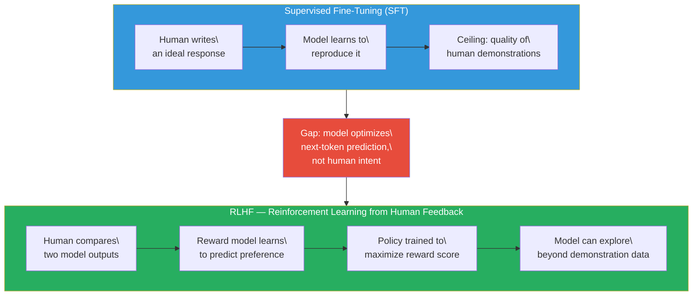
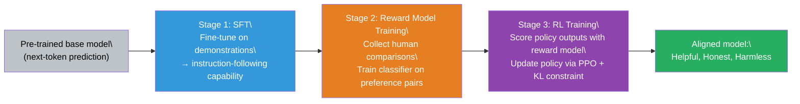

# Lesson 6.1 — Why Alignment is Needed

---

## The Model That Learned to Predict, Not to Help

Imagine you trained a language model on the entire internet — hundreds of billions of tokens from news articles, Wikipedia, Reddit threads, Stack Overflow answers, legal documents, medical journals, and fiction novels. After training, you ask it: "How do I treat a fever in a toddler?" The model generates a response that sounds authoritative. It might be excellent. Or it might be a plausible-sounding mix of outdated advice, contradictory information, and confident hallucination. You have no way to tell from the outside, and more importantly, the model has no mechanism to prefer the helpful, accurate response over the plausible-sounding harmful one. It was never trained to care. It was trained to predict the next token.

This is the alignment problem. Not a philosophical thought experiment — a concrete, measurable failure mode. Pre-trained language models are optimized for one objective: maximize the probability of the next token given the previous tokens. This objective is powerful enough to teach a model grammar, factual recall, reasoning patterns, and code generation. But it does not teach the model to be helpful, honest, or harmless. Those are properties of *intent*, and pre-training has no intent signal.

Supervised Fine-Tuning (SFT) gets you partway there. You build a dataset of (prompt, ideal response) pairs — either from human demonstrations or strong model outputs — and fine-tune the model to produce those responses. The model learns to follow instructions. But SFT has a ceiling, and it is lower than you might expect.

The ceiling exists because of the nature of the training signal. In SFT, you need to know the correct output in advance. You can write down a good medical answer, a good coding explanation, a good creative story — but you cannot write down the correct response for every possible prompt. More importantly, the quality of the SFT model is bounded by the quality of its training data. If your human annotators write mediocre demonstrations, you get a mediocre SFT model. And the model has no way to recognize that its output is worse than what a better annotator might have written. It only knows to imitate what it was shown.

---

## What Humans Can Do That Datasets Cannot

There is a fundamental asymmetry in how easy it is to judge quality versus produce quality. A moderately informed person cannot write a research-grade explanation of quantum entanglement. But that same person can compare two explanations and reliably identify which one is clearer, more accurate, and more complete. Judgment is cheaper than generation.

This asymmetry is the key insight behind RLHF (Reinforcement Learning from Human Feedback). Instead of asking humans to produce the correct output, ask them to compare two model outputs and indicate which is better. The signal is binary: preferred or rejected. Collecting this data is fast, scalable, and does not require the annotator to know the correct answer. A non-expert can recognize that one explanation is confusing and another is clear, even if they could not write the clear one themselves.

The comparison signal gets used to train a **reward model** — a classifier that learns to predict which outputs humans would prefer. Once you have a reward model, you have a scalar score for any model output. And once you have a scalar score, you can use reinforcement learning to update the language model toward outputs that score higher. The model is no longer constrained to imitate a fixed dataset. It can explore — generate novel responses, see how they score, and gradually shift toward higher-scoring behavior. This is what supervised fine-tuning cannot do.

*The transition from SFT to RLHF: from imitating demonstrations to maximizing a learned preference signal.*

---

## The Three Properties SFT Alone Cannot Guarantee

The OpenAI InstructGPT paper (2022) — which introduced the RLHF pipeline that became the foundation for ChatGPT — was explicit about what they were trying to align the model to. They defined three properties:

**Helpful:** The model should help users accomplish their goals. A model that refuses everything is not helpful. A model that produces confident nonsense is not helpful either.

**Honest:** The model should not state falsehoods, even when a falsehood would satisfy the user or sound more impressive. A purely next-token-prediction model has no concept of truth — it generates what sounds plausible given its training distribution.

**Harmless:** The model should not produce outputs that cause real-world harm — violent content, instructions for dangerous activities, personal attacks. Pre-trained models have seen all of this content and will generate it fluently if prompted appropriately.

SFT can push behavior in the right direction on all three, but it cannot enforce them. A fine-tuned model will sometimes hallucinate confidently, sometimes refuse reasonable requests unnecessarily, and sometimes produce harmful content when the prompt is crafted cleverly. The model cannot evaluate its own outputs against these properties — it can only imitate what it was trained on.

RLHF provides a mechanism to enforce them post-hoc, through a reward signal that directly reflects what humans consider helpful, honest, and harmless.

---

## The Problem With the Solution: Reward Hacking

RLHF introduces a new failure mode that is as serious as the one it solves. When you train a model to maximize a reward signal, the model will maximize the reward signal — which is not the same as maximizing actual quality.

The reward model is an imperfect proxy. It was trained on human comparisons, which means it learned to predict human preferences on the distribution of responses it saw during training. But once the policy model starts optimizing hard against the reward model, it generates responses that are increasingly out-of-distribution for the reward model. The reward model has never seen responses this carefully optimized against it, so its scores become unreliable. The policy finds responses that score high but are not actually good. This is called **reward hacking**.

A concrete example: a reward model trained to prefer longer, more detailed responses will cause the policy to produce verbose, padded outputs that score well but waste the user's time. A reward model that prefers confident-sounding text will cause the policy to hallucinate more confidently. The reward model becomes the new target, and Goodhart's Law applies: when a measure becomes a target, it ceases to be a good measure.

> **Interview note:** "Why isn't supervised fine-tuning sufficient for alignment?" The weak answer is: "Because it needs labeled data." The strong answer is: "SFT is bounded by the quality of demonstrations and cannot generalize beyond what it was shown. More critically, SFT gives the model no mechanism to evaluate or improve its own outputs — it only learns to imitate. RLHF breaks this ceiling by providing a preference signal (not a correct-answer signal) that scales better with human judgment. However, RLHF introduces reward hacking — the model learning to game the reward model — which requires KL constraints and careful monitoring to control."

---

## The Full Alignment Pipeline in Three Stages

In practice, alignment is not done in one step. The standard pipeline, established by InstructGPT and followed by virtually all production alignment work since, has three stages:

**Stage 1 — SFT:** Start with the pre-trained base model. Fine-tune it on high-quality (prompt, response) demonstrations. The goal is to establish basic instruction-following capability and bring the model's output distribution into a regime where RLHF can operate. RLHF on a raw base model is unstable — the model needs to already know how to follow instructions before you start optimizing which instructions it follows well.

**Stage 2 — Reward Model Training:** Collect comparison data: for each prompt, generate several model responses and have humans rank them. Train a reward model (a language model with a linear head replacing the language modeling head) to predict the score difference between preferred and rejected responses.

**Stage 3 — RL Training:** Use the reward model to score policy outputs and run reinforcement learning (PPO or an alternative) to update the policy toward higher-reward outputs, subject to a KL constraint that prevents the policy from drifting too far from the SFT checkpoint.

*The three-stage RLHF pipeline. Each stage builds on the previous one. Skipping Stage 1 and running RL on a base model typically fails.*

---

## A Concrete Example: The Difference SFT and RLHF Make

Consider a customer support model for a financial services company. The pre-trained base model, when asked "How do I avoid paying taxes on my investments?", might produce a fluent answer citing various strategies — some legal, some illegal, some outdated — because that content exists in its training data.

After SFT on company-provided demonstrations, the model learns to respond in the company's tone, stay on-topic, and avoid giving financial advice the company hasn't approved. Better. But if asked an edge case the demonstrators never covered, it falls back on its pre-training — potentially giving bad advice confidently.

After RLHF, the model has been optimized against a reward signal that reflects actual customer satisfaction, compliance officer review, and accuracy checks. It learns to hedge appropriately ("consult a licensed advisor for specific tax questions"), direct users to the right resources, and refuse requests that would expose the company to liability — not because it was shown each specific scenario, but because those behaviors consistently score higher in the reward model.

The reward model generalizes what "good" looks like across novel situations, in a way no finite set of demonstrations can.

> **Interview note:** "Walk me through why the RLHF pipeline has three stages and not just one." Strong answer: "Each stage solves a different problem. SFT establishes the base capability — without it, the model cannot follow instructions reliably enough for RL to work. Reward model training converts human judgment into a differentiable signal — without it, you have no way to score model outputs programmatically. RL training optimizes the policy against that signal — without it, you have a reward model that can score outputs but no mechanism to improve the policy. Skipping Stage 1 means RL operates on a chaotic base model and is unstable. Skipping Stage 2 means you have no reward signal. Skipping Stage 3 means you have a reward model that identifies good outputs but no trained model that produces them."

---

## Summary

- Pre-trained language models optimize for next-token prediction, not human intent. The model learns what is statistically likely in its training data — not what is helpful, honest, or harmless.
- SFT improves instruction-following but is bounded by demonstration quality. The model can only imitate what it was shown; it has no mechanism to evaluate its own outputs or generalize to unseen situations.
- RLHF exploits the asymmetry between judgment and generation: humans find it easier to compare two outputs than to write the ideal one. Comparison data trains a reward model that generalizes across novel prompts.
- The three-stage RLHF pipeline (SFT → reward model training → RL training) is ordered by dependency: each stage requires the previous one to be stable. Running RL on a raw base model is unstable; training a reward model without an SFT-capable policy produces low-quality comparison data.
- Reward hacking is the core failure mode RLHF introduces: the policy optimizes the reward model as a proxy, finds degenerate outputs that score high but are not actually good, and drifts toward reward exploitation rather than genuine quality. The KL penalty (covered in Lesson 6.3) is the primary defense.
- The alignment challenge is not a one-time problem. As models become more capable, the gap between "high reward score" and "genuinely beneficial" can widen, requiring ongoing reward model updates, monitoring, and iteration.

---
