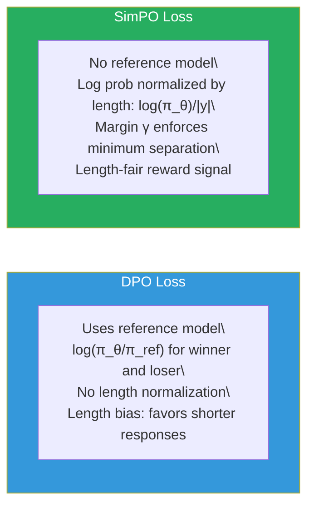
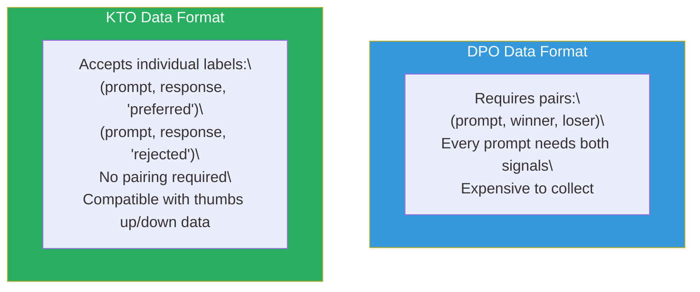
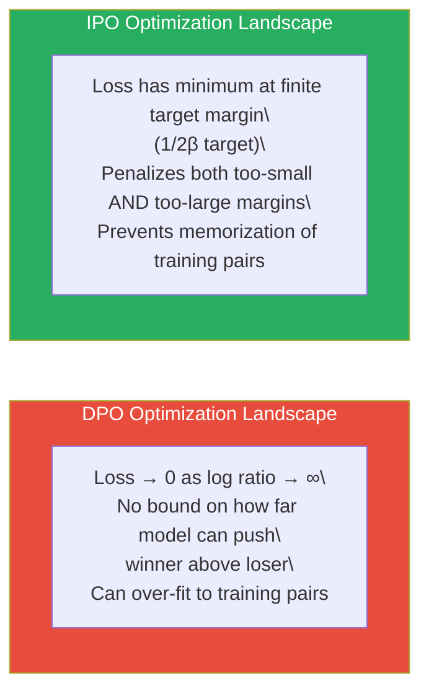
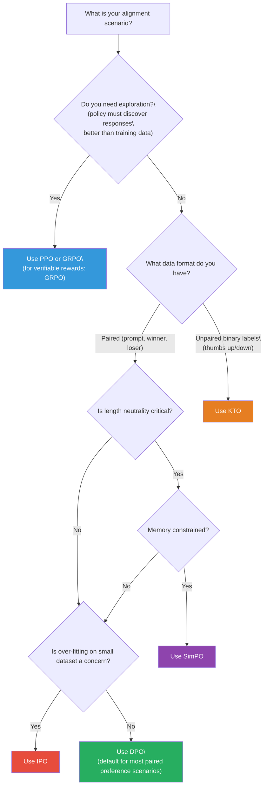

# Lesson 6.10 — Other Alignment Methods: SimPO, KTO, and IPO

---

## Why More Alignment Methods Exist

DPO was a breakthrough — it showed that preference alignment could be done without RL. But DPO has specific failure modes that became apparent as practitioners deployed it at scale. Some users found that DPO was too sensitive to the reference model's quality. Others had data that was not in the pairwise preference format DPO requires. Still others found that DPO's implicit reward was poorly calibrated for generating versus not generating specific behaviors.

The alignment research community responded with variants that each address a specific DPO limitation. SimPO, KTO, and IPO are the three most widely discussed and practically relevant alternatives. None of them replaces DPO universally — each is the best choice in specific circumstances. Understanding what problem each one solves is what allows you to choose the right tool for your scenario.

---

## SimPO: Simple Preference Optimization

### The Problem SimPO Solves

DPO requires a reference model (the frozen SFT checkpoint) to compute the log ratio log(π_θ/π_ref). This has two practical costs: (1) memory — you need the reference model loaded during training; (2) a subtle alignment issue — the reference model's per-token probabilities can dominate the log ratio signal, especially for long responses.

The length problem is concrete. For a response of length L tokens, the log probability log π(y|x) = Σ_t log π(a_t|s_t). For longer responses, this sum has more terms and naturally becomes more negative (since individual log probabilities are negative). This means DPO's log ratio log(π_θ/π_ref) systematically rewards shorter responses — not because they are better, but because they have less total negative log probability.

SimPO (Meng et al., 2024) eliminates the reference model and adds explicit length normalization.

### The SimPO Loss

```
L_SimPO = -log σ( β · [log π_θ(y_w|x) / |y_w|] - β · [log π_θ(y_l|x) / |y_l|] - γ )
```

Where:
- `log π_θ(y|x) / |y|` is the **average log probability per token** — the log probability normalized by response length
- `γ` is a **target reward margin** — the minimum margin by which the winner must beat the loser
- No `log π_ref` terms — no reference model needed

The length normalization removes the bias against longer responses. The reward margin γ prevents the model from satisfying the loss with infinitesimally small preference margins — it must separate winners and losers by at least γ on the normalized scale.



### When to Use SimPO

SimPO is the right choice when:
- **Memory is tight** — no reference model means ~50% less memory than DPO
- **Response length neutrality matters** — your task requires both short and long responses to be ranked by quality, not length
- **You observe DPO favoring shorter responses** — this is the most direct indicator that SimPO's length normalization is needed
- **You want a minimum preference margin** — γ prevents the model from satisfying the loss with trivially small preference differences

SimPO is NOT ideal when:
- Your preference data contains many borderline pairs (small quality differences) — the margin γ will cause the loss to ignore them
- You need the theoretical grounding of DPO's KL-constrained derivation

---

## KTO: Kahneman-Tversky Optimization

### The Problem KTO Solves

DPO requires **pairs**: for each prompt, you need a preferred response AND a rejected response together. But in many real-world annotation pipelines, you have **unpaired binary feedback** — a user rated one response as good (thumbs up) or bad (thumbs down), but you do not have a paired rejected response for every good one, or vice versa.

Collecting pairwise data is expensive. For every annotation, you need to show two responses and get a relative judgment. Binary feedback is much cheaper to collect at scale: every time a user clicks thumbs up or thumbs down, you have a binary signal. E-commerce platforms, customer support systems, and consumer applications generate millions of binary feedback signals naturally.

KTO (Ethayarajh et al., 2024) is built on Kahneman-Tversky prospect theory from behavioral economics. The key insight from Kahneman-Tversky: humans experience losses more intensely than equivalent gains. KTO embeds this asymmetry into its alignment signal — treating rejected responses (losses) with higher weight than preferred responses (gains) of the same quality difference.

### The KTO Loss

KTO trains on individual (prompt, response, label) triples, where label ∈ {preferred, rejected}. There is no pairing required.

```
For preferred responses (y_w):
L_KTO_w = -σ( β · (log π_θ(y_w|x) - log π_ref(y_w|x)) - z_ref )

For rejected responses (y_l):
L_KTO_l = -σ( -β · (log π_θ(y_l|x) - log π_ref(y_l|x)) + z_ref )

L_KTO = λ_w · E[L_KTO_w] + λ_l · E[L_KTO_l]
```

Where z_ref is a normalization term (the KL divergence between the current policy and reference on the prompt distribution), and λ_w, λ_l are loss weights (typically λ_l > λ_w to implement the Kahneman-Tversky loss aversion asymmetry).


*KTO's data format flexibility is its primary practical advantage.*

### When to Use KTO

KTO is the right choice when:
- **You have unpaired binary feedback** — thumbs up/down, star ratings, click-through data from a production system
- **Your preferred and rejected data are imbalanced** — if you have 10,000 rejected examples but only 3,000 preferred ones (or vice versa), KTO can use them all independently
- **You want to weight rejected responses more heavily** — the Kahneman-Tversky asymmetry reflects that avoiding bad outputs matters more than maximizing good ones in safety-critical applications
- **You cannot afford the annotation cost of pairwise comparisons** but have access to large volumes of binary signals

KTO requires a reference model (like DPO), so it does not save the memory that SimPO saves. Its advantage is purely in data format flexibility.

---

## IPO: Identity Preference Optimization

### The Problem IPO Solves

DPO has a specific theoretical failure mode: **over-optimization to the training distribution**. The DPO loss is minimized when the model assigns infinitely higher probability to winners than losers. But in practice, with a finite dataset, this means DPO can over-fit to the specific (prompt, winner, loser) pairs in its training set — assigning very high log ratio margins to training pairs without generalizing the preference to held-out examples.

The root cause: DPO's loss function drives the log ratio log(π_θ(y_w|x)/π_ref(y_w|x)) toward infinity as training continues (since the loss is minimized at infinite margin). With a finite dataset, this manifests as the model memorizing training pairs rather than learning transferable preference signals.

IPO (Azar et al., 2024) — Identity Preference Optimization — regularizes this by replacing the non-linear sigmoid in DPO with a linear identity function, which prevents the loss from being driven to zero by infinite margins.

### The IPO Loss

DPO loss:
```
L_DPO = -log σ( β · [log ratio_w - log ratio_l] )
```
The sigmoid allows the loss → 0 as the ratio difference → ∞. This enables over-fitting.

IPO loss:
```
L_IPO = ( β · [log ratio_w - log ratio_l] - 1/(2β) )²
```

The quadratic (squared difference from 1/2β) has a minimum at a finite target margin — the log ratio difference cannot grow without bound. IPO penalizes both insufficient preference margins AND excessive preference margins.

The 1/(2β) target comes from the optimal solution to the KL-constrained preference problem when the preference label is non-deterministic — which is the realistic case. Real human preferences have noise. IPO explicitly accounts for this by setting a target margin that corresponds to the expected noise level.



### When to Use IPO

IPO is the right choice when:
- **You observe DPO over-fitting** — training loss decreases but held-out preference accuracy plateaus or declines
- **Your preference data has significant noise** — when annotators frequently disagree, the 1/(2β) target prevents IPO from over-committing to noisy labels
- **You have a small preference dataset** — DPO on small datasets over-fits badly; IPO's bounded margin regularizes this

IPO is NOT the default choice because it adds training complexity (the squared loss is less numerically stable than log-sigmoid for extreme margin values) and the 1/(2β) target requires careful β calibration.

---

## Comparing All Five Methods

| | PPO | DPO | SimPO | KTO | IPO |
|---|---|---|---|---|---|
| **Requires RL loop** | ✅ | ❌ | ❌ | ❌ | ❌ |
| **Requires reward model** | ✅ | ❌ | ❌ | ❌ | ❌ |
| **Requires reference model** | ✅ | ✅ | ❌ | ✅ | ✅ |
| **Data format** | Prompts for rollout | (prompt, winner, loser) pairs | (prompt, winner, loser) pairs | (prompt, response, binary label) | (prompt, winner, loser) pairs |
| **Length bias** | None (scored end-to-end) | Yes — penalizes long responses | None — length normalized | Slight | Yes |
| **Over-fitting risk** | Low | Medium | Low (margin γ helps) | Low | Low (bounded margin) |
| **Memory footprint** | Very high (4 models) | Medium (2 models) | Low (1 model) | Medium (2 models) | Medium (2 models) |
| **Training stability** | Low | High | High | High | Medium |
| **Best for** | Complex alignment, exploration | Standard alignment | Length-neutral, no ref model needed | Binary feedback data | Noisy labels, small datasets |

---

## Decision Guide: Choosing the Right Method


*Decision tree for choosing an alignment method.*

> **Interview note:** "When would you use KTO over DPO?" Strong answer: "KTO is designed for scenarios where you have binary feedback data rather than pairwise comparisons. In practice, this happens when you have a production system that generates implicit feedback — thumbs up/down, user continuation signals, or star ratings — where for each response you know whether it was liked or disliked, but you don't have a rejected counterpart for every liked response. Collecting pairwise comparison data requires showing two responses simultaneously and getting a relative judgment, which is expensive and cannot be done retroactively on historical interactions. KTO can use any binary label directly. It also implements Kahneman-Tversky loss aversion — weighting rejected responses more than preferred ones — which matches behavioral economics findings about how humans experience losses more acutely than equivalent gains. If you have pairwise data and no memory or length constraints, DPO is usually the stronger default."

---

## Summary

- **SimPO** removes the reference model from DPO and adds length normalization (per-token average log probability instead of total log probability) plus a target reward margin γ. It eliminates DPO's systematic bias against longer responses and reduces memory usage by ~50%. Use it when response length should not influence preference scores or when memory is constrained.
- **KTO** trains on individual binary-labeled (prompt, response, preferred/rejected) triples — no pairing required. It is built on Kahneman-Tversky prospect theory, weighting rejected responses more than equivalent preferred ones. Use it when your data is unpaired binary feedback (thumbs up/down), which is far cheaper to collect at scale than pairwise comparisons.
- **IPO** replaces DPO's log-sigmoid loss with a squared error to a finite target margin. This prevents the model from over-optimizing (driving log ratio margins to infinity) on the training distribution. Use it when DPO is over-fitting to training pairs, when preference data has high annotator noise, or when your preference dataset is small.
- All three are supervised training methods — no RL loop, no value network — and are simpler to implement than PPO. All three use preference data; they differ in format requirements, reference model dependency, and how they handle edge cases in DPO's loss.
- The right choice depends on your data format, memory constraints, response length characteristics, dataset size, and label noise. DPO remains the default for well-curated pairwise preference datasets; SimPO, KTO, and IPO are surgical alternatives for specific deployment constraints.

---
