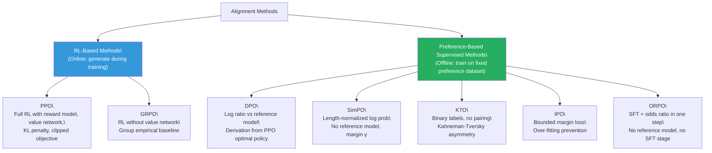

# Lesson 6.11 — Alignment Method Comparison: The Full Decision Matrix

---

## The Question You Will Actually Be Asked

In an interview, you will not be asked to derive DPO's loss from scratch. You will be asked: "You have a preference dataset of 50K pairs and a 13B parameter model. What alignment method would you choose and why?" Or: "Your team is seeing reward hacking in PPO training. What would you do?" Or: "We only have thumbs up/down feedback from production. How do you use it to align the model?"

These questions require you to know not just what each method is, but when each method wins and what the concrete costs of choosing wrong look like. This lesson is a synthesis — the side-by-side comparison you need to answer those questions fluently, with enough depth to defend your choice when pushed.

---

## The Alignment Method Landscape

Every method we have covered fits into one of two paradigms:

**RL-based methods (PPO, GRPO):** The policy is trained by generating responses, scoring them with a reward function, and updating parameters to maximize expected reward. These methods require rollout generation during training and can explore beyond the training data.

**Preference-based supervised methods (DPO, SimPO, KTO, IPO, ORPO):** The policy is trained directly on a preference dataset using a supervised loss. No rollout generation. No reward model inference during training. Simpler, more stable, but bounded by the quality of the preference data.

*The alignment method landscape. RL-based methods are online (they generate rollouts); preference-based methods are offline (they train on fixed datasets).*

---

## Full Comparison Matrix

| | **PPO** | **GRPO** | **DPO** | **SimPO** | **KTO** | **IPO** | **ORPO** |
|---|---|---|---|---|---|---|---|
| **Training paradigm** | RL (online) | RL (online) | Supervised (offline) | Supervised (offline) | Supervised (offline) | Supervised (offline) | Supervised (offline) |
| **Models in memory** | 4 (policy, ref, RM, value) | 3 (policy, ref, reward fn) | 2 (policy, ref) | 1 (policy only) | 2 (policy, ref) | 2 (policy, ref) | 1 (policy only) |
| **Reward model needed** | ✅ Trained separately | Optional (verifiable OK) | ❌ | ❌ | ❌ | ❌ | ❌ |
| **Reference model needed** | ✅ | ✅ | ✅ | ❌ | ✅ | ✅ | ❌ |
| **SFT stage required** | ✅ | ✅ | ✅ | ✅ | ✅ | ✅ | ❌ |
| **Data format** | Prompts | Prompts | (x, y_w, y_l) | (x, y_w, y_l) | (x, y, label) | (x, y_w, y_l) | (x, y_w, y_l) |
| **Can explore beyond training data** | ✅ | ✅ | ❌ | ❌ | ❌ | ❌ | ❌ |
| **Training stability** | ⚠️ Fragile | 🟡 Moderate | ✅ Stable | ✅ Stable | ✅ Stable | 🟡 Moderate | ✅ Stable |
| **Length bias** | None | None | ⚠️ Favors shorter | ✅ Normalized | Slight | ⚠️ Favors shorter | None |
| **Over-fitting risk** | Low | Low | Medium | Low | Low | Low | Medium |
| **Compute cost** | Very High | High | Low | Low | Low | Low | Low |
| **Memory cost** | Very High | High | Medium | Low | Medium | Medium | Low |
| **Implementation complexity** | Very High | High | Low | Low | Low | Low | Low |
| **Best reward type** | Subjective (learned RM) | Verifiable (binary/rule) | Preference pairs | Preference pairs | Binary labels | Preference pairs | Preference pairs |

---

## When Each Method Wins

### Use PPO when:
The task requires the model to discover behaviors that do not exist in any fixed preference dataset. The canonical case is training a model to achieve goals that cannot be anticipated — game-playing, open-ended multi-turn reasoning, or code generation where the space of correct solutions is too large to enumerate in advance. PPO's rollout exploration is its distinguishing strength.

Also use PPO when: you have a very high-quality reward model trained on a large human preference dataset, you have the infrastructure to run four-model training, and you need the maximum possible control over the training dynamics (adaptive KL, value function monitoring, per-step reward diagnostics).

**Warning:** Do not use PPO as your first choice just because it was the first famous alignment algorithm. Its complexity is a serious cost. Most alignment tasks do not need exploration, and DPO or ORPO will give comparable or better results with a fraction of the engineering effort.

### Use GRPO when:
The task has a verifiable reward signal — math problems with checkable answers, code with executable test cases, logic puzzles with verifiable solutions. GRPO's group baseline works naturally when rewards are binary (correct/incorrect), giving informative advantages without a learned reward model. If you are training a reasoning model (DeepSeek-R1 style), GRPO is the current state of the art.

Also use GRPO when: you want PPO's exploration benefits but not its value network complexity. The G× rollout cost is the price you pay; the reward is elimination of the most fragile part of PPO.

### Use DPO when:
You have a well-curated pairwise preference dataset, an existing SFT checkpoint, and your task does not require exploration. This is the most common alignment scenario. DPO is the default — it is simple, stable, and has strong theoretical grounding. For most RLHF-style alignment tasks (chat model quality improvement, safety alignment, style preference), DPO should be your starting point.

### Use SimPO when:
DPO is producing responses that are shorter than optimal, suggesting length bias. Or when memory is constrained and you cannot afford a reference model. SimPO is also useful when you want a minimum preference margin — γ prevents the model from satisfying the loss with trivially small quality differences.

### Use KTO when:
Your preference data is binary and unpaired — thumbs up/down from production traffic, star ratings, binary quality labels. You do not have paired (winner, loser) examples for each prompt. KTO lets you use all of this data directly without forcing artificial pairing.

### Use IPO when:
You are seeing DPO over-fit on a small preference dataset — training loss decreasing but held-out preference accuracy stagnating. Or when your preference data has high annotator disagreement (noisy labels), and you want the model to represent uncertainty rather than commit to potentially wrong preferences with high confidence.

### Use ORPO when:
You want to combine SFT and alignment in a single training run. This is especially compelling when starting from a base model (not an SFT checkpoint) or when your preference winners are themselves the instruction-following demonstrations you would have used for SFT. ORPO eliminates the two-stage pipeline and cuts memory requirements by ~50% compared to DPO.

---

## A Concrete Decision Walkthrough

**Scenario A:** You have a 7B model SFT checkpoint, 200K pairwise preference pairs rated by medical experts for a clinical documentation assistant, and 4× 80GB A100 GPUs.

**Analysis:** You have pairwise data (eliminates KTO), you have an SFT checkpoint (ORPO's single-stage advantage is irrelevant), memory is adequate (SimPO's memory advantage is irrelevant). No verifiable reward signal (eliminates GRPO's primary advantage). The task does not require exploration (eliminates PPO). The dataset is large (200K), which reduces over-fitting concern (eliminates IPO's specific advantage).

**Decision:** **DPO**. Standard case. Large, well-curated pairwise dataset + SFT checkpoint + adequate memory + no exploration needed = DPO is the textbook choice. β = 0.1 as starting point.

---

**Scenario B:** You are training a model to solve high school mathematics competition problems. You have 50K problems with known correct answers and a 14B model.

**Analysis:** Verifiable reward (correct answer is checkable programmatically). No preference dataset needed. Exploration is important (the model needs to discover correct solution paths). Memory is constrained (14B model is large).

**Decision:** **GRPO**. Binary verifiable reward (correct/incorrect) creates natural within-group variance that makes GRPO's baseline informative. No learned reward model needed. Value network eliminated. The G=8 rollout cost is offset by the simpler training setup. Cold-start with SFT on math chain-of-thought examples first.

---

**Scenario C:** You have a base model (no SFT checkpoint), 8K preference pairs (customer support conversations with good/bad ratings from human reviewers), and you want to align it in one training run to minimize iteration time.

**Analysis:** No SFT checkpoint (eliminates DPO, SimPO, KTO, IPO — all require an SFT starting point or at least treat the reference model as critical). Small dataset (8K pairs) means over-fitting risk is real. ORPO can train from a base model directly and its SFT component provides the instruction-following bootstrapping.

**Decision:** **ORPO**. ORPO's winners serve as SFT targets. Single training run. No reference model memory overhead. The 8K pairs are a concern for over-fitting, but ORPO's SFT regularization provides some protection. Monitor validation preference accuracy and stop early if it plateaus.

---

> **Interview note:** "If you had to choose between PPO and DPO for a new alignment task, what factors would drive your decision?" Strong answer: "The primary factor is whether the task requires exploration — if the optimal behavior can only be discovered through rollout generation rather than learned from existing preference pairs, PPO wins. If the preference data is sufficient to represent the target behavior, DPO wins on every engineering dimension: 2 models instead of 4, no rollout generation, no value network calibration, one hyperparameter instead of six. In practice, I would default to DPO unless I had a specific reason to need exploration. Secondary factors: if the task has verifiable rewards (math, code), GRPO often outperforms both PPO and DPO; if the preference data is unpaired binary, KTO; if I'm seeing DPO length bias, SimPO; if I'm starting from a base model, ORPO."

---

## The Impact of Data Quality on Method Choice

One dimension the comparison matrix does not fully capture: data quality has a different impact on each method.

**PPO / GRPO:** Data quality means the quality of the reward signal. For PPO, a noisy reward model causes the policy to optimize toward the reward model's errors. For GRPO with verifiable rewards, the signal is clean by definition (the answer is either correct or not). PPO with a high-quality reward model often outperforms DPO; PPO with a noisy reward model often underperforms DPO.

**DPO / SimPO / IPO:** Data quality means the quality of the preference pairs. Noisy labels (annotators frequently disagree on which response is better) wash out the training signal. DPO is more sensitive to label noise than IPO (IPO's bounded margin explicitly accounts for it). If inter-annotator agreement is below ~70%, consider IPO or collecting more data before running DPO.

**KTO:** Binary labels are inherently noisier than pairwise comparisons (a user's thumbs down might reflect the wrong question rather than a bad response). KTO's Kahneman-Tversky weighting (higher weight on rejections) partially compensates for this but does not eliminate it.

**ORPO:** The SFT component is only as good as the winner responses. If the "preferred" responses in your dataset are only marginally better than the rejected ones, the SFT component trains on mediocre targets.

---

## The Practical Starting Kit

If you are new to alignment work and need a starting point for most tasks:

1. **Build a solid SFT checkpoint first.** All offline preference methods except ORPO require it. The SFT quality is the floor that alignment training cannot go below.

2. **Start with DPO.** It is the simplest method with the strongest theoretical grounding. Use β = 0.1 as a default. Run for 1–3 epochs on your preference dataset.

3. **Check for length bias.** If your model consistently generates shorter responses than you want, switch to SimPO.

4. **Scale up the preference data before trying PPO.** PPO's advantage is exploration, not data efficiency. If you do not have at least 50K+ preference pairs and a validated reward model, DPO will typically match PPO's quality with a fraction of the effort.

5. **Use GRPO for reasoning and code.** If your task has verifiable correct/incorrect answers, GRPO with binary rewards is the strongest alignment approach available.

---

## Summary

- **PPO** is the most powerful alignment method (exploration capability, full reward model control) but the most expensive and fragile to implement. Use it only when exploration is required or when you have verifiable rewards and a full RL infrastructure.
- **GRPO** eliminates PPO's value network by using group empirical baselines. It is the best choice for verifiable reward tasks (math, code, logic) and is what powers DeepSeek-R1.
- **DPO** is the default for standard preference alignment: theoretically grounded, simple to implement, stable to train, requires only paired preference data and an SFT checkpoint. Start here.
- **SimPO** adds length normalization and a reward margin to DPO's design, removing the reference model. Use when DPO produces length-biased outputs or when memory is constrained.
- **KTO** handles unpaired binary feedback, enabling use of production thumbs up/down signals at scale without pairwise annotation. Use when your data is binary-labeled rather than paired.
- **IPO** prevents DPO over-optimization on small or noisy preference datasets by replacing the log-sigmoid with a bounded squared loss. Use when DPO is over-fitting or when annotator disagreement is high.
- **ORPO** merges SFT and preference alignment into one training stage without a reference model. Use when starting from a base model or when a single-stage pipeline is required.
- Data quality is the most important factor across all methods. No alignment algorithm can turn low-quality preference data into a high-quality model. Get the data right before choosing the algorithm.

---
