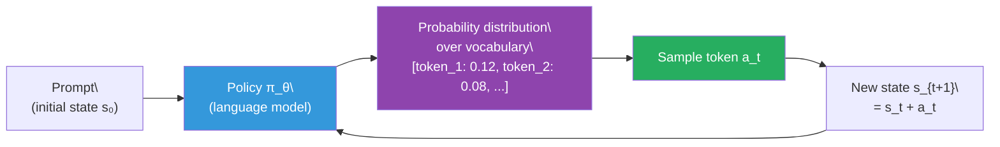
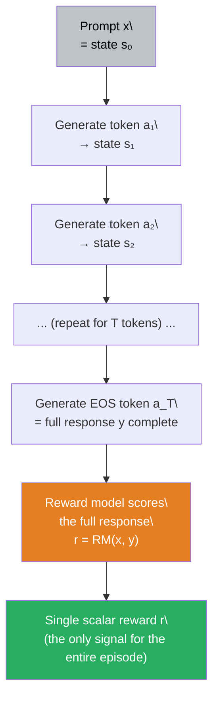
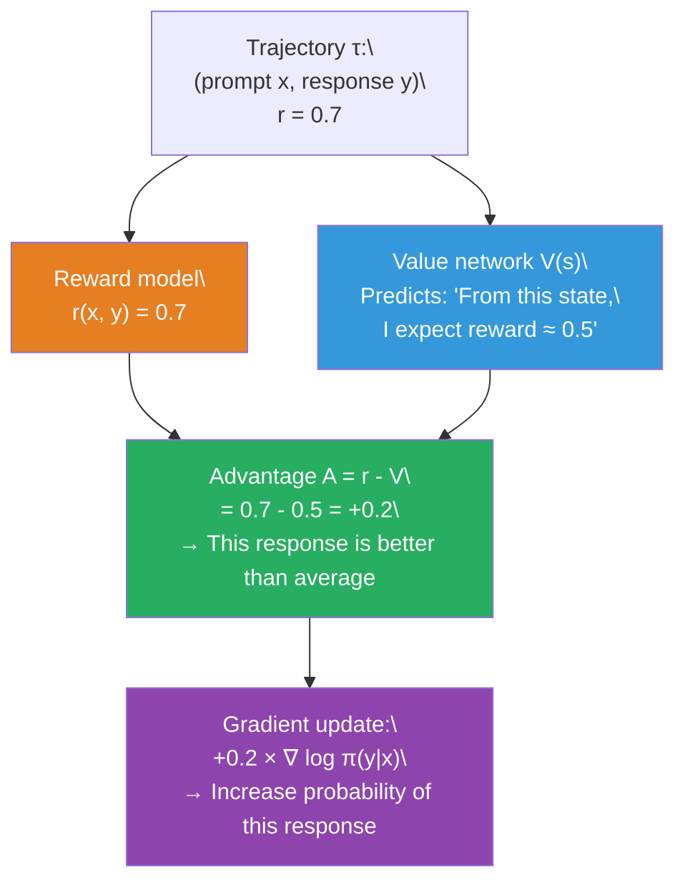

# Lesson 6.2 — RL Foundations for Alignment

---

## Why You Need to Know This

Every alignment paper — PPO, DPO, GRPO, ORPO — uses a shared vocabulary from reinforcement learning. The papers assume you know what a policy is, what an advantage is, what the policy gradient theorem says. If you do not, the equations are impenetrable and the design choices feel arbitrary. This lesson gives you exactly the vocabulary you need for LLM alignment, nothing more. This is not a general RL course. You will not learn how to train a robot arm. You will learn what every alignment paper means when it says "the policy," "the advantage," and "the REINFORCE gradient."

The reason alignment uses RL — and not just supervised learning — is explained in Lesson 6.1. The short version: human preferences cannot be expressed as a fixed dataset of correct answers. They can only be expressed as a reward signal, and RL is the framework for learning from reward signals rather than correct labels.

---

## The Core Abstraction: An Agent in an Environment

RL is built on a single abstraction: an **agent** takes **actions** in an **environment**, receives **rewards**, and learns a **policy** that maximizes expected total reward. In general RL, the agent might be a game-playing AI or a robot. In LLM alignment, every term maps directly to language generation.

| RL Term | LLM Alignment Meaning |
|---|---|
| **Agent** | The language model |
| **Environment** | The prompt + generation context |
| **State** | The prompt plus all tokens generated so far |
| **Action** | Choosing the next token (from a vocabulary of 32,000–100,000+ tokens) |
| **Policy** | The model's probability distribution over the next token given the current state |
| **Reward** | A scalar score given by the reward model after the full response is generated |
| **Episode** | One complete interaction: one prompt → full generated response → reward |

The agent does not receive a reward after every token. It generates an entire response — sometimes hundreds of tokens — and only then gets a single scalar reward. This is called a **sparse reward** setting, and it is the norm in LLM alignment.

---

## The Policy

The **policy** π is the function that maps states to a probability distribution over actions. For a language model, the policy at each step is the probability distribution over the entire vocabulary:

```
π_θ(a_t | s_t) = probability of generating token a_t given the current state s_t
```

Where θ are the model's parameters. Training RL means updating θ so that the policy assigns higher probability to actions that lead to higher reward.

The subscript θ is important. The policy is parameterized — it is not fixed. It changes as you train. When a paper says "the policy improved," it means the model parameters changed such that the distribution over tokens shifted toward higher-reward outputs.

There is also a **reference policy** π_ref, which is the SFT checkpoint — the model before RL training. The reference policy does not change during RL training. It serves as a constraint: the trained policy should not drift too far from the reference policy. This is enforced by the KL penalty (covered in depth in Lesson 6.3).


*At each step, the policy takes the current state and outputs a probability distribution. One token is sampled from this distribution, appended to the state, and the process repeats.*

---

## State, Action, and the Token-by-Token Loop

### State

The **state** at step t is everything available to the model at that moment:

```
s_t = [prompt tokens; token_1; token_2; ...; token_{t-1}]
```

For an autoregressive transformer, the full context window up to the current position is the state. The model has no other information. It cannot look ahead, it cannot revisit decisions, and it cannot access external memory unless explicitly given tools.

### Action

The **action** at step t is selecting one token from the vocabulary:

```
a_t ∈ {token_1, token_2, ..., token_|V|}
```

Where |V| is the vocabulary size (typically 32,000 for Llama 2, 128,256 for Llama 3, etc.). This is a massive action space — far larger than most RL problems. A chess-playing agent has ~35 legal moves per turn. A language model has ~32,000 possible actions per step. This is why naive exploration strategies from classic RL do not work here.

### Episode

An **episode** runs from the prompt through the full response:

1. Receive prompt (state s_0)
2. Generate token a_1 (action), get new state s_1
3. Generate token a_2 (action), get new state s_2
4. ... repeat until EOS (end-of-sequence) token is generated ...
5. Receive reward r from the reward model (based on the full sequence)

One episode = one (prompt, response) pair = one reward signal.

### Trajectory

A **trajectory** τ is the complete sequence of states and actions in an episode:

```
τ = [(s_0, a_1), (s_1, a_2), (s_2, a_3), ..., (s_{T-1}, a_T)]
```

The **return** G of a trajectory is the total reward. In the sparse-reward LLM setting, G = r (the single end-of-sequence reward), because there is no intermediate reward at each token step.


*One complete episode. The model generates every token without feedback. Only after the full response is complete does the reward signal arrive.*

---

## The Objective: Maximize Expected Return

RL training maximizes the **expected return** — the expected reward across all possible responses the policy might generate, over all prompts in the training distribution:

```
J(θ) = E_{x ~ D, y ~ π_θ(·|x)} [ r(x, y) ]
```

Where:
- x is a prompt sampled from the training prompt distribution D
- y is a full response sampled from the current policy given prompt x
- r(x, y) is the scalar reward from the reward model

This is fundamentally different from the SFT loss. SFT minimizes cross-entropy against a fixed dataset. RL maximizes a reward by **exploring** — generating responses and using the reward signal to update the policy. The policy can discover high-reward responses that were never in the training data.

---

## The Policy Gradient Problem: Sampling is Not Differentiable

Here is the core technical challenge. You want to compute the gradient of J(θ) with respect to θ so you can run gradient descent. But J(θ) involves sampling — the response y is sampled from the policy, and sampling is a discrete operation with no gradient. You cannot backpropagate through a `torch.multinomial()` call.

The **policy gradient theorem** (also called REINFORCE, from Williams 1992) is the solution. It provides a way to compute an unbiased estimate of the gradient of J(θ) without needing to differentiate through the sampling step:

```
∇_θ J(θ) = E_{τ ~ π_θ} [ G(τ) · ∇_θ log π_θ(τ) ]
```

Breaking this down:
- `G(τ)` is the return of the trajectory (the reward signal)
- `∇_θ log π_θ(τ)` is the gradient of the log probability of the trajectory — this IS differentiable
- The expectation is estimated by sampling trajectories and averaging

For an LLM with a single end-of-sequence reward r:

```
∇_θ J(θ) ≈ r(x, y) · Σ_t ∇_θ log π_θ(a_t | s_t)
```

**Intuition in plain English:** If the response got a high reward, increase the log probability of every token in the response (make them more likely). If the reward was low, decrease the log probabilities (make them less likely). Scale the update by how good or bad the reward was.

This is elegant but has high variance — a single trajectory's reward is a noisy estimate of the true expected return. This motivates the **advantage** function.

> **Interview note:** "Why can't you just backpropagate through the reward signal to train the policy?" Strong answer: "Because the response generation involves discrete token sampling, which has no gradient. The policy outputs a probability distribution over tokens, and you sample from that distribution to get the actual token. The sampling operation is not differentiable — you cannot compute ∂(sampled_token)/∂(model_parameters). The policy gradient theorem sidesteps this by reformulating the gradient of expected reward in terms of the gradient of log probability, which IS differentiable. This allows you to estimate the gradient by sampling trajectories and weighting the log-probability gradient by the observed reward."

---

## Advantage: The Key to Variance Reduction

Suppose a response receives a reward of 0.7. Should you reinforce it (increase its probability) or suppress it (decrease it)?

The answer depends on context. If the average response to this prompt gets a reward of 0.4, then 0.7 is well above average — reinforce it strongly. If the average response gets 0.9, then 0.7 is below average — suppress it. The raw reward is not informative on its own. You need to know whether this response is better or worse than what the policy normally produces.

The **advantage function** A(s, a) captures this:

```
A(s_t, a_t) = Q(s_t, a_t) - V(s_t)
```

Where:
- **Q(s, a)** — the action-value function: expected total return if you take action a in state s and then follow the current policy for the rest of the episode
- **V(s)** — the value function: expected total return from state s under the current policy (the baseline — what you would get on average without choosing any specific action)
- **A(s, a)** — the advantage: how much better (or worse) is this specific action compared to the average action from this state

In the LLM sparse-reward setting, Q(s, a) reduces to the reward r for the episode (since reward only arrives at the end), and V(s) is estimated by a separate neural network called the **critic** or **value network**.


*The advantage function uses a baseline (the value estimate) to determine whether a response is above or below average. Only above-average responses get reinforced.*

The value network is trained to minimize the squared error between its predictions and the actual observed rewards — a supervised regression task that runs in parallel with the policy update. This is the **critic** in actor-critic methods. PPO (Lesson 6.6) uses exactly this structure: a policy network (actor) and a value network (critic) trained simultaneously.

---

## Why Advantage Matters: A Numerical Example

Consider a customer support model prompted with "I'm angry about my delayed order."

- Response A: Empathetic apology with solution offered → reward 0.85
- Response B: Robotic acknowledgment with no solution → reward 0.45
- Response C: Deflection to FAQ page → reward 0.30

Value function estimate for this prompt type: V(s) = 0.55 (the average reward the current policy gets on similar prompts).

| Response | Reward | Value | Advantage | Action |
|---|---|---|---|---|
| A | 0.85 | 0.55 | **+0.30** | Strongly reinforce |
| B | 0.45 | 0.55 | **-0.10** | Mildly suppress |
| C | 0.30 | 0.55 | **-0.25** | Strongly suppress |

Without the advantage, you would use raw rewards and reinforce Response B (reward 0.45 > 0). With the advantage, you correctly identify that Response B is actually below average and suppress it. The value function baseline is what makes this distinction possible.

---

## On-Policy vs Off-Policy: Why Alignment Uses On-Policy Methods

RL methods fall into two categories:

**On-policy:** The policy being trained is the same policy used to collect data. You generate responses with the current policy, compute rewards, update the policy, and repeat. PPO and GRPO are on-policy.

**Off-policy:** You train on data collected by a different (or older) policy. You have a replay buffer of past experiences. DQN and many robotics algorithms are off-policy.

LLM alignment is predominantly on-policy because the reward model scores responses from the current policy's distribution. As the policy changes, the distribution of responses changes, and old responses become stale. You want your reward signals to reflect what the current policy actually produces. Off-policy methods introduce distribution mismatch between the policy being trained and the policy that collected the data, which can cause instability.

This is also why PPO includes the **clipped probability ratio** (covered in Lesson 6.6): it allows you to use a few gradient steps on the same batch of rollouts (slightly off-policy) without the instability of fully off-policy training.

> **Interview note:** "What is the policy in RLHF and how does it change during training?" Strong answer: "The policy is the language model itself — specifically, its probability distribution over the next token given all previous tokens. It starts as a copy of the SFT checkpoint. During RL training, the policy parameters are updated via policy gradient: responses that score above the value function baseline have their log probabilities increased; responses below have their log probabilities decreased. The magnitude of the update is proportional to the advantage. The reference policy — a frozen copy of the SFT checkpoint — is not updated; it serves as a constraint via the KL penalty to prevent the policy from drifting into degenerate reward-hacking territory."

---

## Summary

- In LLM alignment, the **policy** is the language model, the **state** is the prompt plus all tokens generated so far, the **action** is the next token chosen, and the **reward** is a scalar score from the reward model given only after the full response is generated.
- One **episode** = one (prompt, response, reward) triple. One **trajectory** = the full sequence of (state, action) pairs in that episode. Learning happens by sampling many trajectories and updating the policy based on their rewards.
- The **policy gradient theorem** enables gradient computation despite discrete token sampling: ∇J(θ) = E[G · ∇ log π(τ)]. High-reward trajectories increase log-probability of their tokens; low-reward trajectories decrease it.
- The **advantage** A(s, a) = Q(s, a) - V(s) measures how much better a response is than the expected baseline from that state. Using advantage instead of raw reward drastically reduces gradient variance and is essential for stable training.
- The **value network (critic)** learns to predict expected reward from any state. It is trained simultaneously with the policy (actor) in actor-critic methods like PPO. GRPO eliminates the value network entirely — at the cost of needing multiple rollouts per prompt.
- LLM alignment uses **on-policy** methods: the policy being trained collects its own rollouts, ensuring reward signals reflect the current model's output distribution. Off-policy data leads to distribution mismatch and instability.

---
