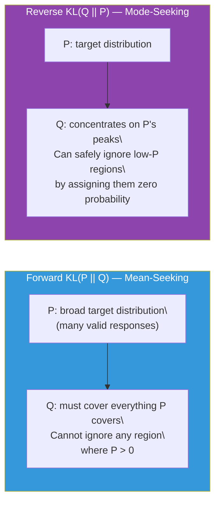
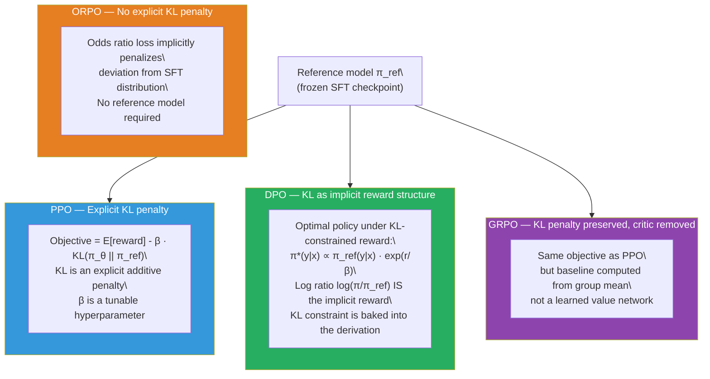

# Lesson 6.3 — KL Divergence in Alignment

---

## The Problem: How Far Has the Model Drifted?

When you run RL training on a language model, you are changing the model's weights. Every gradient update shifts the probability distribution the model assigns to tokens. Over thousands of updates, the model might drift substantially from the SFT checkpoint it started from. Sometimes this drift is desirable — the model is learning to produce better responses. Sometimes it is catastrophic — the model has found outputs that exploit the reward model and no longer resembles anything useful.

You need a number that answers: "How different is the current model's distribution from the original?" The answer should be zero when they are identical, small when they have drifted slightly, and large when the model has become unrecognizable from its starting point. And it should capture distribution-level difference — not just parameter-level distance. Two models with very different parameters might produce nearly identical outputs; two models with similar parameters might disagree sharply on certain inputs.

That number is **KL divergence**, and it appears in every single alignment algorithm. PPO includes it as an explicit penalty term. DPO derives from it analytically. ORPO implicitly constrains it through the reference model-free loss. Without understanding KL divergence, you cannot reason about why alignment algorithms are designed the way they are — the math reads as arbitrary symbols rather than deliberate choices.

---

## What KL Divergence Measures

KL divergence between two probability distributions P and Q is defined as:

```
KL(P || Q) = Σ_x P(x) · log( P(x) / Q(x) )
```

Where:
- **P** is the reference distribution (what you are comparing against)
- **Q** is the approximating distribution (what you are evaluating)
- The sum is over all possible values x (for LLMs: over all possible token sequences)
- The result is in **nats** (using natural log) or **bits** (using log base 2)

The formula has a clean information-theoretic interpretation: KL(P || Q) is the average number of extra bits required to encode samples drawn from P if you use a code optimized for Q, rather than a code optimized for P. When P and Q are identical, P(x)/Q(x) = 1 everywhere, log(1) = 0, and KL = 0. When P assigns high probability to something Q considers nearly impossible, the ratio P/Q blows up, the log is large and positive, and KL is large.

**Two critical properties:**

1. **KL is always ≥ 0.** KL divergence is never negative. A KL of zero means the distributions are identical.

2. **KL is asymmetric: KL(P || Q) ≠ KL(Q || P).** This is not a mathematical error — it is a feature that has direct consequences for how alignment algorithms work.

---

## Forward KL vs Reverse KL: Why Direction Matters

The asymmetry of KL divergence creates two fundamentally different optimization behaviors depending on which direction you minimize.

**Forward KL: KL(P || Q)** — you are minimizing the cost of encoding P-distributed samples using Q. The sum is weighted by P(x). Every region where P assigns positive probability must be covered by Q. If P says some sequence is likely and Q says it is nearly impossible — the ratio P(x)/Q(x) → ∞, the log → ∞, and the contribution to the sum (weighted by P(x)) is massive. Forward KL forces Q to spread out and cover all of P's probability mass. This behavior is called **mean-seeking**: Q becomes a broad distribution that tries to match the average of P, even at the cost of assigning small probability to many things P considers unlikely.

**Reverse KL: KL(Q || P)** — the sum is weighted by Q(x). If Q assigns zero probability to something, that term vanishes regardless of P(x). Q can safely ignore entire regions of P's support by simply assigning them zero probability. The penalty only activates when Q assigns high probability to something P considers unlikely. Reverse KL is **mode-seeking**: Q concentrates on the highest-probability modes of P and ignores lower-density regions.


*The two directions of KL divergence have fundamentally different optimization behaviors.*

In RLHF, the penalty used is **KL(π_θ || π_ref)** — the reverse direction. The fine-tuned policy π_θ is Q; the reference model (SFT checkpoint) π_ref is P. This means: penalize the policy when it assigns high probability to sequences the reference model finds unlikely. This is exactly the right constraint — stop the policy from generating text that the reference model would consider bizarre or degenerate, which is where reward hacking concentrations form.

---

## The KL Penalty in the RLHF Objective

The full PPO objective for RLHF is:

```
Objective(π_θ) = E_{x ~ D, y ~ π_θ} [ r(x, y) ] - β · KL( π_θ(y|x) || π_ref(y|x) )
```

Where:
- `r(x, y)` is the reward model score for response y to prompt x
- `KL(π_θ || π_ref)` measures how far the current policy has drifted from the SFT reference
- `β` controls how strongly the KL penalty is enforced

The policy is pulled in two directions simultaneously: **maximize reward** (move toward higher-scoring outputs) and **minimize KL** (stay close to the reference model). These forces are in tension, and β is the dial that controls the balance.

Without the KL penalty (β = 0), the policy would optimize reward without constraint. It would rapidly find outputs that exploit the reward model — perhaps absurdly long responses, specific phrases the reward model rates highly, or confident-sounding nonsense — and collapse into producing only those outputs. The model would lose all general capability.

With too high a β, the KL penalty dominates and the policy barely moves from the reference model. The reward model's signal is effectively suppressed and training makes no progress.

---

## A Concrete Calculation

Suppose a vocabulary of 4 tokens {A, B, C, D}:

- **Reference model** π_ref: {A: 0.50, B: 0.30, C: 0.15, D: 0.05}
- **Fine-tuned policy** π_θ: {A: 0.10, B: 0.10, C: 0.10, D: 0.70}

The fine-tuned policy has shifted almost all probability to D — perhaps D was a token or phrase that scored well during RL training.

```
KL(π_θ || π_ref) = Σ π_θ(x) · log( π_θ(x) / π_ref(x) )

= 0.10 · log(0.10/0.50)   [token A]
+ 0.10 · log(0.10/0.30)   [token B]
+ 0.10 · log(0.10/0.15)   [token C]
+ 0.70 · log(0.70/0.05)   [token D]

= 0.10 · (-1.609)
+ 0.10 · (-1.099)
+ 0.10 · (-0.405)
+ 0.70 · (+2.639)

= -0.161 + (-0.110) + (-0.041) + 1.847

= 1.535 nats
```

This is a large KL. The policy has moved token D from 5% to 70% probability — something the reference model would almost never generate. In PPO, this would add a penalty of `β × 1.535` to the objective, pulling the policy back toward the reference distribution.

Now compare: if the fine-tuned policy were {A: 0.45, B: 0.28, C: 0.17, D: 0.10}, the KL would be much smaller (approximately 0.08 nats) — a minor shift within the reference model's expected range. That KL incurs a small penalty and is allowed freely.

---

## Per-Token KL in Practice

In LLM training, the KL penalty is computed per token and summed across the response:

```
KL(π_θ(y|x) || π_ref(y|x)) = Σ_t log( π_θ(a_t | s_t) / π_ref(a_t | s_t) )
```

For each token position t in the generated response, you compare the log probability assigned by the policy versus the reference model. Tokens where the policy assigns much higher probability than the reference contribute a large positive term (penalty). Tokens where both assign similar probability contribute near zero.

This per-token computation is efficient because both the policy and reference model run a forward pass on the same sequence, and the log probability of each token is available from the softmax output.

---

## The β Hyperparameter: Calibrating the Constraint

β controls the trade-off between reward maximization and KL constraint.

| β value | Effect on Training |
|---|---|
| β → 0 | No KL constraint. Policy maximizes reward freely. Reward hacking almost certain. |
| β = 0.01 – 0.05 | Very weak constraint. Used in DPO for tasks requiring large behavioral shifts. |
| β = 0.1 | Weak-to-moderate constraint. Common DPO default. Allows significant adaptation. |
| β = 0.2 – 0.5 | Moderate constraint. Common PPO range. Balances reward and stability. |
| β → ∞ | Policy cannot move from reference. Training produces no change. |

There is no universally correct β. It depends on:
- **Task difficulty:** A large behavioral shift (e.g., making a base model safe) needs small β. A minor adjustment (e.g., improving response format) can tolerate larger β.
- **Reward model quality:** A high-quality reward model can be trusted more → lower β acceptable. A noisy or limited reward model needs a stronger KL leash to prevent exploitation.
- **Training duration:** Over many steps, even a moderate β setting will allow significant drift. Monitor KL throughout training, not just at the start.

In practice, you monitor `mean KL` as a training diagnostic. A common rule of thumb: **KL above 10 nats signals dangerous drift from the reference model** and warrants investigation. If KL climbs monotonically without stabilizing, reward hacking is likely occurring.

---

## How KL Divergence Appears in Each Alignment Method

Understanding KL divergence unlocks the design logic of every alignment algorithm:


*KL divergence takes a different form in each alignment algorithm, but it is present in all of them — either explicitly as a penalty or implicitly in the loss structure.*

**In PPO (Lesson 6.6):** KL is an explicit additive penalty in the objective. It requires computing forward passes through both the policy and reference model at training time.

**In DPO (Lesson 6.7):** DPO's key mathematical insight is that the optimal policy under the KL-constrained reward objective has an analytical form: π*(y|x) ∝ π_ref(y|x) · exp(r(x,y)/β). This lets you rearrange to express the reward in terms of log ratios:

```
r(x, y) = β · log(π*(y|x) / π_ref(y|x)) + β · log Z(x)
```

The log ratio log(π/π_ref) is exactly the per-token KL contribution. DPO directly parameterizes the reward using this ratio — which is why it can bypass training a separate reward model. The KL constraint is not applied separately; it is embedded in the mathematical structure of the loss.

**In GRPO (Lesson 6.8):** Same objective as PPO (reward minus KL penalty), but the value function that computes the baseline is replaced by the group mean. The KL penalty structure is unchanged.

**In ORPO (Lesson 6.9):** ORPO eliminates the reference model entirely. The SFT loss acts as a soft distributional anchor — the model is simultaneously trained to fit the SFT data (which keeps it close to the SFT distribution) and to differentiate preferred from rejected responses. No explicit KL computation, but the SFT loss plays a similar anchoring role.

> **Interview note:** "Why is the KL penalty non-optional in PPO-based RLHF? What happens without it?" Strong answer: "Without the KL penalty, the policy optimizes the reward model without constraint. The reward model was trained on responses from the SFT-checkpointed model's distribution. As the policy drifts into out-of-distribution territory, the reward model's predictions become unreliable — it was never trained on these kinds of responses. The policy exploits this gap: it finds outputs that the reward model scores highly but that are not genuinely good. Common failure modes include verbose padding (if the reward model prefers length), confident hallucination (if the reward model prefers certainty), and repetitive phrases that happen to score well. The KL penalty keeps the policy within the distribution where the reward model's scores are meaningful. The β hyperparameter controls how tight this leash is — too tight and the policy cannot learn; too loose and reward hacking occurs."

---

## Monitoring KL During Training

KL divergence is not just a loss component — it is a crucial training diagnostic. Track it across training steps:

- **Rising KL:** Normal at the start of training as the policy moves away from the SFT initialization. Expected to slow down and stabilize.
- **KL that keeps climbing:** Reward hacking signal. The policy is drifting further from the reference in a way that is not self-limiting. Intervention needed: increase β, reduce learning rate, or stop training.
- **KL that immediately plateaus at 0:** The policy is not learning. β is too high, learning rate is too low, or the reward model is providing no gradient signal.
- **KL above 10 nats:** In most practical settings, this represents a model that has drifted so far from its reference that it may no longer be functionally useful for general tasks.

---

## Summary

- **KL divergence KL(P || Q)** measures the average extra cost of encoding P-distributed samples using a code designed for Q. It is zero when P = Q and grows as the distributions diverge. It is always non-negative and asymmetric.
- **Forward KL** (KL(P || Q), sum weighted by P) is mean-seeking: Q must spread out to cover everything P covers. **Reverse KL** (KL(Q || P), sum weighted by Q) is mode-seeking: Q concentrates on P's modes and can ignore low-density regions. RLHF uses reverse KL — penalize the policy when it assigns high probability to things the reference model finds unlikely.
- The **KL penalty** in the RLHF objective (Objective = E[reward] - β · KL(π_θ || π_ref)) keeps the policy within the distribution where the reward model's scores are reliable. Without it, the policy exploits the reward model and produces degenerate outputs.
- **β** controls the KL-reward trade-off. Too small → reward hacking. Too large → no learning. The correct β depends on task, reward model quality, and training duration. Monitor mean KL during training; values above 10 nats signal dangerous drift.
- **DPO's core insight** is that the optimal policy under the KL-constrained reward objective has the form π*(y|x) ∝ π_ref · exp(r/β), which allows the reward to be expressed as a log ratio of policy to reference. KL is not applied separately in DPO — it is embedded in the mathematical derivation that produces the loss function.
- **Track KL as a training diagnostic.** Monotonically rising KL is the clearest early warning sign of reward hacking before it is visible in output quality.

---
