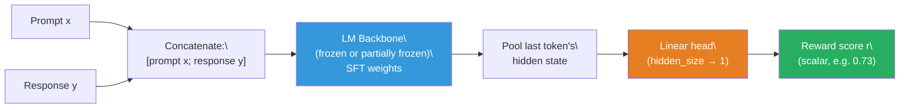
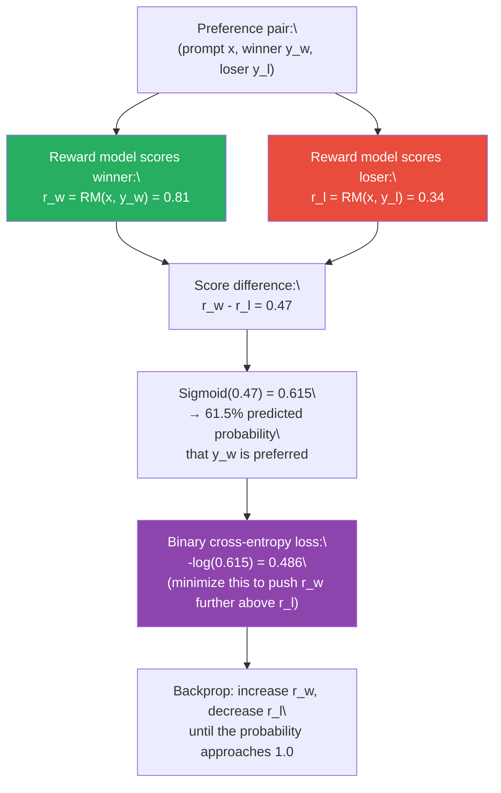
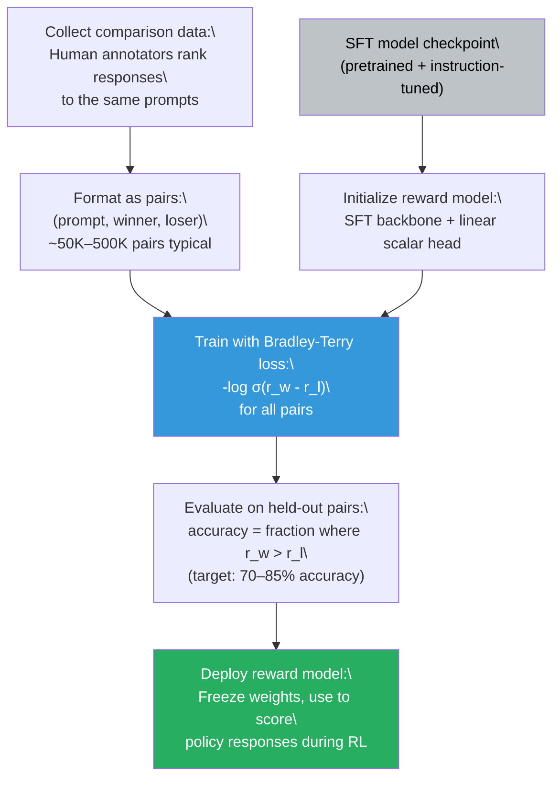

# Lesson 6.4 — Reward Models

---

## The Signal Problem

You want to train a language model to produce responses that humans prefer. But "what humans prefer" is not a differentiable signal. You cannot backpropagate through a human. And you cannot afford to have a human evaluate every response during training — a PPO training run generates millions of (prompt, response) pairs, and each one needs a score.

The solution is to train a separate neural network to simulate human judgment. You collect human preferences once, train this network to predict those preferences, and then use it as a fast, differentiable proxy for human evaluation during RL training. This network is the **reward model** (RM), also called the **preference model** or **Bradley-Terry model** in the literature.

The reward model is the bridge between the human preference signal and the mathematical objective that drives RL training. Every alignment method that uses RL — PPO, GRPO — depends on it. Even methods that bypass it, like DPO, implicitly assume the preference data the reward model would have been trained on. Understanding the reward model means understanding what the RL signal actually measures — and where it can go wrong.

---

## What a Reward Model Is

A reward model is architecturally almost identical to the language model it is scoring. Take a pretrained or SFT language model, remove the language modeling head (the final linear layer that maps hidden states to vocabulary logits), and replace it with a linear regression head that outputs a single scalar. That scalar is the reward score.

```
Architecture: [Pretrained LM backbone] → [Linear head: hidden_size → 1] → reward scalar
```

The backbone is initialized from the SFT checkpoint. This is important: the reward model needs to understand language well enough to evaluate response quality, and a pretrained backbone provides that understanding. Starting from the SFT checkpoint also aligns the reward model with the distribution of responses it will be scoring.

During inference, you feed the reward model a (prompt, response) pair concatenated together, and it outputs a single number: the predicted reward. Higher is better, by convention.


*The reward model architecture. It takes a (prompt, response) pair and outputs a single scalar.*

---

## How Preferences Become Training Data: Comparison Pairs

The reward model is trained on **comparison data** — pairs of responses to the same prompt, with a human label indicating which is preferred. The format is:

```
(prompt x, response y_w, response y_l)
```

Where:
- `y_w` is the **winner** (the preferred response)
- `y_l` is the **loser** (the rejected response)

To collect this data, you show human annotators a prompt and two or more model responses side by side. Annotators choose which response is better according to the criteria you specify (helpfulness, factual accuracy, harmlessness, etc.). This is far easier and faster than asking annotators to write ideal responses from scratch.

For a dataset like InstructGPT's (used to train the reward model behind early ChatGPT), OpenAI collected approximately 50,000 prompts with 4–9 ranked responses each, producing around 330,000 comparison pairs. The key insight: comparison data scales because judging is easier than generating. A non-expert annotator who cannot write a medical explanation can still reliably say "this explanation is clearer and more accurate than that one."

---

## The Bradley-Terry Model: Why the Loss is Cross-Entropy

The standard training objective for reward models comes from the **Bradley-Terry model** — a statistical model of pairwise comparisons. The Bradley-Terry model assumes that the probability that response y_w is preferred over y_l is determined by their underlying "strength" scores:

```
P(y_w ≻ y_l | x) = σ( r(x, y_w) - r(x, y_l) )
```

Where:
- `r(x, y)` is the scalar reward score the model assigns to response y given prompt x
- `σ` is the sigmoid function: σ(z) = 1 / (1 + exp(-z))

This says: the probability that the winner is preferred equals the sigmoid of the difference in reward scores. If the winner gets a much higher reward (large positive difference), the sigmoid output approaches 1.0 — confident preference. If both responses get similar rewards (difference near 0), the sigmoid output approaches 0.5 — no strong preference.

Training maximizes the log-likelihood of the observed preferences, which gives the binary cross-entropy loss:

```
L_RM = -E[ log σ( r(x, y_w) - r(x, y_l) ) ]
```

In plain English: for every comparison pair, push the winner's score above the loser's score, by exactly as much as needed to explain the preference probability. If you have 10,000 comparison pairs, you run gradient descent to find reward model parameters that collectively make preferred responses score higher than rejected responses, on average, in the most parsimonious way the Bradley-Terry model allows.


*The reward model training loop. Each comparison pair pushes the winner's score above the loser's score.*

---

## The Full Reward Model Training Pipeline


*The reward model training pipeline, from SFT checkpoint to deployed scorer.*

---

## A Concrete Example: Medical Q&A Reward Model

Suppose you are building a medical Q&A assistant and you need a reward model to score responses.

**Prompt:** "What are the first-line treatments for Type 2 diabetes?"

**Response A (winner):** "The first-line treatment for Type 2 diabetes is lifestyle modification — a combination of dietary changes and regular physical activity. If lifestyle changes are insufficient after 3 months, the standard first-line medication is metformin, which reduces hepatic glucose production and improves insulin sensitivity. Contraindications include renal impairment (eGFR < 30). Additional agents such as GLP-1 receptor agonists or SGLT-2 inhibitors are added based on comorbidities."

**Response B (loser):** "Type 2 diabetes can be treated with medication. There are several diabetes drugs available including metformin, insulin, and others. You should see your doctor for the best treatment plan."

An annotator familiar with medical content immediately recognizes A as more accurate, specific, and actionable — even if they could not have written it themselves. They mark A as preferred.

After training on thousands of such pairs, the reward model generalizes: it learns to score responses that are specific, accurate, and actionable more highly than vague, incomplete ones — across medical prompts it has never seen. This generalization is what makes the reward model useful for RL training, where the policy will generate novel responses not in the comparison dataset.

---

## What Reward Models Actually Learn: Score Distribution

A well-trained reward model does not output scores in a fixed range. The scores are real numbers with no inherent bounds. In practice, you expect:

- **High-quality responses:** Scores clustered in a positive range (e.g., 0.5 to 2.0)
- **Average responses:** Scores near zero
- **Low-quality responses:** Scores in a negative range (e.g., -1.0 to -0.5)
- **Harmful responses:** Scores in a strongly negative range (e.g., -3.0 to -5.0)

The exact scale depends on the training data distribution and model initialization. What matters is the **ordering** — the reward model needs to rank preferred responses above rejected ones, not output calibrated probabilities.

During RL training, you typically normalize reward scores: subtract the mean and divide by the standard deviation computed over recent batches. This prevents the reward scale from shifting unpredictably as the policy changes and keeps the RL training signal stable.

---

## Reward Model Limitations: Why It Is an Imperfect Proxy

The reward model is the weakest link in the RLHF pipeline. Understanding its limitations is essential for diagnosing alignment failures:

**1. Distribution shift.** The reward model was trained on responses from the SFT model's distribution. As the policy model improves and generates responses that are qualitatively different from what was in the comparison data, the reward model is being asked to score out-of-distribution inputs. Its predictions become unreliable. This is the root cause of reward hacking (covered in Lesson 6.5).

**2. Annotator inconsistency.** Human preference judgments are noisy. Two annotators often disagree on the same pair, especially for nuanced cases. The reward model learns the average of this noisy signal, which means it can reflect human biases, blind spots, and inconsistencies.

**3. Reward over-optimization.** Even if the reward model perfectly captures preferences on its training distribution, optimizing too hard against it causes the policy to find edge cases where the reward model is wrong. The policy is, in effect, discovering the reward model's failure modes. See Lesson 6.5 for the quantitative analysis of this phenomenon.

**4. Dimension collapse.** If the comparison data emphasizes certain quality dimensions (e.g., length, confidence, formatting), the reward model may over-index on these and ignore others (e.g., factual accuracy, safety). The reward model reflects what the comparisons measured, not what quality actually means.

**5. Lack of absolute calibration.** The reward model scores are relative, not absolute. A score of 1.0 does not mean "good response" in isolation — it only means "better than whatever got 0.0." This makes reward model scores hard to interpret outside the context of the comparison distribution they were trained on.

> **Interview note:** "How is a reward model trained, and what are its key limitations?" Strong answer: "The reward model is a language model backbone with the LM head replaced by a scalar regression head, initialized from the SFT checkpoint. It is trained on pairwise comparison data using the Bradley-Terry cross-entropy loss: -log σ(r_w - r_l), which pushes the preferred response score above the rejected response score. The key limitations are: (1) distribution shift — the reward model is only reliable for responses similar to what it was trained on, and as the policy generates increasingly optimized responses, the reward model's scores become unreliable; (2) annotator inconsistency — the reward model learns the average of noisy human judgments; (3) dimension collapse — if comparisons systematically favor length or confidence, the reward model learns to score those proxies rather than actual quality. This is why the KL penalty is essential: it prevents the policy from exploiting the reward model's distribution-shift vulnerabilities."

---

## Reward Model Evaluation

Before deploying a reward model for RL training, you evaluate it on a held-out set of comparison pairs:

- **Pairwise accuracy:** What fraction of held-out pairs does the reward model rank correctly (r_w > r_l)? A well-trained reward model should achieve 70–85% accuracy on typical benchmarks. Higher is not always better — if you achieve 95%+ accuracy, you may be overfitting to annotator artifacts rather than genuine quality.
- **Score distribution:** Are the scores for high-quality responses clearly separated from low-quality ones? A reward model where scores overlap heavily between good and bad responses is not providing useful training signal.
- **Correlation with downstream quality:** Does a higher reward model score actually correlate with better human evaluations of the final RLHF model? This is the ground truth test — but it requires running the full RL pipeline, which is expensive.

---

## Code: Training a Reward Model with TRL

```python
from transformers import AutoModelForSequenceClassification, AutoTokenizer
from trl import RewardTrainer, RewardConfig
from datasets import Dataset

# Load the SFT checkpoint as the backbone.
# AutoModelForSequenceClassification adds a scalar head automatically.
model = AutoModelForSequenceClassification.from_pretrained(
    "meta-llama/Llama-3-8B-Instruct",
    num_labels=1,           # Single scalar output — the reward score
    torch_dtype="bfloat16"
)
tokenizer = AutoTokenizer.from_pretrained("meta-llama/Llama-3-8B-Instruct")

# Dataset format: each example must have 'chosen' and 'rejected' keys.
# Both are full (prompt + response) strings.
reward_config = RewardConfig(
    output_dir="./reward_model",
    per_device_train_batch_size=4,
    num_train_epochs=1,
    learning_rate=1e-5,         # Lower LR than SFT — reward models overfit easily
    max_length=1024,
    gradient_checkpointing=True,
    bf16=True,
    logging_steps=50,
    eval_strategy="steps",
    eval_steps=200,
)

trainer = RewardTrainer(
    model=model,
    args=reward_config,
    train_dataset=train_dataset,  # Dataset with 'chosen' and 'rejected' columns
    eval_dataset=eval_dataset,
    tokenizer=tokenizer,
)

trainer.train()
# The trained reward model is saved at output_dir.
# To score a response: model(input_ids).logits[0].item()
```

---

## Summary

- A **reward model** is a language model backbone with the LM head replaced by a scalar regression head. It takes a (prompt, response) pair and outputs a single number representing predicted human preference. It is initialized from the SFT checkpoint.
- Reward models are trained on **comparison data**: human annotators label which of two responses to the same prompt is preferred. This data is easier to collect than demonstrations because judging is cheaper than generating.
- The **Bradley-Terry model** provides the training objective: P(y_w preferred) = σ(r_w - r_l). Minimizing the negative log-likelihood gives loss = -log σ(r_w - r_l). This pushes the winner's score above the loser's score across all training pairs.
- Reward model accuracy on held-out comparison pairs should be 70–85%. Below 70% means the model is not learning preferences reliably; above 90% often signals overfitting to annotation artifacts.
- The reward model's core limitation is **distribution shift**: it is trained on SFT-model responses but used to score an increasingly optimized policy's responses. As the policy diverges from the SFT distribution, the reward model's scores become unreliable — and the policy exploits this gap. This is reward hacking.
- The KL penalty in PPO and the reference model in DPO both exist to counteract reward model distribution shift by keeping the policy within the distribution where the reward model's scores are reliable.

---
