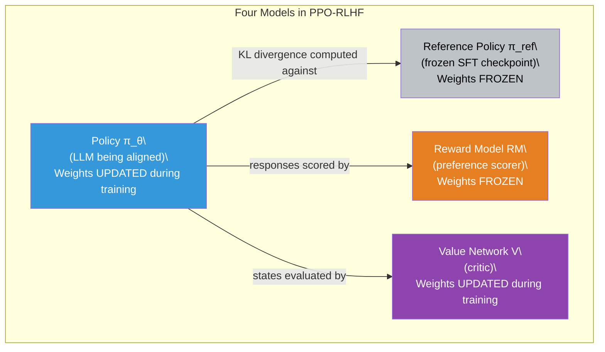
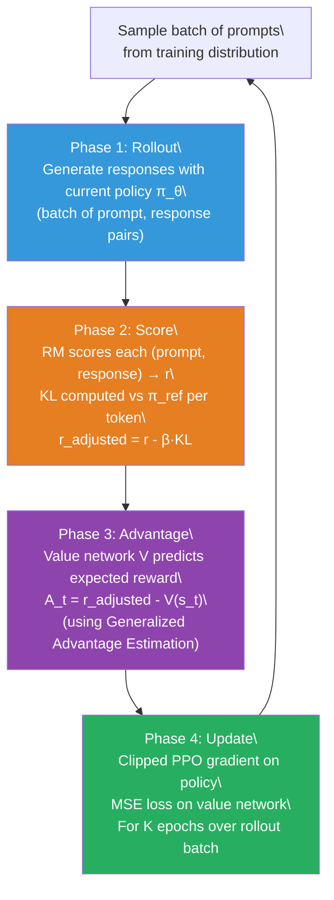

# Lesson 6.6 — RLHF with PPO

---

## The Algorithm That Started It All

Proximal Policy Optimization (PPO) is the reinforcement learning algorithm that powered InstructGPT — the training run that turned GPT-3 into a useful assistant and laid the foundation for ChatGPT. When someone says "RLHF," they almost always mean RLHF with PPO. It is the canonical alignment algorithm, the one every alternative (DPO, GRPO, ORPO) is compared against, and the one most likely to come up in an alignment interview.

PPO's power comes from an engineering insight: naive policy gradient updates are unstable. If you compute a gradient step and it is large, you might overshoot — the policy changes so dramatically in one step that it loses capabilities it previously had and enters a region of parameter space from which it is hard to recover. PPO solves this by **clipping** the policy update: no single gradient step can move the policy probability ratios beyond a bounded region. The result is a training algorithm that is significantly more stable than vanilla policy gradient.

But PPO for LLM alignment is not just PPO. It is PPO plus a reward model, a reference model, and a value network — four models running simultaneously, with intricate dependencies between them. This is both its strength (it is the most expressive and controllable alignment algorithm) and its weakness (it is the most complex and resource-intensive to implement correctly).

---

## The Four Models in PPO-RLHF

PPO for LLM alignment requires four separate models loaded in memory simultaneously during training:

**1. The Policy (π_θ) — the model being trained.** This is the LLM you are aligning. It starts as a copy of the SFT checkpoint and its weights are updated during training. This is the only model whose weights change.

**2. The Reference Policy (π_ref) — frozen SFT checkpoint.** A frozen copy of the SFT model, never updated during RL training. It is used exclusively to compute the KL penalty: KL(π_θ || π_ref). Its role is to prevent the policy from drifting into reward-hacking territory.

**3. The Reward Model (RM) — frozen preference scorer.** Trained as described in Lesson 6.4. Takes a (prompt, response) pair and outputs a scalar reward. Frozen during RL training — the reward model's weights do not change.

**4. The Value Network (V) — the critic.** A separate model (often initialized from the SFT checkpoint or the reward model) that predicts the expected future reward from the current state. It is trained during RL to estimate baselines for the advantage computation. The value network's weights are updated during training, alongside the policy.


*The four models. Two are trained (policy + value network). Two are frozen (reference policy + reward model). Memory requirement: roughly 4× the size of a single model.*

The memory cost of this setup is significant. If the policy is a 7B parameter model in BF16, it occupies ~14 GB. Four models of this size would require ~56 GB of GPU memory before accounting for optimizer states and activations. In practice, the reference model and reward model are often loaded in 4-bit quantization to reduce memory, while the policy and value network are kept in BF16 for training stability.

---

## The PPO Training Loop: Four Phases

PPO training is structured as a loop of four repeating phases. Each iteration of the loop is called a **PPO step** or **RL step**.

### Phase 1: Rollout — Generate Responses

Sample a batch of prompts from the training prompt distribution. For each prompt, use the **current policy** to generate a complete response via autoregressive sampling. This produces a batch of (prompt, response) pairs.

This phase is called "rollout" because you are rolling out the policy — letting it generate complete trajectories under its current parameters. The quality of these rollouts depends on the current policy's capabilities.

### Phase 2: Score — Compute Rewards and KL

For each (prompt, response) pair:
- Feed it through the **frozen reward model** to get the scalar reward r(x, y).
- Feed both prompt+response through the **policy** and the **frozen reference model** to get per-token log probabilities. Compute the per-token KL divergence.
- Compute the adjusted reward: `r_adjusted = r(x, y) - β · KL(π_θ || π_ref)`.

The KL penalty is subtracted from the reward at this stage. The policy's net reward is not just what the reward model gives — it is reward minus KL cost.

### Phase 3: Advantage — Compute How Good Each Response Was

For each state in the trajectory, compute the advantage:

```
A_t = r_adjusted - V(s_t)
```

Where V(s_t) is the value network's prediction of expected reward from state s_t. A positive advantage means this response was better than the value network predicted. A negative advantage means it was worse.

In practice, PPO uses **Generalized Advantage Estimation (GAE)** — a weighted combination of multi-step advantage estimates that reduces variance further. GAE introduces a second hyperparameter λ (lambda, typically 0.95) that controls the bias-variance trade-off in advantage estimation.

### Phase 4: Update — Clipped Policy Gradient

Run gradient descent on the **clipped PPO objective** for several epochs over the current rollout batch:

```
L_CLIP(θ) = E_t [ min( r_t(θ) · A_t,  clip(r_t(θ), 1-ε, 1+ε) · A_t ) ]
```

Where:
- `r_t(θ) = π_θ(a_t | s_t) / π_θ_old(a_t | s_t)` is the probability ratio of the new policy to the old policy (before the update)
- `ε` is the clip threshold (typically 0.2 — the policy's probability ratio cannot move more than ±20% per update step)
- `A_t` is the computed advantage

The clip is the heart of PPO. Without it, a large advantage estimate would cause a large gradient step that could destabilize the policy. With the clip, the gradient is zeroed out for any token where the probability ratio has already moved beyond [1-ε, 1+ε]. You take many small, stable steps rather than one large, potentially catastrophic step.

The value network is trained simultaneously with an MSE loss:

```
L_VF = E_t [ (V(s_t) - r_adjusted)² ]
```

The full PPO-RLHF objective combines all three terms:

```
L_total = -L_CLIP + c_1 · L_VF - c_2 · Entropy
```

Where c_1 and c_2 are coefficients, and the entropy bonus encourages the policy to maintain diversity (avoid collapsing to deterministic outputs).


*The four-phase PPO training loop. Each cycle is one PPO step. Thousands of steps are run for a complete training run.*

---

## The Clipped Objective: Why PPO is Stable

The intuition behind the clipped objective deserves a concrete example.

Suppose at step t, the old policy assigned probability 0.10 to token "definitely" given the current context. After computing advantages, we find this token had a high advantage (+0.8 — it appeared in a high-quality response). A naive policy gradient would strongly increase the probability of this token.

With PPO and ε = 0.2, the probability ratio `r_t = π_new / π_old` is clipped to [0.8, 1.2]. This means the new policy's probability for "definitely" can be at most 0.10 × 1.2 = 0.12, or at least 0.10 × 0.8 = 0.08, after this update step. Even if the advantage is very high, the single-step change is bounded.

The clipping applies **per token per update step**. Over many PPO epochs on the same rollout batch, the probabilities can move further — but the movement is gradual, controlled, and recoverable if it goes in the wrong direction.

> **Interview note:** "Walk me through the PPO RLHF training loop step by step." Strong answer: "PPO-RLHF requires four models: the policy (trained), the reference model (frozen SFT checkpoint), the reward model (frozen preference scorer), and the value network (trained critic). The training loop has four phases. Phase 1 (Rollout): sample prompts, generate responses with the current policy. Phase 2 (Score): score each response with the reward model, compute per-token KL vs the reference model, and subtract β times the KL from the reward to get the adjusted reward. Phase 3 (Advantage): the value network predicts expected reward from each state; the advantage is the difference between actual adjusted reward and this prediction. Phase 4 (Update): run the clipped PPO objective, which limits the policy probability ratio to [1-ε, 1+ε] per update step. The value network is updated simultaneously via MSE loss. This loop repeats thousands of times. The clip is what makes PPO stable — without it, large advantage estimates cause large updates that destabilize the policy."

---

## Concrete Example: PPO Training for a Code Assistant

Suppose you are aligning a code generation model with PPO. Your setup:

- **Policy:** Llama-3-8B-Instruct (SFT on code generation data)
- **Reference model:** Same Llama-3-8B-Instruct checkpoint, frozen
- **Reward model:** 7B model trained on 200K code quality comparisons (correctness, clarity, efficiency)
- **Value network:** Llama-3-8B initialized from the reward model, with regression head

**Training configuration:**
- 512 prompts per rollout batch
- Each response generated up to 512 tokens
- β = 0.2 (KL penalty coefficient)
- ε = 0.2 (clip threshold)
- K = 4 PPO epochs per rollout batch
- Total training: 5,000 PPO steps (~2.56M prompt-response pairs processed)

**What you observe:**
- Steps 0–500: Policy reward climbs from ~0.3 to ~0.6. KL from reference: ~0.5 nats. Code quality visibly improves.
- Steps 500–2000: Reward climbs to ~0.8. KL: ~2.5 nats. Responses become more thorough and correct.
- Steps 2000–3500: Reward climbs to ~0.9. KL: ~5 nats. Some verbosity emerging — responses are getting longer.
- Steps 3500–5000: Reward still ~0.9–0.91. KL: ~8 nats. Gold evaluation (human rating) shows slight decline. Decision: stop at step 3500.

The KL monitoring flagged the issue before human evaluation confirmed it. This is why monitoring KL throughout training is essential.

---

## Why PPO is Complex and Unstable

PPO is the most powerful alignment algorithm, but it comes with serious engineering challenges:

**Four-model memory pressure.** Training a 7B policy requires ~14 GB for weights, ~28 GB for optimizer states (Adam), and gradient buffers. Add a frozen 7B reference model (~14 GB inference), a frozen reward model (~14 GB inference), and a 7B value network (weights + optimizer). Total: ~100+ GB GPU memory for a 7B policy. This typically requires multi-GPU setups even for models this size.

**Reward and value model synchronization.** The value network's predictions need to stay calibrated with the policy's actual reward distribution. If the value network lags — predicts expected rewards that are systematically too high or low — the advantage estimates are wrong and training diverges. Careful learning rate scheduling and separate update frequencies for the policy and value network are required.

**Hyperparameter sensitivity.** PPO has a large hyperparameter surface: β (KL penalty), ε (clip threshold), c_1 (value loss coefficient), c_2 (entropy coefficient), GAE λ, K (PPO epochs per rollout), rollout batch size, mini-batch size. These hyperparameters interact in non-obvious ways. Getting PPO to converge reliably requires careful grid search or experienced tuning.

**Rollout generation cost.** Phase 1 generates full responses for every prompt in the batch. For a 512-prompt batch with responses up to 512 tokens, that is 262,144 tokens of autoregressive generation per step — slow even on modern hardware. This is the primary throughput bottleneck in PPO training.

These challenges have motivated the development of DPO, GRPO, and ORPO — all of which sacrifice some of PPO's expressiveness in exchange for simpler, more stable training. Understanding exactly where PPO's complexity comes from is what makes those alternatives' design choices legible.

---

## Code: PPO-RLHF with TRL

```python
from trl import PPOTrainer, PPOConfig, AutoModelForCausalLMWithValueHead
from transformers import AutoTokenizer, pipeline

# The policy model with value head appended.
# AutoModelForCausalLMWithValueHead adds a linear regression head
# on top of the language model — this IS the value network.
# Policy and value network share the same backbone.
model = AutoModelForCausalLMWithValueHead.from_pretrained(
    "meta-llama/Llama-3-8B-Instruct",
    torch_dtype="bfloat16"
)
tokenizer = AutoTokenizer.from_pretrained("meta-llama/Llama-3-8B-Instruct")

# Reference model is loaded separately and kept frozen.
# TRL handles this automatically — it freezes the ref model weights.
ref_model = AutoModelForCausalLMWithValueHead.from_pretrained(
    "meta-llama/Llama-3-8B-Instruct",
    torch_dtype="bfloat16"
)

# Reward model pipeline — wraps the trained reward model for inference.
reward_model = pipeline(
    "sentiment-analysis",           # Single-score classification
    model="./reward_model",         # Your trained reward model checkpoint
    tokenizer=tokenizer,
    device=0,
    return_token_type_ids=False,
)

ppo_config = PPOConfig(
    model_name="llama3-8b-ppo",
    learning_rate=1e-5,
    batch_size=64,                  # Prompts per rollout batch
    mini_batch_size=8,              # Prompts per gradient update
    ppo_epochs=4,                   # K — epochs over each rollout batch
    kl_penalty="kl",                # Use per-token KL as penalty
    init_kl_coef=0.2,               # β — initial KL coefficient
    adap_kl_ctrl=True,              # Adaptively adjust β to hit KL target
    target_kl=6.0,                  # Target KL in nats
    gamma=1.0,                      # Discount factor (1.0 for sparse reward)
    lam=0.95,                       # GAE λ for advantage estimation
    cliprange=0.2,                  # ε — PPO clip threshold
    vf_coef=0.1,                    # c_1 — value loss coefficient
    log_with="wandb",               # Track KL, reward, entropy on W&B
)

trainer = PPOTrainer(
    config=ppo_config,
    model=model,
    ref_model=ref_model,
    tokenizer=tokenizer,
    reward_model=reward_model,
)

# Training loop.
for batch in dataloader:
    query_tensors = batch["input_ids"]
    
    # Phase 1: Rollout — generate responses.
    response_tensors = trainer.generate(query_tensors, max_new_tokens=256)
    
    # Phase 2: Score — get reward for each (query, response) pair.
    texts = [tokenizer.decode(r) for r in response_tensors]
    rewards = [torch.tensor(r["score"]) for r in reward_model(texts)]
    
    # Phases 3 and 4: Advantage + Update — handled by trainer.step().
    stats = trainer.step(query_tensors, response_tensors, rewards)
    trainer.log_stats(stats, batch, rewards)
```

---

## Summary

- PPO-RLHF requires **four models simultaneously**: the policy (trained), the reference model (frozen SFT), the reward model (frozen preference scorer), and the value network (trained critic). Only the policy and value network update during training.
- Training is a **four-phase loop**: (1) Rollout — generate responses with the current policy; (2) Score — compute reward and per-token KL penalty; (3) Advantage — subtract value network's baseline prediction from adjusted reward; (4) Update — clipped policy gradient + value network MSE loss.
- The **clipped PPO objective** limits the probability ratio r_t = π_new/π_old to [1-ε, 1+ε] per update step. This prevents large, destabilizing gradient steps. ε = 0.2 is the standard setting.
- The **KL penalty** (β · KL(π_θ || π_ref)) is subtracted from the reward before computing advantages. It keeps the policy within the distribution where the reward model's scores are reliable and prevents reward hacking.
- PPO is the most expressive and controllable alignment algorithm, but its complexity is its weakness: four-model memory pressure, hyperparameter sensitivity, rollout generation bottleneck, and value network calibration requirements make it significantly harder to implement correctly than DPO or ORPO.
- Monitor **mean KL from reference** throughout training. Adaptive KL control (automatically adjusting β to hit a KL target) is strongly recommended in practice. KL above 8–10 nats should trigger evaluation with a gold reward signal.

---
