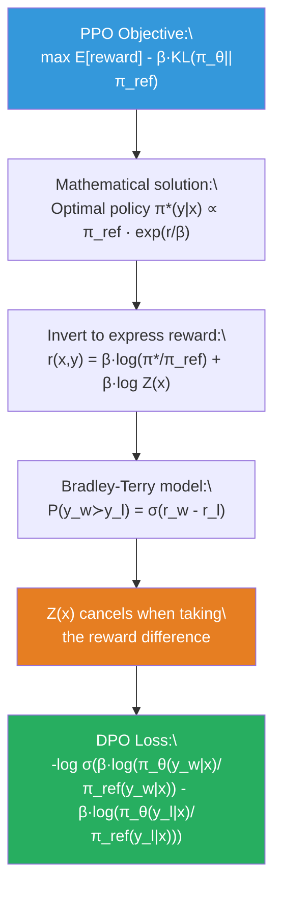
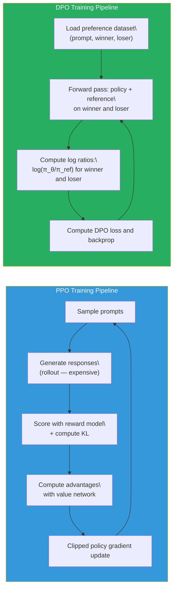

# Lesson 6.7 — DPO (Direct Preference Optimization)

---

## The Problem With PPO's Complexity

PPO works. InstructGPT proved it. But PPO's four-model setup, its fragile hyperparameter surface, its rollout generation bottleneck, and its value network calibration requirements make it genuinely difficult to run correctly. In practice, PPO training runs frequently diverge, collapse, or plateau — not because the algorithm is theoretically wrong, but because the engineering complexity creates too many ways for things to go wrong.

The question researchers at Stanford asked in 2023 (Rafailov et al., "Direct Preference Optimization: Your Language Model is Secretly a Reward Model") was: does alignment from human preferences *actually require* reinforcement learning? The answer, it turns out, is no. The PPO objective has an analytical solution. Once you find that solution, you can train directly on preference data without ever running RL, without ever needing a reward model, and without ever computing policy gradients. This is DPO — Direct Preference Optimization.

DPO does not make alignment easier by sacrificing power. It makes it easier by recognizing that the power of PPO's objective is latent in the preference data itself, and all you need to do is write a loss function that extracts it directly. The result: a training setup as simple as SFT, with alignment performance competitive with PPO.

---

## The Mathematical Derivation: From PPO Objective to DPO Loss

This derivation is the core of DPO. Follow it carefully — it is what interviewers mean when they ask "how does DPO bypass the reward model?"

**Step 1: The PPO objective has an analytical solution.**

The KL-constrained reward maximization problem that PPO solves is:

```
max_{π_θ} E_{x ~ D, y ~ π_θ} [ r(x, y) ]   subject to   KL(π_θ || π_ref) ≤ δ
```

Or equivalently, the Lagrangian form:

```
max_{π_θ} E_{x ~ D, y ~ π_θ} [ r(x, y) ] - β · KL(π_θ(y|x) || π_ref(y|x))
```

This is a constrained optimization problem with a unique closed-form solution. Solving it mathematically (by taking the functional derivative with respect to π and setting it to zero) gives:

```
π*(y|x) = (1/Z(x)) · π_ref(y|x) · exp( r(x,y) / β )
```

Where Z(x) = Σ_y π_ref(y|x) · exp(r(x,y)/β) is a normalizing partition function.

**This is the optimal policy.** If you could compute and deploy this equation directly, PPO would be unnecessary. The problem is that Z(x) is intractable — it requires summing over all possible response sequences y, which is an astronomically large space.

**Step 2: Invert the relationship to express reward in terms of the policy.**

Rearrange the optimal policy equation to isolate the reward:

```
r(x, y) = β · log( π*(y|x) / π_ref(y|x) ) + β · log Z(x)
```

This says: the true reward r(x,y) is proportional to the log-ratio of the optimal policy to the reference model, plus a prompt-dependent constant.

**Step 3: Plug into the Bradley-Terry preference loss.**

Recall the Bradley-Terry preference model from Lesson 6.4:

```
P(y_w ≻ y_l | x) = σ( r(x, y_w) - r(x, y_l) )
```

Now substitute the reward expression from Step 2:

```
P(y_w ≻ y_l | x) = σ( [β · log(π*(y_w|x)/π_ref(y_w|x)) + β·log Z(x)]
                     - [β · log(π*(y_l|x)/π_ref(y_l|x)) + β·log Z(x)] )
```

The `β·log Z(x)` terms cancel:

```
P(y_w ≻ y_l | x) = σ( β · log(π*(y_w|x)/π_ref(y_w|x)) - β · log(π*(y_l|x)/π_ref(y_l|x)) )
```

**Step 4: Replace π* with the parameterized policy π_θ.**

Instead of knowing the optimal policy π*, parameterize it with the trainable model π_θ. The DPO loss is the negative log-likelihood of the preference data under this model:

```
L_DPO(θ) = -E_{(x, y_w, y_l) ~ D} [ log σ( β · log(π_θ(y_w|x)/π_ref(y_w|x)) - β · log(π_θ(y_l|x)/π_ref(y_l|x)) ) ]
```

This is the complete DPO loss. It requires no reward model, no RL loop, no value network, no rollout generation. It is a supervised loss computed directly on preference pairs.


*The mathematical derivation from PPO's objective to the DPO loss. The key insight: when you subtract the rewards for winner and loser, the intractable partition function Z(x) cancels.*

---

## What the DPO Loss Is Actually Doing

Unpacking the DPO loss without the derivation:

```
L_DPO = -log σ( β · [log π_θ(y_w|x) - log π_ref(y_w|x)] 
                - β · [log π_θ(y_l|x) - log π_ref(y_l|x)] )
```

- `log π_θ(y_w|x) - log π_ref(y_w|x)` is the log-ratio of the policy's probability for the winner versus the reference model's probability. A positive value means the policy assigns the winner more probability than the reference model does — the policy has shifted toward the winner.
- `log π_θ(y_l|x) - log π_ref(y_l|x)` is the same quantity for the loser.
- The difference of these two log-ratios is the **implicit reward difference**: by how much does the trained policy prefer the winner over the loser, relative to the reference model's preferences?
- The loss is minimized when the winner's implicit reward is much higher than the loser's — when the policy has learned to strongly prefer y_w over y_l.

**Gradient intuition:** DPO's gradient increases the log probability of the winner AND decreases the log probability of the loser — simultaneously, from a single loss function. But importantly, the gradient is scaled by how much the model is already getting things right. If the policy already strongly prefers the winner (large margin), the gradient is small. If the policy is uncertain or prefers the loser (small or negative margin), the gradient is large. DPO is harder on the examples where it is currently wrong.

---

## DPO vs PPO: Training Setup Comparison

The practical difference between DPO and PPO is dramatic:

| | PPO | DPO |
|---|---|---|
| **Models required** | 4 (policy, reference, reward model, value network) | 2 (policy, reference) |
| **Training paradigm** | Reinforcement learning (rollout → score → update) | Supervised learning (direct on preference pairs) |
| **Reward model needed** | Yes (trained separately) | No (implicit in log ratio) |
| **Rollout generation** | Required every step | Not required |
| **Hyperparameters** | β, ε, GAE λ, K epochs, c₁, c₂, batch sizes | β only |
| **Memory** | ~4× single model | ~2× single model |
| **Training stability** | Fragile — sensitive to hyperparameters | High — behaves like supervised training |
| **Data requirements** | Prompts for rollout + preference pairs | Preference pairs only |
| **Implementation complexity** | Very high | Low |


*DPO eliminates Phase 1 (rollout), Phase 2 (scoring), and Phase 3 (advantage computation) from PPO. It reduces to a supervised training loop over preference pairs.*

---

## The β Hyperparameter in DPO

β in DPO plays the same role as in PPO — it controls the KL penalty strength — but its effect is more directly visible in the loss function.

**Low β (e.g., 0.01–0.1):** The model is sensitive to preference differences. Even a small margin between winner and loser scores drives a large update. The model changes rapidly. Risk of over-fitting to the preference data or ignoring the reference model entirely.

**High β (e.g., 0.5–1.0):** Large reward differences are needed before the model updates meaningfully. The policy stays closer to the reference model. More conservative adaptation.

DPO papers typically use β = 0.1 as a default. For tasks requiring large behavioral shifts (e.g., safety alignment from a relatively unconstrained base model), lower β allows faster adaptation. For fine-grained preference adjustments (e.g., improving response format while keeping content the same), higher β prevents over-adaptation.

---

## A Concrete Example: DPO for Legal Document Summarization

Suppose you are training a model to summarize legal contracts. Your preference dataset contains 10,000 pairs: each pair has the same contract as the prompt, a preferred summary (winner: precise, covers key obligations and risks, uses appropriate legal terminology) and a rejected summary (loser: vague, misses important clauses, uses informal language).

**DPO training process:**

For each pair, the training computes:
1. Run the policy forward on [contract + winner_summary] → get log π_θ(winner|contract)
2. Run the policy forward on [contract + loser_summary] → get log π_θ(loser|contract)
3. Run the reference model forward on both → get log π_ref(winner|contract) and log π_ref(loser|contract)
4. Compute log ratios: (log π_θ/π_ref) for winner and loser
5. Compute DPO loss and update.

After training, the policy assigns higher probability to precise, legally-appropriate summaries relative to where the reference model was. It has been directly optimized on the human preference signal, without ever generating rollouts or consulting a reward model.

**What β = 0.1 means here:** The policy is willing to move substantially from the reference model to satisfy the preference signal. If the reference model (SFT) was already decent at legal summarization, this allows the DPO training to sharpen its quality significantly. If you set β = 0.5, the policy would stay more conservative — useful if you are worried about the preference data being noisy.

---

## DPO Limitations: What It Trades Away

DPO is not strictly better than PPO. It makes specific trade-offs:

**No exploration.** PPO generates rollouts, so the policy can discover responses that were never in the preference dataset. DPO only trains on the fixed preference pairs. If the optimal behavior for a new kind of prompt was never demonstrated in the preference data, DPO cannot learn it.

**Data quality sensitivity.** Because DPO trains directly on preference pairs with no reward model as an intermediate buffer, noisy preference labels affect training directly. PPO's reward model averages over many preference pairs during training, providing some noise robustness.

**Cannot improve beyond the preference data.** DPO's ceiling is the quality of the winner responses in the preference dataset. The model learns to match the distribution of winners, not to exceed it. PPO (theoretically) can find responses better than anything in the dataset through exploration.

**Distribution mismatch at inference.** DPO trains on fixed preference pairs, but at inference time, the policy generates responses it never saw during training. This can create a subtle mismatch — the model is good at distinguishing between the specific winner/loser pairs it trained on, but may not generalize perfectly to novel prompts.

> **Interview note:** "How does DPO bypass the reward model? What does it trade away to do so?" Strong answer: "DPO derives from the observation that the PPO objective — KL-constrained reward maximization — has a closed-form optimal policy: π*(y|x) ∝ π_ref(y|x)·exp(r/β). Rearranging, the reward is expressible as β·log(π/π_ref) + constant. When this is substituted into the Bradley-Terry preference model and you take the difference between winner and loser rewards, the intractable normalizing constant cancels, giving the DPO loss: -log σ(β·[log ratio for winner] - β·[log ratio for loser]). No reward model, no RL, no rollouts. What it trades away: (1) exploration — DPO can only learn from examples in the preference dataset, not discover novel high-quality responses; (2) data ceiling — the policy cannot exceed the quality of the winners in the training data; (3) noise sensitivity — preference labels affect training directly with no reward model as a buffer."

---

## Code: DPO Training with TRL

```python
from trl import DPOTrainer, DPOConfig
from transformers import AutoModelForCausalLM, AutoTokenizer
from datasets import load_dataset

# Load the policy model (SFT checkpoint to align).
model = AutoModelForCausalLM.from_pretrained(
    "meta-llama/Llama-3-8B-Instruct",
    torch_dtype="bfloat16",
    attn_implementation="flash_attention_2",  # Speed up forward passes
)
tokenizer = AutoTokenizer.from_pretrained("meta-llama/Llama-3-8B-Instruct")

# The reference model is loaded separately by DPOTrainer.
# TRL will freeze it automatically.
# If you don't pass ref_model, TRL will use a frozen copy of model.

# Dataset must have 'prompt', 'chosen', and 'rejected' columns.
# 'chosen' and 'rejected' are full responses (not including the prompt).
dataset = load_dataset("your/preference-dataset")

dpo_config = DPOConfig(
    output_dir="./dpo_model",
    num_train_epochs=1,
    per_device_train_batch_size=4,
    gradient_accumulation_steps=4,    # Effective batch size = 16
    learning_rate=5e-7,               # Very low LR — DPO is sensitive to LR
    beta=0.1,                         # KL penalty coefficient
    max_length=1024,                  # Max total length (prompt + response)
    max_prompt_length=512,            # Max prompt length
    bf16=True,
    logging_steps=10,
    eval_strategy="steps",
    eval_steps=100,
    # loss_type="sigmoid" is default (standard DPO loss)
    # Alternative: loss_type="hinge" for IPO, loss_type="ipo" for identity PO
)

trainer = DPOTrainer(
    model=model,
    args=dpo_config,
    train_dataset=dataset["train"],
    eval_dataset=dataset["test"],
    tokenizer=tokenizer,
    # ref_model=ref_model  # Optional: pass explicitly, otherwise auto-created
)

trainer.train()
```

---

## Summary

- DPO derives from the mathematical fact that the PPO objective (KL-constrained reward maximization) has a closed-form optimal policy: π*(y|x) ∝ π_ref(y|x) · exp(r(x,y)/β). Rearranging this to express reward in terms of log ratios, and substituting into the Bradley-Terry model, gives a loss over preference pairs where the intractable partition function Z(x) cancels.
- The DPO loss is: -log σ(β·log(π_θ(y_w|x)/π_ref(y_w|x)) - β·log(π_θ(y_l|x)/π_ref(y_l|x))). It increases the log probability of winners and decreases the log probability of losers relative to the reference model, using no reward model and no RL.
- DPO requires only **2 models** (policy + frozen reference), trains via standard supervised backpropagation on preference pairs, and has only **one key hyperparameter** (β). This makes it dramatically simpler to implement and tune than PPO.
- DPO's implicit reward is the log ratio log(π_θ/π_ref). The policy IS the reward model — a response's quality is determined by how much more (or less) the trained policy assigns to it compared to the reference.
- DPO trades away **exploration** (it cannot discover responses better than its training data) and is **data-ceiling bounded** (quality limited by winner quality in preference pairs). These trade-offs are acceptable for most fine-grained preference alignment tasks where high-quality preference data exists.
- In practice, DPO is the default choice for most alignment tasks due to its simplicity and stability. PPO is reserved for cases where exploration is needed or where the preference data is insufficient for direct supervised alignment.

---
