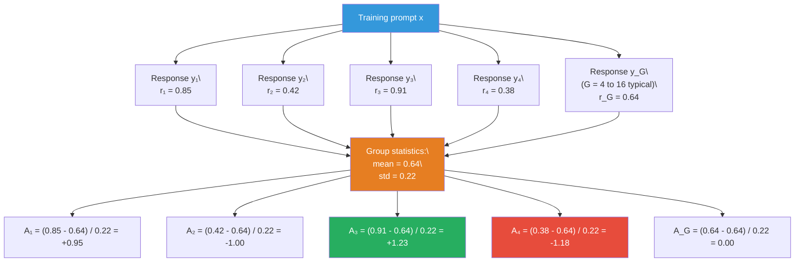
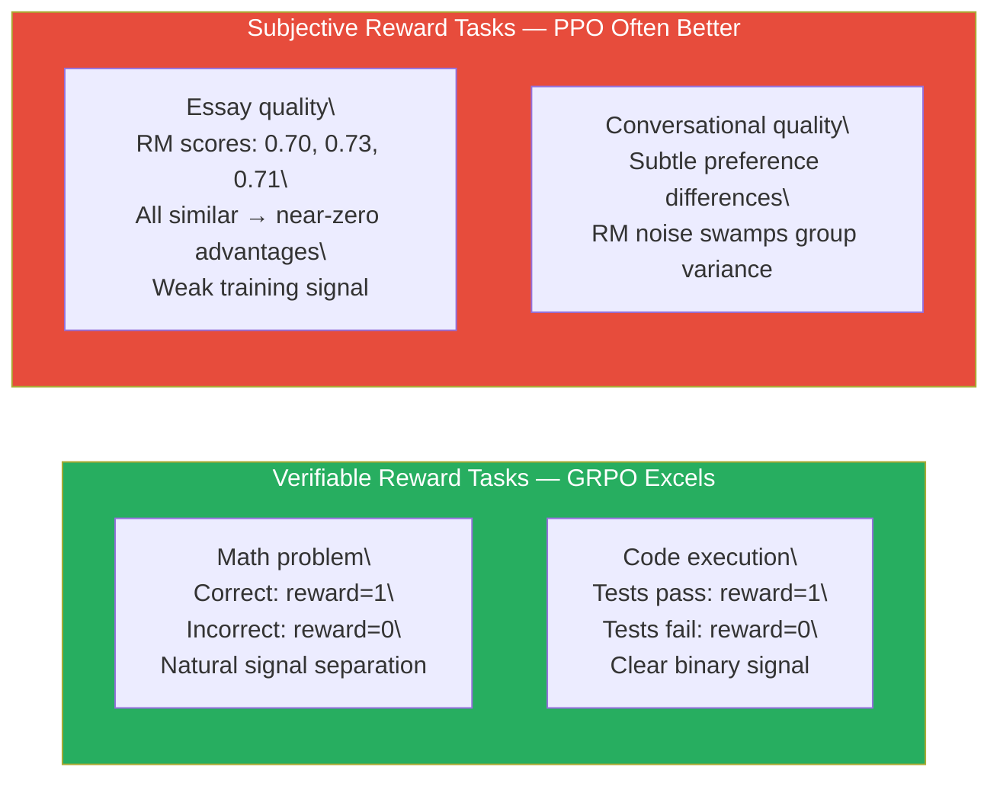
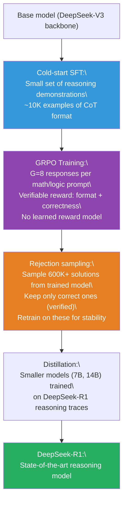

# Lesson 6.8 — GRPO (Group Relative Policy Optimization)

---

## The Critic Network Problem

PPO's training loop requires a value network — a separate neural network (the critic) trained to predict expected reward from any given state. This critic is essential for computing the advantage function: how much better was this response than what the policy typically produces? Without a reliable baseline prediction, the policy gradient has high variance and training is unstable.

But the value network is a source of pain in practice. It is the same size as the policy model, doubling memory requirements. It needs to stay calibrated with the policy — as the policy changes, the value network's predictions must track the shifting reward landscape, or the advantages it computes are wrong. If the critic lags, the advantage estimates are stale and the policy gradient is noisy. If the critic is over-updated, it over-fits to recent rollouts and loses generality. Getting the critic's learning rate, update frequency, and architecture right relative to the actor is one of the primary sources of PPO instability.

GRPO (Group Relative Policy Optimization), introduced by DeepSeek in the DeepSeek-Math paper (2024) and later used in DeepSeek-R1, asks a simple question: what if we didn't need the critic at all? What if we could compute a reliable baseline without training a separate network? The answer: generate multiple responses for each prompt and use their average reward as the baseline. No critic. No learning rate calibration problem. No doubled memory cost. Just better baselines, computed empirically.

---

## The Core Idea: Group Sampling as a Baseline

The fundamental insight in GRPO is that you can estimate the value function (expected reward from a given state) by sampling from the policy itself. For each training prompt x, instead of generating one response, you generate **G responses** — a group — from the current policy. You score all G responses with the reward function. The mean reward across the group is your baseline estimate.

```
Generate G responses: {y₁, y₂, ..., y_G} from π_θ(·|x)
Compute rewards: {r₁, r₂, ..., r_G} from the reward function

Baseline = mean(r₁, ..., r_G)

Advantage of response i:
A_i = (r_i - mean(r₁, ..., r_G)) / std(r₁, ..., r_G)
```

The normalization by standard deviation is important: it ensures the advantage has a consistent scale across different prompts where the reward distribution might vary widely. A prompt that consistently gets rewards near 0.5 and one that consistently gets rewards near 0.9 will produce advantages on the same scale after normalization.


*GRPO for a single prompt with G=5. The group mean (0.64) is the baseline. Response y₃ (reward 0.91) gets a positive advantage; y₄ (reward 0.38) gets a negative advantage. The critic network is replaced entirely by this empirical calculation.*

---

## The GRPO Loss Function

With group advantages computed, GRPO applies the same clipped PPO objective as PPO:

```
L_GRPO(θ) = E_{x, {y_i}} [ (1/G) Σᵢ min( r_t(θ) · A_i,  clip(r_t(θ), 1-ε, 1+ε) · A_i ) ]
           - β · KL(π_θ || π_ref)
```

Where r_t(θ) = π_θ(y_i|x) / π_θ_old(y_i|x) is the probability ratio of new to old policy.

This is structurally identical to PPO's clipped objective, with one change: A_i is computed from the group statistics rather than from a learned value network. The KL penalty term against the reference model is preserved — GRPO has the same reward hacking protection as PPO.

The gradient update reinforces responses with positive normalized advantages (above-average for this prompt) and suppresses responses with negative normalized advantages (below-average). The normalization ensures that a prompt where all responses scored 0.8–0.9 produces similar gradient magnitudes to a prompt where responses scored 0.2–0.7 — the update is relative to the group, not to an absolute scale.

---

## Why GRPO Works Especially Well for Verifiable Rewards

GRPO is most effective when the reward function has a specific property: for any given prompt, the group of G responses naturally contains some correct and some incorrect ones. This makes the advantages informative — you have both positively and negatively reinforced examples from each prompt.

This property holds naturally for **verifiable tasks**:

- **Mathematical reasoning:** Generate G solutions to the same math problem. Some will be correct (reward = 1); others will be wrong (reward = 0). The group mean is approximately the accuracy rate on this problem. Correct solutions get positive advantage; incorrect ones get negative advantage.

- **Code generation:** Generate G code implementations. Run them against test cases. Passing solutions get high reward; failing solutions get low reward. The group statistics naturally separate correct from incorrect code.

- **Logical reasoning:** Generate G answers to a logic puzzle with a verifiable correct answer. Binary reward (correct/incorrect) gives clean advantages.

For tasks with **subjective reward** (a learned reward model scoring essay quality), GRPO is less ideal because the reward model's scores may not naturally separate within a group — responses might all score similarly, giving near-zero advantages that provide no training signal. In this setting, PPO's learned value function (which can track subtle differences in quality across the reward model's distribution) provides better baselines.


*GRPO's group baseline works best when the reward function naturally separates responses within a group. For verifiable tasks (math, code), it is the strongest choice.*

---

## DeepSeek-R1: GRPO for Reasoning Training

The most prominent real-world application of GRPO is DeepSeek-R1, which used GRPO to train a reasoning model capable of complex multi-step mathematical and logical reasoning.

DeepSeek's key design choices:

**Verifiable reward signal.** Instead of using a learned reward model to score reasoning quality (which would require extensive human annotation of reasoning chains), they used two verifiable reward components:
1. **Format reward:** Was the final answer properly formatted within `<answer>` tags? Binary.
2. **Accuracy reward:** Is the numerical/symbolic answer correct, checkable programmatically? Binary.

Together, these create a clear, hack-resistant reward signal. A model cannot improve its reward score without actually reasoning more correctly — there are no stylistic proxies to exploit.

**Large group size.** DeepSeek used G = 8–16 responses per prompt. Larger groups give more stable baseline estimates at the cost of more inference compute per step.

**Cold-start with SFT on reasoning data.** Before running GRPO, DeepSeek SFT-trained the model on a small set of carefully curated reasoning demonstrations. This gave the model a starting point with basic chain-of-thought capability. Running GRPO on a raw base model without this initialization produces incoherent reasoning chains that the reward signal cannot meaningfully differentiate.

**Emergent chain-of-thought.** A striking result: after GRPO training with binary correctness reward, the model developed extended internal reasoning — thinking through problems in detail before stating the answer — without being explicitly trained on chain-of-thought format. The binary correctness reward was sufficient to encourage the model to discover that extended internal deliberation improves its accuracy.


*The DeepSeek-R1 training pipeline. GRPO is the core alignment step, using verifiable rewards without a learned reward model.*

---

## GRPO vs PPO: The Engineering Trade-Off

| | PPO | GRPO |
|---|---|---|
| **Baseline method** | Learned value network (critic) | Group mean reward (empirical) |
| **Models required** | 4 (policy, reference, reward model, value network) | 3 (policy, reference, reward function) — RM can be replaced by verifiable reward |
| **Memory advantage** | None | Eliminates value network (~25% memory reduction for same-size backbone) |
| **Training stability** | Value network calibration is a source of instability | More stable — no critic to calibrate |
| **Compute per step** | 1 rollout per prompt | G rollouts per prompt (G× inference cost) |
| **Best reward type** | Subjective (learned reward model with fine-grained signal) | Verifiable (binary or rule-based, natural within-group variance) |
| **Exploration quality** | Single rollout per prompt | G rollouts per prompt — richer exploration of response space |
| **Used in** | InstructGPT, Anthropic Claude (early), many production systems | DeepSeek-R1, DeepSeek-Math, reasoning model training |

The G× inference cost at rollout time is the primary downside of GRPO. For G=8, GRPO needs 8 forward passes per prompt during rollout, versus 1 for PPO. This is partially offset by the elimination of the value network's forward and backward passes, but the net compute is still higher. In practice, GRPO training runs are slower than PPO on a per-step basis but often require fewer steps to converge on reasoning tasks because the group advantages are more informative.

> **Interview note:** "What is GRPO and when does it outperform PPO?" Strong answer: "GRPO (Group Relative Policy Optimization) replaces PPO's learned critic network with an empirical baseline: generate G responses per prompt, use the group mean as the baseline, and normalize advantages by the group standard deviation. This eliminates the value network entirely — removing the most significant source of PPO instability (critic calibration) and reducing memory requirements. GRPO outperforms PPO specifically for tasks with verifiable rewards — math, code, logic — where the group of G responses naturally contains some correct and some incorrect answers, creating informative advantages without needing a subjective reward model. For tasks with learned, subjective reward models where reward variance within a group is small, GRPO's empirical baseline is noisy and PPO's learned value function provides better signal. GRPO's main cost is G× inference at rollout time — each prompt requires G full response generations."

---

## Concrete Example: GRPO for Mathematical Reasoning

**Setup:**
- Model: A 7B math-specialized model
- Task: Train it to solve competition-level algebra problems
- Reward: Programmatic verification (is the final answer numerically correct?)
- G = 8 responses per prompt
- Total prompts per batch: 64 (→ 512 responses generated per step)

**One training step, one prompt:**
Problem: "Find all real x such that x² - 5x + 6 = 0"

| Response | Solution attempted | Correct? | Reward |
|---|---|---|---|
| y₁ | x = 2 and x = 3 (factoring) | ✅ | 1.0 |
| y₂ | x = 2 (forgot second root) | ❌ | 0.0 |
| y₃ | x = 2 and x = 3 (quadratic formula) | ✅ | 1.0 |
| y₄ | x = -2 and x = -3 (sign error) | ❌ | 0.0 |
| y₅ | x = 2 and x = 3 (completing the square) | ✅ | 1.0 |
| y₆ | x = 2.5 (differentiated instead) | ❌ | 0.0 |
| y₇ | x = 2 and x = 3 (factoring) | ✅ | 1.0 |
| y₈ | x = 1 and x = 6 (arithmetic error) | ❌ | 0.0 |

Group mean = 0.50, std = 0.53

Advantages: correct responses get A = (1.0 - 0.50)/0.53 = +0.94; incorrect responses get A = (0.0 - 0.50)/0.53 = -0.94.

The policy update reinforces the token sequences that led to correct solutions (factoring, quadratic formula, completing the square) and suppresses the sequences that led to incorrect solutions (arithmetic errors, differentiating). After thousands of such steps across thousands of algebra problems, the model learns general algebraic reasoning strategies that generalize beyond the training examples.

---

## Summary

- **GRPO** eliminates PPO's value network (critic) by computing the baseline empirically: generate G responses per prompt, compute their rewards, use the mean as the baseline, and normalize advantages by the group standard deviation. No separate network to train or calibrate.
- The GRPO advantage for response i is: A_i = (r_i - mean(r₁...r_G)) / std(r₁...r_G). This measures how much better or worse this response is than the policy's average on this specific prompt, on a standardized scale.
- GRPO applies the same clipped PPO objective and KL penalty as PPO. The only change is the baseline computation. All reward hacking protections from PPO are preserved.
- GRPO is **most effective for verifiable reward tasks** (math, code, logic) where the group naturally separates into correct and incorrect responses, creating informative advantages. For subjective, learned-reward tasks, PPO's value function typically provides better baselines.
- **DeepSeek-R1** demonstrated GRPO's power for reasoning: using binary correctness reward (no learned reward model), GRPO training caused models to develop extended chain-of-thought reasoning spontaneously — the model discovered internal deliberation improves its accuracy, driven purely by outcome reward.
- GRPO's primary cost is **G× inference** at rollout time. For G=8, each training step requires 8 full response generations per prompt. This is offset by the elimination of value network compute and the richer exploration of the response space that multi-sample rollouts provide.

---
