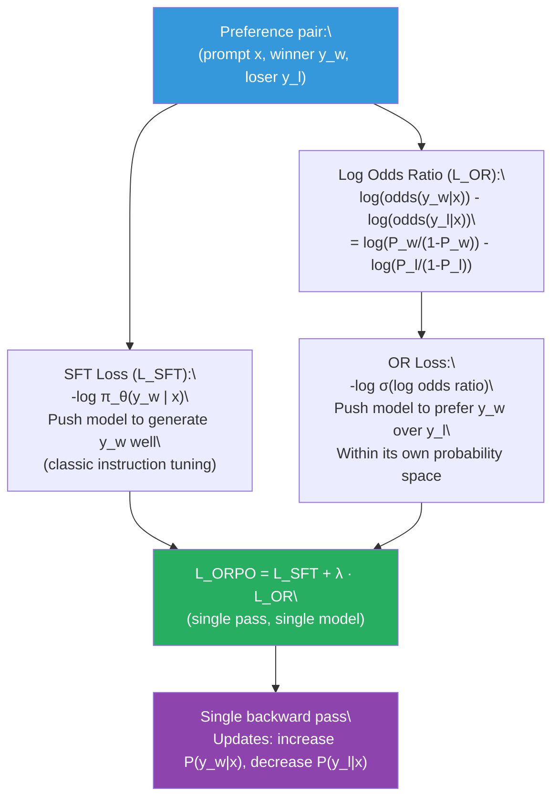
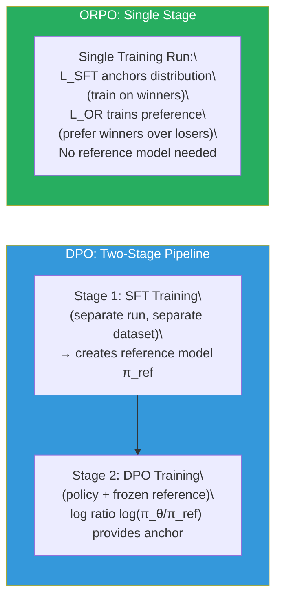

# Lesson 6.9 — ORPO (Odds Ratio Preference Optimization)

---

## DPO Still Has an Overhead: The Two-Stage Pipeline

DPO is already dramatically simpler than PPO — no RL loop, no reward model, no rollout generation, no value network. Two models, one loss, supervised training on preference pairs. But DPO still has a structural requirement that costs time, compute, and introduces a subtle failure mode: it requires a pre-trained SFT model as both the starting point for alignment and the frozen reference model.

This creates a mandatory two-stage pipeline. You cannot run DPO on a base model. You must first SFT the model on instruction-following data, then run DPO. Each stage is a separate training run with its own dataset, compute budget, and hyperparameter sweep. The reference model in DPO is a frozen snapshot of the SFT checkpoint — you load it in memory alongside the trainable policy, consuming memory for a model that contributes nothing new during DPO training. It just sits there, providing log probabilities to compute the KL constraint.

ORPO (Odds Ratio Preference Optimization), introduced by Hong et al. (2024), asks whether this two-stage structure is truly necessary. Its answer: no. ORPO combines SFT and preference alignment into a single training objective, applied in a single training run, without a reference model. You take a base model, a preference dataset, and train directly to produce an instruction-following, human-preference-aligned model in one pass.

---

## The Odds Ratio: A Measure of Relative Preference

ORPO's key innovation is replacing the log-ratio relative to a reference model (which requires the reference model) with the **odds ratio** between preferred and rejected responses — computed entirely within the current model's own predictions.

**Odds** of a response y given prompt x under policy π:

```
odds(y|x) = P(y|x) / (1 - P(y|x))
```

Where P(y|x) is the probability the model assigns to generating response y given prompt x. In the autoregressive LLM setting, P(y|x) = exp(Σ_t log π_θ(a_t | s_t)) — the product of per-token probabilities.

The **log odds ratio** between the winner and loser:

```
log OR(y_w, y_l | x) = log( odds(y_w | x) / odds(y_l | x) )
                     = log( P(y_w|x) / (1 - P(y_w|x)) ) - log( P(y_l|x) / (1 - P(y_l|x)) )
```

This quantity is positive when the model assigns higher relative probability to the winner than to the loser, and negative when the model prefers the loser. Training to increase this quantity directly trains the model to prefer winners over losers — within the model's own probability space, without any reference model.

---

## The ORPO Loss

ORPO combines two terms:

**Term 1 — SFT loss:** Standard negative log-likelihood on the winner responses. This ensures the model learns to generate good responses, not just rank them correctly.

```
L_SFT = -E[ log π_θ(y_w | x) ]
```

**Term 2 — Odds Ratio loss:** A penalty that pushes the log odds ratio in favor of the winner.

```
L_OR = -E[ log σ( log OR(y_w, y_l | x) ) ]
     = -E[ log σ( log(odds(y_w|x) / odds(y_l|x)) ) ]
```

The σ (sigmoid) transforms the log odds ratio into a probability between 0 and 1. The loss is minimized when the log odds ratio is very positive — the model strongly prefers the winner over the loser.

**Combined ORPO loss:**

```
L_ORPO = L_SFT + λ · L_OR
```

Where λ controls the relative weight of the preference signal. Typical values: λ = 0.1 – 1.0.


*The ORPO loss combines SFT (learn to generate good responses) with odds ratio preference (learn to prefer winner over loser). One model, one training run.*

---

## Why No Reference Model is Needed

In DPO, the reference model is used to anchor the trained policy — to prevent it from drifting too far from the SFT distribution. This anchor is important because the DPO loss alone only pushes the model to prefer winners over losers; without a reference, it might do so by collapsing to trivial solutions.

ORPO achieves the same anchoring through a different mechanism: the **SFT loss on winner responses**. The SFT component continuously trains the model to generate good responses well (high probability on winners). This prevents the model from degenerate behavior where it lowers the probability of both winners and losers (which would increase the log odds ratio without learning anything useful). The model must keep winner probability high — which is the anchoring role the SFT loss plays.

This is the key insight: the SFT loss in ORPO serves double duty. It trains instruction-following capability AND acts as the distributional anchor that DPO's reference model provided.


*DPO's two-stage pipeline vs ORPO's single-stage approach. The SFT loss within ORPO replaces the role of the explicit reference model.*

---

## What the Odds Ratio Captures That Log Ratio Does Not

The odds ratio has a subtle but important difference from the log ratio used in DPO.

**DPO's log ratio:** log(π_θ(y|x) / π_ref(y|x)) — measures how much the trained model's probability has shifted relative to the reference. This is a relative measure: a response that both the model and reference assign 0.001 probability contributes the same log ratio as one where both assign 0.5 probability (if the ratio is the same).

**ORPO's log odds ratio:** log(P(y|x) / (1-P(y|x))) — measures the model's confidence in this response on an absolute scale. A response with probability 0.001 has log odds ≈ -7 (very low confidence). A response with probability 0.9 has log odds ≈ 2.2 (very high confidence). The odds ratio between winner and loser captures the absolute gap in confidence, not just the relative shift from a reference.

This means ORPO's training signal is sensitive to the model's absolute confidence. If the model assigns very low probability to both winner and loser (say, both have P < 0.01), the log odds ratio is still informative but numerically stable. DPO in this situation might have a log ratio that is technically correct but numerically unstable because both log(π_θ) and log(π_ref) are very negative.

In practice, ORPO tends to produce models with **higher absolute probabilities on preferred responses** — the SFT loss directly pushes winner probabilities up. DPO, by contrast, only trains the relative preference, which can sometimes result in both winner and loser having their absolute probabilities reduced (if the model finds this configuration that satisfies the log ratio constraint without explicitly generating the winner well).

---

## When to Prefer ORPO Over DPO

ORPO has specific advantages in certain scenarios:

**Single training run preferred.** When compute is constrained and running two separate training stages (SFT + DPO) is expensive, ORPO's single-stage pipeline saves significant time and resources.

**Limited SFT data.** DPO requires a high-quality SFT checkpoint. If your instruction-following SFT data is limited, the SFT checkpoint may be weak, making DPO's reference model a poor anchor. ORPO learns instruction-following and preference simultaneously, which can be more forgiving of limited SFT data.

**Base model fine-tuning.** DPO typically cannot be applied directly to base models. ORPO can, because it incorporates SFT training within the preference optimization loss.

**Tasks where absolute response quality matters.** ORPO's SFT component directly maximizes the probability of high-quality responses, not just their relative preference. This can produce models that are more reliably capable at generating preferred-style responses on novel prompts.

**ORPO is NOT preferred when:** Your SFT and preference data distributions are very different. If the SFT examples (winners in the preference dataset) are not representative of the full instruction-following distribution you want, the SFT component of ORPO may not provide the broad instruction-following capability that a full SFT stage would.

---

## DPO vs ORPO: Comparison

| | DPO | ORPO |
|---|---|---|
| **Pipeline stages** | 2 (SFT first, then DPO) | 1 (combined) |
| **Reference model** | Required (frozen SFT checkpoint) | Not required |
| **Memory** | ~2× model size (policy + frozen ref) | ~1× model size |
| **Anchor mechanism** | Log ratio vs reference model | SFT loss on winner responses |
| **Sensitivity to β** | Sensitive (controls KL constraint) | λ controls OR loss weight (less sensitive) |
| **Can train base model** | No (requires SFT checkpoint) | Yes |
| **Data requirements** | Separate SFT + preference datasets | Preference dataset only (winners serve as SFT data) |
| **Training time** | 2 training runs | 1 training run |
| **Absolute winner probability** | Not explicitly maximized | Explicitly maximized via SFT loss |

In practice, DPO is more widely adopted because the two-stage pipeline gives you explicit control over each stage and the reference model provides a well-understood, theoretically grounded anchor. ORPO is the better choice when you want efficiency, when you are working with a base model, or when your preference data is also your SFT data.

> **Interview note:** "What problem does ORPO solve that DPO doesn't, and what does it trade away?" Strong answer: "ORPO eliminates DPO's mandatory two-stage pipeline by combining SFT and preference alignment into a single loss: L_ORPO = L_SFT + λ·L_OR. The odds ratio loss (L_OR) measures how much the model prefers the winner over the loser in its own probability space — without needing a reference model for comparison. The SFT loss on winners acts as the distributional anchor that DPO's reference model provided. This means ORPO can fine-tune a base model directly into an aligned assistant in a single training run, using only the preference dataset (winners double as SFT targets). It trades away: (1) the theoretical grounding of DPO's derivation from the PPO optimal policy — ORPO is a more heuristic construction; (2) the clean separation between instruction-following capability (SFT) and preference alignment (DPO), which in DPO lets you optimize each stage independently; (3) the ability to use a broader SFT dataset — in ORPO, only the winners in the preference dataset serve as SFT examples."

---

## Code: ORPO Training with TRL

```python
from trl import ORPOTrainer, ORPOConfig
from transformers import AutoModelForCausalLM, AutoTokenizer

# ORPO can start from a BASE model — no SFT required first.
model = AutoModelForCausalLM.from_pretrained(
    "meta-llama/Llama-3-8B",         # Base model, not the Instruct variant
    torch_dtype="bfloat16",
    attn_implementation="flash_attention_2",
)
tokenizer = AutoTokenizer.from_pretrained("meta-llama/Llama-3-8B")

# Dataset: same format as DPO — 'prompt', 'chosen', 'rejected' columns.
# 'chosen' serves as both the preferred response AND the SFT training target.

orpo_config = ORPOConfig(
    output_dir="./orpo_model",
    num_train_epochs=1,
    per_device_train_batch_size=2,
    gradient_accumulation_steps=8,      # Effective batch size = 16
    learning_rate=8e-6,
    max_length=1024,
    max_prompt_length=512,
    beta=0.1,                           # λ — weight of the odds ratio loss
    # Note: In TRL's ORPO, 'beta' refers to the OR loss weight (λ), 
    # NOT the KL coefficient as in DPO. Read the docs carefully.
    bf16=True,
    logging_steps=10,
    eval_strategy="steps",
    eval_steps=100,
)

trainer = ORPOTrainer(
    model=model,
    args=orpo_config,
    train_dataset=dataset["train"],
    eval_dataset=dataset["test"],
    tokenizer=tokenizer,
    # No ref_model argument — ORPO does not use a reference model
)

trainer.train()
```

---

## A Concrete Example: Customer Support Agent in One Training Run

Suppose you are building a customer support model for an e-commerce company. You have:
- 5,000 preference pairs: each is a customer message, a preferred response (helpful, empathetic, includes resolution), and a rejected response (scripted, unhelpful, or incorrect)
- No separate SFT dataset

**With DPO:** You would need to first SFT the model on a separate instruction-following dataset (or a subset of your preference data), then run DPO on the full preference dataset with the SFT model as reference. Two training runs, two hyperparameter sweeps, more compute.

**With ORPO:** Load a base model. Run ORPO on the 5,000 preference pairs. The SFT loss trains the model to generate preferred (helpful, empathetic) responses well. The odds ratio loss trains it to prefer preferred responses over rejected ones. One training run, one hyperparameter sweep, and the model emerges as both instruction-following and preference-aligned.

After ORPO, the model handles novel customer queries — ones that were not in the preference dataset — by generalizing from the patterns learned in the preferred responses (empathetic tone, specific resolution steps) rather than reverting to generic language model behavior.

---

## Summary

- **ORPO** combines SFT and preference alignment into a single training objective: L_ORPO = L_SFT + λ · L_OR. The SFT component trains the model to generate winner responses well. The odds ratio component trains the model to prefer winner responses over rejected ones. No reference model is required.
- The **odds ratio loss** measures preference within the model's own probability space: log(odds(y_w|x) / odds(y_l|x)). Positive values mean the model already prefers the winner; the loss drives this value higher. Unlike DPO's log ratio, it does not require a frozen reference model for comparison.
- The **SFT loss plays double duty** in ORPO: it trains instruction-following capability AND acts as the distributional anchor that DPO's reference model provides. This is why ORPO does not collapse into degenerate solutions despite having no explicit KL constraint.
- ORPO is the preferred choice when: running a base model (no SFT checkpoint exists), compute budget favors a single training stage, or the preference winners also represent the desired SFT distribution.
- DPO is preferred when: you have a separately trained SFT model, your SFT and preference datasets are different, or you want the theoretical grounding and interpretability of the reference model-based KL constraint.
- ORPO trades away DPO's clean theoretical derivation and two-stage control for **efficiency, simplicity, and base-model compatibility** — a trade-off that is worthwhile in many practical deployment scenarios.

---
